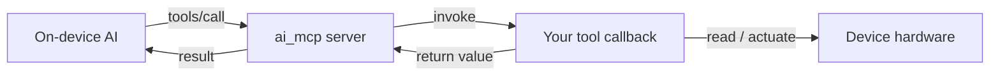

MCP (모델 콘텍스트 프로토콜)는 On-device AI가 장치 자체 함수를 **tools**로 호출합니다. 센서를 읽으면 설정이 변경되어 행동을 트리거합니다. `ai_mcp`는 장치 측 MCP 서버입니다: 당신은 공구로 당신의 기능을 등록하고, 서버는 AI가 요구할 때 그(것)들을 달립니다.

각 도구는 이름, 설명 AI는 호출 할 때 결정하는 것을 읽습니다, 유형 ** 입력 속성** (parameters), 그리고 ** 반환 값** AI는 뒤를받습니다. 서버는 JSON-RPC 2.0을 호출하고 [모델 Context Protocol](https://modelcontextprotocol.io/specification/2024-11-05) `2024-11-05` 개정을 따릅니다.

:::기사
이 문서는**on-device** MCP 서버로 펌웨어 내부에서 실행됩니다. Cloud-side MCP 서버는 AI 에이전트 플랫폼의 MCP 관리에서 별도로 구성됩니다. 이 서버는 앞의 하드웨어를 노출합니다.
:::

## 왜 이것을 사용
MCP 없이, AI는 단지 말에 응답할 수 있습니다. MCP로, 동일한 AI는 장치에서 작동할 수 있습니다: 당신이 너무 밝기 때문에 볼륨을 돌려, 사진을 찍을 때 방문자를 듣고, 또는 요청할 때 펌웨어 버전을보고. 한 번 함수를 작성합니다. AI는 설명에서 호출 할 때 결정합니다.

## 함께 맞는 방법


## 라이프사이클
`ai_mcp_init`는 응용 프로그램을 호출하는 것입니다. 그것은 MQTT 연결 이벤트에 가입하고 연결에, 서버를 가져오고 [건축 도구] (ai-mcp-tools)를 등록합니다. `ai_mcp_server_*` 호출 underneath는 당신이 손으로 서버를 구축하거나 자신의 도구를 추가하는 데 사용하는 것입니다.

|제품정보|이름 *|제품정보|
|----------|------------|---------|
|`ai_mcp_init`를| — |MQTT 연결에 가입; 연결, 서버 시작 및 내장 도구 등록.|
|`ai_mcp_deinit`를| — |서버를 파괴하고 리소스를 공개합니다.|
|`ai_mcp_server_init`를|`name`의 `version`|서버 초기화 `name`는 서버 (보드) 이름입니다; `version`는 그것의 버전 끈입니다.|
|`ai_mcp_server_destroy`를| — |서버 및 모든 등록 도구를 파괴합니다.|
|`ai_mcp_server_add_tool`를|`tool` - `MCP_TOOL_T *`|서버에 도구를 추가합니다. 소유권은 서버에 전송합니다.|
|`ai_mcp_server_find_tool`를|`name`를|그 이름 또는 `NULL`로 등록 된 도구를 반환합니다.|

헤더 : `ai_mcp.h` (`ai_mcp_init` / `ai_mcp_deinit`) 및 `ai_mcp_server.h` (기타). `OPERATE_RET` (`OPRT_OK`를 성공에 반환 할 수있는 모든 기능).

:::대여
MQTT가 연결한 후 서버만 초기화합니다. `ai_mcp_init`는 이미 `EVENT_MQTT_CONNECTED`에 대 한 당신을 위해. `ai_mcp_server_init`를 직접 호출하면 이벤트를 관리할 수 있습니다.
:::

## 도구
A **tool**는 이름과 설명을 가진 콜백을 쌍합니다. AI가 공구를 호출 할 때 콜백 실행; 입력 속성을 읽고, 작업을 수행하고, 반환 값에 채웁니다.

```c
typedef OPERATE_RET (*MCP_TOOL_CALLBACK)(const MCP_PROPERTY_LIST_T *properties,
                                         MCP_RETURN_VALUE_T *ret_val,
                                         void *user_data);
```

`MCP_TOOL_T`는 공구의 `name`, `description`, `properties`, `callback` 및 `user_data`를 붙듭니다.

|제품정보|이름 *|제품정보|
|----------|------------|---------|
|`ai_mcp_tool_register`를|`name`, `description`, `callback`, `user_data`, `...`|도구를 만들고 서버에 등록하십시오. variadic 인수는 `MCP_PROPERTY_DEF_T *` 속성 정의이며, `NULL`에 의해 종결됩니다.|
|`ai_mcp_tool_create`를|`name`, `description`, `callback`, `user_data`|등록없이 도구를 만듭니다. `MCP_TOOL_T *` 또는 `NULL`를 반환합니다.|
|`ai_mcp_tool_add_property`를|`tool`의 `prop`|당신이 만든 도구에 한 속성을 추가합니다.|
|`ai_mcp_tool_destroy`를|`tool`를|만든 도구는 무료하지만 서버에 손을하지 않았다.|

:::가격
`device.audio.set_volume`와 같은 점이있는 이름 도구, 그리고 당신이 도구에 대해 설명 할 수있는 방법을 쓰기 - AI는 도구로 호출 할 때 결정하는 방법을 읽습니다.
:::

편리한 매크로 `AI_MCP_TOOL_ADD(name, description, callback, user_data, ...)`는 `ai_mcp_tool_register`를 호출하고 `NULL` 용어를 추가하므로 속성 정의를 직접 통과 할 수 있습니다. `MCP_PROP_*` 매크로와 그 정의를 빌드:

|제품정보|기본 정보|
|-------|---------|
|`MCP_PROP_INT(name, desc)`를|integer 매개 변수.|
|`MCP_PROP_INT_DEF(name, desc, def)`를|기본값으로 integer.|
|`MCP_PROP_INT_RANGE(name, desc, min, max)`를|`[min, max]`에 바인딩 된 정수.|
|`MCP_PROP_INT_DEF_RANGE(name, desc, def, min, max)`를|integer와 기본값과 범위.|
|`MCP_PROP_BOOL(name, desc)`/케터M1X|boolean 매개 변수.|
|`MCP_PROP_STR(name, desc)`/케터M1X|문자열 매개 변수.|

## 속성
A ** property**는 도구의 한 유형 입력 매개 변수입니다. `MCP_PROPERTY_T`는 부동산의 `name`, `type`, `MCP_PROPERTY_TYPE_E`, `description`, 옵션 디폴트 및 - integers - 옵션 `[min_val, max_val]` 범위를 제공합니다. `MCP_PROPERTY_LIST_T`는 `MCP_MAX_PROPERTIES` (16)까지 보유하고 있습니다.

`MCP_PROPERTY_TYPE_E`는 `MCP_PROPERTY_TYPE_BOOLEAN`, `MCP_PROPERTY_TYPE_INTEGER`, 또는 `MCP_PROPERTY_TYPE_STRING` 중 하나입니다.

`MCP_PROP_*` 매크로 대신 부동산 리스트를 구축할 때 이러한 사용:

|제품정보|이름 *|제품정보|
|----------|------------|---------|
|`ai_mcp_property_create`를|`name`, `type`, `description`|시설 찾기 `MCP_PROPERTY_T *` 또는 `NULL`를 반환합니다.|
|`ai_mcp_property_set_default_bool`를|`prop`의 `value`|boolean 기본값을 설정합니다.|
|`ai_mcp_property_set_default_int`를|`prop`의 `value`|integer 기본값을 설정합니다.|
|`ai_mcp_property_set_default_str`를|`prop`의 `value`|문자열을 기본값으로 설정합니다.|
|`ai_mcp_property_set_range`를|`prop`, `min_val`, `max_val`|Bound an integer 속성에서 범위.|
|`ai_mcp_property_destroy`를|`prop`를|무료 주차|
|`ai_mcp_property_list_init`를|`list`를|빈 속성 목록을 초기화합니다.|
|`ai_mcp_property_list_add`를|`list`의 `prop`|속성을 목록에 추가합니다.|
|`ai_mcp_property_list_find`를|`list`의 `name`|이름 찾기|
|`ai_mcp_property_list_destroy`를|`list`를|무료 모든 속성 목록에 있습니다.|

:::기사
콜백 안에, AI가 `prop->default_val`에 도착한 값은 정수를 위한 `prop->default_val.int_val`의 예입니다. `name`에 의해 재산을 일치하고, 그것의 `type`를 검사하고, 일치 조합 분야를 읽으십시오.
:::

## 반환 값
**리턴 값**는 AI로 다시 공구의 손입니다. `MCP_RETURN_VALUE_T`는 `type`(KEPTERM2X) 및 매칭 데이터를 제공합니다.

`MCP_RETURN_TYPE_E`는 `MCP_RETURN_TYPE_BOOLEAN`, `MCP_RETURN_TYPE_INTEGER`, `MCP_RETURN_TYPE_STRING`, `MCP_RETURN_TYPE_JSON`, 또는 `MCP_RETURN_TYPE_IMAGE`의 한개입니다.

|제품정보|이름 *|제품정보|
|----------|------------|---------|
|`ai_mcp_return_value_init`를|`ret_val`의 `type`|반환 값의 유형을 초기화합니다.|
|`ai_mcp_return_value_set_bool`를|`ret_val`의 `value`|boolean을 반환합니다.|
|`ai_mcp_return_value_set_int`를|`ret_val`의 `value`|정수를 반환합니다.|
|`ai_mcp_return_value_set_str`를|`ret_val`의 `value`|문자열을 반환합니다.|
|`ai_mcp_return_value_set_json`를|`ret_val`의 `json`|`cJSON` 객체를 반환합니다.|
|`ai_mcp_return_value_set_image`를|`ret_val`, `mime_type`, `data`, `data_len`|이미지를 반환; 데이터는 Base64-encoded입니다.|
|`ai_mcp_return_value_cleanup`를|`ret_val`를|반환 값에 의해 제공되는 모든 메모리.|

이미지를 위해, `MCP_IMAGE_MIME_TYPE_JPEG` 또는 `MCP_IMAGE_MIME_TYPE_PNG`를 MIME 유형으로 통과하십시오.

## 작업 예
문을 열지 여부를보고 한 도구는 불린 입력 속성과 불린 반환 값으로 등록하고 AI를 호출합니다. `AI_MCP_TOOL_ADD` 매크로는 단일 통화에서 도구를 생성하고 등록합니다.

```c
#include "ai_mcp_server.h"

// The AI calls this when it wants the door state. It reads the optional
// "refresh" property, samples the sensor, and returns a boolean.
static OPERATE_RET door_is_open_cb(const MCP_PROPERTY_LIST_T *properties,
                                   MCP_RETURN_VALUE_T *ret_val,
                                   void *user_data)
{
    bool refresh = false;
    for (int i = 0; i < properties->count; i++) {
        MCP_PROPERTY_T *prop = properties->properties[i];
        if (strcmp(prop->name, "refresh") == 0 && prop->type == MCP_PROPERTY_TYPE_BOOLEAN) {
            refresh = prop->default_val.bool_val;
            break;
        }
    }

    bool open = read_door_sensor(refresh);   // your hardware read
    ai_mcp_return_value_set_bool(ret_val, open);
    return OPRT_OK;
}

OPERATE_RET register_door_tool(void)
{
    return AI_MCP_TOOL_ADD(
        "device.door.is_open",
        "Report whether the door is currently open. Returns true if open.",
        door_is_open_cb,
        NULL,
        MCP_PROP_BOOL_DEF("refresh", "Re-read the sensor instead of using the cached value.", false));
}
```

서버 후 `register_door_tool()` 호출은 - 자체 MQTT 연결 핸들러에서 예를 들어, `ai_mcp_init()`와 함께.

## 참조
- [Built-in MCP 도구](ai-mcp-tools) - 등록 된 도구, 참조 구현
- [AI Agent](ai-agent) - 장치가 Tuya AI 클라우드에 어떻게 이야기하는지
- [Component Framework] (ai-components.md) - `ai_mcp`가 AI 프레임 워크에 앉아있는 곳
- [Multimodal data flow](../multimodal-data-flow) - 기기를 통해 입력 및 출력 이동 방법
