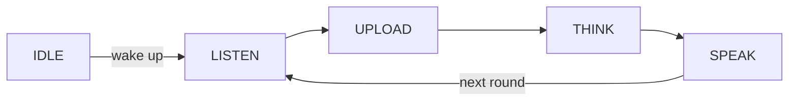

** 무료 대화 **는 대화 모드입니다, 깨어난 후, 장치는 멀티 라운드, 손없는 대화를 듣습니다. 한 번에 일어나서 버튼없이 돌아와서 각 턴을 반복하지 마십시오.

그것은 4 개의 [voice 채팅 모드] (ai-mode-manage); `ai_mode_free_register()`로 등록합니다.

## 사용할 때
자연의 무료 모드를 사용, 사용자가 행에 여러 차례의 회전을 가지고 대화 상호 작용:

-**Multi-round chat** — waking 후에, 장치는 따옴표 회전을 위해 듣는 것을 지킵니다, 그래서 각 시간을 re-triggering 없이 대화 교류.
-**Fully hand-free** — 대화 중 버튼이 누르지 않습니다. 사용자는 그냥 말하기를 유지합니다.
- **Conversational Products** — 단일 명령보다는 백 및 대화를 위해 설계된 조수 및 동반자를위한 최고의.

무역 떨어져는 장치가 대화 도중 지속적으로 듣는다는 것을, 그래서 더 조용하고, 단 하나 사용자 조정은 noisy 또는 공유 방 보다는 더 낫습니다. 한 번에 한 번 켜면 [wake-word](ai-mode-wakeup) 모드를 사용하십시오. 전체 수동 제어를 위해 [hold-to-talk](ai-mode-hold)를 사용하십시오.

## 행동하는 방법
회전은 공유 모드 수명주기를 따릅니다. 장치가 `LISTEN`를 입력한 후, `UPLOAD`, `THINK` 및 `SPEAK`를 통해 각 차례로 전진하여 다음 라운드에 `LISTEN`로 돌아갑니다.



:::기사
무료 모드는 회전 사이에 듣기를 유지하므로 장치가 대화 중 오디오를 지속적으로 캡처합니다. 음성 감지를 위한 오디오 구성 요소(`ENABLE_COMP_AI_AUDIO`)가 필요합니다.
:::

## 그것을 사용
시작 모드에서 모드를 등록한 다음 `ai_mode_init`를 사용하여 활성 모드를 만듭니다.

```c
ai_mode_free_register();
ai_mode_init(AI_CHAT_MODE_FREE);   // AI_CHAT_MODE_HOLD | ONE_SHOT | WAKEUP | FREE
```

[Voice Chat Modes](ai-mode-manage)를 전체 시작 시퀀스에 보시려면 작업 루프를 실행하고, 실행시에 전환합니다.

## 참조
- [Voice Chat Modes](ai-mode-manage) - 모든 모드에서 등록, 스위치 및 노선 이벤트
- [Hold-to-Talk Mode](ai-mode-hold) - 기록 및 기록
- [One-Shot Mode](ai-mode-oneshot) - 한 번 클릭
- [Wake-Word Mode](ai-mode-wakeup) - 음성으로 전환
- [AI Agent](ai-agent) - 드라이브 모드의 클라우드 브리지
