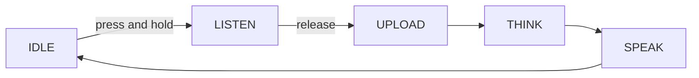

**Hold-to-talk**는 버튼을 누르고 기록할 수 있는 채팅 모드입니다. 캡처 창은 단추를 붙들기 때문에 정확히 지속됩니다. — 아무것도 시작하거나 자신의 중지합니다.

그것은 4 개의 [voice 채팅 모드] (ai-mode-manage); `ai_mode_hold_register()`로 등록합니다.

## 사용할 때
deliberate를 원할 때 hold-to-talk 사용, 명시된 회전 및 모든 제어 장치가 듣는지:

- **Noisy room** - 버튼이 다운된 동안 마이크만 캡처하므로, 그 창이 클라우드에 도달하지 않는 배경의 연설과 소음이 없습니다.
-**Deliberate turn** — 사용자가 턴이 시작되고 종료될 때 정확히 결정합니다.
- ** false 트리거 ** - 버튼이 누르면 업로드되지 않습니다, 그래서 장치는 주변 소리에 반응하지 않습니다.

거래-오프는 손에: 각 회전은 물리적 압박을 필요로 합니다. 손없는 상호 작용을 위해 [wake-word] (ai-mode-wakeup) 또는 [free] (ai-mode-free) 모드를 대신 사용하십시오.

## 행동하는 방법
회전은 공유 모드 수명주기를 따릅니다. 버튼을 눌러 `IDLE`에서 `LISTEN`로 장치를 이동; 버튼을 종료 캡처를 해제하고 `UPLOAD`, `THINK`, `SPEAK`를 통해 전진.



:::기사
캡처는 얼마나 오래 당신은 버튼을 보유합니다. 모드는 버튼 구성 요소 (`ENABLE_BUTTON`)를 필요로하여 프레스 및 릴리스 이벤트를받습니다.
:::

## 그것을 사용
시작 모드에서 모드를 등록한 다음 `ai_mode_init`를 사용하여 활성 모드를 만듭니다.

```c
ai_mode_hold_register();
ai_mode_init(AI_CHAT_MODE_HOLD);   // AI_CHAT_MODE_HOLD | ONE_SHOT | WAKEUP | FREE
```

[Voice Chat Modes](ai-mode-manage)를 전체 시작 시퀀스에 보시려면 작업 루프를 실행하고, 실행시에 전환합니다.

## 참조
- [Voice Chat Modes](ai-mode-manage) - 모든 모드에서 등록, 스위치 및 노선 이벤트
- [One-Shot Mode](ai-mode-oneshot) - 한 번 클릭
- [Wake-Word Mode](ai-mode-wakeup) - 음성으로 전환
- [무료 대화 모드](ai-mode-free) - 항상 손없는 채팅을 재생
- [AI Agent](ai-agent) - 드라이브 모드의 클라우드 브리지
