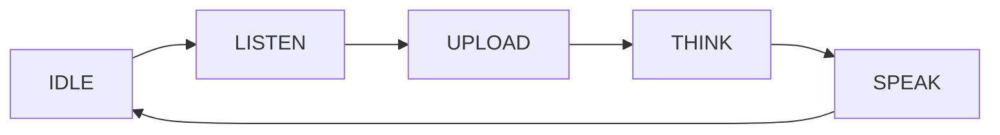

**voice 채권 모드**는 *when* 장치 듣기, 업로드 및 replies를 결정합니다. 즉, 키워드로 한 번 누르거나 손을 잡을 수 있습니다. `ai_manage_mode`는 이러한 모드를 등록하는 구성 요소이며, 그 사이를 전환하고, 이벤트 (사용자, VAD, 키)를 어느 모드가 활성화됩니다.

그것은 장치의 입력 (버튼, 마이크, 웨이브 단어)과 [`ai_agent`] (ai-agent) 사이에 앉아 실제 클라우드 이야기. 모드는 오디오 자체를 업로드하지 않습니다. *moment*를 시작하고 중지하기로 결정하면 `ai_agent`를 구동합니다.

## 약관
|(주)|이름 *|
|------|---------|
|채팅 모드|기기가 듣고 업로드 할 때 결정하는 상호 작용 스타일 - `hold`, `oneshot`, `wakeup` 또는 `free`.|
|VAD를|Voice Activity Detection - 사용자가 말하는지 감지합니다.|
|모드 핸들|`AI_MODE_HANDLE_T` - 콜백의 세트는 하나의 모드 구현 (init, Task, event handling 등).|

## 채팅 모드는 무엇입니까?
모든 모드는 하나의 질문에 답합니다. ** 장치 시작을 유지하고 사용자의 목소리를 캡처 중지해야합니까?** 네 개의 내장 모드가 서로 응답합니다.

|주요 특징|뚱 베어|더 큰|관련 기사|
|------|------|---------|--------------------|
|기타|`AI_CHAT_MODE_HOLD`를|버튼을 눌러|버튼 출시|
|원샷|`AI_CHAT_MODE_ONE_SHOT`를|버튼을 한 번 클릭|VAD는 연설의 끝을 검출합니다|
|모닝콜|`AI_CHAT_MODE_WAKEUP`를|자주 묻는 질문|VAD는 연설의 끝을 검출합니다|
|무료 다운로드|`AI_CHAT_MODE_FREE`를|항상 듣고|결코 — 연속|

enum은 `AI_CHAT_MODE_E`입니다. 사용자 정의 모드는 `AI_CHAT_MODE_CUSTOM_START` (`0x100`)에서 시작하므로, 내장 된 것과는 결코 충돌하지 않습니다.

```c
typedef enum {
    AI_CHAT_MODE_HOLD,
    AI_CHAT_MODE_ONE_SHOT,
    AI_CHAT_MODE_WAKEUP,
    AI_CHAT_MODE_FREE,

    AI_CHAT_MODE_CUSTOM_START = 0x100,
} AI_CHAT_MODE_E;
```

## 모드 수명주기
방아쇠가 무엇이든, 각 형태는 `AI_MODE_STATE_E`로 드러낸 동일한 국가 기계를 달립니다. 활성 모드는 이 상태를 차례로 진행합니다. 현재 `ai_mode_get_state`로 쿼리하십시오.

|(주)|이름 *|
|-------|---------|
|`AI_MODE_STATE_INIT`를|모드는 초기화됩니다.|
|`AI_MODE_STATE_IDLE`를|방아쇠를 위한 처음과 대기.|
|`AI_MODE_STATE_LISTEN`를|사용자의 목소리를 캡처.|
|`AI_MODE_STATE_UPLOAD`를|캡처 된 오디오를 클라우드로 전송합니다.|
|`AI_MODE_STATE_THINK`를|클라우드는 처리 (ASR + reasoning).|
|`AI_MODE_STATE_SPEAK`를|클라우드의 답장을 다시 재생합니다.|
|`AI_MODE_STATE_INVALID`를|모드가 활성화되지 않습니다, 또는 모드는 시작되지 않습니다.|



:::기사
`ai_mode_get_state`는 `AI_MODE_STATE_INVALID`를 반환합니다. 상태에 의존하기 전에 `ai_mode_init`와 모드를 초기화합니다.
:::

## 모드가 구현되는 방법
모드는 `AI_MODE_HANDLE_T`에서 수집된 콜백 세트로 `AI_CHAT_MODE_E` 값을 `ai_mode_register`로 등록했습니다. `name` 만, `init`, `deinit`, `task`, `handle_event`, `get_state`, `client_run`가 필요합니다. `vad_change` 및 `handle_key`는 오디오 및 버튼 구성 요소가 활성화 될 때만 존재합니다.

```c
typedef struct {
    const char *name;

    OPERATE_RET     (*init)         (void);
    OPERATE_RET     (*deinit)       (void);
    OPERATE_RET     (*task)         (void *args);
    OPERATE_RET     (*handle_event) (AI_NOTIFY_EVENT_T *event);
    AI_MODE_STATE_E (*get_state)    (void);
    OPERATE_RET     (*client_run)   (void *data);

#if defined(ENABLE_COMP_AI_AUDIO) && (ENABLE_COMP_AI_AUDIO == 1)
    OPERATE_RET     (*vad_change)   (AI_AUDIO_VAD_STATE_E vad_state);
#endif

#if defined(ENABLE_BUTTON) && (ENABLE_BUTTON == 1)
    OPERATE_RET     (*handle_key)   (TDL_BUTTON_TOUCH_EVENT_E event, void *arg);
#endif
} AI_MODE_HANDLE_T;
```

내장 모드는 이미 핸들을 제공; 당신은 각각 하나의 통화로 등록 (`ai_mode_hold_register`, `ai_mode_oneshot_register`, 나머지). 사용자 정의 모드를 만들 때 자신의 `AI_MODE_HANDLE_T` 만 정의합니다.

## API 참조
헤더: `ai_manage_mode.h`. 기능 반환 `OPERATE_RET` (`OPRT_OK` 성공에) 그렇지 않으면.

|제품정보|이름 *|제품정보|
|----------|------------|---------|
|`ai_mode_register`를|`mode`의 `handle`|채팅 모드 값에 대한 모드 핸들을 등록하십시오. 등록 순서는 `ai_mode_switch_next` 주기 순서를 놓습니다.|
|`ai_mode_init`를|`mode`를|등록 된 모드를 초기화하고 활성 모드를 만듭니다.|
|`ai_mode_deinit`를| — |활성 모드를 분리합니다.|
|`ai_mode_task_running`를|`args`를|Active Mode의 `task` 콜백을 실행합니다. 이 호출을 반복하여 state Machine을 미리 호출합니다.|
|`ai_mode_handle_event`를|`event`를|Active Mode에 `AI_NOTIFY_EVENT_T`를 전달합니다.|
|`ai_mode_get_state`를| — |활성 모드의 `AI_MODE_STATE_E` (`AI_MODE_STATE_INVALID` 아무도)를 반환합니다.|
|`ai_mode_client_run`를|`data`를|Active Mode의 `client_run` 콜백을 실행합니다.|
|`ai_mode_vad_change`를|`vad_state`를|Active Mode로 VAD state를 변경합니다. `ENABLE_COMP_AI_AUDIO`를 요구합니다.|
|`ai_mode_handle_key`를|`event`의 `arg`|Active Mode로 버튼 이벤트를 전달합니다. `ENABLE_BUTTON`를 요구합니다.|
|`ai_mode_get_curr_mode`를|`mode` (아웃)|활성 채팅 모드를 가져옵니다.|
|`ai_mode_switch`를|`mode`를|다른 모드로 전환 - 현재를 분리하고 목표를 초기화합니다.|
|`ai_mode_switch_next`를| — |다음 등록 모드로 전환하고 `AI_CHAT_MODE_E` 값을 반환합니다.|
|`ai_get_mode_state_str`를|`state`를|상태에 대한 인간의 읽기 가능한 이름을 반환합니다.|
|`ai_get_mode_name_str`를|`mode`를|모드에 대한 인간의 읽기 가능한 이름을 반환합니다.|
|`ai_mode_is_in_register_list`를|`mode`를|모드가 등록되면 `TRUE`를 반환합니다.|
|`ai_get_first_mode`를|`out_mode` (아웃)|첫 번째 등록 모드를 가져옵니다.|

:::가격
`ai_mode_switch_next` 사이클 모드는 등록한 순서에. 긴 압박 또는 설정 toggle에 와이어를 사용하여 사용자가 runtime에서 채팅 모드를 통해 회전 할 수 있습니다.
:::

## 앱으로 연결
시작시에 필요한 모드를 등록하고 기본을 초기화 한 다음 작업 루프 및 전달 이벤트를 실행합니다.

```c
#include "ai_manage_mode.h"
#include "ai_mode_hold.h"
#include "ai_mode_oneshot.h"

OPERATE_RET ai_modes_start(void)
{
    OPERATE_RET rt = OPRT_OK;

    // 1. Register the modes you want. Registration order = switch-next order.
    TUYA_CALL_ERR_RETURN(ai_mode_hold_register());
    TUYA_CALL_ERR_RETURN(ai_mode_oneshot_register());

    // 2. Initialize a default mode.
    TUYA_CALL_ERR_RETURN(ai_mode_init(AI_CHAT_MODE_HOLD));
    return rt;
}

// 3. Advance the active mode's state machine in your loop.
void ai_mode_loop(void *args)
{
    while (1) {
        ai_mode_task_running(args);
        tal_system_sleep(10);
    }
}

// Rotate to the next registered mode (e.g. from a long-press).
void ai_mode_cycle(void)
{
    AI_CHAT_MODE_E next = ai_mode_switch_next();
    PR_NOTICE("Switched to mode: %s", ai_get_mode_name_str(next));
}
```

## 사용자 정의 모드 추가
필요한 콜백을 구현하고 `AI_MODE_HANDLE_T`를 채우고 `AI_CHAT_MODE_CUSTOM_START` 이상의 값으로 등록하십시오.

```c
static AI_MODE_STATE_E sg_state = AI_MODE_STATE_IDLE;

static OPERATE_RET my_mode_init(void)   { sg_state = AI_MODE_STATE_IDLE; return OPRT_OK; }
static OPERATE_RET my_mode_deinit(void) { return OPRT_OK; }
static AI_MODE_STATE_E my_mode_get_state(void) { return sg_state; }

static OPERATE_RET my_mode_task(void *args)
{
    switch (sg_state) {
        case AI_MODE_STATE_IDLE:   /* wait for a trigger */ break;
        case AI_MODE_STATE_LISTEN: /* capture voice */      break;
        default: break;
    }
    return OPRT_OK;
}

static OPERATE_RET my_mode_handle_event(AI_NOTIFY_EVENT_T *event) { return OPRT_OK; }

OPERATE_RET my_mode_register(void)
{
    AI_MODE_HANDLE_T handle = {
        .name         = "my_mode",
        .init         = my_mode_init,
        .deinit       = my_mode_deinit,
        .task         = my_mode_task,
        .handle_event = my_mode_handle_event,
        .get_state    = my_mode_get_state,
    };
    return ai_mode_register(AI_CHAT_MODE_CUSTOM_START, &handle);
}
```

## 참조
- [Hold-to-Talk Mode](ai-mode-hold) - 기록 및 보유
- [One-Shot Mode](ai-mode-oneshot) - 한 번 클릭
- [Wake-Word Mode](ai-mode-wakeup) - 음성으로 전환
- [무료 대화 모드](ai-mode-free) - 항상 손없는 채팅을 재생
- [AI Agent](ai-agent) - 드라이브 모드의 클라우드 브리지
- [Component Framework] (ai-components.md) - 모드가 더 넓은 AI 프레임 워크에 적합한 방법
- [Multimodal Data Flow](../multimodal-data-flow) - 음성 및 기타 입력이 클라우드로 이동하는 방법
