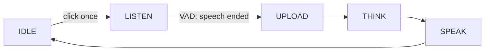

** One-shot**는 한 번 버튼을 클릭한 채팅 모드입니다. 장치가 즉시 듣는 시작하고, 음성 활동 탐지 (VAD)는 당신이 말하기를 중지할 때 차례를 끝냅니다 — 당신은 단추를 붙들지 않습니다.

그것은 4 개의 [voice 채팅 모드] (ai-mode-manage); `ai_mode_oneshot_register()`로 등록합니다.

## 사용할 때
퀵, 원클릭 질문 또는 명령을 위해 원샷을 사용하세요.

- ** 단 하나, 자기 유지 회전 ** - 한 번의 클릭, 하나의 질문, 하나의 대답. "what's weather"스타일 상호 작용을 위해 좋은.
-**Hands-light** - 시작 버튼을 만 터치합니다. VAD는 중지를 처리하므로 자연스럽게 말하고 갈 수 있습니다.
- **Quieter 룸** - VAD가 연설이 끝날 때 결정하기 때문에 배경 소음이 문장의 끝 (또는 시작)에 실수가되지 않을 경우 가장 잘 작동합니다.

거래 오프 versus [hold-to-talk](ai-mode-hold)는 캡처의 끝의 정확한 제어를 제공합니다. VAD는 턴 스톱 때 선택합니다. 노이즈 룸, 홀 - 투 - 토크를 선호합니다. 멀티 라운드 손없는 채팅을 위해 [무료](ai-mode-free) 모드를 사용하십시오.

## 행동하는 방법
회전은 공유 모드 수명주기를 따릅니다. 한 번의 클릭은 `IDLE`에서 `LISTEN`로 장치를 이동합니다. VAD가 말하는 것을 감지하면 `UPLOAD`, `THINK` 및 `SPEAK`를 통해 차례로 전진하고 `IDLE`로 돌아갑니다.



:::기사
턴은 VAD에서 두 번째 클릭이 아닙니다. 모드는 버튼 구성 요소 (`ENABLE_BUTTON`)가 VAD에 대한 클릭 및 오디오 구성 요소 (`ENABLE_COMP_AI_AUDIO`)를 수신해야합니다.
:::

## 그것을 사용
시작 모드에서 모드를 등록한 다음 `ai_mode_init`를 사용하여 활성 모드를 만듭니다.

```c
ai_mode_oneshot_register();
ai_mode_init(AI_CHAT_MODE_ONE_SHOT);   // AI_CHAT_MODE_HOLD | ONE_SHOT | WAKEUP | FREE
```

[Voice Chat Modes](ai-mode-manage)를 전체 시작 시퀀스에 보시려면 작업 루프를 실행하고, 실행시에 전환합니다.

## 참조
- [Voice Chat Modes](ai-mode-manage) - 모든 모드에서 등록, 스위치 및 노선 이벤트
- [Hold-to-Talk Mode](ai-mode-hold) - 기록 및 기록
- [Wake-Word Mode](ai-mode-wakeup) - 음성으로 전환
- [무료 대화 모드](ai-mode-free) - 항상 손없는 채팅을 재생
- [AI Agent](ai-agent) - 드라이브 모드의 클라우드 브리지
