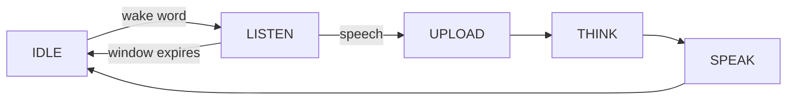

**Wake-word**는 단어가 단일 라운드 턴을 시작하게 하는 채팅 모드입니다. 웨이브 단어 후, 장치는 창을 듣습니다 (약 30 초), 한 차례가 걸리고, 그 후 idle에 반환합니다.

그것은 4 개의 [voice 채팅 모드] (ai-mode-manage); `ai_mode_wakeup_register()`로 등록합니다.

## 사용할 때
손없는 상호 작용을 원할 때 웨이브 모드를 사용하지만 여전히 한 번에 한 번의 deliberate 차례로 :

-**Hands-free start** — 버튼에 도달 대신 깨어있는 단어를 말합니다. 방 전체에 배치되는 기기를 위해 좋은.
- ** 깨진 당 한 라운드 ** - 각 깨진 단어는 단일 턴을 부여하므로 장치는 지속적으로 듣거나 답변 후 응답하지 않습니다.
-**Bounded listening window** — 아무 말도 일어나지 않는다면, 이 장치는 창이 만료된 후 자체에 idle을 반환한다.

Trade-off versus [free](ai-mode-free) 모드는 모든 회전이 신선한 웨이브 단어를 필요로한다는 것입니다. 멀티 라운드 후속이 없습니다. 연속 back-and-forth, 사용 무료 모드; 완전히 수동 회전, 사용 [hold-to-talk](ai-mode-hold).

## 행동하는 방법
회전은 공유 모드 수명주기를 따릅니다. 웨이브 워드는 `IDLE`에서 `LISTEN`로 장치를 이동합니다. `UPLOAD`, `THINK` 및 `SPEAK`를 통해 차례의 진보가 `IDLE`로 돌아갑니다. 청취 창이 아무 연설 없이 만료되면, 장치는 `IDLE`에 직접 돌려줍니다.

청취 창은 `AI_CHAT_WAKEUP_TIME_MS`로 정의된 `30 * 1000` (30 초)입니다.



:::기사
장치가 약 30 초 동안 듣는 동안 깨어 났을 때, 당신은 아무것도 말하지 않는 경우 idle로 반환합니다. 각 새로운 회전은 또 다른 단어가 필요합니다.
:::

## 그것을 사용
시작 모드에서 모드를 등록한 다음 `ai_mode_init`를 사용하여 활성 모드를 만듭니다.

```c
ai_mode_wakeup_register();
ai_mode_init(AI_CHAT_MODE_WAKEUP);   // AI_CHAT_MODE_HOLD | ONE_SHOT | WAKEUP | FREE
```

[Voice Chat Modes](ai-mode-manage)를 전체 시작 시퀀스에 보시려면 작업 루프를 실행하고, 실행시에 전환합니다.

## 참조
- [Voice Chat Modes](ai-mode-manage) - 모든 모드에서 등록, 스위치 및 노선 이벤트
- [Hold-to-Talk Mode](ai-mode-hold) - 기록 및 기록
- [One-Shot Mode](ai-mode-oneshot) - 한 번 클릭
- [무료 대화 모드](ai-mode-free) - 항상 손없는 채팅을 재생
- [AI Agent](ai-agent) - 드라이브 모드의 클라우드 브리지
