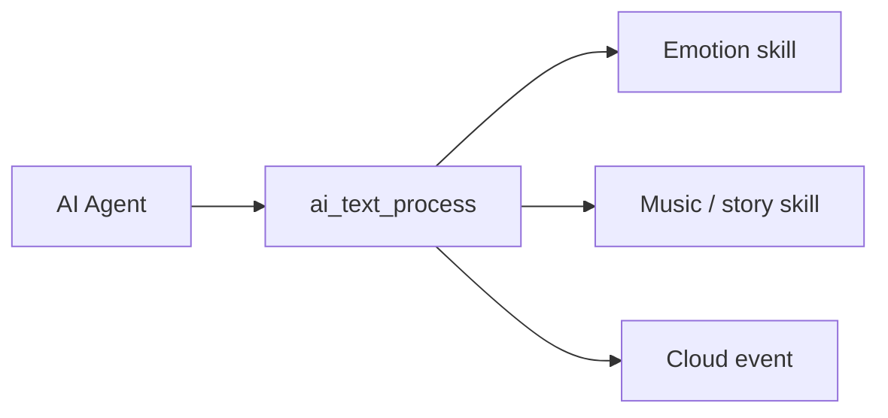

`ai_skills`는 AI의 구조화된 기술 데이터를 해석하고, 음악 또는 이야기를 보여주는 감정을 보여주는 장치 행동으로 전환하고, 재생 제어를 처리하고, 클라우드 이벤트에 반응합니다. [AI Agent](ai-agent)는 기술 데이터를 전달합니다. 이 모듈은 장치가 어떻게 사용하는지 결정합니다.

## 기술이 도착하는 방법
기술은 JSON를 구조화하여 클라우드가 대화를 나눕니다. [AI Agent](ai-agent) 각 텍스트는 `ai_text_process`로 전송합니다.

```c
OPERATE_RET ai_text_process(AI_TEXT_TYPE_E type, cJSON *root, bool eof);
```

|제품 설명|이름 *|
|-----------|---------|
|`type`를|탑재량 유형: `AI_TEXT_ASR`, `AI_TEXT_NLG`, `AI_TEXT_SKILL`, 또는 `AI_TEXT_CLOUD_EVENT`.|
|`root`를|JSON 페이로드.|
|`eof`를|`true` 이 페이로드의 마지막 펑크입니다.|

`OPERATE_RET` (`OPRT_OK` 성공)를 반환합니다. `type`가 `AI_TEXT_SKILL`일 때, 모듈은 기술 JSON를 파고 아래 일치하는 기술 제품군에 전달합니다. `AI_TEXT_CLOUD_EVENT`는 클라우드 배출 핸들러로 이동합니다.



## Skill 가족
단위는 3개의 기술 가족을 발송합니다. 각에는 그것의 자신의 우두머리 및 입장 기능이 있습니다.

|이름 *|기타 제품|핵심 기능|이름 *|
|--------|--------|---------------|------|
|팟캐스트|`skill_emotion.h`를|`ai_skill_emo_process`, `ai_agent_play_emo`, `ai_emoji_unicode_to_utf8`|전시에 대한 감정을 표시합니다.|
|음악 / 이야기|`skill_music_story.h`를|`ai_skill_parse_music`, `ai_skill_parse_playcontrol`, `ai_skill_playcontrol_music`|음악 또는 이야기 및 핸들 재생 컨트롤.|
|Cloud 이벤트|`skill_cloudevent.h`를|`ai_parse_cloud_event`를|Cloud-pushed 이벤트에 대한 반응.|

## 감정
감정 기술지도 감정 이름 (`HAPPY`, `SAD`, `THINKING`, `SLEEP`, 더 많은 - `EMOJI_*`에서 `EMOJI_*` 매크로로 정의) 디스플레이의 표현. 감정은 `AI_AGENT_EMO_T`에 의해 설명됩니다:

```c
typedef struct {
    const char  *emoji;   // emoji code point, e.g. "U+1F636"
    const char  *name;    // emotion name, e.g. "NEUTRAL"
} AI_AGENT_EMO_T;
```

|제품정보|이름 *|제품정보|
|----------|------------|---------|
|`ai_skill_emo_process`를|`json` - 감정 기술 JSON|감정적 인 스킬 페이로드를 파고 그것을 재생합니다.|
|`ai_agent_play_emo`를|`emo` - 감정에 대한 포인터|전시에 한 감정을 표시합니다.|
|`ai_emoji_unicode_to_utf8`를|`unicode_str` - `"U+XXXX"`; `utf8_buf` - 출력 (≥ 5 바이트); `buf_size` - 버퍼 크기|유니코드 코드 포인트를 UTF-8 바이트로 변환합니다. 오류에 byte 카운트 또는 `-1`를 반환합니다.|

`ai_skill_emo_process`와 `ai_agent_play_emo` 반환 `OPERATE_RET`.

### 음악과 이야기
음악/스토리 스킬은 플레이어의 `AI_AUDIO_MUSIC_T`를 통해 재생과 재생을 제어하는 방법을 분석합니다. 이 기능은 `ENABLE_COMP_AI_AUDIO`가 설정될 때만 건설됩니다. [Audio Player](ai-audio-player)는 실제 재생을 합니다.

|제품정보|이름 *|제품정보|
|----------|------------|---------|
|`ai_skill_parse_music`를|`json`; `music` - 패딩 구조 수신|음악/스토리 페이로드를 `AI_AUDIO_MUSIC_T`로 파세요.|
|`ai_skill_parse_music_free`를|`music`를|무료 음악 구조.|
|`ai_skill_parse_music_dump`를|`music`를|디버깅을위한 음악 구조를 인쇄합니다.|
|`ai_skill_parse_playcontrol`를|`json`; `music` - 패딩 구조 수신|재생 제어 페이로드 (플레이, 일시 정지, 다음 등)를 파.|
|`ai_skill_playcontrol_music`를|`music`를|parsed 재생 제어 명령을 실행합니다.|

`ai_skill_parse_music`와 `ai_skill_parse_playcontrol` 반환 `OPERATE_RET`; 다른 사람 반환 `void`.

:::대여
`ai_skill_parse_music` 또는 `ai_skill_parse_playcontrol` 통화를 한 번에 한 번에 한 번 구조로 완료하거나 장치가 패딩 페이로드를 누출합니다.
:::

## 클라우드 이벤트
Cloud-event 기술은 TTS 재생 명령과 같은 정상적인 응답 스트림 밖에 클라우드 푸시를 처리합니다.

|제품정보|이름 *|제품정보|
|----------|------------|---------|
|`ai_parse_cloud_event`를|`json` — 클라우드 배출 JSON|Parse 및 클라우드 이벤트 처리. `OPERATE_RET`를 반환합니다.|

## 참조
- [AI Agent] (ai-agent) - 이 모듈 해석 기술을 제공합니다
- [AI 오디오 플레이어](ai-audio-player) - 음악 및 스토리 스킬 요청을 재생
- [Component Framework] (ai-components.md) - `ai_skills`가 더 넓은 AI 프레임 워크에 적합
- [Multimodal Data Flow](../multimodal-data-flow) - 장치와 클라우드 간의 데이터 여행
