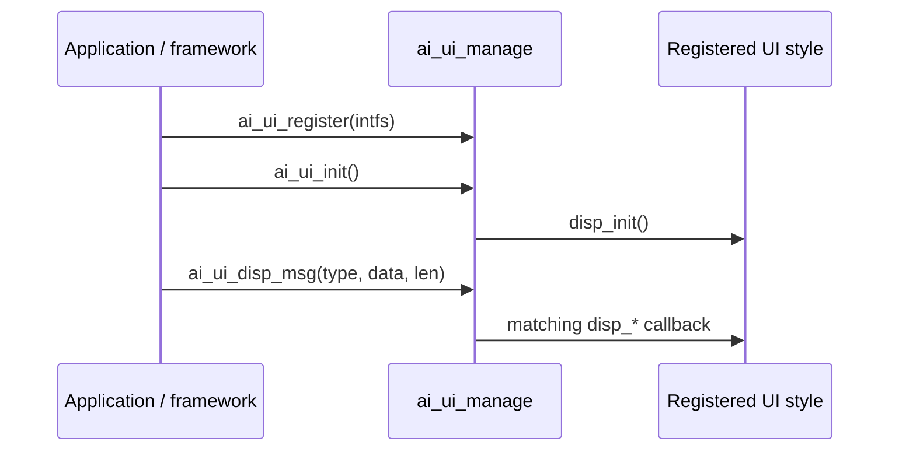

`ai_ui_manage`는 TuyaOpen AI 프레임 워크의 화면 채팅 UI 파견 층입니다. 프레임 워크는 채팅 메시지 - 사용자 텍스트, AI 답글, 감정, 상태, 알림, 네트워크 상태, 카메라 프레임, 사진 — 그리고 UI 스타일이 등록되는 각 경로입니다. 펌웨어의 나머지는 화면에 직접 그리지 않습니다. 입력된 메시지를 보내고 등록된 스타일이 렌더링합니다.

그것은 프레임 워크 사이 앉아 (메시지를 생산) 콘크리트 UI 스타일 (그들은 페인트). 세 개의 내장 스타일 - [WeChat-style](ai-ui-chat-wechat), [Chatbot](ai-ui-chat-chatbot) 및 [OLED](ai-ui-chat-oled) - 각각 자신의 구현을 등록합니다. 주문 UI는 동일한 인터페이스를 구현합니다.

## 어떻게 작동합니까?
`AI_UI_INTFS_T` - 디스플레이 콜백 세트를 등록하면 `ai_ui_init()`를 호출합니다. 다음에서, 모든 `ai_ui_disp_msg()` 호출은 UI 스레드에서 일치 콜백, 그래서 콜러는 렌더링에 결코 차단되지 않습니다.



## UI 인터페이스
UI 스타일은 `AI_UI_INTFS_T`, 계약 `ai_ui_manage` 호출을 구현합니다. 스타일이 메시지를 처리하지 않는 경우 콜백 `NULL`를 남겨주세요. 프레임 워크가 일치하는 메시지를 파견 할 때 각 콜백 화재.

|콜백|화재 때|
|----------|------------|
|`disp_init`를|UI 모듈 초기화. 디스플레이 장치 및 화면 레이아웃을 설정합니다. `OPERATE_RET`를 반환합니다.|
|`disp_user_msg`를|사용자 메시지가 표시됩니다 (인지도 된 연설 또는 유형 텍스트).|
|`disp_ai_msg`를|완전한 AI 대답은 1개 조각에서 보입니다.|
|`disp_ai_msg_stream_start`를|AI 응답은 스트리밍을 시작합니다. 메시지 컨테이너를 만듭니다.|
|`disp_ai_msg_stream_data`를|AI 텍스트의 펑크가 도착합니다. 계정 만들기|
|`disp_ai_msg_stream_end`를|스트림 AI 응답 완료.|
|`disp_system_msg`를|시스템 메시지가 표시됩니다.|
|`disp_emotion`를|AI는 감정을 표현합니다. 문자열 이름은 감정이다.|
|`disp_ai_mode_state`를|AI 모드 상태 변경 (예를 들면, 듣기 또는 생각).|
|`disp_notification`를|알림이 표시됩니다.|
|`disp_wifi_state`를|네트워크 상태 변경. `AI_UI_WIFI_STATUS_E`를 수신합니다.|
|`disp_ai_chat_mode`를|활성 채팅 모드 변경.|
|`disp_other_msg`를|주문 `type`의 메시지는, 익지않는 `data`/`len` 탑재량과 더불어 도착합니다.|
|`disp_camera_start`를|카메라 미리보기가 시작됩니다. 구조 `width` 및 `height`를 받으십시오. `OPERATE_RET`를 반환합니다.|
|`disp_camera_flush`를|카메라 프레임은 그리기 준비가되어 있습니다. `OPERATE_RET`를 반환합니다.|
|`disp_camera_end`를|카메라 미리보기 끝. `OPERATE_RET`를 반환합니다.|
|`disp_picture`를|그림이 표시됩니다. `ENABLE_COMP_AI_PICTURE`에 의해 감시하는. `OPERATE_RET`를 반환합니다.|

## 메시지 유형
`ai_ui_disp_msg()`는 `AI_UI_DISP_TYPE_E`를 사용해서 콜백 실행을 선택한다.

```c
typedef enum {
    AI_UI_DISP_USER_MSG,                 // user message
    AI_UI_DISP_AI_MSG,                   // complete AI message
    AI_UI_DISP_AI_MSG_STREAM_START,      // AI message stream starts
    AI_UI_DISP_AI_MSG_STREAM_DATA,       // AI message stream chunk
    AI_UI_DISP_AI_MSG_STREAM_END,        // AI message stream ends
    AI_UI_DISP_AI_MSG_STREAM_INTERRUPT,  // AI message stream interrupted
    AI_UI_DISP_SYSTEM_MSG,               // system message
    AI_UI_DISP_EMOTION,                  // emotion
    AI_UI_DISP_STATUS,                   // AI mode state
    AI_UI_DISP_NOTIFICATION,             // notification
    AI_UI_DISP_NETWORK,                  // network state
    AI_UI_DISP_CHAT_MODE,                // chat mode
    AI_UI_DISP_SYS_MAX,
} AI_UI_DISP_TYPE_E;
```

네트워크 상태는 `AI_UI_WIFI_STATUS_E`로 보고됩니다:

```c
typedef uint8_t AI_UI_WIFI_STATUS_E;
#define AI_UI_WIFI_STATUS_DISCONNECTED 0  // not connected
#define AI_UI_WIFI_STATUS_GOOD         1  // strong signal
#define AI_UI_WIFI_STATUS_FAIR         2  // normal signal
#define AI_UI_WIFI_STATUS_WEAK         3  // weak signal
```

## API 참조
헤더: `ai_ui_manage.h`. 모든 기능은 `OPERATE_RET` (`OPRT_OK`를 성공에 반환합니다)를 반환합니다.

```c
OPERATE_RET ai_ui_register(AI_UI_INTFS_T *intfs);
OPERATE_RET ai_ui_init(void);
OPERATE_RET ai_ui_disp_msg(AI_UI_DISP_TYPE_E tp, uint8_t *data, int len);
OPERATE_RET ai_ui_camera_start(uint16_t width, uint16_t height);
OPERATE_RET ai_ui_camera_flush(uint8_t *data, uint16_t width, uint16_t height);
OPERATE_RET ai_ui_camera_end(void);
OPERATE_RET ai_ui_disp_picture(TUYA_FRAME_FMT_E fmt, uint16_t width, uint16_t height,
                               uint8_t *data, uint32_t len);  // ENABLE_COMP_AI_PICTURE
```

|제품정보|이름 *|제품정보|
|----------|------------|---------|
|`ai_ui_register`를|`intfs` - 스타일의 `AI_UI_INTFS_T`|UI 스타일 디스플레이 콜백 등록.|
|`ai_ui_init`를| — |UI 모듈을 초기화; 등록된 `disp_init`를 호출합니다.|
|`ai_ui_disp_msg`를|`tp`, `data`, `len` - 메시지 유형, 페이로드, 길이|등록 된 스타일에 대한 형식 된 메시지를 작성합니다.|
|`ai_ui_camera_start`를|`width`, `height` - 프레임 크기|카메라 미리보기를 시작합니다.|
|`ai_ui_camera_flush`를|`data`, `width`, `height` - 프레임 버퍼 및 크기|1개의 사진기 구조를 끌기.|
|`ai_ui_camera_end`를| — |카메라 미리보기를 종료합니다.|
|`ai_ui_disp_picture`를|`fmt`, `width`, `height`, `data`, `len`|사진보기 `ENABLE_COMP_AI_PICTURE`가 설정될 때 사용 가능|

:::기사
`ai_ui_init()`를 호출하는 Style**before를 등록하십시오. 초기화는 style's `disp_init` 콜백을 실행합니다. 각 내장 스타일은 `ai_ui_register`를 호출하는 등록 함수(예를 들어, `ai_ui_chat_wechat_register()`)를 제공합니다.
:::

## UI 스타일 등록
1개의 붙박이 작풍의 기록기 기능을, 그 후에 단위를 초기화하십시오:

```c
#include "ai_ui_manage.h"
#include "ai_ui_chat_wechat.h"

OPERATE_RET ui_start(void)
{
    OPERATE_RET rt = OPRT_OK;

    // Register a UI style (WeChat, Chatbot, or OLED).
    TUYA_CALL_ERR_RETURN(ai_ui_chat_wechat_register());

    // Initialize the UI module — runs the style's disp_init callback.
    TUYA_CALL_ERR_RETURN(ai_ui_init());

    return rt;
}
```

사용자 정의 UI를 구축하려면 자신의 `AI_UI_INTFS_T`에 채우고 직접 등록하십시오.

```c
static OPERATE_RET my_disp_init(void) { /* set up the screen */ return OPRT_OK; }
static void my_disp_user_msg(char *string) { /* draw the user message */ }
static void my_disp_ai_msg(char *string)   { /* draw the AI reply */ }

OPERATE_RET my_ui_register(void)
{
    static AI_UI_INTFS_T intfs = {
        .disp_init     = my_disp_init,
        .disp_user_msg = my_disp_user_msg,
        .disp_ai_msg   = my_disp_ai_msg,
        // leave unhandled callbacks NULL
    };
    return ai_ui_register(&intfs);
}
```

## 참조
- [WeChat-style UI](ai-ui-chat-wechat) - 컬러 LCD용 버블 채팅
- [Chatbot UI](ai-ui-chat-chatbot) - 중심의 단거리 디스플레이
- [OLED UI] (ai-ui-chat-oled) - 작은 모노크롬 스크린의 경우
- [AI Agent](ai-agent) - 메시지 생성 클라우드 브리지
- [Component Framework] (ai-components.md) - `ai_ui`가 더 넓은 AI 프레임 워크에 적합
