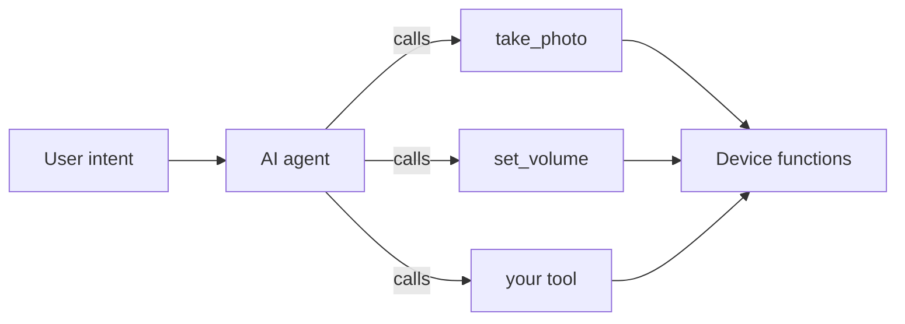
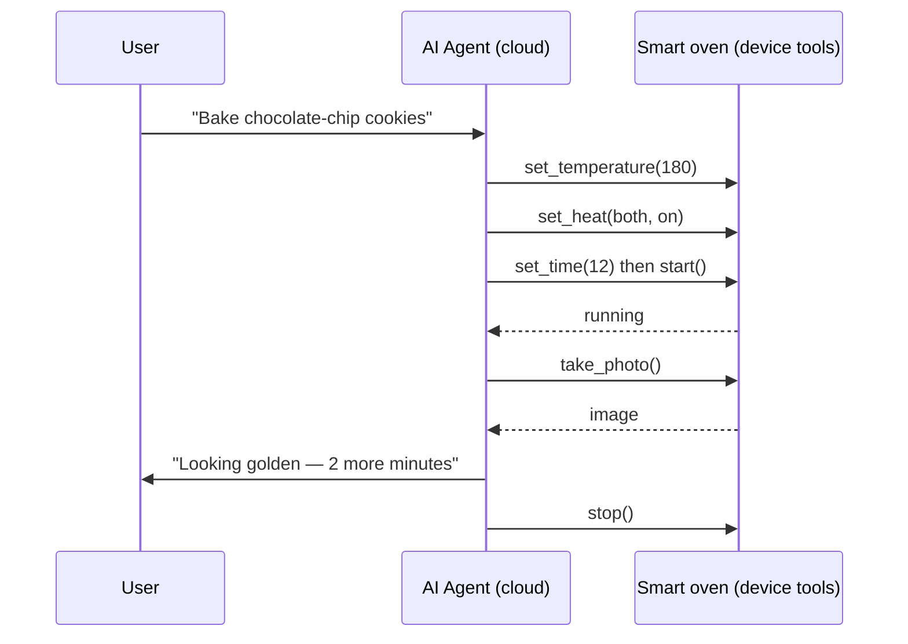

** 장치 MCP 도구**는 장치의 기능 중 하나를 포장합니다. 센서를 읽고 설정 변경, 모터를 이동, 사진을 찍습니다. 그래서 on-device AI 에이전트가 호출 할 수 있습니다. 도구는 에이전트 장치가 AI가 실제로 사용할 수있는 기능으로 변환하는 방법입니다. 이 페이지는 좋은 공구 뒤에 디자인 생각입니다; API를 위해, [MCP 서버] (../ai-components/ai-mcp-server)를 보십시오.

## 왜 명령 대신 도구
app-first 장치에서 흐름을 작성: 버튼 → 핸들러 → 동작. 대신에 에이전트 장치에서 ** 기능의 **를 게시하고 에이전트가 사용하는 것을 결정합니다, 어떤 순서에서, 대화를 기반으로. 게시된 각 기능은 도구입니다.

이 에이전트는 호출 할 때 결정하는 각 도구의 ** 이름과 설명을 읽습니다. 즉 도구 정의는 단지 배관되지 않습니다. - 그들은 AI가 의존합니다. 읽을 모델에 대한 쓰기.

## 좋은 도구를 만드는 것
### 이름 intent, 구현하지 않음
이름과 설명은 *what 사용자 get*를 설명해야하며, 펌웨어가 어떻게 작동하는지. `set_room_temperature`는 `pwm_write_channel_3` 보다는 더 낫습니다. 이 에이전트는 그 설명에 대한 사용자를 일치, 그래서 vague 또는 내부 이름은 잘못 된 도구에 리드 - 또는 none.

## 한 도구, 한 일
몇몇 것들이 제대로 선택하는 대리인을 위해 열심히 하는 공구. `set_brightness`, `set_color` 및 `turn_off`로 "빛 관리"를 분할하십시오. 소형, 단일 용도 도구 작곡; 다목적 도구 confuse.

### 는 모수를 정확하게 설명합니다
각 모수 (KEPTERM7X *property*)는 유형을 필요로 하고, 그것 적용되는, 범위. `volume`는 정수 `0–100`입니다. `mode`는 고정 세트 중 하나입니다. 정확한 경계는 에이전트 공급 유효한 인수를 허용하고 콜백은 입력을 신뢰합니다. TuyaOpen 속성 지원 유형 기본 및 범위 - [MCP 서버] (../ai-components/ai-mcp-server)에서 `ai_mcp_property_set_range` 및 `set_default_*` 의 도움자를 참조하십시오.

### 구조화, 의미있는 결과
도구는 그렇게 에이전트가 그것에 대해 말할 수 있는지보고해야합니다 : 새로운 온도, 사진 캡처, "오프" 반환 typed 값 (bool, int, string, JSON, 또는 이미지), 그냥 성공 / 실패. 대리인은 그것의 대답으로 당신의 반환 가치를 켭니다.

### Make 도구는 기본적으로 안전합니다
에이전트는 당신이 기대하지 않았다 조합에 도구 호출합니다. 장치를 보호하십시오:

- ** 콜백 내부의 변동 ** 속성이 입력되지 않는 경우에도 - 결코 장님으로 가치를 신뢰하지 않습니다.
- **Make 작업 idempotent ** 어디, 그래서 반복 통화는 무해합니다.
- ** 위험한 것. ** 파괴적 또는 반복적 인 행동 (공장 리셋, 잠금 해제)는 확인 단계가 아니며 베어 도구가 아닙니다.
- **Apply 최소한의 특전.** 만 게시 도구는 실제로 AI를 필요로합니다.

## 작업 예 : 스마트 오븐
스마트 오븐은 "expose 기능, 흐름"의 명확한 케이스입니다. 오븐에는 물리적 기능의 손이 있습니다. 도구로 포장하고 에이전트는 말한 요리법에서 요리 할 수 있습니다. - 당신이 고정 된 메뉴로 스크립트 할 수없는 무언가.

## 는 도구로 오븐의 기능을 포장
|제품 정보|제품 정보|기타 제품|오시는 길|
|------|------------|---------|---------|
|`set_temperature`를|`celsius` (int, 0–250)|새로운 setpoint|히이터 통제|
|`set_time`를|`minutes` (int, 0–180)|timer 값|카운트다운 타이머|
|`set_heat`를|`element` (`top` / `bottom` / `both`), `on` (불)|요소 상태|top/bottom 요소|
|`start`를| — |실행 상태|주기 시작|
|`stop`를| — |정지 상태|끝 주기|
|`take_photo`를| — |JPEG 이미지|내부 카메라|

각은 의도적으로 이름, 단일 목적이며, 유형 및 경계 속성을 가지고 있으며, 의미있는 결과를 반환합니다. 경계 문제 : `celsius`를 250에서 캡핑하는 것은 물리적으로 안전한 온도를 요청할 수 없습니다.

## # 에이전트가 레시피를 계획하자
오븐은 고정 "bake"버튼보다는 기능을 게시하기 때문에, 에이전트는 계획으로 열린 요청을 전환하고 카메라를 사용하여 *check 행렬 *로 설정하고 이동 여부를 결정합니다.

레시피 지식 ("cookies bake at 180°C for ~12 분,"golden edges mean done") 클라우드 에이전트의 이유와 기술에 살고. 이 장치는 솔직하고 안전한 공구를 노출해야 합니다. 레시피를 교환하고 장치 변경에 아무것도 없습니다. 즉, Agentic-first payoff입니다.

:::가격
이것은 [Device & Cloud Collaboration](/device-cloud) 페이지에 표시된 상호 작용입니다. 상호 작용하는 레시피 데모를 사용해 클라우드에서 디바이스를 실행하는 단계를 볼 수 있습니다.
:::

## 내장 도구에서 알아보기
TuyaOpen는 참조 구현으로 장치 도구의 작은 세트를 발송합니다 - 쿼리 장치 정보, 사진, 설정 볼륨, 스위치 채팅 모드. 이 규칙을 정확히 따르십시오. 의도적으로 이름, 단일 목적, 범위를 가진 유형 속성, 구조화 된 반환, 그리고 구성 요소에 의해 각 한 게이트. 스스로 작성하기 전에 [Built-in MCP Tools](../ai-components/ai-mcp-tools)에서 공부하십시오.

## 장치 도구 vs 클라우드 MCP
MCP의 2개의 층은 존재하고, 그들은 다른 문제를 해결합니다:

| |장치 MCP 도구|클라우드 MCP|
|---|------------------|-----------|
|지원하다|제품정보|Tuya 클라우드 에이전트|
|제품정보|지역 센서, 액추에이터, 주변 장치|외부 서비스, APIs, 데이터베이스|
|정의 된|[`ai_mcp` 서버 API] (../ai-components/ai-mcp-server)|[클라우드 MCP 관리](../../tuya-cloud/ai-agent/mcp-management)|

전체 제품은 종종 두 가지를 사용합니다 : "이 상자가 의미하고 할 수 있는지,"세계가 그것을 위해 할 수있는 구름 MCP를."

## 참조
- [MCP Server](../ai-components/ai-mcp-server) - 장치 측 도구 API
- [Built-in MCP 도구](../ai-components/ai-mcp-tools) - 참조 구현
- [Agentic-first 하드웨어](agentic-first-hardware) - 왜 기능 비트 흐름
- [Manage cloud MCP](../../tuya-cloud/ai-agent/mcp-management) - 클라우드 사이드 카운터
