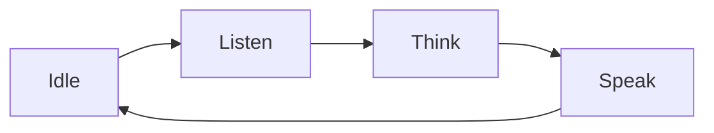

Voice-first 디자인은 ** 대화는 사용자가 장치를 제어하는 주요 방법이다** - 음성은 상호 작용, 화면, LED 및 톤 지원이 오히려 납보다. 이 페이지는 음성 상호 작용이 자연스럽고, 각지도가 TuyaOpen 기능에 미치는 원리를 다룹니다.

## 왜 음성 첫번째
음성은 하드웨어를 위한 가장 낮은 마찰 공용영역입니다: 그것은 스크린, 앱 및 학습을 필요로 하지 않습니다. 핸즈프리와 방 전체에 작동합니다. 그러나 목소리는 또한 unforgiving입니다 — 검사하는 아무 메뉴도 없습니다, 그래서 장치는 응답을 느끼고, 그것의 국가를 명백하게 만들고, 그것을 mishears 때 우아한 회복하십시오. 좋은 목소리 디자인은 대부분 그 기대를 관리에 대해.

## 원칙
## 1. Make 모든 국가 명백
사용자는 커서 또는 스피너를 볼 수 없으므로 장치가 켜져있는 신호가 있어야합니다. idle, listening, 사고 또는 말하기. 채팅 모드 상태 (`LISTEN`, `UPLOAD`, `THINK`, `SPEAK`)에 직접이지도 - 톤, LED 색상, 화면 표시기 또는 애니메이션으로 각 하나.

:::가격
Signal "listening" 즉시 캡처 시작. 가장 일반적인 목소리 불만은 준비가되지 않은 장치에 대해 이야기합니다.
:::

## 2. 답하기 전에 즉시 응답
Reasoning은 시간이 걸립니다. 인정은 안됩니다. 짧은 프롬프트 톤을 재생하는 순간 당신은 깨어있는 단어 또는 버튼을 눌러 그래서 사용자가 듣는 것을 알고. TuyaOpen는 클라우드 프롬프트 톤(`cmd:0`–`cmd:5`)과 로컬 알림 톤을 제공합니다. [AI Agent](../ai-components/ai-agent)과 [Audio Player](../ai-components/ai-audio-player)를 참조하십시오.

## 3. 사용자 중지하자
사람들은 그들의 마음을 변화시킵니다. 음성장치는 **barge-in**를 지원해야 합니다. 사용자는 기기가 말하는 동안, 재생을 즉시 중지하고 듣습니다. Agent's session **break** 이벤트는 플레이어를 멈추고 버퍼를 한 번에 맑게 합니다.

## 4. 올바른 캡처 모드를 선택하십시오.
장치가 전체적인 느낌을 듣는 *when*를 결정하는 방법. 제품 및 환경에 [chat mode](../ai-components/ai-mode-manage) 일치:

|제품 상황|주요 특징|이름 *|
|------------------|------|-----|
|Noisy 방, deliberate 회전|[Hold-to-talk](../ai-components/ai-mode-hold)|사용자가 듣는 경우 정확히 제어|
|간단한 단일 질문|[원샷](../ai-components/ai-mode-oneshot)|1개의 압박, 1개의 대답|
|핸즈프리, 깨어있는 단어|[워크업](../ai-components/ai-mode-wakeup)|자연, 버튼 없음|
|연속 대화|[무료](../ai-components/ai-mode-free)|다 회전, 항상 울음 후|

## # 5. "나는 그것을 잡지 않았다"에서 복구
Misrecognition는 정상적인, 과실 국가 아닙니다. ASR가 쓸모없는 것을 반환 할 때, 한 번 묻습니다, 단순히 ("Sorry, 그 다시?"), 그리고 청취를 반환 - 절대 죽은 말. 짧은 프롬프트 유지; 긴 사과는 원래 놓기보다 악화됩니다.

## 6. 짧고 말한 모양을 replies
눈에 쓰여진 텍스트는 잘못된 aloud를 읽습니다. 문장 당 한 가지 아이디어, 답을 프론트로드하고 사용자가 더 많은 것을 요청하십시오. [AI Agent 플랫폼](../../tuya-cloud/ai-agent/ai-agent-dev-platform)의 에이전트 역할과 프롬프트에서 이것을 구성합니다.

## 7. 어떤 목소리를 위한 스크린을 빈번하게 추가하십시오
음성은 목록, 숫자, 그리고 진행 상황을 보여서 나쁘다. 장치에는 디스플레이가있을 때, [UI 구성품](../ai-components/ai-ui-manage)를 사용하여 성적표, 정서, 현재 플레이 카드 또는 사진 - 대화를 강화하고 대체하지 않습니다.

## 방지패턴
- **심사.** 청각과 대답 사이에 조용히 가십시오 - 사용자는 실패를 가정합니다.
- **램백이 없는 것만.** 네트워크 드롭은 분명한 말이나 시각 메시지로 정렬되어야하며 침묵이 아닙니다.
- ** 텍스트 aloud의 벽을 읽기. ** Summarize; 요청에 세부 사항 제공.
- **통역을 무시합니다. ** 사용자에 대해 이야기하는 장치가 깨어납니다.

## 참조
- [Agentic-first Hardware](agentic-first-hardware) - 더 큰 상호 작용 이동
- [Voice Chat Modes](../ai-components/ai-mode-manage) - 디바이스가 듣는 경우
- [AI Agent] (../ai-components/ai-agent) - 세션, 신속한 톤 및 역할
- [Component Framework](../ai-components/ai-components) - 음성 루프 뒤에 모듈
