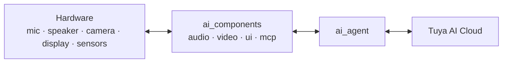

TuyaOpen AI 장치는 ** 다중 **: 그것은 연설, 원본, 사진기 이미지 및 장치/감지기 자료에서 가지고 가고, 연설, 화면 원본 및 행동에 반응합니다. 이 페이지는 그 4개의 modalities를 분류하고 **hardware** (mic, speaker, camera, display, sensors), **on-device software** (`ai_components`) 및 **Tuya AI 클라우드**와 같은 각 여행 방법을 보여줍니다.

## 세 레이어 경로
모든 modality는 동일한 경로를 따르고, `ai_agent`는 구름에 단일 다리입니다. 각 modality 모듈은 주변의 하나의 클래스를 소유하고 데이터를 손으로 - 또는 에이전트에서 수신.

`Kconfig` (`ENABLE_COMP_AI_*`)의 제품 요구만 사용할 수 있습니다.

## 1. 오디오 - 음성, 음성
음성 조수의 핵심 형태.

-**In:** 마이크 → `ai_audio_input` → 음성 활동 탐지 (VAD) - 수동 (버튼 프레스) 또는 자동 (보이지 감지) - 음성을 조각, `ai_agent` 클라우드 ASR에 업로드. Wake-word 청취는 [Wakeup 채팅 모드](ai-components/ai-mode-wakeup)에 의해 구동됩니다.
- ** 아웃 : ** 클라우드 TTS 및 음악 → `ai_audio_player` → 디코딩 및 재 샘플 → 스피커.
-**Hardware:** 마이크, 스피커, 버튼
- ** 구성품 :** [오디오 입력](ai-components/ai-audio-input), [오디오 플레이어](ai-components/ai-audio-player).

## 2. Vision — 이미지, 미리 보기
-**In:** 카메라 → `ai_video_input`는 JPEG 프레임(`ai_video_get_jpeg_frame`)을 캡처 → `ai_agent_send_image`는 시각 Q&A 또는 이미지 이해를 위한 클라우드 비전으로 업로드합니다.
- ** 아웃 / 미리보기 : ** 라이브 카메라 프레임은 비디오 디스플레이 콜백을 통해 로컬 렌더링합니다. `ai_picture`를 통해 클라우드 퓨즈 이미지 스트림.
-**Hardware:** 카메라, 디스플레이.
- ** 구성품 :** [영상 입력](ai-components/ai-video-input).

## 3. 텍스트 — 입력 또는 인식, 렌더링
- **에서:** `ai_agent_send_text`는 문자열을 직접 보냅니다; 음성 입력은 또한 ASR 텍스트로 돌아옵니다.
- ** 아웃 : ** NLG 응답은 토큰으로 다시 토큰을 스트리밍하고 `ai_ui`는 선택한 스타일 (WeChat-style Bubbles, chatbot 또는 OLED)에서 렌더링합니다.
-**Hardware:** 디스플레이 (및 serial, serial chatbot 데모).
- ** 구성품 : ** [AI Agent] (ai-components/ai-agent), [UI 관리] (ai-components/ai-ui-manage).

## 4. Sensory / 장치 데이터 - 상태, 행동
이것은 클라우드 AI가 물리적 장치를 인식하고 제어하는 방법입니다.

- AI는 장치 상태를 읽고 **MCP 도구를 통해 동작을 트리거 ** `ai_mcp`에 의해 노출: 쿼리 장치 정보, 스위치 채팅 모드, 사진을 찍고 볼륨을 조정할 수 있습니다. - 자신의 센서 및 액추에이터에 등록 할 수있는 사용자 정의 도구.
- Arbitrary byte 페이로드도 `ai_agent_send_file`로 업로드 할 수 있습니다.
- ** 하드웨어 : ** 센서, 액추에이터, GPIO - MCP 도구 구현을 통해 도달.
- ** 구성품:** [MCP 서버](ai-components/ai-mcp-server), [MCP 도구](ai-components/ai-mcp-tools).

## 각 modality가 처리되는 곳
|이름 *|(하드웨어 → 클라우드)|아웃 (cloud → 하드웨어)|제품정보|
|----------|------------------------|------------------------|------------|
|**오디오 **|mic → VAD → 대리인|TTS / 음악 → 플레이어 → 스피커|`ai_audio_input`의 `ai_audio_player`|
|**비젼 **|카메라 → JPEG → 에이전트|미리보기 / 푸시 이미지 → 디스플레이|`ai_video_input`의 `ai_picture`|
|** 텍스트 **|`send_text`/케터M1X|NLG 스트림 → UI → 디스플레이|`ai_agent`의 `ai_ui`|
|**Sensory / 장치 **|MCP 도구 읽기, `send_file`|MCP 도구 작업|`ai_mcp`를|

:::기사
모든 4개의 modalities는 `ai_agent`를 통해 하나의 클라우드 세션을 공유합니다. 채팅 모드는 *when* 장치 듣기 및 업로드를 결정합니다. 에이전트는 *how* 데이터가 클라우드에 도달합니다. 클라우드는 *what*가 다시 제공됩니다.
:::

## 참조
- [Component Framework](ai-components/ai-components.md) - 각 modality의 모듈
- [AI Agent] (ai-components/ai-agent) - 구름에 단일 다리
- [Voice Chat Modes](ai-components/ai-mode-manage) - 디바이스가 듣는 경우
- [장치에 MCP를](ai-components/ai-mcp-server) - 센서 입력 및 장치 제어
