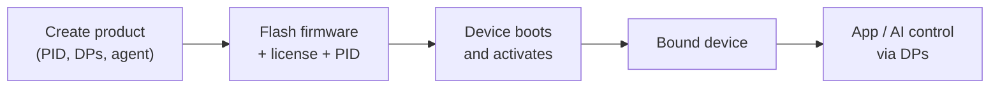

Binding은 Tuya 클라우드의 정체성에 물리적 장치를 연결하는 것은, 그래서 Tuya 앱과 AI 에이전트는 인식 할 수 있습니다, 제어, 업데이트. 이 페이지는 4 개와 함께 넣어 주문에 대해 설명합니다. - 제품을 만들거나 보드를 플래시하기 전에 읽어보십시오.

:::기사
Binding는 Tuya Cloud를 사용하므로 라이센스 키 ()) 및 플랫폼에 설정 된 제품을 필요로합니다. [Equipment authorization](../../quick-start/equipment-authorization)를 참조하십시오.
:::

## 네 조각
|제품 정보|관련 기사|그것은 무엇입니까?|
|-------|----------|------------|
|**제품(PID)**|Tuya 구름|장치 모델의 클라우드 정의 — 그것의 기능 (DPs) 및, AI 제품, 그것의 대리인. 제품 ID (`PID`)에 의해 식별.|
|**라이센스 (UUID + AuthKey) **|장치로 깜박임|하드웨어를 증명하는 per-device 자격.|
|**액션 **|장치 ↔ 구름|첫번째 연결에, 장치는 그것의 면허 및 `PID`를 선물하고, 구름으로 등록하고, 그것의 ID (`DeviceID`의 열쇠, 스키마)를 다운로드합니다.|
|**DP 컨트롤 **|앱 / AI ↔ 장치|활성화 후, 앱 및 에이전트는 데이터 포인트로 명령을 보냅니다 (DP); 장치가 DP로 state를 다시 보여줍니다.|

이 장치는 *bound* 한 번 활성화가 성공합니다. 클라우드는 이제 제품에 묶여있는 독특한 장치가 있으며 제어는 두 가지 방법을 모두 흘릴 수 있습니다.

## 바인딩 교류

## 실제로 무엇을
Binding는 3개의 구체적인 단계, 그것의 자신의 가이드로 각각입니다:

1. ** 클라우드에 제품을 저장 ** - `PID`, 그 기능 (DP), AI 에이전트 및 사용자 정의 펌웨어 항목 정의. → [제품 및 에이전트](creating-new-product)
2. ** 장치 ** - 라이센스 (`UUID` + `AuthKey`) 및 `PID`를 펌웨어로 작성, 코드 또는 플래시 도구로. → [장비 허가](../../quick-start/equipment-authorization)
3. ** 건물 및 플래시 ** - `tos.py build && tos.py flash`. 첫 번째 부팅 장치 쌍 (Bluetooth 또는 Wi-Fi AP) 및 제품에 대한 활성화.

그 후, 장치는 Tuya 앱에 나타나고 에이전트는 DP를 통해 구동 할 수 있습니다.

## 펌웨어가 클라우드에 이야기하는 곳
장치 측에, [Tuya IoT 클라이언트] (../iot-client/tuya-iot-client-reference) (`tuya_iot.h`)는 활성화, MQTT 연결 및 DP 보고를 소유합니다. 응용 프로그램은 이벤트 핸들러를 등록하고 들어오는 DP에 반응합니다. - [제품 및 에이전트] (creating-new-product#handle-control-on-the-device) 및 최소 [switch demo] (../iot-client/demo-tuya-iot-light) 예에서 핸들러를 볼 수 있습니다.

## 참조
- [제품 및 에이전트](creating-new-product) - 클라우드 사이드 설정
- [Tuya IoT 클라이언트 API] (../iot-client/tuya-iot-client-reference) - 장치 측 클라우드 클라이언트
- [switch demo](../iot-client/demo-tuya-iot-light) - 최소 경계 장치
- [Equipment authorization](../../quick-start/equipment-authorization) - 라이센스 취득 및 쓰기
