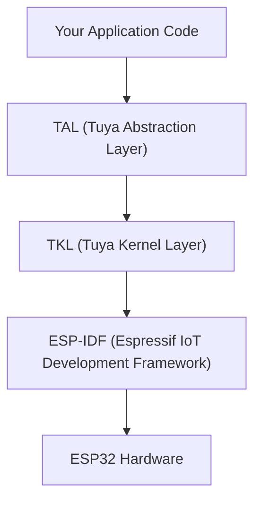

TuyaOpen은 ESP-IDF의 상단에 Espressif ESP32 칩 제품군을 실행하므로 TuyaOpen SDK와 같은 TuyaOpen SDK 및 API를 사용하여 ESP32 하드웨어에서 IoT 및 AI 애플리케이션을 구축하십시오. Tuya T-series, Linux 및 기타 지원 플랫폼.

## 왜 TuyaOpen를 사용 ESP32
이미 ESP32에서 개발 한 경우 TuyaOpen은 다음과 같습니다.

- **Tuya Cloud 통합 **: 장치 활성화, 원격 제어, OTA 및 데이터 포인트 (DP) 상자에서 자신의 클라우드 스택을 작성하지 않고.
- **Cross-platform 포트 가능 **: TuyaOpen의 TAL/TKL 요약에 대해 한 번 응용 코드를 작성하십시오. 동일한 앱 로직은 T5AI, T2, T3, Raspberry Pi 및 ESP32에서 리쓰기 없이 실행됩니다.
- **AI 기능**: 통합 AI SDK를 통해 Tuya의 AI Agent, 음성 상호 작용(ASR/TTS/KWS) 및 LLM 서비스 액세스.
- **Production-ready 경로**: 장치 허가, 라이센스 키 관리, OTA 펌웨어 업데이트 및 Tuya Smart 앱 페어링은 프로토 타입에서 대량 생산에 내장되어 있습니다.
- **Peripheral 라이브러리 **: Reusable 디스플레이, 오디오 코덱, 버튼, LED 및 센서 드라이버를 보드 레벨 구성으로 사용합니다.

## ESP-IDF와의 관계
TuyaOpen on ESP32는 ESP-IDF의 상단에 구축하여 교체하지 않습니다. 이 같이 층 더미:

- **ESP-IDF**는 아래 SDK를 유지한다. FreeRTOS, lwIP, NVS, Wi-Fi 드라이버 및 블루투스 컨트롤러 모두 IDF에서 제공됩니다.
- ** TKL 어댑터 ** (`tkl_wifi.c`, `tkl_gpio.c`, 다른 사람) TuyaOpen의 휴대용 API 호출을 ESP-IDF 기능 호출 번역.
- **Your app code**는 TAL/TKL API를 호출합니다. 모든 TuyaOpen 플랫폼에서 동일합니다.

아직도 사용할 수 있습니다`tos.py idf`ESP-IDF 명령에 직접 접근하기 (예:`menuconfig`, `monitor`) 당신은 저수준 통제를 필요로 할 때.

## ESP-IDF 라이브러리를 사용할 때 TuyaOpen 라이브러리
|이름 *|제품 정보|이름 *|
|------|-----|-----|
|Wi-Fi, BLE, GPIO, UART, SPI, I2C, PWM, ADC, 타이머|TuyaOpen TKL/TAL APIs는|Cross-platform, 일관된 API|
|Tuya Cloud, 장치 관리, OTA, DP|TuyaOpen 클라우드 서비스|Tuya 생태계에 필요한|
|AI (ASR, TTS, LLM, MCP)|TuyaOpen AI SDK는|Tuya AI Agent와 통합|
|LVGL 그래픽|ESP32의 LVGL (IDF 성분을 통해)|ESP32는 자체 LVGL 포트를 사용합니다|
|디스플레이 드라이버 (LCD init, SPI 버스)| `boards/ESP32/common/display/` |보드 레벨 BSP, ESP-IDF LCD API 호출|
|오디오 코덱 (ES8311, ES8388)| `boards/ESP32/common/audio/` |보드 레벨 BSP, ESP-IDF I2S/codec API 호출|
|공급업체별 IDF API(NVS, ESP-NOW, ULP)|직접 ESP-IDF`tos.py idf` |TuyaOpen에 의해 요약되지 않음|
|제3자 IDF 부품|ESP-IDF 부품 관리자|더 보기`idf_component.yml`당신의 프로젝트|

:::tip[엄지의 규칙]
TuyaOpen APIs를 사용하여 플랫폼 전체에 휴대용을 원합니다. ESP-IDF를 직접 사용하여 TuyaOpen가 추상적이지 않는 ESP32-specific 기능 (예: ULP coprocessor, ESP-NOW, ESP-MESH).
:::

## ESP32 Wi-Fi 구현 노트
TKL Wi-Fi 어댑터 (`tkl_wifi.c`) 알아야 할 ESP32 별 행동이 있다:

- ** 전원 저장 **: 역 모드를 자동으로 활성화`WIFI_PS_MIN_MODEM`연결 후에. 이것은 힘을 감소시키고 그러나 순간 신청을 위한 latency를 증가할지도 모릅니다.
- ** 빠른 연결 **:`tkl_wifi_station_fast_connect()`저장된 채널과 BSSID를 사용하여 스캔을 건너 뛸 수 있습니다. Credentials는 namespace의 NVS에서 캐시됩니다.`tuya.storage`.
- **AP 중지는 불완전 **:`tkl_wifi_stop_ap()`이름 *`OPRT_OK`, 그러나 눈물 아래로 논리는 현재 접합기에서 밖으로 언급됩니다. AP에서 STA 모드로 전환하면 재시작이 필요할 수 있습니다.
- **스텁 API **:`tkl_wifi_ioctl()`이름 *`OPRT_NOT_SUPPORTED`. `tkl_wifi_get_bssid()`반환 성공하지만 BSSID 버퍼를 채우지 않습니다. 이 일반적인 사용은 중요하지 않지만 고급 시나리오에 대한 문제.
- **국가 코드**: 어댑터 맵 지역 코드 (CN, 미국, JP, EU) Wi-Fi 채널 범위. EU는 내부적으로 국가 코드 맵`"AL"`.

## 다음 단계
- [ESP32로 빠른 시작](esp32-quick-start): ESP32에서 첫 번째 TuyaOpen 프로젝트를 만들고 플래시합니다.
- [ESP32 지원 기능](esp32-supported-features): 칩 변형의 특징 매트릭스.
- [ESP32 핀 Mapping](esp32-pin-mapping): GPIO, UART, I2C, SPI 및 PWM 핀 할당
- [새로운 ESP32 보드 추가](esp32-new-board): 사용자 정의 하드웨어의 BSP 만들기.
- [ESP32 OTA 업데이트](esp32-ota): 오버 에어 펌웨어 업데이트.

## 더 보기
- [Espressif ESP32 자료표](https://www.espressif.com.cn/sites/default/files/documentation/esp32_datasheet_en.pdf)
- [TuyaOpen-esp32 GitHub 저장소](https://github.com/tuya/TuyaOpen-esp32)
- [TuyaOpen 시작하기](/docs/quick-start)
- [지원되는 기계설비 명부](/docs/hardware)
