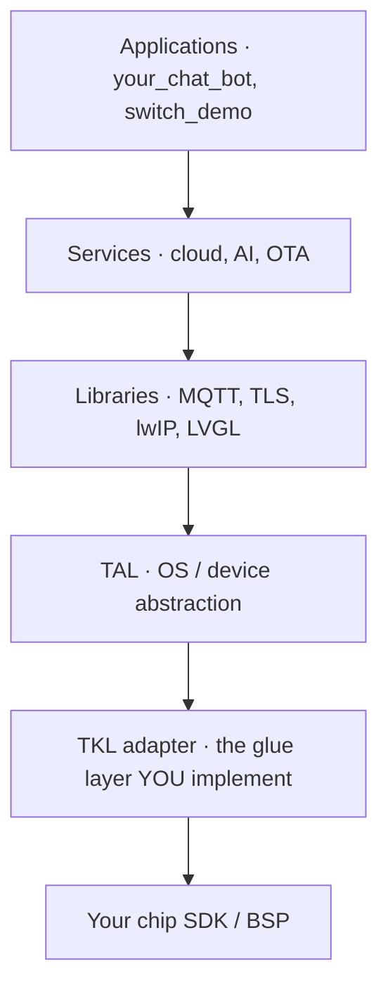

이 가이드는 **실리콘, 모듈 및 보드 공급업체 ** TuyaOpen을 실행하려면 하드웨어를 원합니다. Porting은 얇은 어댑터를 구현하는 것을 의미합니다. "glue layer" - TuyaOpen의 하드웨어 요약에 칩 SDK를 매핑하므로 모든 TuyaOpen 응용 프로그램, 클라우드 서비스 및 AI 기능은 플랫폼에서 변경되지 않습니다. 이 페이지는 빌드하는 것을 설명합니다. 참조 포트에서 복사 할 수 있으며 작업이 당신을 위해 잠금 해제됩니다.

## 누구에게도
3개의 납품업자 역할은 일의 다른 양을 합니다. 시작하기 전에

|당신은 ...|당신의 목표|당신은 무엇을|시작하기|
|------------|-----------|-------------|------------|
|**칩 납품업자 ** (silicon / SDK 소유자)|SoC 또는 MCU를 일류 TuyaOpen 대상 만들기|칩 SDK (시스템, 주변 장치, 연결, 저장)에 전체 TKL 어댑터 구현|이 가이드 →[플랫폼 만들기](new-platform) → [새로운 플랫폼에 적응](porting-platform) |
|**모듈 공급업체 **|칩에 내장 된 모듈을 배송|칩의 플랫폼 항구를 재사용하십시오; 단위 핀/flash/RF config를 추가하십시오| [새로운 플랫폼에 적응](porting-platform), 그 후에 널 구성|
|** Board / DevKit 공급 업체 **|이미 지원된 칩의 주위에 널을 발송하십시오|보드 정의 만 추가 - 플랫폼 포팅 없음| [새 보드에 적응](new-board) |

칩이 이미 지원되는 경우 (Tuya T-series, ESP32, BK7231X, GigaDevice, Linux ...), 당신은 모듈 또는 보드 공급 업체입니다 : 플랫폼 포팅을 건너 보드를 정의합니다.

## 큰 그림: 접착제 층이 앉는 곳에
TuyaOpen은 계층화됩니다. 응용 프로그램, 서비스 및 라이브러리는 **platform-independent** 및 배 as-is입니다. 아래 어댑터에서 포트의 수명 - **Tuya Kernel Layer (TKL)** - 칩 SDK와 BSP를 호출합니다.

TKL 라인 위의 모든 것은 재사용됩니다. TuyaOpen가 실리콘을 만나는 한 층입니다. SDK를 호출하여 TKL 인터페이스를 구현합니다. TKL 공용영역은 TuyaOS와 동일하기 때문에, 항구는 또한 rework 없이 상업적인 TuyaOS SDK를 실행합니다.

## 참고 포트에서 시작
처음부터 시작하지 마십시오. Tuya는 여러 플랫폼에 완벽한 작업 접착제 층 포트를 유지합니다. 칩에 가장 가까운 것을 복사하고 SDK 통화를 대신합니다.

|회사연혁|참고 접착제 층 repo|모델로 사용|
|----------|---------------------------|------------------------|
|Tuya T5 (Wi-Fi + BT AI 소C)| [투야Open-T5AI](https://github.com/tuya/TuyaOpen-T5AI) |가득 차있는 AI-capable Wi-Fi + Bluetooth SoC 항구|
|사이트맵| [카테고리](https://github.com/tuya/TuyaOpen-GigaDevice) |GigaDevice MCU / Wi-Fi 포트|
|에스프레소 ESP32| [토야Open-esp32](https://github.com/tuya/TuyaOpen-esp32) |**벤더의 lwIP** 사용`tkl_network.c`) |
|투야 T2| [투야Open-T2](https://github.com/tuya/TuyaOpen-T2) |**TuyaOpen의 lwIP ** (다트`tkl_lwip.c`) |
|우분투 / 리눅스| [카테고리](https://github.com/tuya/TuyaOpen-ubuntu) |흐름을 학습하고 PC에서 가져 오기|

:::tip
더 알아보기[Ubuntu 참조](https://github.com/tuya/TuyaOpen-ubuntu)먼저, 대상이 아닙니다. 당신이 실행하자`switch_demo`엔드 - 페어링, 활성화, 클라우드 제어 - 그래서 당신은 하드웨어를 터치하기 전에 포트를 재현해야합니다.
:::

## 당신이 실행하는 것: 접합기 표면
`tos.py new platform`아래의 어댑터 템플릿 생성`platform/<your_chip>/tuyaos/`이름 *`tools/porting/adapter`. 당신은 안으로 채웁니다`.c`칩 SDK를 호출하여 파일. 표면은 4 개의 영역 - 원시 하드웨어 인터페이스에서 네트워크 프로토콜 인터페이스까지.

|(주)|TKL 인터페이스 구현|이름 *|
|------|------------------------------|-----------|
|**시스템 및 OS**|시스템, 실, mutex, semaphore, 타이머, 로그 출력| [시스템 API](../../tkl-api/tkl_system) |
|** 기계설비 공용영역 **|GPIO, UART, I2C, SPI, PWM, ADC, DAC, I2S, pinmux, watchdog, RTC| [하드웨어 인터페이스 API](../../tkl-api/tkl_gpio) |
|** 연결성**|Wi-Fi, Bluetooth의 네트워크 소켓 (`tkl_network`) 또는 lwIP (`tkl_lwip`), 타전된 이더네트| [사이트맵](../../tkl-api/tkl_wifi), [tkl 블루토](../../tkl-api/tkl_bluetooth) |
|**저장 및 OTA**|Flash, OTA; LittleFS (TuyaOpen) 또는 공급업체 FS를 통해 파일 시스템| [tkl 플라쉬](../../tkl-api/tkl_flash), [사이트맵](../../tkl-api/tkl_ota) |

당신은 당신의 제품 필요만 인터페이스를 구현 —`menuconfig`Wi-Fi, BLE 또는 둘 다만 활성화할 수 있으며, 해당 템플릿만 생성됩니다.

:::note
두 개의 연결 옵션이 가장 중요합니다. 네트워크 스택의 경우, SDK의 lwIP를 유지하고 적응`tkl_network.c`(기타)[토야Open-esp32](https://github.com/tuya/TuyaOpen-esp32/blob/master/tuya_open_sdk/tuyaos_adapter/src/drivers/tkl_network.c)) ** 또는 ** 사용 TuyaOpen의 lwIP 및 적응`tkl_lwip.c`(기타)[투야Open-T2](https://github.com/tuya/TuyaOpen-T2/blob/master/tuyaos/tuyaos_adapter/src/tkl_lwip.c)) — 단지 하나만 적응하십시오. TLS의 경우 SDK의 Mbed TLS 또는 TuyaOpen을 사용하십시오. 가득 차있는 RTOS porting 참고는 입니다[포트 TuyaOS에 RTOS 플랫폼](https://developer.tuya.com/en/docs/iot-device-dev/TuyaOS-translation_rtos?id=Kcrwraf21847l).
:::

## Porting 워크플로우
1. **작동 ** — 실행`switch_demo`우분투 참조에; 읽기[시작하기](../../quick-start/index.md)그리고[tos.py 가이드](../../tos-tools/tos-guide).
2. ** 플랫폼 ** —`tos.py new platform`비계`platform/<your_chip>/`이름 *`boards/<your_chip>/`. 보기[플랫폼 만들기](new-platform).
3. **Wire the build** — 툴체인을 가져오고 컴파일/link를 실행하는 스크립트를 작성하고 QIO/UA/UG 펌웨어를 생성한다. 이름 *[새로운 플랫폼에 적응](porting-platform).
4. ** TKL 어댑터 ** - 생성 된 채우기`.c`SDK의 파일, 참고 저장소에서 칩에 가까운 시작.
5. ** TuyaOpen의 저수지 ** — 활성화`ENABLE_FLASH`그리고 사용되지 않는 플래시 지역을 설정 (펌웨어 영역, 일치 지우개 granularity) 장치 허가 및 파일 시스템.
6. ** 데모와 함께 제공 ** — 빌드`apps/tuya_cloud/switch_demo`, 쌍, 활성화하고, 항구를 확인하기 위하여 장치를 통제하십시오.

## 자주 묻는 질문
한 번에 플랫폼 한 층을 가져 와서 확인하십시오. 각 단계는 1 전에 달려 있으므로 항상 작업 기지에 테스트하십시오. 각 단계는 목표, 정확한 파일 구현 및 확인 방법의 자체 가이드를 가지고 있습니다.

|기본 정보|이름 *|키 파일|
|-------|------|-----------|
| [1. 시스템 및 로그](bring-up/system-and-logs) |Boot, OS primitives, UART에 로그| `tkl_system.c`, `tkl_output.c`, `tkl_uart.c` |
| [2. 섬광과 저장](bring-up/flash-and-storage) |권한 데이터 persists| `tkl_flash.c` |
| [3. Wi-Fi 및 네트워크](bring-up/wifi-and-network) |AP 가입, 인터넷에 도달 (TLS)| `tkl_wifi.c`, `tkl_network.c` / `tkl_lwip.c` |
| [4. 구름 연결](bring-up/cloud-connection) |쌍, 활성화, 실행`switch_demo` | `tkl_rtc.c`, RNG,`tkl_bluetooth.c`* (선택) *|
| [5. Peripherals와 AI](bring-up/peripherals-and-ai) |오디오/display/BLE, 그 후에`your_chat_bot` | `tkl_i2s.c`, `tkl_gpio.c`, … |

## 왜 TuyaOpen에 칩을 가져
한 번 실리콘을 AI + IoT 생태계에 연결하십시오. 구체적으로, 항구 후에:

- ** 모든 TuyaOpen 앱은 칩을 변경하지 않습니다 ** —`switch_demo`, `your_chat_bot`, 그리고 더 넓은 app 도서관은 일 당신의 접합기 통행을, 앱 노력 없이 작동합니다.
- ** Tuya 클라우드 및 AI 플랫폼에 대한 즉각적인 액세스 ** - 고객은 클라우드 인프라를 구축하지 않고 장치 페어링, OTA, 에이전트 플랫폼, 음성 및 Tuya 응용 프로그램을 얻습니다.
- ** 고객을위한 Faster Time-to-market ** - 칩에 모듈 및 보드 메이커 건물이 완성 된 소프트웨어 스택과 선박 제품을 상속, 가져 오기 프로젝트. 그것은 당신의 실리콘을 쉽게 디자인합니다.
- ** 한 번, 어디에 배치 ** — 같은 응용 코드 그들의 팀은 칩과 다른 TuyaOpen 대상을 통해 실행, 그래서 당신의 플랫폼은 하드웨어 메모에 경쟁, 잠금에서.
- **TuyaOS 호환 무료** — TKL 인터페이스는 TuyaOS와 일치하기 때문에, 동일한 포트는 또한 Tuya의 상용 SDK를 실행, 대량 생산 Tuya 생태계를 엽니 다.
- ** 생태계의 가능성 ** — 지원된 플랫폼은 docs, 보드 목록 및 IDE에 나타납니다. 모든 TuyaOpen 개발자의 앞에 칩을 넣어.

짧은: 1개의 접합기는 완전한, 클라우드 연결해, AI-ready 제품 플랫폼으로 벌거벗은 칩 SDK를 회전시키고, 당신의 실리콘에게 그것의 정상에 모든 것을 위한 쉬운 선택을 만듭니다.

## 더 보기
- [플랫폼 만들기](new-platform)— 플랫폼과 비계`tos.py new platform`
- [새로운 플랫폼에 적응](porting-platform)- 상세한 빌드 + TKL 단계
- [새 보드에 적응](new-board)— 지원되는 칩에 board/DevKit 납품업자를 위해
- [하드웨어 인터페이스 API](../../tkl-api/tkl_gpio) · [사이트맵](../../tkl-api/tkl_wifi) · [tkl 블루토](../../tkl-api/tkl_bluetooth)— 구현하는 인터페이스
