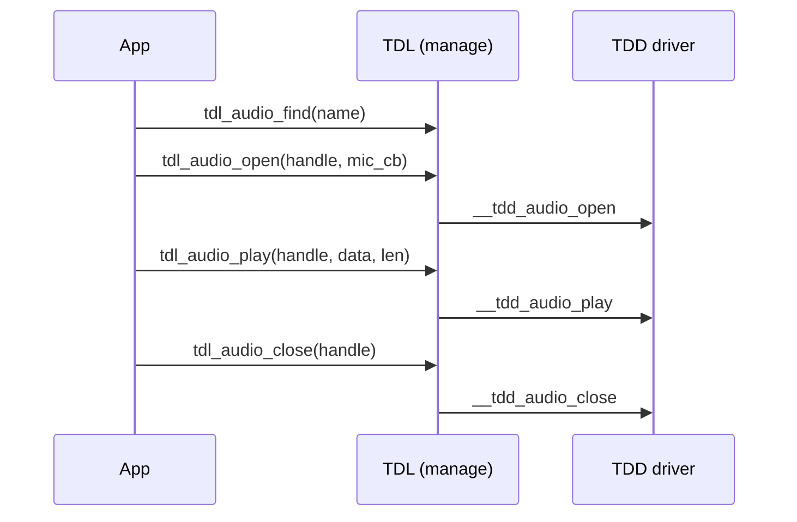

더 보기[오디오 드라이버](https://github.com/tuya/TuyaOpen/tree/master/src/peripherals/audio_codecs)TuyaOpen에서 오디오 입력 및 출력을 처리합니다. 마이크 및 스피커와 같은 오디오 장치를 관리하기위한 통합 인터페이스를 제공하므로 응용 프로그램은 하드웨어를 직접 관리하지 않고 오디오 캡처, 재생 및 구성 할 수 있습니다.

## 기본 개념
|(주)|이름 *|
| :---------------------- | :---------------- |
|마이크 (MIC)|마이크는 전기 신호로 사운드 신호를 변환하는 변형기입니다.|
|스피커 (SPK)|스피커는 전기 신호를 소리 신호로 변환하는 장치입니다.|
|비밀번호|코덱은 일반적으로 두 개의 주요 부품으로 구성됩니다.<ul><li>**Encoder**: 더 쉬운 저장 또는 전송을 위한 다른 체재로 원료 (압축 오디오 또는 영상 같이)를 변환합니다.</li><li>**Decoder**: 재생 또는 보기를 위한 원본 형식으로 인코딩된 데이터를 복원합니다.</li></ul> |
|전력 증폭기 (PA)|스피커 또는 안테나와 같은 고출력 부하를 구동하는 약한 입력 신호를 증폭하는 전자 부품.|
|맥박 부호 조음 (PCM)|아날로그 오디오 신호를 디지털 신호로 변환하는 인코딩 방법. 원시 PCM 데이터 (PCM 원시 스트림 또는 원시 데이터를 호출)는 압축되지 않고 재생에 대한 디코딩을 요구합니다.|
|맥박 조밀도 조음 (PDM)|아날로그 신호의 강도를 나타내는 펄스의 밀도를 사용하여 데이터의 한 비트 만 가지고 특징 디지털 오디오 인코딩 방법.|
|간접 회로 (I2C)|제어 신호, 구성 매개 변수 및 칩 사이의 소량의 데이터를 전달하는 데 사용됩니다. 2개의 철사는 SDA (동태 자료)와 SCL (동태 시계)를 포함하여 커뮤니케이션을 위해 이용됩니다.|
|인터 IC 사운드 (I2S)|디지털 방식으로 오디오 자료 전송을 위해 특히 디자인됩니다. 적어도 3개의 선을 사용하십시오:<ul><li>연속 시계 (SCK)</li><li>워드 선택 (WS)</li><li>직렬 데이터 (SD)</li></ul> |
|Analog-to-digital 변환기 (ADC)|아날로그 신호 (음, 빛 및 온도와 같은)를 컴퓨터 또는 다른 디지털 방식으로 체계에 의하여 가공, 저장, 또는 전송을 위한 디지털 신호로 변환하십시오.<br/>더 보기`analog-to-digital`변환 과정은 일반적으로 샘플링, 정량화 및 인코딩 (PCM과 같은)을 포함한다.|
|Digital-to-analog 변환기 (DAC)|디지털 신호를 변환 (예 : 컴퓨터 및 MP3 플레이어와 같은) 아날로그 신호를 사용하여 스피커 또는 디스플레이와 같은 아날로그 장치를 구동합니다.<br/>더 보기`digital-to-analog`변환 프로세스는 디지털 입력 값에 따라 대응 아날로그 전압 또는 전류 출력을 생성합니다.|

## 오디오 연결 건축
오디오 연결 건축은 주요 관제사 칩에 달려 있습니다. 더 보기`T5AI`내장 ADC 및 DAC 인터페이스를 포함하므로 코덱 칩없이 오디오 시스템을 구축 할 수 있습니다. 더 보기`ESP32-S3`DAC를 지원하지 않으며 외부 코덱 칩을 요구합니다.

### 내장 코덱
MCU는 자체 ADC와 DAC를 가지고 있을 때, 코덱 칩은 필요하지 않습니다. 신호 경로는:

|기본 정보|오시는길|
| --- | --- |
|팟캐스트|마이크 → MCU ADC|
|공유하기|MCU DAC → PA 입력 → PA 산출 → 스피커|
|증폭기 통제|사이트맵`PA_GPIO`→ 파`CTRL` |

### 외부 코덱
MCU가 DAC가 부족할 때 (예를 들어,`ESP32-S3`), 외부 코덱 칩 손잡이 변환. MCU는 두 버스에 코덱을 구동:`I2C`제어 및 구성을 운반하고,`I2S`PCM 오디오 데이터를 운반합니다. 신호 경로는:


|기본 정보|오시는길|
| --- | --- |
|제품 정보|사이트맵`I2C`↔ 코덱`I2C` |
|팟캐스트|마이크 → 코덱 ADC → 코덱`I2S`· MCU`I2S` |
|공유하기|사이트맵`I2S`→ 코덱`I2S`→ 코덱 DAC → PA 입력 → PA 출력 → 스피커|
|증폭기 통제|사이트맵`PA_GPIO`→ 파`CTRL` |

## 기능 모듈
TuyaOpen은 표준화 된 플랫폼을 제공하는 것을 목표로합니다. 그것의 핵심 디자인 철학은 층을 꿴 decoupling에 센터를, 효과적으로 underlying 수준에 특정한 기계설비 실시에서 신청 층의 오디오 필요조건 분리합니다.

* ** 신청 개발자를 위해 **: underlying 하드웨어가 T5AI 칩 또는 다른 칩의 오디오 코덱을 사용하는지 여부에 관계없이 애플리케이션 층은 통합되지 않은 단일 설정, 표준화 된 API (the`tdl_audio_xxx`기능 시리즈)와 같은`tdl_audio_open`이름 *`tdl_audio_play`. 이것은 크게 발달 복잡성을 감소시키고 부호 portability를 강화합니다.
* ** 드라이버 개발자용 **: 새로운 오디오 칩을 위한 지원을 추가할 때, 개발자는 단순히 정의된 표준 공용영역에 고착해야 합니다`tdl_audio_driver.h`새로운 TDD-layer 드라이버 쓰기 (similar to`tdd_audio.c`), 그리고 그 후에 TDL 관리 층으로 그것을 등록하십시오. 이 과정은 어떤 신청 층 부호든지에 수정이 없습니다.

### 추상 관리 단위 (Tuya 운전사 층 - TDL)
가장 높은 수준의 요약, 응용 레이어에 통합 된 오디오 서비스 인터페이스 제공.

* `tdl_audio_manage.c/h`: 오디오 드라이버 관리를 위한 핵심 논리 구현 다른 유형의 오디오 장치 드라이버를 등록 및 관리하기위한 연결 목록 (또는 다른 플랫폼)을 유지합니다. 적용 기능`tdl_audio_find`이름 *`tdl_audio_open`구현 세부 사항과 관련이없는 오디오 기능을 액세스하려면.
* `tdl_audio_driver.h`: 표준화 된 인터페이스를 무시합니다 (`TDD_AUDIO_INTFS_T`) 모든 오디오 장치 드라이버가 준수해야합니다. 이것은 같은 가동을 위한 기능 포인터를 포함합니다`open`, `play`, `config`·`close`. 이것은 그것을 지킵니다`tdl_audio_manage`획일하게 이 기준에 따르는 어떤 underlying 운전사도 상호 작용할 수 있습니다.


### 순간 및 등록 모듈 (Tuya Device Driver - TDD)
이것은 특정 하드웨어 플랫폼에 대한 구체적인 구현을 포함하는 드라이버의 중간 층입니다.

`tdd_audio.c/h`: 다른 플랫폼의 오디오 드라이버를 구현합니다. 그것은 다리 역할을, 성취`TDD_AUDIO_INTFS_T`위 TDL 층에 의해 정의된 표준 공용영역은, TKL 층 또는 칩 납품업자가 실제적인 기계설비를 통제하기 위하여 제공한 기계설비 요약 공용영역을 부르는 동안. 더 보기`tdd_audio_register`함수는 TDL 레이어로 이 드라이버의 구현 (기능 포인터)를 등록합니다.

## 주요 특징
**오디오 입력 (마이크로폰 캡처) **

* 시작 및 중지: 오디오 캡처 시작 및 중지`tdl_audio_open`이름 *`tdl_audio_close`.
* 비동기 데이터 콜백 : 드라이버는 콜백 메커니즘을 고용 (`TDL_AUDIO_MIC_CB`)는 순간에 있는 신청 층에 붙잡힌 오디오 자료를, 구조에 의하여 구멍을 뚫었습니다. Application layer를 수동으로 수신합니다. proactively polling 대신 데이터가 더 높은 효율을 제공합니다.
* 상태 알림: 콜백 함수는 오디오 데이터뿐만 아니라 현재 상태도 전달합니다.`TDL_AUDIO_STATUS_E`), "Voice Activity Detected"의 적용을 통지 (`VAD_START`)"또는 "Voice 활동 종료 (`VAD_END`)".

** 오디오 출력 (speaker 재생) **

* 오디오 스트림을 재생: 응용 프로그램은 오디오 데이터 블록을 보낼 수 있습니다 (예를 들어, PCM 형식으로) 드라이버를 통해`tdl_audio_play`그런 다음 재생을위한 하드웨어로 이동합니다.
* 재생 제어 : 재생은 즉시 호출 할 수 있습니다`tdl_audio_play_stop`playback 버퍼를 삭제하는 언제든지.

** 볼륨 제어 **

* 설정 볼륨: 스피커의 재생 볼륨은 동적으로 조정 될 수 있습니다 (0에서 100에 이르기까지) 런타임을 사용하여`tdl_audio_volume_set`기능.

**Acoustic echo 취소 (AEC) **

* 구성 가능한 AEC : 오디오 장치 초기화 중에 구성 옵션을 통해 AEC 기능 ( 하드웨어 지원 필요)을 활성화하거나 비활성화 할 수 있습니다 (`aec_enable`).
* 향상된 통화 경험 : AEC는 전체 두 번의 음성 통화를 달성하기위한 핵심 기술입니다 (이초를 생산하지 않고 발음 및 듣기). 드라이버의 내장 AEC 지원은 음성 채팅 및 비디오 통화와 같은 고급 응용 프로그램의 요구를 충족 할 수 있습니다.

**Extensible 드라이버 관리**
* 동적 등록 및 발견 : 시스템은 여러 다른 오디오 드라이버를 동시에 등록 할 수 있습니다 ( onboard codec 및 외부 USB 사운드 카드와 같은).
* 이름으로 찾기: 애플리케이션 레이어를 보고 특정 오디오 장치에 핸들을 얻을 수 있습니다 (`tdl_audio_find`) 문자열 이름을 사용하여 (예 :`audio_codec`). 따라서 원하는 장치를 쉽게 찾을 수 있습니다.

## 지원되는 주변 장치
|비밀번호|오디오 녹음|공유하기|
| :----: | :---: | :---: |
|사이트맵| ✅ | ✅ |
|사이트맵| ✅ | ✅ |
|사이트맵| ✅ | ✅ |
| … |       |       |

## 작업 흐름
오디오 드라이버 프레임 워크는 모든 플랫폼에서 동일한 수명주기를 따릅니다. 예를 들어 T5AI를 사용하여 보드는 장치를 등록 한 다음 응용 프로그램은 이름에 의해 찾을 수 있으며 오디오를 재생하거나 캡처하고 닫습니다.



전체 순서는 등록, 구성, 볼륨 및 중지 단계 추가:

1. **Register** - 보드 호출`tdd_audio_register`이름 *`AUDIO_CODEC_NAME`그리고`TDD_AUDIO_T5AI_T`설정 (`ai_chn`, `sample_rate`, `data_bits`, `channel`, `spk_pin`, `aec_enable`). TDD 드라이버를 호출`tdl_audio_driver_register`로그인`TDD_AUDIO_INTFS_T`인터페이스를 만들고 오디오 노드를 만듭니다 (`TDL_AUDIO_NODE_T`) 장치 목록에서.
2. **Find** - 신청 통화`tdl_audio_find`이름에 의해 장치를 보고 그것의 손잡이를 얻으십시오.
3. ** 오픈 ** —`tdl_audio_open`뚱 베어`__tdd_audio_open`기계설비를 초기화하고, ADC/DAC와 I2S 공용영역을 구성하고, 스피커는 핀을 가능하게 합니다.
4. **Configure** - 구성 인터페이스 호출`__tdd_audio_config`샘플 속도, 데이터 비트, 채널 및 echo 취소를 설정할 수 있습니다.
5. ** 설정 볼륨** —`tdl_audio_volume_set`뚱 베어`__tdd_audio_set_volume`출력량과 증폭기 이득을 조정하기 위하여.
6. ** 재생 ** —`tdl_audio_play`프레임 데이터 및 형식을 전달`__tdd_audio_play`DAC 또는 I2S로 출력하고 스피커를 활성화합니다.
7. ** 정지 및 닫기 ** —`tdl_audio_play_stop`출력되는 halts;`tdl_audio_close`뚱 베어`__tdd_audio_close`하드웨어를 분리하고 I2S 리소스를 해제합니다.

## 회사연혁
### Kconfig 구성
빌드의 드라이버를 포함하려면 관련 확인`Kconfig`건물 앞에 옵션이 활성화됩니다. 대상 프로젝트 디렉토리에서 실행`tos.py config menu`터미널에서 다음 구성 옵션을 확인:

|제품정보|제품정보|이름 *|
| :---------------------- | :----- | ---------------------------------- |
|오디오 코덱|스낵 바|이 매크로가 활성화될 때만 컴파일에 드라이버 코드가 포함되어 있습니다.|
|오디오 지원 AEC|스낵 바|AEC 기능 활성화 ( 하드웨어 지원 필요).|
|audio codec의 이름|팟캐스트|codec에 대한 장치 이름 구성.|
|오디오 코덱의 num|팟캐스트|보드 레벨 코덱의 수를 구성합니다.|


:::tip
이 구성 항목은 모두 지원되어야 합니다.`src/peripherals/audio_codecs/Kconfig`이름 *`boards/<target_platform>/<target_board>/Kconfig`(체크인`Kconfig`특정 대상 보드에 대한 파일). 관련 구성 항목을 찾을 수없는 경우,이 두 파일의 내용을 검토하십시오.
:::

### Runtime 환경
이 드라이버를 실행하려면, 먼저 활성화해야 ** 마스터 매크로 활성화 ** (`ENABLE_AUDIO_CODECS`). 이 매크로가 활성화되는 세 가지 시나리오가 있습니다. ** 대상 보드에 기본적으로 활성화 **, ** 오디오 드라이버를 필요로하는 다른 기능에 의해 의존성으로 활성화 **, ** 수동으로 활성화 **.

:::warning

모든 후속 명령은 대상 애플리케이션 디렉토리에서 실행되어야 합니다. TuyaOpen root 디렉토리 또는 다른 모든 위치에서 실행하지 마십시오. 오류가 발생할 것입니다.

:::

#### Scenario 1 : 대상 보드의 기본으로 사용
:::info

선택한 개발 보드가 사전 등록 된 오디오 장치와 함께 제공됩니다. 이 경우, 보드의 소스 파일은 이미 필요한 등록 코드를 포함합니다.

예제: TUYA T5AI EVB 보드는 마이크와 스피커를 모두 지원합니다. 적응 중에 오디오 장치가 사전 등록되고,`boards/T5AI/TUYA_T5AI_EVB/Kconfig`파일에는 라인이 포함되어 있습니다.`select ENABLE_AUDIO_CODECS`. 특정한 표본 부호 및 윤곽을 위해, 참조하십시오`boards/T5AI/TUYA_T5AI_EVB`.

:::

이 타겟 보드가 선택될 때마다 운전자가 자동으로 활성화됩니다.

명령을 실행`Kconfig`메뉴 인터페이스.

```shell
tos.py config menu
```

:::warning

실행 후`select ENABLE_XXX`내 계정`boards/T5AI/TUYA_T5AI_EVB/Kconfig`, 당신은 수동으로 select/deselect를 실행하여 할 수 없습니다`tos.py config menu`.

:::

#### Scenario 2 : 오디오 드라이버가 필요한 다른 기능에 의해 의존성으로 사용
오디오 드라이버에 의존하는 기능을 활성화하면 오디오 드라이버의 매크로가 자동으로 활성화됩니다.

#### Scenario 3: 수동으로 매크로를 활성화
1. 명령을 실행`Kconfig`메뉴 인터페이스.

   ```shell
   tos.py config menu
   ```

2. 수동으로 찾아 매크로를 활성화합니다.


### 사용 방법
#### 오디오 드라이버를 적응
:::tip

오디오 하드웨어에 적합한 드라이버가 이미 존재하면 이 단계를 건너뛸 수 있습니다.[사이트맵](https://github.com/tuya/TuyaOpen/tree/master/boards/ESP32/common/audio). 그렇지 않은 경우, 이 프로세스를 따라 오디오 드라이버를 직접 조정할 수 있습니다.

:::

1. 이름 *`tdd_audio_xxx.c/h`파일 내`src/peripherals/audio_codecs/tdd_audio`.
2. ** 메모리를 할당 ** 기기에 대한 및 추상 오디오 드라이버 인터페이스를 구현 (기능 포인터와 같은)`open`, `close`, `play`·`config`) 당신의 특정한 기계설비에 따라.
3. 인터페이스를 호출 ** 일반 오디오 장치 노드 등록 ** (`tdl_audio_driver_register()`).
4. 예를 들어 구현 코드에 대한 이미 적응 된 드라이버를 참조하십시오.


```c
OPERATE_RET tdd_audio_register(char *name, TDD_AUDIO_T5AI_T cfg)
{
    OPERATE_RET rt = OPRT_OK;

    TDD_AUDIO_DATA_HANDLE_T *_hdl = NULL;
    TDD_AUDIO_INTFS_T intfs = {0};

    /* Allocate memory to the device */
    _hdl = (TDD_AUDIO_DATA_HANDLE_T *)tal_malloc(sizeof(TDD_AUDIO_DATA_HANDLE_T));
    memset(_hdl, 0, sizeof(TDD_AUDIO_DATA_HANDLE_T));
    g_tdd_audio_hdl = _hdl;
    _hdl->play_volume = 80;
    memcpy(&_hdl->cfg, &cfg, sizeof(TDD_AUDIO_T5AI_T));

    /* Register function pointers */
    intfs.open = __tdd_audio_open;
    intfs.play = __tdd_audio_play;
    intfs.config = __tdd_audio_config;
    intfs.close = __tdd_audio_close;

    TDD_AUDIO_INFO_T info = {0};
    info.sample_rate   = cfg.sample_rate;
    info.sample_ch_num = cfg.channel;
    info.sample_bits   = cfg.data_bits;
    info.sample_tm_ms  = 20;

    tdl_audio_driver_register(name, (TDD_AUDIO_HANDLE_T)_hdl, &intfs, &info);
    return rt;
}
```


:::warning

ESP32 드라이버를 적용하면 새 파일을 만들 필요가 있습니다.`boards/ESP32/common/audio`이름 * ESP32 호환 코덱 칩에 대한 사전 승인 드라이버도이 경로에 있습니다.

:::

#### 오디오 장치 등록
:::tip

선택한 타겟 보드가 이미 오디오 장치가 사전 등록 된 경우 대상 보드를 선택해야합니다.`Kconfig`, 그리고 호출`board_register_hardware()`당신의 신청에 있는 공용영역. 이 인터페이스는 이미 해당 오디오 장치에 대한 등록이 포함되어 있습니다.

:::

1. 오디오 코덱 모델과 연결 핀을 기반으로 등록 인터페이스를 구현합니다. 이 구현을 할 것을 권장합니다.`board_register_hardware()`인터페이스, 에 위치`boards/<target_platform>/<target_board>/xxx.c`.
2. 장치의 기본 정보를 구성하고 등록 인터페이스를 호출`board_register_hardware()`.


```c
OPERATE_RET __board_register_audio(void)
{
    /* Write your struct configuration information here */
    /* begin */

    /* end */
    TUYA_CALL_ERR_RETURN(tdd_audio_register(AUDIO_CODEC_NAME, cfg));
    return rt;
}

OPERATE_RET board_register_hardware(void)
{
	TUYA_CALL_ERR_LOG(__board_register_audio());
	return rt;
}
```


#### 장치 제어
TDL 인터페이스를 활용`src/peripherals/audio_codecs/tdl_audio/include/tdl_audio_manage.h`오디오 장치를 통제하기 위하여.

- 장치명에서 핸들을 찾습니다.
- 전원 및 오디오 장치를 초기화.
- 오디오 장치에서 전원 및 관련 리소스를 해제합니다.
- 동적 오디오 출력 볼륨을 조정합니다.
- 오디오 데이터를 재생합니다.
- 오디오 데이터를 재생합니다.

구체적인 구현 예제의 경우, 참조`examples/multimedia/audio`.

## API 설명
### 구조 구성
TDD 레이어의 하드웨어 구성 정보 구조 구축. 다음 예제는 T5AI 플랫폼을 사용합니다.


```c
/**
 * @brief Audio device configuration structure for T5AI board.
 *
 * This structure contains all hardware configuration parameters for the audio device,
 * including sample rate, data bits, channels, speaker control pins, and AEC settings.
 */
typedef struct {
    uint8_t aec_enable;
    TKL_AI_CHN_E ai_chn;
    TKL_AUDIO_SAMPLE_E sample_rate;
    TKL_AUDIO_DATABITS_E data_bits;
    TKL_AUDIO_CHANNEL_E channel;

    // spk
    TKL_AUDIO_SAMPLE_E spk_sample_rate;
    int spk_pin;
    int spk_pin_polarity;
} TDD_AUDIO_T5AI_T;
```


### 회사연혁
오디오 드라이버의 구조를 등록하려면 오디오 드라이버를 기반으로 해당 기능 포인터를 구현해야합니다.

```c
/**
 * @brief Audio driver interface structure.
 *
 * This structure contains function pointers for all audio operations, providing
 * a unified interface for the audio abstract layer to call driver functions.
 */
typedef struct {
    OPERATE_RET (*open)(TDD_AUDIO_HANDLE_T handle, TDL_AUDIO_MIC_CB mic_cb);
    OPERATE_RET (*play)(TDD_AUDIO_HANDLE_T handle, uint8_t *data, uint32_t len);
    OPERATE_RET (*config)(TDD_AUDIO_HANDLE_T handle, TDD_AUDIO_CMD_E cmd, void *args);
    OPERATE_RET (*close)(TDD_AUDIO_HANDLE_T handle);
} TDD_AUDIO_INTFS_T;
```

### 오디오 장치 등록
시스템에 오디오 장치 드라이버를 등록하는 것은 오디오 드라이버 프레임 워크의 항목 포인트입니다. 장치 이름과 구성 매개 변수를 전달함으로써, 응용 프로그램에 의해 사용을위한 관리 목록에 오디오 장치를 추가합니다.

```c
/**
 * @brief Registers an audio device driver with the audio management system.
 *
 * This function registers an audio device driver including device name, hardware
 * configuration parameters, and driver interface functions. After successful
 * registration, applications can find and use the audio device by name.
 *
 * @param name Audio device name used for identification and lookup
 * @param cfg Audio device configuration parameters including sample rate, data bits,
 * channels, speaker pin configuration, etc.
 *
 * @return Returns OPRT_OK on successful registration, or an appropriate error code on failure.
 */
OPERATE_RET tdd_audio_register(const char *name, TDD_AUDIO_T5AI_T cfg);
```

### 오디오 드라이버 등록
아래에서 오디오 드라이버 인터페이스를 요약 레이어 관리 시스템에 등록하고 장치 노드를 만들고 장치 목록을 유지합니다.


```c
/**
 * @brief Registers audio device driver interfaces to the abstract layer management system.
 *
 * This function registers audio device driver interface functions to the audio abstract
 * layer management system, creates device nodes and adds them to the device management list
 * for upper layer application calls.
 *
 * @param name Audio device name
 * @param tdd_hdl TDD device handle (private context allocated by the TDD driver)
 * @param intfs Audio driver interface structure containing various operation function pointers
 * @param info Audio device information (sample rate, channels, width)
 *
 * @return Returns OPRT_OK on successful registration, or an appropriate error code on failure.
 */
OPERATE_RET tdl_audio_driver_register(char *name, TDD_AUDIO_HANDLE_T tdd_hdl,
                                      TDD_AUDIO_INTFS_T *intfs, TDD_AUDIO_INFO_T *info);

```


### 장치 찾기 및 관리
장치 이름에 기반하여 등록된 오디오 장치의 목록에서 지정된 장치 핸들을 찾습니다. 이것은 장치의 증대 통제를 위한 중요한 공용영역입니다.


```c
/**
 * @brief Finds an audio device by device name.
 *
 * This function searches for the corresponding audio device node in the registered
 * audio device list based on the device name, and returns a device handle for
 * subsequent operations.
 *
 * @param name Name of the audio device to find
 * @param handle Pointer to receive the device handle
 *
 * @return Returns OPRT_OK on success, or an appropriate error code if not found.
 */
OPERATE_RET tdl_audio_find(char *name, TDL_AUDIO_HANDLE_T *handle);

```


### 장치에 힘
전원 및 하드웨어 초기화, 핀 구성 및 기타 필요한 작업을 포함하여 오디오 장치를 초기화합니다.


```c
/**
 * @brief Opens and initializes an audio device.
 *
 * This function opens the specified audio device and initializes audio hardware
 * including ADC/DAC, I2S interface, speaker enable pins, etc. After successful
 * opening, the device enters a usable state.
 *
 * @param handle Audio device handle
 * @param mic_cb Microphone data callback (receives audio input frames; NULL if mic not needed)
 *
 * @return Returns OPRT_OK on successful opening, or an appropriate error code on failure.
 */
OPERATE_RET tdl_audio_open(TDL_AUDIO_HANDLE_T handle, TDL_AUDIO_MIC_CB mic_cb);

```


### 장치에서 힘
오디오 장치에서 전원 및 하드웨어를 분리하고 핀을 분리하여 청소를 포함하여 관련 리소스를 방출합니다.


```c
/**
 * @brief Closes and deinitializes an audio device.
 *
 * This function closes the specified audio device and deinitializes audio hardware
 * including releasing I2S resources, disabling speaker pins, closing ADC/DAC, etc.
 * After closing, the device becomes unavailable and needs to be reopened for use.
 *
 * @param audio_hdl Audio device handle
 *
 * @return Returns OPRT_OK on successful closing, or an appropriate error code on failure.
 */
OPERATE_RET tdl_audio_close(TDL_AUDIO_HANDLE_T audio_hdl);

```


### 볼륨을 조정
Dynamically 오디오 출력 볼륨을 조정하고 스피커 증폭기 이득을 제어합니다.


```c
/**
 * @brief Sets audio output volume.
 *
 * This function adjusts the output volume of the audio device, controls the gain
 * of the speaker amplifier, and implements dynamic volume adjustment functionality.
 *
 * @param audio_hdl Audio device handle
 * @param volume Volume value, typically ranging from 0-100
 *
 * @return Returns OPRT_OK on successful setting, or an appropriate error code on failure.
 */
OPERATE_RET tdl_audio_volume_set(TDL_AUDIO_HANDLE_T audio_hdl, uint8_t volume);

```


### 제어 오디오 재생
오디오 데이터를 재생하고 하드웨어 인터페이스를 통해 스피커에 오디오 프레임을 출력합니다.


```c
/**
 * @brief Plays audio data.
 *
 * This function sends audio frame data to the audio device for playback. Data is
 * output to the speaker through DAC or I2S interface.
 *
 * @param handle Audio device handle
 * @param data PCM audio data pointer
 * @param len Audio data length in bytes
 *
 * @return Returns OPRT_OK on successful playback, or an appropriate error code on failure.
 */
OPERATE_RET tdl_audio_play(TDL_AUDIO_HANDLE_T handle, uint8_t *data, uint32_t len);

```


### 오디오 재생
현재 오디오 재생을 중지하고, 오디오 출력을 끄고, 장치를 mute합니다.

```c
/**
 * @brief Stops audio playback.
 *
 * This function stops the currently ongoing audio playback, closes audio output,
 * disables speaker amplifier, and puts the device into a mute state.
 *
 * @param audio_hdl Audio device handle
 *
 * @return Returns OPRT_OK on successful stopping, or an appropriate error code on failure.
 */
OPERATE_RET tdl_audio_play_stop(TDL_AUDIO_HANDLE_T audio_hdl);

```
