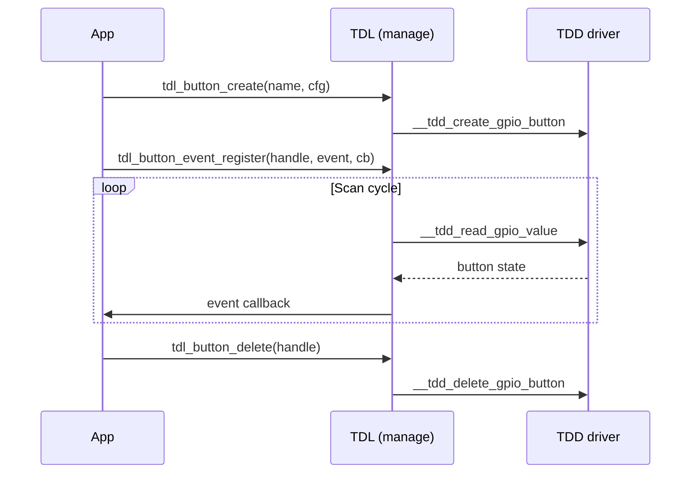
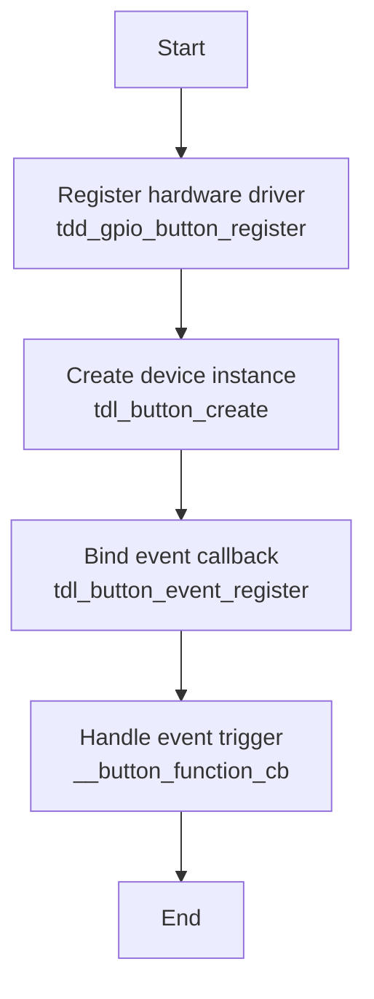

더 보기[버튼 드라이버](https://github.com/tuya/TuyaOpen/tree/master/src/peripherals/button)TuyaOpen에서 사용자 입력을 처리합니다. 버튼 장치를 관리하고 버튼 이벤트를 감지하기위한 통합 인터페이스를 제공하므로 응용 프로그램은 입력 감지, 이벤트 처리 및 하드웨어를 직접 관리하지 않고 상태 관리를 구현할 수 있습니다.

## 기본 개념
|(주)|이름 *|
| --------- | :----------------------------------------------------------- |
|사이트맵|단추와 같은 외부 장치를 연결하기 위하여 이용되는 범용 입력/출력 핀.|
|이름 *|단추는 소프트웨어 또는 기계설비 방법을 통해서 삭제되어야 하는 압박되거나 풀어 놓일 때 기계적인 bouncing를 생성합니다.|
|풀업/풀다운|GPIO 핀의 수평 구성, 버튼을 누르면 기본 상태를 결정하는 데 사용.|
|채용 정보|하드웨어 이벤트에 의해 트리거 된 비동기 알림 메커니즘은 저전력 버튼 감지를 달성 할 수 있습니다.|
|회사연혁|주기적으로 간단한 애플리케이션 시나리오에 적합한 버튼 상태를 확인합니다.|
|활동 수준|버튼이 누르면 GPIO 핀의 수준 상태는 활성 높은 또는 활성 낮은 구성 할 수 있습니다.|
|연락처|방아쇠 형태는 상승 가장자리, 떨어지는 가장자리, 또는 이중 가장자리 방아쇠로 형성될 수 있습니다.|
|주 기계|단추 사건 탐지 및 취급을 관리하기 위하여 이용된 논리 통제 기계장치.|

## 버튼 연결 프레임
단추 연결 방법은 기계설비 디자인에 따라서 변화합니다. 일반적인 연결 방법은 풀 업 버튼과 풀다운 버튼이 포함되어 있습니다.

### Pull-up 버튼 연결 프레임


### Pull-down 버튼 연결 프레임


## 기능 모듈
TuyaOpen은 표준화 된 플랫폼을 제공하는 것을 목표로합니다. 그것의 핵심 디자인 철학은 층을 꿴 decoupling에 센터, 효과적으로 underlying 수준에 특정한 기계설비 실시에서 신청 층의 단추 필요조건을 분리합니다.

* ** 신청 개발자를 위해 **: 사용 된 GPIO 칩에 관계없이 애플리케이션 층은 표준화 된 API (the unified set of standardized APIs)를 호출해야합니다.`tdl_button_xxx`기능 시리즈)와 같은`tdl_button_create`이름 *`tdl_button_event_register`. 이것은 크게 발달 복잡성을 감소시키고 부호 portability를 강화합니다.
* ** 드라이버 개발자용 **: 새로운 하드웨어 플랫폼에 대한 지원을 추가 할 때, 개발자는 단순히 정의 된 표준 인터페이스에 준수해야합니다`tdl_button_driver.h`새로운 TDD-layer 드라이버 쓰기 (similar to`tdd_button_gpio.c`), 그리고 그 후에 TDL 관리 층으로 그것을 등록하십시오. 이 과정은 어떤 신청 층 부호든지에 수정이 없습니다.

### 추상 관리 단위 (Tuya 운전사 층 - TDL)
이것은 애플리케이션 레이어에 통합된 버튼 서비스 인터페이스를 제공하는 요약의 가장 높은 수준입니다.

* `tdl_button_manage.c/h`: 버튼 드라이버 관리를 위한 핵심 논리 구현 다른 유형의 버튼 장치 드라이버 등록 및 관리에 대한 링크 된 목록을 유지합니다 (또는 다른 플랫폼에 대한). 응용 프로그램은 같은 기능을 호출하여 버튼 기능을 사용할 수 있습니다.`tdl_button_create`이름 *`tdl_button_event_register`, underlying 구현 세부사항을 알고 없이.
* `tdl_button_driver.h`: ** 표준화 된 인터페이스 ** (`TDL_BUTTON_CTRL_INFO`) 모든 버튼 장치 드라이버는 기능 포인터를 포함하여 준수해야`button_create`, `button_delete`·`read_value`. 이것은 그것을 지킵니다`tdl_button_manage`획일하게 이 기준에 따르는 어떤 underlying 운전사도 상호 작용할 수 있습니다.

### 순간 및 등록 모듈 (Tuya Device Driver - TDD)
이것은 특정 하드웨어 플랫폼에 대한 구체적인 구현을 포함하는 드라이버의 중간 층입니다.

`tdd_button_gpio.c/h`: GPIO 버튼의 드라이버 구현. 그것은 다리 역할을, 성취`TDL_BUTTON_CTRL_INFO`위 TDL 층에 의해 정의된 표준 공용영역은, TKL 층 GPIOs를 호출하고 실제적인 기계설비를 통제하기 위하여. 더 보기`tdd_gpio_button_register`함수는 TDL 레이어로 이 드라이버의 구현 (기능 포인터)를 등록합니다.

## 주요 특징
** 버튼 이벤트 감지 **

* 다중 이벤트 유형: 보도, 릴리스, 클릭, 더블 클릭, 멀티 클릭, 긴 압박 시작, 긴 압박 파악 및 기타 버튼 이벤트를 지원 합니다.
* 비동기 이벤트 콜백: 드라이버는 콜백 메커니즘을 고용 (`TDL_BUTTON_EVENT_CB`)는 순간에 있는 신청 층에 검출된 단추 사건을 밀어. 애플리케이션 레이어는 버튼 상태에 영향을 줄 필요가 없지만, 수동으로 이벤트 알림을받습니다.
* 주 기계 처리: 내부 국가 기계는 단추의 각종 국가 전환을 관리하기 위하여 이용됩니다, 사건 탐지의 정확도 그리고 신뢰성을 지키.

** 버튼 스캔 모드 **

* Timed 스캐닝 모드 : 정기적인 타이머를 통해 버튼 상태를 확인하고 전력 소비가 중요하지 않는 응용 시나리오에 적합합니다.
* Interrupt 스캐닝 형태: GPIO 중단 기계장치를 이용해서 단추 상태에 있는 변화를 검출하고, 저전력 단추 탐지를, 건전지 전원을 공급한 장치를 위해 이상 가능하게 합니다.

**선물 취급 **

* 소프트웨어 debounce: configurable debounce 시간 모수를 통해서 기계적인 단추 되튐에 기인한 효과적으로 거짓 방아쇠를 삭제합니다.
* 가동 가능한 윤곽: debounce 시간은 다른 단추의 특성에 따라 주문을 받아서 만들어질 수 있습니다.

** 긴 프레스 기능**

* 구성 가능한 긴 압박 탐지: 긴 압박 시작 시간 및 긴 압박 파악 방아쇠 간격의 윤곽을 지원합니다.
* 긴 압박 사건을 분리하십시오: 긴 압박 시작 사건 사이 Distinguishes는 다른 신청 요구에 응하기 위하여 사건을 붙듭니다.

** 멀티 클릭 감지**

* Double-click/multi-click support: configurable valid click counts and time windows와 함께 더블 클릭 및 멀티 클릭 이벤트 감지를 지원합니다.
* 유연한 타이밍 구성: 멀티 클릭 이벤트에 대한 유효한 시간 간격의 구성을 허용.

**Extensible 드라이버 관리**
* 동적 등록 및 발견 : 시스템은 여러 다른 버튼 드라이버를 동시에 등록 할 수 있습니다.
* 이름 근거한 조회: 애플리케이션 레이어는 문자열 이름을 사용하여 특정 버튼 장치의 핸들을 확인하고 유연한 장치 선택을 할 수 있습니다.

## 지원되는 주변 장치
|단추 유형|오염 검사|Interrupt 검사|
| :----------: | :------: | :------: |
|GPIO 버튼| ✅ | ✅ |
|매트릭스 키보드| ✅ | ✅ |
|전기 용량 접촉 단추| ❌ | ❌ |
|ADC 버튼| ❌ | ❌ |

## 작업 흐름
단추 운전사 기구는 각 플랫폼에 동일한 lifecycle를 따릅니다. 예를 들어 GPIO 버튼을 사용하여 보드는 드라이버를 등록 한 다음 응용 프로그램은 버튼 인스턴스를 생성하고 이벤트 콜백을 바인딩하고 인스턴스를 삭제합니다.



전체 수명주기는 이러한 단계를 다룹니다.

1. **Register** - 보드 호출`tdd_gpio_button_register`이름 *`BUTTON_NAME`그리고`BUTTON_GPIO_CFG_T`설정 (`pin`, `mode`, `level`, `pin_type`). TDD 드라이버 호출`tdl_button_register`로그인`TDL_BUTTON_CTRL_INFO`인터페이스를 만들고 버튼 노드를 만듭니다 (`TDL_BUTTON_LIST_NODE_T`) 장치 목록에서.
2. **요금** —`tdl_button_create`패스워드`TDL_BUTTON_CFG_T`config (debounce, long-press 및 멀티 클릭 타이밍) 및 호출`__tdd_create_gpio_button`GPIO를 초기화하고 핀 모드를 구성하고 중단 모드에서 중단을 가능하게 합니다. TDL 층은 스캔 작업과 상태 기계를 시작하고 손잡이를 반환합니다.
3. **등록 콜백 ** —`tdl_button_event_register`이벤트 배열의 각 이벤트 유형에 대한 콜백을 저장합니다.
4. ** 스캔 및 파견 ** - 스캔 작업 (또는 중단) 통화`__tdd_read_gpio_value`핀 상태를 읽으십시오. 주 기계 (`__tdl_button_state_handle`)는 debounce와 사건 탐지를 실행하고, 그 후에 검출한 사건을 위한 등록한 콜백을 실행합니다.
5. ** 해적 ** —`tdl_button_delete`뚱 베어`__tdd_delete_gpio_button`GPIO 리소스를 비활성화하고 노드를 제거하고 마지막 버튼이 있다면 스캔 작업을 중지합니다.

## 회사연혁
### Kconfig 구성
빌드의 드라이버를 포함하려면, 관련 Kconfig 옵션이 건물 전에 활성화된다는 것을 확인합니다. 대상 프로젝트 디렉토리에서 실행`tos.py config menu`터미널에서 다음 구성 옵션을 확인:

|제품정보|제품정보|이름 *|
| :------------------- | :----- | ---------------------------------- |
|버튼|스낵 바|이 매크로가 활성화될 때만 컴파일에 드라이버 코드가 포함되어 있습니다.|
|단추의 num|팟캐스트|버튼의 수를 구성합니다.|
|단추의 이름 1|팟캐스트|첫번째 단추를 위한 장치 이름 형성.|
|단추의 이름 2|팟캐스트|두 번째 버튼의 장치 이름을 구성합니다.|
|단추의 이름 3|팟캐스트|세 번째 버튼의 장치 이름을 구성합니다.|
|단추의 이름 4|팟캐스트|네 번째 버튼의 장치 이름을 구성합니다.|


:::tip
이 구성 항목은 모두 지원되어야 합니다.`src/peripherals/button/Kconfig`이름 *`boards/<target_platform>/<target_board>/Kconfig`(Kconfig 파일을 특정 대상 보드에 체크하십시오). 관련 구성 항목을 찾을 수없는 경우,이 두 파일의 내용을 검토하십시오.
:::

### Runtime 환경
이 드라이버를 실행하려면, 먼저 활성화해야 ** 마스터 매크로 활성화 ** (`ENABLE_BUTTON`). 이 매크로가 활성화되는 세 가지 시나리오가 있습니다. ** 대상 보드의 기본으로 사용 **, 버튼 드라이버를 필요로하는 다른 기능에 의해 의존성으로 **, ** 수동으로 활성화 **.

:::warning
모든 후속 명령은 대상 애플리케이션 디렉토리에서 실행되어야 합니다. TuyaOpen root 디렉토리 또는 다른 모든 위치에서 실행하지 마십시오. 오류가 발생할 것입니다.
:::

#### Scenario 1 : 대상 보드의 기본으로 사용
:::info
선택한 개발 보드가 사전 등록 된 버튼 장치와 함께 제공됩니다. 이 경우, 보드의 소스 파일은 이미 필요한 등록 코드를 포함합니다. 예제:`TUYA_T5AI_BOARD`널은 사용자 단추를 지원합니다. 그것의 적응 도중, 단추 장치는 사전등록되고,`boards/T5AI/TUYA_T5AI_BOARD/Kconfig`파일에는 라인이 포함되어 있습니다.`select ENABLE_BUTTON`.
이 타겟 보드가 선택될 때마다 운전자가 자동으로 활성화됩니다.
:::

Kconfig 메뉴 인터페이스를 입력하려면 명령을 실행합니다.

```shell
tos.py config menu
```

:::warning
실행 후`select ENABLE_XXX`내 계정`boards/<platform>/<target_board>/Kconfig`, 당신은 수동으로 select/deselect를 실행하여 할 수 없습니다`tos.py config menu`.
:::

#### Scenario 2 : 버튼 드라이버가 필요한 다른 기능에 의해 의존성으로 사용
버튼 드라이버에 따라 기능을 활성화하면 버튼 드라이버의 매크로가 자동으로 활성화됩니다.

#### Scenario 3: 수동으로 매크로를 활성화
1. Kconfig 메뉴 인터페이스를 입력하려면 명령을 실행합니다.

   ```shell
   tos.py config menu
   ```

2. 수동으로 찾아 매크로를 활성화합니다.


### 사용 방법
#### Adapt 버튼 드라이버
:::tip
적합한 드라이버가 기존 버튼 드라이버 컬렉션에서 발견되면이 단계를 건너뛸 수 있습니다. 그렇지 않다면, 이 프로세스를 따르는 버튼 드라이버를 직접 조정할 수 있습니다.
:::

1. 이름 *`tdd_button_xxx.c/h`파일 내`src/peripherals/button/tdd_button`.
2. ** 메모리를 할당 ** 장치에 대한 버튼 드라이버의 추상 인터페이스 (기능 포인터와 같은`button_create`, `button_delete`·`read_value`) 당신의 장치에.
3. **일반 버튼 장치 노드 등록 ** (`tdl_button_register`).
4. 예를 들어 구현 코드에 대해 이미 GPIO 버튼 드라이버를 적용했습니다.

구체적인 예제의 경우, 참조`examples/peripherals/button`.

#### 회사 소개
:::tip
선택한 타겟 보드가 이미 버튼 장치가 사전 등록 된 경우 Kconfig에서 대상 보드를 선택하고 전화해야합니다.`board_register_hardware()`당신의 신청에 있는 공용영역. 이 인터페이스는 이미 해당 버튼 장치에 대한 등록이 포함되어 있습니다.
:::

1. 버튼 모델과 연결 핀을 기반으로 등록 인터페이스를 구현합니다. 이 구현을 할 것을 권장합니다.`board_register_hardware()`인터페이스, 에 위치`boards/<target_platform>/<target_board>/xxx.c`.
2. 장치의 기본 정보를 구성하고 등록 인터페이스를 호출`board_register_hardware()`.

    ```c
    OPERATE_RET __board_register_button(void)
    {
        /* Write your struct configuration information here */
        /* begin */

        /* end */
        TUYA_CALL_ERR_RETURN(tdd_gpio_button_register(BUTTON_NAME, &button_cfg));
        return OPRT_OK;
    }

    OPERATE_RET board_register_hardware(void)
    {
        TUYA_CALL_ERR_LOG(__board_register_button());
        return OPRT_OK;
    }
    ```

#### 장치 제어
TDL 인터페이스를 활용`src/peripherals/button/tdl_button/include/tdl_button_manage.h`단추 장치를 통제하기 위하여.

- 버튼 장치 인스턴스를 만들고 매개 변수를 구성합니다.
- 버튼 이벤트 콜백 기능을 등록하십시오.
- 손잡이 단추 사건.
- 버튼 장치 인스턴스를 삭제합니다.

## 개발과정
몇 가지 간단한 API는 버튼 주변 개발을 완료해야합니다.



예제 코드는 아래에 있습니다`examples/peripherals/button`경로. 제공된 예에 따라 구현을 수정할 수 있습니다.


## API 설명
### 버튼 장치 구성 구조
GPIO 버튼을 예를 들어, TDD 레이어의 하드웨어 구성 정보 구조를 구성합니다.

```c
/**
 * @brief GPIO button configuration structure.
 *
 * This structure contains all hardware configuration parameters for GPIO button,
 * including pin number, operation mode, active level, and pin type settings.
 */
typedef struct {
    TUYA_GPIO_NUM_E pin;           // GPIO pin number
    TUYA_GPIO_LEVEL_E level;       // Active level (HIGH/LOW)
    TDD_GPIO_TYPE_U pin_type;      // Pin configuration (pull-up/pull-down for scan mode, edge type for IRQ mode)
    TDL_BUTTON_MODE_E mode;        // Button operation mode (timer scan or interrupt)
} BUTTON_GPIO_CFG_T;

typedef union {
    TUYA_GPIO_MODE_E gpio_pull;    // GPIO pull mode for BUTTON_TIMER_SCAN_MODE
    TUYA_GPIO_IRQ_E irq_edge;      // IRQ edge type for BUTTON_IRQ_MODE
} TDD_GPIO_TYPE_U;
```

### 버튼 소프트웨어 구성 구조
debounce 시간 및 긴 압박 시간을 포함하여 단추를 위한 소프트웨어 모수를 구성하십시오.

```c
/**
 * @brief Button software configuration structure.
 *
 * This structure contains software configuration parameters for button behavior,
 * including debounce time, long press timing, and multi-click settings.
 */
typedef struct {
    uint16_t long_start_valid_time;    // Long press start valid time (ms)
    uint16_t long_keep_timer;          // Long press hold trigger interval (ms)
    uint16_t button_debounce_time;     // Button debounce time (ms)
    uint8_t button_repeat_valid_count; // Multi-click count threshold
    uint16_t button_repeat_valid_time; // Multi-click valid time window (ms)
} TDL_BUTTON_CFG_T;
```

### 단추 사건 enumeration
버튼에 의해 지원되는 모든 이벤트 유형을 정의합니다.

```c
/**
 * @brief Button event types enumeration.
 *
 * This enumeration defines all supported button event types that can be
 * detected and reported to the application layer.
 */
typedef enum {
    TDL_BUTTON_PRESS_DOWN = 0,     // Press down trigger
    TDL_BUTTON_PRESS_UP,           // Release trigger
    TDL_BUTTON_PRESS_SINGLE_CLICK, // Single click trigger
    TDL_BUTTON_PRESS_DOUBLE_CLICK, // Double click trigger
    TDL_BUTTON_PRESS_REPEAT,       // Multiple click trigger
    TDL_BUTTON_LONG_PRESS_START,   // Long press start trigger
    TDL_BUTTON_LONG_PRESS_HOLD,    // Long press hold trigger
    TDL_BUTTON_RECOVER_PRESS_UP,   // Recovery press up trigger
    TDL_BUTTON_PRESS_MAX,          // Maximum event count
    TDL_BUTTON_PRESS_NONE,         // No event
} TDL_BUTTON_TOUCH_EVENT_E;
```

### 버튼 드라이버 등록 구조
버튼 드라이버의 구조를 등록하려면 버튼 드라이버를 기반으로 해당 기능 포인터를 구현해야합니다.

```c
/**
 * @brief Button driver interface structure.
 *
 * This structure contains function pointers for all button operations, providing
 * a unified interface for the button abstract layer to call driver functions.
 */
typedef struct {
    OPERATE_RET (*button_create)(TDL_BUTTON_OPRT_INFO *dev);
    OPERATE_RET (*button_delete)(TDL_BUTTON_OPRT_INFO *dev);
    OPERATE_RET (*read_value)(TDL_BUTTON_OPRT_INFO *dev, uint8_t *value);
} TDL_BUTTON_CTRL_INFO;
```

### 버튼 장치 등록
시스템이있는 버튼 장치 드라이버 등록은 버튼 드라이버 프레임 워크의 항목 점입니다. 장치 이름과 구성 매개 변수를 전달함으로써, 당신은 응용 프로그램에 의해 사용을위한 관리 목록에 버튼 장치를 추가합니다.

```c
/**
 * @brief Registers a GPIO button device driver with the button management system.
 *
 * This function registers a GPIO button device driver including device name and
 * hardware configuration parameters. After successful registration, applications
 * can create button instances and use the button device by name.
 *
 * @param name Button device name used for identification and lookup
 * @param gpio_cfg GPIO button configuration parameters including pin number,
 *                 operation mode, active level, and pin type settings
 *
 * @return Returns OPRT_OK on successful registration, or an appropriate error code on failure.
 */
OPERATE_RET tdd_gpio_button_register(char *name, BUTTON_GPIO_CFG_T *gpio_cfg);
```

### 버튼 드라이버 등록
아래 버튼 드라이버 인터페이스를 추상 레이어 관리 시스템에 등록하고 장치 노드를 만들고 장치 목록을 유지합니다.

```c
/**
 * @brief Registers button device driver interfaces to the abstract layer management system.
 *
 * This function registers button device driver interface functions to the button abstract
 * layer management system, creates device nodes and adds them to the device management list
 * for upper layer application calls.
 *
 * @param name Button device name
 * @param button_ctrl_info Button driver interface structure containing various operation function pointers
 * @param button_cfg_info Button device configuration information
 *
 * @return Returns OPRT_OK on successful registration, or an appropriate error code on failure.
 */
OPERATE_RET tdl_button_register(char *name, TDL_BUTTON_CTRL_INFO *button_ctrl_info,
                                TDL_BUTTON_DEVICE_INFO_T *button_cfg_info);
```

### 회사 소개
버튼 장치 인스턴스를 만들고 소프트웨어 매개 변수를 구성하여 사용 가능한 장치를 만들 수 있습니다.

```c
/**
 * @brief Creates a button device instance with specified configuration.
 *
 * This function creates a button device instance based on the registered button driver,
 * configures software parameters such as debounce time and long press timing, and
 * initializes the button hardware. After successful creation, the device enters a usable state.
 *
 * @param name Button device name (must match registered name)
 * @param button_cfg Button software configuration parameters
 * @param handle Pointer to store the returned button device handle
 *
 * @return Returns OPRT_OK on successful creation, or an appropriate error code on failure.
 */
OPERATE_RET tdl_button_create(char *name, TDL_BUTTON_CFG_T *button_cfg, TDL_BUTTON_HANDLE *handle);
```

### 장치 삭제
버튼 장치 인스턴스를 삭제하고 관련 리소스를 해제하여 하드웨어를 분리하고 핀을 비활성화합니다.

```c
/**
 * @brief Deletes a button device instance and releases related resources.
 *
 * This function deletes the specified button device instance, deinitializes button hardware
 * including disabling GPIO interrupts, releasing GPIO resources, and removing the device
 * from the management list. After deletion, the device becomes unavailable.
 *
 * @param handle Button device handle
 *
 * @return Returns OPRT_OK on successful deletion, or an appropriate error code on failure.
 */
OPERATE_RET tdl_button_delete(TDL_BUTTON_HANDLE handle);
```

### 회원가입
지정된 이벤트가 감지되면 호출됩니다 버튼 이벤트 콜백 기능을 등록하십시오.

```c
/**
 * @brief Registers an event callback function for a specific button event.
 *
 * This function registers a callback function for a specific button event type. When the
 * specified event is detected, the registered callback function will be called with event
 * information and parameters.
 *
 * @param handle Button device handle
 * @param event Button event type to register callback for
 * @param cb Callback function pointer to be called when event occurs
 *
 * @return None
 */
void tdl_button_event_register(TDL_BUTTON_HANDLE handle, TDL_BUTTON_TOUCH_EVENT_E event, TDL_BUTTON_EVENT_CB cb);
```

### 읽기 버튼 상태
단추의 현재 상태를 읽으십시오.

```c
/**
 * @brief Reads the current status of a button device.
 *
 * This function reads the current physical status of the specified button device,
 * returning whether the button is currently pressed or released.
 *
 * @param handle Button device handle
 * @param status Pointer to store the button status (0: released, 1: pressed)
 *
 * @return Returns OPRT_OK on successful reading, or an appropriate error code on failure.
 */
OPERATE_RET tdl_button_read_status(TDL_BUTTON_HANDLE handle, uint8_t *status);
```

### 버튼 레벨 설정
Dynamically는 DIP 스위치와 같은 시나리오에 적합한 버튼의 효과적인 수준을 설정합니다.

```c
/**
 * @brief Sets the active level of a button device.
 *
 * This function dynamically sets the active level of the specified button device.
 * This is useful for toggle switches where the effective level needs to be changed
 * during runtime.
 *
 * @param handle Button device handle
 * @param level Active level to set (TUYA_GPIO_LEVEL_HIGH or TUYA_GPIO_LEVEL_LOW)
 *
 * @return Returns OPRT_OK on successful setting, or an appropriate error code on failure.
 */
OPERATE_RET tdl_button_set_level(TDL_BUTTON_HANDLE handle, TUYA_GPIO_LEVEL_E level);
```

### 스캔 시간을 구성
버튼의 스캔 간격을 구성합니다.

```c
/**
 * @brief Sets the button scan time interval.
 *
 * This function sets the time interval for button scanning. The default scan time
 * is 10ms. Shorter intervals provide better responsiveness but consume more CPU resources.
 *
 * @param time_ms Button scan time interval in milliseconds
 *
 * @return Returns OPRT_OK on successful setting, or an appropriate error code on failure.
 */
OPERATE_RET tdl_button_set_scan_time(uint8_t time_ms);
```

### 통제 깊은 잠
저전력 시나리오에 적합한 버튼 온/오프를 제어합니다.

```c
/**
 * @brief Controls button functionality for deep sleep scenarios.
 *
 * This function enables or disables button functionality, which is useful for
 * power management in battery-powered devices. When disabled, button scanning
 * and event detection are suspended to save power.
 *
 * @param enable Enable flag (0: disable, 1: enable)
 *
 * @return Returns OPRT_OK on successful control, or an appropriate error code on failure.
 */
OPERATE_RET tdl_button_deep_sleep_ctrl(uint8_t enable);
```

## 관련 기사
### Hardware 구성
- **Pin 선택 **: 선택된 GPIO 핀은 필요한 기능을 지원합니다 (입력, 풀업/풀다운 및 중단).
- ** 수준**: Properly는 하드웨어 회로 설계와 일치하기 위해 버튼의 활성 수준을 구성합니다.
- **Pull-up/pull-down **: Properly는 버튼 연결 방법에 따라 내부 풀 업 또는 풀 다운 저항기를 구성합니다.
- ** Interrupt 가장자리 **: 중단 모드에서, 제대로 동작 레벨에 따라 중단 트리거 가장자리를 구성합니다.

### 소프트웨어 구성
- **출시시간**: 권장 범위는 20 ~ 50m입니다. 너무 짧은 시간은 거짓 방아쇠를 일으킬 수 있고, 너무 긴 시간은 응답에 영향을 줄 수 있습니다.
- ** 긴 압박 시간 **: 긴 압박 시작 시간을 놓고 사용자 경험 요구에 따라 제대로 간격을 붙들.
- ** 다중 클릭 시간 창**: 더블 클릭/멀티 클릭 시간 창은 사용자 조작 습관과 일치해야, 일반적으로 300 ~ 800 ms.
- ** 스캔 간격**: 기본 10 ms는 대부분의 시나리오에 적합합니다. 필요한 간격을 조정할 수 있습니다.

### 전력 최적화
- **무선 모드 우선 **: 낮은 전력 대시보드를 위한 오염 검사 보다는 오히려 중단 형태를 사용하십시오.
- ** 깊은 잠 통제 **: 필요한 경우, 전원을 저장하는 버튼 기능을 비활성화합니다.
- ** 스캔 주파수 최적화 **: 적절한 스캔 간격을 증가 전력 소비를 줄일 수 있지만 응답에 영향을 줄 수 있습니다.

### 실 안전
- ** 콜백 기능 제한 **: 콜백 기능에서 시간 소모 작업을 수행하지 마십시오. 다른 버튼의 감지에 영향을 줄 수 있습니다.
- ** 자원 경쟁 **: 여러 버튼이 스캔 작업을 공유할 때, 리소스 경쟁 문제의 마음을 사로잡습니다.
- **Interrupt context**: 중단 모드에서 콜백 함수는 중단된 컨텍스트에서 실행됩니다. 안전 관리

### 자주 묻는 질문
- **로그 출력**: 문제점 진단에 원조에 단추 관련 디버그 기록.
- **Status 모니터링**: 사용`tdl_button_read_status`실시간 버튼 상태를 모니터링하는 인터페이스.
- ** 이벤트 통계 **: 버튼 기능이 제대로 작동되는지 확인하기 위해 콜백 함수를 계산하는 이벤트를 추가합니다.

### 제품 정보
- **Button unresponsive **: GPIO 구성, 활성 레벨 설정 및 드라이버 등록을 확인하십시오.
- ** 빠른 false 트리거 **: 적절하게 증가 debounce 시간, 및 하드웨어 회로의 방해에 대 한 확인.
- ** 긴 압박 트리거 **: 긴 압박 시간 윤곽을 검증하고, 안정되어 있는 기계설비 연결을 지킵니다.
- ** 더블 클릭 인식 실패 **: 더블 클릭 시간 창을 조정하고, 사용자 작업이 유효 시간 창 내에서 발생합니다.
