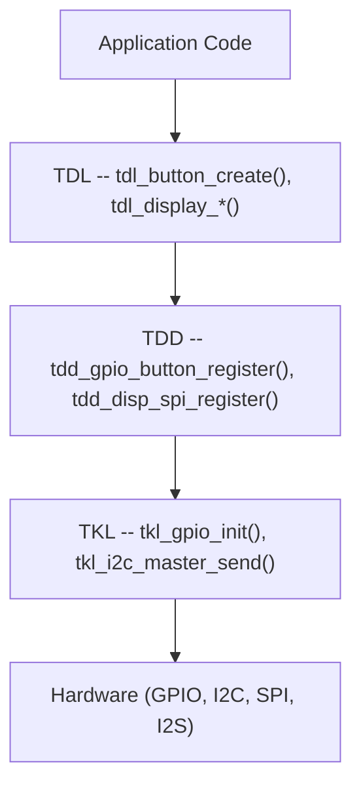

TuyaOpen는 두 층 주변 드라이버 프레임 워크를 사용합니다. ** TDL** (Tuya Driver Layer)는 장치 수명주기를 관리하고 애플리케이션 API를 제공합니다. ** TDD** (Tuya Device Driver)는 칩 별 하드웨어 액세스를 구현합니다. 이 분리는 애플리케이션 코드를 변경하지 않고 새로운 하드웨어를 추가 할 수 있습니다.

## 층 개요


|제품정보|연락처|제품정보|누가 그것을 쓰고|
|-------|--------|------|---------------|
|**TDL **| `tdl_*` |장치 관리, 등록, 응용 API|TuyaOpen SDK (당신은 거의 이것을 수정)|
|**TDD **| `tdd_*` |TDL 인터페이스를 구현하는 하드웨어 별 드라이버|새로운 센서/display/codec를 추가할 때|
|**TKL **| `tkl_*` |플랫폼 요약 (GPIO, I2C, SPI, UART)|플랫폼 어댑터 (칩당)|

## 등록 패턴
모든 주변 범주는 동일한 패턴을 따릅니다 :

### 1. TDL는 공용영역 struct를 정의합니다
```c
typedef struct {
    OPERATE_RET (*create)(TDL_OPRT_INFO *dev);
    OPERATE_RET (*delete)(TDL_OPRT_INFO *dev);
    OPERATE_RET (*read_value)(TDL_OPRT_INFO *dev, uint8_t *value);
} TDL_BUTTON_CTRL_INFO;
```

### 2. TDD는 공용영역과 기록기를 실행합니다
```c
OPERATE_RET tdd_gpio_button_register(char *name, BUTTON_GPIO_CFG_T *cfg)
{
    TDL_BUTTON_CTRL_INFO ctrl = {
        .create     = __tdd_create_gpio_button,
        .delete     = __tdd_delete_gpio_button,
        .read_value = __tdd_read_gpio_value,
    };
    return tdl_button_register(name, &ctrl, &device_info);
}
```

### 3. 이사회 init 호출 TDD 등록
```c
void board_register_hardware(void)
{
    BUTTON_GPIO_CFG_T btn_cfg = {
        .pin = BOARD_BUTTON_PIN,
        .level = BOARD_BUTTON_ACTIVE_LV,
        .mode = BUTTON_IRQ_MODE,
    };
    tdd_gpio_button_register("power_btn", &btn_cfg);
}
```

### 4. 신청은 TDL 전용을 이용합니다
```c
board_register_hardware();

TDL_BUTTON_HANDLE handle;
TDL_BUTTON_CFG_T cfg = { .long_start_valid_time = 3000 };
tdl_button_create("power_btn", &cfg, &handle);
tdl_button_event_register(handle, TDL_BUTTON_PRESS_DOWN, my_callback);
```

## 관련 분류
|(주)|TDL 헤더|TDD 예제|소스 경로|
|----------|-----------|--------------|-------------|
|이름 *| `tdl_button_driver.h` | `tdd_button_gpio` | `src/peripherals/button/` |
|주도하는| `tdl_led_driver.h` | `tdd_led_gpio` | `src/peripherals/led/` |
|LED 화소| `tdl_pixel_driver.h` | `tdd_ws2812`, `tdd_sm16703p` | `src/peripherals/leds_pixel/` |
|제품정보| `tdl_display_driver.h` | `tdd_disp_spi`, `tdd_disp_rgb` | `src/peripherals/display/` |
|언어: 영어| `tdl_audio_driver.h` | `tdd_audio`(T5AI),`tdd_audio_alsa` | `src/peripherals/audio_codecs/` |
|제품정보| `tdl_camera_driver.h` | `tdd_camera_dvp_ov2640` | `src/peripherals/camera/` |
|제품정보| `tdl_tp_driver.h` | `tdd_tp_i2c_ft6336`, `tdd_tp_i2c_gt911` | `src/peripherals/tp/` |
|IR정보| `tdl_ir_driver.h` | `tdd_ir_driver` | `src/peripherals/ir/` |
|조이스틱| `tdl_joystick_driver.h` | `tdd_joystick` | `src/peripherals/joystick/` |
|관련 상품| `tdl_transport_driver.h` | `tdd_transport_uart` | `src/peripherals/transport/` |

## TDL/TDD 없는 주변
일부 주변 장치 사용 직접 TKL 호출 없이 등록 프레임 워크:

|회사 소개|제품 정보|이름 *|
|-----------|---------|---------|
|이뮤 (BMI270)|벤더 라이브러리 +`tkl_i2c_*` | `examples/peripherals/imu/bmi270/` |
|지원하다|회사 소개`drv_encoder` | `src/peripherals/encoder/` |
|SHT3x/SHT4x의|직접 I2C 읽기| `examples/peripherals/i2c/sht3x_4x_sensor/` |
|PMIC (AXP2101)|공급 업체| `src/peripherals/pmic/axp2101/` |

간단한 센서 (온도, 습도, 압력), 당신은 일반적으로 TDL / TDD 층을 만들기보다 TKL I2C를 직접 사용합니다. 이름 *[새로운 센서 드라이버 작성](tutorials/writing-sensor-driver).

## Kconfig 통합
각 주변은 Kconfig toggle에 의해 문질러`boards/{platform}/TKL_Kconfig`:

```kconfig
config ENABLE_BUTTON
    bool
    default n

config ENABLE_LED
    bool
    default n
```

Board-specific Kconfig 파일을 선택하면 주변을 활성화할 수 있습니다:

```kconfig
config BOARD_CONFIG
    select ENABLE_BUTTON
    select ENABLE_LED
    select ENABLE_AUDIO
```

빌드 시스템은 활성화된 TDD 드라이버만 컴파일합니다.

## 더 보기
- [새로운 센서 드라이버 작성](tutorials/writing-sensor-driver)
- [센서 라이브러리를 TuyaOpen로 마이그레이션](tutorials/migrating-sensor-driver)
- [Display Driver 통합](tutorials/display-driver-guide)
- [Audio Codec 드라이버 가이드](tutorials/audio-codec-guide)
- [버튼 드라이버](button)
- [표시 드라이버](display)
- [오디오 드라이버](audio)
