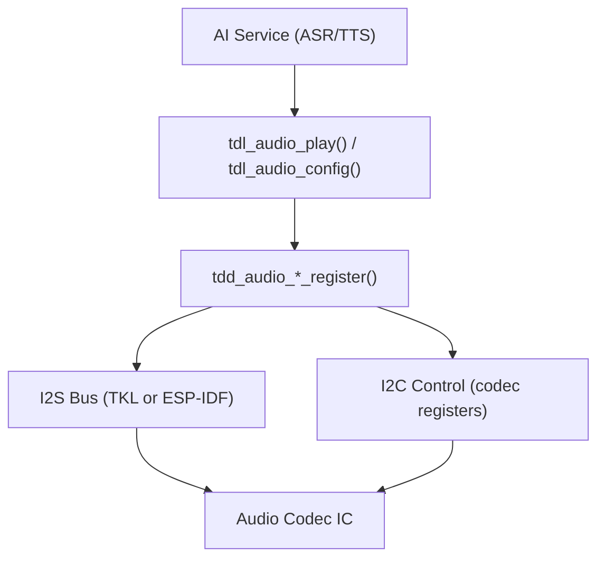

TuyaOpen의 코덱 드라이버는 오디오 코덱 IC를 연결합니다.`tdl_audio_*`응용 인터페이스, 그래서 응용 프로그램은 I2S 또는 I2C 버스를 직접 터치하지 않고 PCM을 재생하고 캡처 할 수 있습니다. 이 가이드는 음성 상호 작용, 오디오 재생 및 AI 신청을 위한 코덱을 통합합니다.

## 자주 묻는 질문
- 지원하다[TDD/TDL 드라이버 아키텍처](../driver-architecture)
- I2S와 I2C 공용영역을 가진 널
- 오디오 코덱 데이터 시트 (예 : ES8311, ES8388, ES8389)

## 오디오 아키텍처


## TDL 오디오 공용영역
이 응용 프로그램은`tdl_audio_*`:

```c
tdl_audio_find("audio_device", &handle);
tdl_audio_open(handle, &audio_cfg);
tdl_audio_play(handle, pcm_data, len);
tdl_audio_close(handle);
```

## 플랫폼 차이
|제품정보|사이트맵|사이트맵|
|--------|------|----------|
|TDD 위치| `src/peripherals/audio_codecs/tdd_audio/` | `boards/ESP32/common/audio/` |
|I2S 드라이버|사이트맵`tkl_i2s_*` |사이트맵`i2s_channel_*` |
|I2C 통제|사이트맵`tkl_i2c_*` |사이트맵`i2c_master_*` |
|Codec 라이브러리|내 계정| `esp_codec_dev`(ESP-IDF 구성품)|
|지원된 코덱|플랫폼 오디오 IC|ES8311, ES8388, ES8389, 코드 없음 (DAC)|

## ESP32 오디오 코덱 등록 흐름
ES8311 사용 예 (에서`boards/ESP32/common/audio/tdd_audio_8311_codec.c`):

### 1. 코덱 구성
```c
TDD_AUDIO_8311_CODEC_T codec_cfg = {
    .i2c_cfg = {
        .i2c_scl_io = I2C_SCL_IO,
        .i2c_sda_io = I2C_SDA_IO,
        .i2c_port = 0,
        .i2c_addr = 0x18,
    },
    .i2s_cfg = {
        .i2s_mclk_io = I2S_MCK_IO,
        .i2s_bclk_io = I2S_BCK_IO,
        .i2s_ws_io = I2S_WS_IO,
        .i2s_dout_io = I2S_DO_IO,
        .i2s_din_io = I2S_DI_IO,
    },
    .sample_rate = 16000,
    .pa_gpio = GPIO_OUTPUT_PA,
};
```

### 2. 게시판 init에 등록
```c
void board_register_hardware(void)
{
    tdd_audio_8311_codec_register("audio", codec_cfg);
}
```

### 3. 내부적으로 TDD
- ESP-IDF를 통해 I2C 마스터 버스 만들기
- ESP-IDF를 통해 I2S 이중 채널 생성
- ES8311의 초기화`esp_codec_dev`
- 제품정보`TDD_AUDIO_INTFS_T`(오픈, 재생, 구성, 닫기)
- 이름 *`tdl_audio_driver_register("audio", handle, &intfs, &info)`

## 사용 가능한 ESP32 오디오 코덱
|비밀번호|파일 형식|I2C 추가|지원하다|
|-------|------|----------|-------|
|사이트맵| `tdd_audio_8311_codec.c` |0x18'실제 이름입|S3 보드에 공통|
|사이트맵| `tdd_audio_es8388_codec.c` |0x20의|Alternate 코덱|
|사이트맵| `tdd_audio_es8389_codec.c` |주요 특징|사이트맵|
|코드 없음| `tdd_audio_no_codec.c` |사이트맵|직접 DAC 산출|
|ATK 코드 없음| `tdd_audio_atk_no_codec.c` |사이트맵|Alternate 번호 코드|

## 새로운 Codec TDD 작성
새로운 코덱에 대한 지원을 추가하려면 (예 : WM8960) :

1. 이름 *`tdd_audio_wm8960.c`이름 *`tdd_audio_wm8960.h`
2. 4개의 공용영역 기능을 실행하십시오:`open`, `play`, `config`, `close`
3. 내 계정`open`: init I2C, init I2S, 코덱 등록 구성
4. 내 계정`play`: I2S 채널에 PCM 데이터를 쓰기
5. 내 계정`config`: 핸들 샘플 속도 변경, 볼륨, mute
6. 내 계정`close`: 정지 I2S, 전원 다운 코덱
7. 이름 *`tdl_audio_driver_register()`등록 기능의 끝에

## 이름 *
- [TDD/TDL 드라이버 아키텍처](../driver-architecture)
- [오디오 드라이버 참조](../audio)
- [ESP32 지원 기능](../../hardware/espressif/esp32-supported-features)
