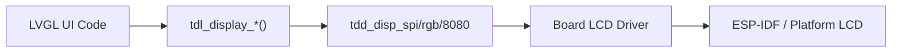

TuyaOpen의 디스플레이 드라이버는 TDL 디스플레이 프레임 워크와 패널을 등록하므로 LVGL 및 응용 프로그램은 그것을 통해 끌 수 있습니다.`tdl_display_*`. 이 가이드는 TDL 디스플레이 및 LVGL을 사용하여 새로운 패널을 통합합니다.

## 자주 묻는 질문
- 지원하다[TDD/TDL 드라이버 아키텍처](../driver-architecture)
- 한국어[환경 설정](../../quick-start/enviroment-setup)
- init 순서로 표시 패널 datasheet

## 전시건축


TuyaOpen의 디스플레이 시스템은 플랫폼에 따라 두 개의 경로가 있습니다.

|회사연혁|LVGL 소스|전시 항구|BSP 위치|
|----------|-----------|-------------|-------------|
|사이트맵|카테고리`src/liblvgl/` | `tdl_display` + `tdd_display` | `boards/T5AI/` |
|사이트맵|ESP-IDF LVGL 구성 요소|사이트맵`esp_lcd_*` | `boards/ESP32/common/display/` |

## 지원되는 위원회 공용영역
|지원하다|TDD 드라이버|예제 패널|
|-----------|-----------|---------------|
|·| `tdd_disp_spi_device_register` |ST7789, ILI9341, GC9A01|
|RGB (패럴)| `tdd_disp_rgb_device_register` |큰 TFT 패널|
|8080 (패럴)|보드 레벨 (Board-level)`lcd_st7789_80.c`) |DNESP32S3-BOX에 ST7789|
|사이트맵|보드 레벨 (Board-level)`lcd_sh8601.c`) |SH8601 AMOLED 제품|
|I2C 정보|보드 레벨 (Board-level)`oled_ssd1306.c`) |SSD1306의 OLED|

## 새로운 SPI 디스플레이 추가 (T5AI 예제)
### 1. 패널 TDD 등록
```c
#include "tdd_disp_spi_device.h"

TDD_DISP_SPI_DEVICE_T panel_cfg = {
    .spi_cfg = {
        .port = TUYA_SPI_NUM_0,
        .mode = TUYA_SPI_MODE0,
        .speed = 40000000,
        .dc_pin = DC_PIN,
        .cs_pin = CS_PIN,
    },
    .dev_info = {
        .width = 240,
        .height = 320,
        .color_depth = 16,
    },
    .init_cmds = st7789_init_sequence,
    .init_cmds_len = sizeof(st7789_init_sequence),
};
tdd_disp_spi_device_register("main_display", &panel_cfg);
```

### 2. 앱의 디스플레이 만들기
```c
TDL_DISP_HANDLE disp;
tdl_display_create("main_display", &disp);
tdl_display_open(disp);
```

### 3. LVGL에 연결
TDL 디스플레이는 플러시 콜백을 통해 LVGL과 통합됩니다.`tdl_display_create`.

## ESP32에 디스플레이 추가
ESP32에서, 디스플레이 사용 ESP-IDF의 LCD 드라이버 직접 (TUYAOpen하지 않음)`tdd_disp_*`층). 각 널은 LCD init를 안으로 실행합니다`boards/ESP32/{board}/`사용 :

- `lcd_st7789_spi.c`(SPI 패널)
- `lcd_st7789_80.c`(파렐 8080)
- `lcd_sh8601.c`(QSPI AMOLED)
- `oled_ssd1306.c`(I2C OLED)

공지사항`board_register_hardware()`디스플레이와 와이어를 ESP-IDF의 LVGL 포트로 초기화`boards/ESP32/common/display/lv_port_disp.c`.

## Kconfig 요구사항
```kconfig
config ENABLE_ESP_DISPLAY
    bool
    default y

config DISPLAY_NAME
    string "display"
```

## 이름 *
- [LVGL 소개](lvgl-application-guide)
- [TDD/TDL 드라이버 아키텍처](../driver-architecture)
- [표시 드라이버 참조](../display)
- [Peripheral 지원 명부](../support_peripheral_list)
