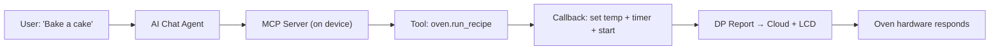

오븐을 말해주는 상상 *"Preheat to 200 도 and bake for 25 분"* — 그리고 그냥... 그것을. 앱 없음, 버튼 없음, 메뉴 없음. AI 에이전트에 의해 이해 된 단지 자연 언어, 실제 하드웨어에서 실행.

이 가이드는**exactly** 어떻게 작동하나요?**Smart 오븐** 프로젝트는 TuyaOpen로 제작되었습니다. 끝에, 당신은 어떤 장치를 위한 당신의 자신의 기계설비 MCP 기술을 창조하는 방법을 알고 있을 것입니다.

---

<section id="what-youll-build" className="section">

## 당신이 빌드 할 것
AI 전원 스마트 채팅 에이전트가 할 수있는 오븐 :

|이름 *|Agent는 무엇입니까?|
|---|---|
|*"고속 오븐"*|`oven.start` 호출 → 전원 DP 설정|
|* "200°C에 예열"*|`oven.set_temperature(200)`를 호출 → 온도를 쓰기 DP|
|* 25 분 "*|`oven.set_timer(1500)`를 호출 → 카운트 다운 DP|
|* "나는 아직도?"*|전화 `oven.get_state()` → 모든 DP를 읽고, JSON를 반환|
|* " 피자 요리법"*|`oven.run_recipe("pizza")` → 세트 임시 직원 + 타이머 + 시작|
|*"사진을 찍고 케이크가 완료되면 확인"*|`device.camera_shot()`를 호출 → JPEG를 캡처 AI를 볼 수 있습니다|

마술 접착제? **MCP Function Call** - AI Agent 도구로 하드웨어 작업을 회전하는 프로토콜은 발견 및 호출 할 수 있습니다.

</section>

---

<section id="how-it-works" className="section">

## 어떻게 작동 : 건축


** 중요한 통찰력: ** 모든 하드웨어 기능 (설정 온도, 읽기 상태, 캡처 이미지)는 ** MCP 도구**로 등록됩니다. AI 에이전트는 이러한 도구를보고, 사용자 의도를 기반으로 호출하는 결정, 그리고 콜백은 실제 하드웨어를 구동.

</section>

---

<section id="step-1-cloud-product" className="section">

## Step 1: 클라우드 생성
어떤 펌웨어 코드를 작성하기 전에 Tuya 클라우드 플랫폼**에 ** 제품이 필요합니다. 제품은 장치의 데이터 모델 (DP), AI 에이전트 및 클라우드 기능을 정의합니다. 모든 다운스트림 - 펌웨어, MCP 도구, 앱 - 이것에 따라 다릅니다.

## 1a. ## ## 1a. ## ## 1a. ## ## 1a. ## ## 1a. ## ## 1a. ## ## 1a. ## 1a. ## 1a. ## 1a. ## 1a. ## 1a. ## 1a. ## 1a. ## 1a. ## 1a. ## 1a. ## 1a. 제품 만들기
1. [Tuya Developer Platform](https://platform.tuya.com/pmg/list) → **AI 제품 > 개발** → **요금**
2. 선택 ** 사용자 정의** 스크래치에서 사용자 정의 제품을 만들기 (Preset 카테고리를 선택 중)
3. 생성 마법사 완료 — 당신은 ** PID** (제품 ID)

:::가격
가장 빠른 방법 : TuyaOpen IDE의 **`/tuya-iot-platform`** vibe 코딩 기술을 사용합니다. 자연적인 언어에 있는 장치를 설명하고 Agent는 제품을 창조하고, DP를 정의하고, 당신을 위한 AI Agent를 구성합니다.
:::

## 1b. 데이터 포인트 정의 (DP)
**Data Points (DPs)**는 하드웨어의 디지털 트윈입니다. 각 DP는 controllable 또는 readable 특징에 지도합니다. **기능 정의** 탭에서, **Add** 이 사용자 정의 DP(IDs 101–199)를 만들려면:

|DP ID를 입력|이름 *|제품정보|제품정보|이름 *|
|---|---|---|---|---|
| 101 |`switch`를|뚱 베어| — |힘 온/오프|
| 102 |`temp_set`를|주요 특징| 50–250 |표적 온도 (°C)|
| 103 |`temp_current`를|주요 특징| 0–300 |현재 온도 (°C)|
| 104 |`timer`를|주요 특징| 0–3600 |카운트다운 타이머 (seconds)|

:::기사
표준 DPs (ID < 100)는 Tuya에 의해 미리 정의됩니다. 사용자 정의 DP (ID 101-199)는 정의하는 것입니다. 오븐을 위해, 모든 4는 관례입니다.
:::

## 1c. ###1c. ###1c. ##1c. ##1c. ##1c. ##1c. ##1c. ##1c. ##1c. ##1c. ##1c. ##1c. ##1c. ##1c. ##1c. ##1c. ##1c. ##1c. ##1c. ##1c. ##1c. ##1c. ##1c. AI Agent 및 MCP 기능 추가
** 기능 정의 ** 탭 → ** 제품 AI 기능 ** → ** Agent 추가 **:

1.**Model Configuration** → **Skills Configuration** → select **Plugin** → add **Device Control · Bound Only** (이 디바이스 DP에 MCP 툴 호출 가능)
2. **Prompt Development** → 각 도구를 호출 할 때, AI가 알고있는 오븐의 기능을 설명하는 시스템 프롬프트를 작성

이것은 당신이 펌웨어에 등록 MCP 도구를 발견하고 invoke 할 수있는 Cloud-side Agent를 만듭니다.

## # 1d. # # # # # 1d. # # # # # 1d. # # # # 1d. # # # # 1d. # # # # # 1d. # # # # # 1d. # # # # # 1d. # # # # # 1d. # # # # # # 1d. # # # # # # 1d. # # # # # 1d. # # # 1d. # # # 1d. # # # 1d. # # # # 1d. # 1d. # # 1d. # 1d. # # 1d. # 1d. 펌웨어를 위한 DP 헤더 생성
DP가 클라우드에 정의되면 C 헤더를 생성하면 펌웨어가 포함될 것입니다.

```bash
tuyaopen dp generate --target embedded
```

이 생성 `tuya_dp_profile.h` — 클라우드와 장치 간의 계약:

```c
// tuya_dp_profile.h — auto-generated by `tuyaopen dp generate`
#define DPID_SWITCH       101
#define DPID_TEMP_SET     102
#define DPID_TEMP_CURRENT 103
#define DPID_TIMER        104

#define DPID_TEMP_SET_MIN 50
#define DPID_TEMP_SET_MAX 250
#define DPID_TIMER_MIN    0
#define DPID_TIMER_MAX    3600
```

:::가격
전체 제품 생성 흐름은 [제품 및 Agent](/docs/cloud/tuya-cloud/creating-new-product)에 문서화됩니다. 오븐 데모의 경우 AI Agent는 `/tuya-iot-platform` IDE에서 `/tuya-iot-platform` 기술을 사용하여 제품 및 DP를 생성합니다.
:::

</section>

---

<section id="step-2-mock-hardware" className="section">

## 단계 2: Mock 하드웨어 레이어 구현
MCP 도구를 배선하기 전에, 실제 하드웨어를 시뮬레이션하는 함수가 필요합니다. 이 도구 콜백을 깨끗하게 유지:

```c
// app_oven.h
typedef struct {
    bool switch_on;
    int  temp_set;
    int  temp_current;
    int  timer_remaining;
} oven_state_t;

OPERATE_RET app_oven_set_switch(bool on);
OPERATE_RET app_oven_set_temp(int temp_c);
OPERATE_RET app_oven_set_timer(int seconds);
OPERATE_RET app_oven_add_timer(int seconds);
oven_state_t app_oven_get_state(void);
```

```c
// app_oven.c — each setter reports DPs to the cloud + updates the LCD
static oven_state_t g_oven_state = {
    .switch_on = false,
    .temp_set = 180,
    .temp_current = 25,
    .timer_remaining = 0
};

OPERATE_RET app_oven_set_temp(int temp_c) {
    if (temp_c < DPID_TEMP_SET_MIN || temp_c > DPID_TEMP_SET_MAX)
        return OPRT_INVALID_PARM;
    g_oven_state.temp_set = temp_c;
    __oven_report_dp();  // sync to cloud + LCD
    return OPRT_OK;
}
```

</section>

---

<section id="step-3-register-tools" className="section">

## 단계 3: MCP 도구 등록 (핵심 단계)
AI 에이전트가 하드웨어에 "손"을 가져옵니다. 각 도구는 다음과 같습니다:
- **이름** - AI가 보는 것 (사용 dot-notation: `oven.set_temperature`)
-**Description** — LLM-친화적인 텍스트를 호출할 때/방법
- **Parameters** - 범위를 가진 유형 입력 속성
- **Callback** - AI가이 도구를 호출 할 때 실행되는 함수

### 등록 패턴
```c
#include "ai_mcp_server.h"
#include "tal_event_info.h"

// Called once when MQTT connects (deferred registration)
static OPERATE_RET __oven_mcp_on_mqtt_connected(void *data) {
    (void)data;

    // Tool 1: Start the oven
    TUYA_CALL_ERR_GOTO(AI_MCP_TOOL_ADD(
        "oven.start",
        "Turn on the oven. Use when the user wants to start cooking, "
        "preheat, or begin baking.\nParameters: none\nReturns: bool",
        __oven_start_cb, NULL
    ));

    // Tool 2: Set temperature
    TUYA_CALL_ERR_GOTO(AI_MCP_TOOL_ADD(
        "oven.set_temperature",
        "Set the oven target temperature in Celsius (50-250).\n"
        "Parameters: temperature (int)\nReturns: int (applied temp)",
        __oven_set_temp_cb, NULL,
        MCP_PROP_INT_RANGE("temperature", "Target temperature in °C (50-250).",
                           DPID_TEMP_SET_MIN, DPID_TEMP_SET_MAX),
        MCP_PROP_END
    ));

    // Tool 3: Get full state
    TUYA_CALL_ERR_GOTO(AI_MCP_TOOL_ADD(
        "oven.get_state",
        "Get the current oven state: power, target temp, current temp, "
        "timer remaining.\nParameters: none\nReturns: JSON object",
        __oven_get_state_cb, NULL
    ));

    // ... more tools
    return OPRT_OK;
}

OPERATE_RET app_oven_mcp_init(void) {
    return tal_event_subscribe(
        EVENT_MQTT_CONNECTED, "oven_mcp_tools",
        __oven_mcp_on_mqtt_connected, SUBSCRIBE_TYPE_ONETIME);
}
```

### 콜백 패턴
각 콜백은 `properties`에서 AI-supplied 인수를 읽고 하드웨어 기능을 호출하고 결과를 반환합니다.

```c
static OPERATE_RET __oven_set_temp_cb(const MCP_PROPERTY_LIST_T *properties,
                                       MCP_RETURN_VALUE_T *ret_val,
                                       void *user_data) {
    // 1. Read the AI-supplied parameter
    int temp = properties->properties[0]->value.int_val;

    // 2. Call the hardware function
    OPERATE_RET rt = app_oven_set_temp(temp);

    // 3. Return the result to the AI
    ai_mcp_return_value_set_int(ret_val,
        (rt == OPRT_OK) ? temp : -1);
    return OPRT_OK;
}
```

JSON 반환 (KEPTERM0X와 같은):

```c
static OPERATE_RET __oven_get_state_cb(const MCP_PROPERTY_LIST_T *properties,
                                        MCP_RETURN_VALUE_T *ret_val,
                                        void *user_data) {
    oven_state_t s = app_oven_get_state();
    cJSON *json = cJSON_CreateObject();
    cJSON_AddBoolToObject(json, "switch_on", s.switch_on);
    cJSON_AddNumberToObject(json, "temp_set", s.temp_set);
    cJSON_AddNumberToObject(json, "temp_current", s.temp_current);
    cJSON_AddNumberToObject(json, "timer_remaining", s.timer_remaining);
    ai_mcp_return_value_set_json(ret_val, json);
    return OPRT_OK;
}
```

</section>

---

<section id="step-4-wire-boot" className="section">

## 단계 4: 철사 그것은 시동 순서에
`app_chat_bot.c`에서 MCP init**right를 호출합니다** `ai_mcp_init()`:

```c
#if defined(ENABLE_COMP_AI_MCP) && (ENABLE_COMP_AI_MCP == 1)
    TUYA_CALL_ERR_RETURN(ai_mcp_init());
    TUYA_CALL_ERR_RETURN(app_oven_mcp_init());  // ← your tools
#endif
```

MQTT가 연결할 때 자동으로 도구 등록. 그게 다.

</section>

---

<section id="step-5-build-test" className="section">

## 단계 5: 빌드 및 테스트
```bash
cd source/embedded
tos.py build
```

도구는 에이전트 도구 목록에 나타납니다, 다음이 상호 작용을 시도:

|당신은|Agent 통화|제품정보|
|---|---|---|
|"25 분 동안 200 및 베이브로 예열"|`oven.set_temperature(200)` → `oven.set_timer(1500)` → `oven.start()`|오븐 열, 타이머 카운트 다운|
|"닭고기"|`oven.run_recipe("roast")`를|200°C, 40 분, 자동 시작|
|"나는 여전히에? 어떻게 뜨거운?|`oven.get_state()`를|`{switch_on: true, temp_set: 200, ...}` 반환|
|"사진을 찍고 케이크가 완료되면 확인"|`device.camera_shot()`를|AI는 JPEG를 받고 시각적으로 검사할 수 있습니다|

</section>

---

<section id="complete-tool-set" className="section">

## 완전한 공구 세트
다음은 스마트 오븐을위한 MCP 도구의 전체 세트입니다.

|제품 정보|이름 *|기타 제품|제품정보|
|---|---|---|---|
|`oven.start`를| — |한국어|힘에|
|`oven.stop`를| — |한국어|힘 떨어져|
|`oven.set_temperature`를|`temperature` (int, 50-250)|뚱 베어|설정 대상 온도|
|`oven.set_timer`를|`seconds` (int, 0–3600)|뚱 베어|설정 카운트 다운|
|`oven.add_time`를|`seconds` (int)|뚱 베어|타이머에 시간을 추가|
|`oven.get_state`를| — |JSON를|모든 DP를 읽으십시오|
|`oven.list_recipes`를| — |JSON 배열|사전 설정 프로그램|
|`oven.run_recipe`를|`recipe` (문자)|JSON를|요리법 + 시작|
|`device.camera_shot`를| — |이미지/jpeg|사진 캡처|

## # 붙박이 조리법
|뚱 베어|사이트맵|(주)|제품 정보|
|---|---|---|---|
|`bake`를|180°C에|30분|케이크, 빵, 카사|
|`roast`를|200°C의|40분|고기와 야채|
|`broil`를|230°C의|10분|빠른 갈색|
|`pizza`를|220°C의|15분|높은 열 피자|
|`grill`를|250°C의|8분|숙박 약관|
|`reheat`를|120°C에|5 분|좌로|
|`warm`를|80°C에|30분|따뜻한 유지|

</section>

---

<section id="ai-coding-prompts" className="section">

## AI 코딩 Prompts : 개발자를위한 팁
AI 코딩 조수 (Cursor, Claude Code, Copilot)를 사용하여 하드웨어 MCP 기술을 구축 할 때이 신속한 패턴은 개발 가속화됩니다.

## Prompt 패턴 0 : 설명에서 전체 클라우드 제품을 생성
```
/tuya-iot-platform
Create a new AI product for a smart oven with these capabilities:
- Power on/off (bool)
- Temperature setting 50-250°C (value)
- Current temperature readback 0-300°C (value, read-only)
- Countdown timer 0-3600 seconds (value)

Add an AI Agent with device control MCP plugin.
Generate the DP definitions and the embedded DP header.
```

**왜 작동:** `/tuya-iot-platform` 기술은 클라우드 제품을 만들고, DP를 정의하고, AI Agent를 구성하고, 펌웨어 DP 헤더를 생성합니다. 이것은 아이디어에서 코드로가는 가장 빠른 방법입니다.

## Prompt 패턴 1 : 장치 설명, 코드 없음
```
I have a smart oven with these features:
- Power on/off
- Temperature control (50-250°C)
- Timer (0-3600 seconds)
- Current temperature sensor
- Camera for visual inspection

Create MCP tool registrations for each feature.
Use the AI_MCP_TOOL_ADD macro pattern from the otto_robot example.
```

**왜 작동:** AI는 도구 이름, 설명 및 매개 변수에 직접 장치 설명을 표시합니다.

## Prompt 패턴 2 : DP 매핑 지정
```
My oven DPs are:
- DP 101: switch (bool, rw)
- DP 102: temp_set (value, 50-250, rw)
- DP 103: temp_current (value, 0-300, ro)
- DP 104: timer (value, 0-3600, rw)

Generate the tuya_dp_profile.h header and the MCP tool callbacks
that read/write these DPs.
```

**왜 작동:** Explicit DP 정의는 모수 유형과 범위에 관하여 주변성을 삭제합니다.

## # Prompt 패턴 3 : LLM-Friendly 설명 요청
```
For each MCP tool, write descriptions that help an LLM understand:
1. WHEN to use this tool (what user intent triggers it)
2. WHAT parameters it takes (with units and ranges)
3. WHAT it returns (type and meaning)

Example: "Set the oven target temperature in Celsius (50-250).
Use when the user says 'preheat', 'set temp', or 'bake at X degrees'."
```

**왜 작동:** 좋은 도구 설명은 AI에 #1 요소가 올바른 도구입니다.

## # Prompt 패턴 4 : 오류 처리에 대한 질문
```
Add input validation to each MCP tool callback:
- Clamp temperature to the DP range (50-250)
- Return -1 on invalid parameters
- For run_recipe, return {ok: false, available: [...]} on unknown recipe names
```

**왜 작동:** AI는 구조화된 오류 응답을 얻을 때 각자 정확한 할 수 있습니다.

## # Prompt 패턴 5 : 한 번에 전체 스택 생성
```
/tuyaopen-dev-loop
Create a complete Smart Oven project:
1. Cloud product with DPs (switch, temp_set, temp_current, timer)
2. Embedded firmware with mock hardware (app_oven.c)
3. MCP tools for all oven features (app_oven_mcp.c)
4. LVGL UI showing oven state on the T5-AI board display
5. Wire everything in app_chat_bot.c
```

**왜 작동:** `/tuyaopen-dev-loop` 기술은 전체 클라우드 장치 워크플로우를 올렸습니다.

</section>

---

<section id="key-takeaways" className="section">

## 키 테이크아웃
1. ** 클라우드 제품으로 시작 ** - 제품을 만들고, DP를 정의하고, 펌웨어를 터치하기 전에 클라우드 플랫폼에서 AI Agent를 추가합니다. 제품은 기초입니다.
2. **DP는 계약 ** - 클라우드에 정의, 헤더를 생성, 다른 모든은 다음과 같습니다.
3. ** 도구 설명 문제 ** - LLMs에 대한 쓰기 : 사용할 때, 어떤 params, 어떤 반환.
4. ** MQTT 연결에 등록 ** - `tal_event_subscribe(EVENT_MQTT_CONNECTED, ..., SUBSCRIBE_TYPE_ONETIME)`를 사용하여 클라우드 링크가 준비 될 때 도구 등록.
5. ** MCP ** - 당신의 `app_oven.c`는 기계설비를 취급합니다; `app_oven_mcp.c`는 공구 등록을 취급합니다. 깨끗한 분리.
6. ** 구조화 된 데이터 ** - `ok: false` + 사용 가능한 옵션과 JSON 응답은 AI 자동 수정을하자.

</section>

---

<section id="next-steps" className="section">

## 다음 단계
- [제품 및 Agent](/docs/cloud/tuya-cloud/creating-new-product) - 클라우드 제품, DP, AI Agent를 만들기 위한 전체 가이드
- [사용자 정의 장치 MCP (Hardware Skills 가이드)] (/docs/tclaw/custom-device-mcp) - API 도구 개발을위한 전체 API 참조
- [Hardware Peripheral Skills] (/docs/tclaw/hardware-skill) - 내장 GPIO, ADC, I2C, UART, PWM 도구
- [MCP Server API](/docs/cloud/device-ai/ai-components/ai-mcp-server) - MCP 서버 문서 완료
- [Designing Device MCP Tools] (/docs/cloud/device-ai/concepts/designing-device-mcp-tools) - 도구 디자인을위한 모범 사례

</section>
