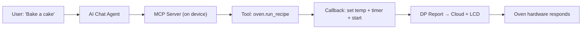

오븐을 말해주는 상상 *"Preheat to 200 도 and bake for 25 분"* — 그리고 그냥... 그것을. 앱 없음, 버튼 없음, 메뉴 없음. AI 에이전트에 의해 이해, 실제 하드웨어에서 실행.

이 가이드는**exactly** 어떻게 작동하나요?**Smart 오븐** 프로젝트는 TuyaOpen로 제작되었습니다. 끝에, 당신은 어떤 장치를 위한 당신의 자신의 기계설비 MCP 기술을 창조하는 방법을 알고 있을 것입니다.

---

<section id="what-youll-build" className="section">

## What You'll Build

An AI-powered Smart Oven where a chat agent can:

| Command | What the Agent Does |
|---|---|
| *"Turn on the oven"* | Calls `oven.start` → sets the power DP |
| *"Preheat to 200°C"* | Calls `oven.set_temperature(200)` → writes the temp DP |
| *"Bake for 25 minutes"* | Calls `oven.set_timer(1500)` → sets countdown DP |
| *"Is it still on?"* | Calls `oven.get_state()` → reads all DPs, returns JSON |
| *"Run the pizza recipe"* | Calls `oven.run_recipe("pizza")` → sets temp + timer + starts |
| *"Take a photo and check if the cake is done"* | Calls `device.camera_shot()` → captures a JPEG the AI can see |

The magic glue? **MCP Function Call** — the protocol that turns hardware operations into tools an AI agent can discover and invoke.

</section>

---

<section id="how-it-works" className="section">

## 어떻게 작동 : 건축



** 중요한 통찰력: ** 모든 하드웨어 기능(설정 온도, 읽기 상태, 캡처 이미지)는 **MCP 도구**로 등록되어 있습니다. AI 에이전트는 이러한 도구를보고, 사용자 의도를 기반으로 호출하는 결정, 그리고 콜백은 실제 하드웨어를 구동.

</section>

---

<section id="step-1-cloud-product" className="section">

## Step 1: Create the Cloud Product
Before writing any firmware code, you need a **product on the Tuya cloud platform**. The product defines your device's data model (DPs), AI agent, and cloud capabilities. Everything downstream — firmware, MCP tools, the app — depends on this.

### 1a. Create the product
1. Log in to the [Tuya Developer Platform](https://platform.tuya.com/pmg/list) → **AI Product > Development** → **Create**
2. Select **Custom** to create a custom product from scratch (instead of picking a preset category)
3. Complete the creation wizard — you'll get a **PID** (Product ID)

:::tip
The fastest way: use the **`/tuya-iot-platform`** vibe coding skill in TuyaOpen IDE. Just describe your device in natural language and the Agent creates the product, defines DPs, and configures the AI Agent for you.
:::

### 1b. Define Data Points (DPs)
**Data Points (DPs)** are the digital twin of your hardware. Each DP maps to a controllable or readable feature. In the **Function Definition** tab, click **Add** to create these custom DPs (IDs 101–199):

| DP ID | Code | Type | Range | Description |
|---|---|---|---|---|
| 101 | `switch` | Bool | — | Power on/off |
| 102 | `temp_set` | Value | 50–250 | Target temperature (°C) |
| 103 | `temp_current` | Value | 0–300 | Current temperature (°C) |
| 104 | `timer` | Value | 0–3600 | Countdown timer (seconds) |

:::note
Standard DPs (ID < 100) are pre-defined by Tuya. Custom DPs (ID 101–199) are yours to define. For the oven, all four are custom.
:::

### 1c. Add AI Agent & MCP capabilities
In the **Function Definition** tab → **Product AI Capabilities** → **Add Agent**:

1. **Model Configuration** → **Skills Configuration** → select **Plugin** → add **Device Control · Bound Only** (this enables MCP tool calls to your device DPs)
2. **Prompt Development** → write a system prompt that describes the oven's capabilities so the AI knows when to call each tool

This creates the cloud-side Agent that will discover and invoke the MCP tools you register in firmware.

### 1d. Generate the DP header for firmware
Once DPs are defined on the cloud, generate the C header your firmware will include:

```bash
tuyaopen dp generate --target embedded
```

This produces `tuya_dp_profile.h` — the contract between cloud and device:

```c
// tuya_dp_profile.h — auto-generated by `tuyaopen dp generate`
#define DPID_SWITCH       101
#define DPID_TEMP_SET     102
#define DPID_TEMP_CURRENT 103
#define DPID_TIMER        104

#define DPID_TEMP_SET_MIN 50
#define DPID_TEMP_SET_MAX 250
#define DPID_TIMER_MIN    0
#define DPID_TIMER_MAX    3600
```

:::tip
The full product creation flow is documented in [Create Your Product & Agent](/docs/cloud/tuya-cloud/creating-new-product). For the oven demo, you can also let the AI Agent generate the product and DPs for you using the `/tuya-iot-platform` skill in TuyaOpen IDE.
:::

</section>

---

<section id="step-2-mock-hardware" className="section">

## 단계 2: Mock 하드웨어 레이어 구현
MCP 도구를 배선하기 전에, 실제 하드웨어를 시뮬레이션하는 함수가 필요합니다. 이 도구 콜백을 깨끗하게 유지:

```c
// app_oven.h
typedef struct {
    bool switch_on;
    int  temp_set;
    int  temp_current;
    int  timer_remaining;
} oven_state_t;

OPERATE_RET app_oven_set_switch(bool on);
OPERATE_RET app_oven_set_temp(int temp_c);
OPERATE_RET app_oven_set_timer(int seconds);
OPERATE_RET app_oven_add_timer(int seconds);
oven_state_t app_oven_get_state(void);
```

```c
// app_oven.c — each setter reports DPs to the cloud + updates the LCD
static oven_state_t g_oven_state = {
    .switch_on = false,
    .temp_set = 180,
    .temp_current = 25,
    .timer_remaining = 0
};

OPERATE_RET app_oven_set_temp(int temp_c) {
    if (temp_c < DPID_TEMP_SET_MIN || temp_c > DPID_TEMP_SET_MAX)
        return OPRT_INVALID_PARM;
    g_oven_state.temp_set = temp_c;
    __oven_report_dp();  // sync to cloud + LCD
    return OPRT_OK;
}
```

</section>

---

<section id="step-3-register-tools" className="section">

## Step 3: Register MCP Tools (The Core Step)
This is where the AI agent gets its "hands" on your hardware. Each tool is registered with:
- **Name** — what the AI sees (use dot-notation: `oven.set_temperature`)
- **Description** — LLM-friendly text explaining when/how to call it
- **Parameters** — typed input properties with ranges
- **Callback** — the function that runs when the AI calls this tool

### The Registration Pattern

```c
#include "ai_mcp_server.h"
#include "tal_event_info.h"

// Called once when MQTT connects (deferred registration)
static OPERATE_RET __oven_mcp_on_mqtt_connected(void *data) {
    (void)data;

    // Tool 1: Start the oven
    TUYA_CALL_ERR_GOTO(AI_MCP_TOOL_ADD(
        "oven.start",
        "Turn on the oven. Use when the user wants to start cooking, "
        "preheat, or begin baking.\nParameters: none\nReturns: bool",
        __oven_start_cb, NULL
    ));

    // Tool 2: Set temperature
    TUYA_CALL_ERR_GOTO(AI_MCP_TOOL_ADD(
        "oven.set_temperature",
        "Set the oven target temperature in Celsius (50-250).\n"
        "Parameters: temperature (int)\nReturns: int (applied temp)",
        __oven_set_temp_cb, NULL,
        MCP_PROP_INT_RANGE("temperature", "Target temperature in °C (50-250).",
                           DPID_TEMP_SET_MIN, DPID_TEMP_SET_MAX),
        MCP_PROP_END
    ));

    // Tool 3: Get full state
    TUYA_CALL_ERR_GOTO(AI_MCP_TOOL_ADD(
        "oven.get_state",
        "Get the current oven state: power, target temp, current temp, "
        "timer remaining.\nParameters: none\nReturns: JSON object",
        __oven_get_state_cb, NULL
    ));

    // ... more tools
    return OPRT_OK;
}

OPERATE_RET app_oven_mcp_init(void) {
    return tal_event_subscribe(
        EVENT_MQTT_CONNECTED, "oven_mcp_tools",
        __oven_mcp_on_mqtt_connected, SUBSCRIBE_TYPE_ONETIME);
}
```

### The Callback Pattern

Each callback reads AI-supplied arguments from `properties`, calls the hardware function, and returns a result:

```c
static OPERATE_RET __oven_set_temp_cb(const MCP_PROPERTY_LIST_T *properties,
                                       MCP_RETURN_VALUE_T *ret_val,
                                       void *user_data) {
    // 1. Read the AI-supplied parameter
    int temp = properties->properties[0]->value.int_val;

    // 2. Call the hardware function
    OPERATE_RET rt = app_oven_set_temp(temp);

    // 3. Return the result to the AI
    ai_mcp_return_value_set_int(ret_val,
        (rt == OPRT_OK) ? temp : -1);
    return OPRT_OK;
}
```

For JSON returns (like `get_state`):

```c
static OPERATE_RET __oven_get_state_cb(const MCP_PROPERTY_LIST_T *properties,
                                        MCP_RETURN_VALUE_T *ret_val,
                                        void *user_data) {
    oven_state_t s = app_oven_get_state();
    cJSON *json = cJSON_CreateObject();
    cJSON_AddBoolToObject(json, "switch_on", s.switch_on);
    cJSON_AddNumberToObject(json, "temp_set", s.temp_set);
    cJSON_AddNumberToObject(json, "temp_current", s.temp_current);
    cJSON_AddNumberToObject(json, "timer_remaining", s.timer_remaining);
    ai_mcp_return_value_set_json(ret_val, json);
    return OPRT_OK;
}
```

</section>

---

<section id="step-4-wire-boot" className="section">

## 단계 4: 철사 그것은 부트 Sequence에
내 계정`app_chat_bot.c`, MCP init**right를 호출**`ai_mcp_init()`:

```c
#if defined(ENABLE_COMP_AI_MCP) && (ENABLE_COMP_AI_MCP == 1)
    TUYA_CALL_ERR_RETURN(ai_mcp_init());
    TUYA_CALL_ERR_RETURN(app_oven_mcp_init());  // ← your tools
#endif
```

MQTT가 연결할 때 자동으로 도구 등록. 그게 다.

</section>

---

<section id="step-5-build-test" className="section">

## Step 5: Build and Test
```bash
cd source/embedded
tos.py build
```

Verify the tool appears in the agent's tool list, then try these interactions:

| You Say | Agent Calls | Result |
|---|---|---|
| "Preheat to 200 and bake for 25 minutes" | `oven.set_temperature(200)` → `oven.set_timer(1500)` → `oven.start()` | Oven heats up, timer counts down |
| "Roast a chicken" | `oven.run_recipe("roast")` | 200°C, 40 min, auto-start |
| "Is it still on? How hot?" | `oven.get_state()` | Returns `{switch_on: true, temp_set: 200, ...}` |
| "Take a photo and check if the cake is done" | `device.camera_shot()` | AI receives a JPEG and can visually inspect |

</section>

---

<section id="complete-tool-set" className="section">

## 완전한 도구 세트

다음은 스마트 오븐을위한 MCP 도구의 전체 세트입니다 :

|제품 정보|이름 *|기타 제품|제품정보|
|---|---|---|---|
| `oven.start` | — |한국어|힘에|
| `oven.stop` | — |한국어|힘 떨어져|
| `oven.set_temperature` | `temperature`(int, 50-250)|뚱 베어|설정 대상 온도|
| `oven.set_timer` | `seconds`(int, 0–3600)|뚱 베어|설정 카운트 다운|
| `oven.add_time` | `seconds`(인치)|뚱 베어|타이머에 시간을 추가|
| `oven.get_state` | — |구글 맵|모든 DP를 읽으십시오|
| `oven.list_recipes` | — |JSON 배열|사전 설정 프로그램|
| `oven.run_recipe` | `recipe`(문자)|구글 맵|요리법 + 시작|
| `device.camera_shot` | — |이미지/jpeg|사진 캡처|

### 내장 요리법

|뚱 베어|사이트맵|(주)|제품 정보|
|---|---|---|---|
| `bake` |180°C에|30분|케이크, 빵, 카사|
| `roast` |200°C의|40분|고기와 야채|
| `broil` |230°C의|10분|빠른 갈색|
| `pizza` |220°C의|15분|높은 열 피자|
| `grill` |250°C의|8분|숙박 약관|
| `reheat` |120°C에|5 분|좌로|
| `warm` |80°C에|30분|따뜻한 유지|

</section>

---

<section id="ai-coding-prompts" className="section">

## AI Coding Prompts: Tips for Developers
When using AI coding assistants (Cursor, Claude Code, Copilot) to build hardware MCP skills, these prompt patterns will accelerate your development:

### Prompt Pattern 0: Generate the Full Cloud Product from a Description
```
/tuya-iot-platform
Create a new AI product for a smart oven with these capabilities:
- Power on/off (bool)
- Temperature setting 50-250°C (value)
- Current temperature readback 0-300°C (value, read-only)
- Countdown timer 0-3600 seconds (value)

Add an AI Agent with device control MCP plugin.
Generate the DP definitions and the embedded DP header.
```

**Why it works:** The `/tuya-iot-platform` skill creates the cloud product, defines DPs, configures the AI Agent, and generates the firmware DP header — all from a natural-language device description. This is the fastest way to go from idea to code.

### Prompt Pattern 1: Describe the Device, Not the Code
```
I have a smart oven with these features:
- Power on/off
- Temperature control (50-250°C)
- Timer (0-3600 seconds)
- Current temperature sensor
- Camera for visual inspection

Create MCP tool registrations for each feature.
Use the AI_MCP_TOOL_ADD macro pattern from the otto_robot example.
```

**Why it works:** The AI maps your device description directly to tool names, descriptions, and parameters.

### Prompt Pattern 2: Specify the DP Mapping
```
My oven DPs are:
- DP 101: switch (bool, rw)
- DP 102: temp_set (value, 50-250, rw)
- DP 103: temp_current (value, 0-300, ro)
- DP 104: timer (value, 0-3600, rw)

Generate the tuya_dp_profile.h header and the MCP tool callbacks
that read/write these DPs.
```

**Why it works:** Explicit DP definitions eliminate ambiguity about parameter types and ranges.

### Prompt Pattern 3: Request LLM-Friendly Descriptions
```
For each MCP tool, write descriptions that help an LLM understand:
1. WHEN to use this tool (what user intent triggers it)
2. WHAT parameters it takes (with units and ranges)
3. WHAT it returns (type and meaning)

Example: "Set the oven target temperature in Celsius (50-250).
Use when the user says 'preheat', 'set temp', or 'bake at X degrees'."
```

**Why it works:** Good tool descriptions are the #1 factor in the AI picking the right tool.

### Prompt Pattern 4: Ask for Error Handling
```
Add input validation to each MCP tool callback:
- Clamp temperature to the DP range (50-250)
- Return -1 on invalid parameters
- For run_recipe, return {ok: false, available: [...]} on unknown recipe names
```

**Why it works:** The AI can self-correct when it gets structured error responses.

### Prompt Pattern 5: Generate the Full Stack at Once
```
/tuyaopen-dev-loop
Create a complete Smart Oven project:
1. Cloud product with DPs (switch, temp_set, temp_current, timer)
2. Embedded firmware with mock hardware (app_oven.c)
3. MCP tools for all oven features (app_oven_mcp.c)
4. LVGL UI showing oven state on the T5-AI board display
5. Wire everything in app_chat_bot.c
```

**Why it works:** The `/tuyaopen-dev-loop` skill orchestrates the full cloud-to-device workflow.

</section>

---

<section id="key-takeaways" className="section">

## 키 테이크아웃

1. **클라우드 제품 시작 ** — 제품을 만들고 DP를 정의하고, 펌웨어를 터치하기 전에 클라우드 플랫폼에 AI 에이전트를 추가합니다. 제품은 기초입니다.
2. **DP는 계약 ** - 클라우드에 정의, 헤더를 생성, 다른 모든은 다음과 같습니다.
3. **Tool descriptions issues** — LLMs에 대한 쓰기: 사용할 때, 어떤 params, 어떤 반환.
4. ** MQTT에 등록은 ** — 사용`tal_event_subscribe(EVENT_MQTT_CONNECTED, ..., SUBSCRIBE_TYPE_ONETIME)`그래서 클라우드 링크가 준비 될 때 도구 등록.
5. ** MCP 별도의 Keep 하드웨어 ** — Your`app_oven.c`손잡이 기계설비;`app_oven_mcp.c`핸들 도구 등록. 깨끗한 분리.
6. **Return Structured data** - JSON 응답`ok: false`+ 유효한 선택권은 AI self-correct를 시켰습니다.

</section>

---

<section id="next-steps" className="section">

## Next Steps

- [Create Your Product & Agent](/docs/cloud/tuya-cloud/creating-new-product) — Full guide to creating the cloud product, DPs, and AI Agent
- [Custom Device MCP (Hardware Skills Guide)](/docs/tclaw/custom-device-mcp) — Full API reference for MCP tool development
- [Hardware Peripheral Skills](/docs/tclaw/hardware-skill) — Built-in GPIO, ADC, I2C, UART, PWM tools
- [MCP Server API](/docs/cloud/device-ai/ai-components/ai-mcp-server) — Complete MCP server documentation
- [Designing Device MCP Tools](/docs/cloud/device-ai/concepts/designing-device-mcp-tools) — Best practices for tool design

</section>
