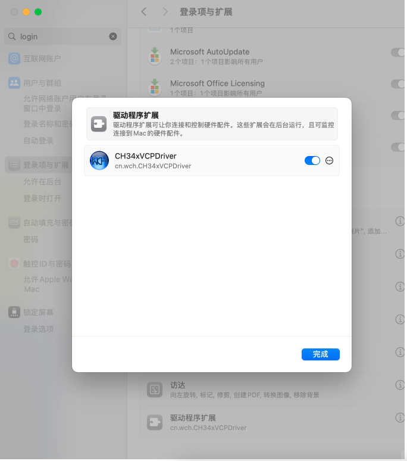

import Tabs from '@theme/Tabs';
import TabItem from '@theme/TabItem';

## 概述

tyutool 是为 TuyaOpen 项目提供的一个烧录授权工具。tyutool 工具分为 GUI 和 CLI 两种版本，GUI 版本提供了图形化界面，CLI 版本提供了命令行界面。

:::danger
tyutool 的授权功能仅适用于 TuyaOpen 项目，不支持 TuyaOS 项目。TuyaOpen 项目的授权码仅适用于 TuyaOpen 项目，TuyaOS 项目的授权码仅适用于 TuyaOS 项目，两者不可混用。
:::

tyutool 工具支持 Windows、Linux 和 macOS 三大操作系统，开发者可以根据自己的操作系统选择对应的版本。

| 平台 | 源码使用(推荐) | 产物使用 |
| :------: | :------: | :--: |
| Github | [github-source](https://github.com/tuya/tyutool) | [github-release](https://github.com/tuya/tyutool/releases) |
| Gitee | [gitee-source](https://gitee.com/tuya-open/tyutool) | [gitee-release](https://gitee.com/tuya-open/tyutool/releases) |

:::note
`tos.py flash` 命令最终调用的也是 tyutool_cli 工具，tyutool_gui 工具是基于 tyutool_cli 添加了图形化界面。
:::

接下来将会为大家介绍 tyutool_gui 工具的烧录和授权使用说明。

## 固件烧录

tyutool_gui 打开后界面如下显示：


 + ① 选择要烧录的芯片、模组型号
 + ② 点击 Browse 选择要烧录的固件文件（包含 `_QIO` 字样的 bin 文件）
 + ③ 点击 Rescan 扫描设备端口，然后选择要烧录的设备端口
 + ④ 点击 Start 开始烧录固件

固件烧录成功后，会出现以下日志输出：

```
[INFO]: Write Start.
[INFO]: Waiting Reset ...
[INFO]: unprotect flash OK.
[INFO]: sync baudrate 921600 success
[INFO]: Erase flash success
[INFO]: Write flash success
[INFO]: CRC check success
[INFO]: Reboot done
```

:::tip
烧录波特率默认使用 921600，如果您感觉烧录速度过慢，可以适当调高波特率，但是调高波特率可能会导致固件烧录失败。
:::

## 设备授权信息写入

当需要使用到 Tuya IoT 平台的功能时，需要先对设备进行授权。可以通过 tyutool_gui 工具进行设备授权，接下来将为大家介绍具体操作步骤。

打开 tyutool_gui 工具后，点击 `Serial` 选项卡，界面如下所示：


 + ① 点击 `Serial` 选项卡
 + ② 点击 `COM` 扫描设备端口
 + ③ 选择要授权的设备端口
 + ④ 点击 `Start` 连接设备

:::tip
授权 UART 和烧录 UART 为同一个，UART 保持默认配置即可（波特率：115200，数据位：8，停止位：1，校验位：无）。
:::

设备串口连接成功后， `Authorize` 按钮将变为可用状态，点击 `Authorize` 按钮弹出以下界面：


 + ② 输入授权信息中的 `UUID`
 + ③ 输入授权信息中的 `AuthKey`
 + ④ 点击 `Authorize` 按钮进行设备授权

:::info
TuyaOpen `UUID` 和 `AuthKey` 可以在 [Tuya IoT 平台](https://platform.tuya.com/purchase/index?type=6) 或在 [淘宝浙江涂鸦智能的小店](https://item.taobao.com/item.htm?ft=t&id=911596682625&spm=a21dvs.23580594.0.0.621e2c1bzX1OIP) 购买获取。
:::

授权成功后，会出现以下日志输出：

```
Authorization write succeeds.
```

## 常见问题

### 烧录过程中总是在`write`时失败

对于 CH34x 系列可以尝试安装或更新驱动

**Windows**：https://www.wch.cn/downloads/ch343ser_exe.html

**Mac**：https://www.wch.cn/downloads/CH34XSER_MAC_ZIP.html

在`Mac`中安装驱动后，需要在**安全设置**中`允许驱动加载`

若驱动安装成功，CH34x 被识别到的名称会以 `cu.wchusb` 开头，否则驱动未安装成功

<Tabs>
  <TabItem value="13" label="MacOS 13" default>

在**MacOS 13**中在`隐私与安全性`中操作


  </TabItem>
  <TabItem value="15" label="MacOS 15">

在**MacOS 15**中`设置`中搜索`login`，操作


  </TabItem>
</Tabs>