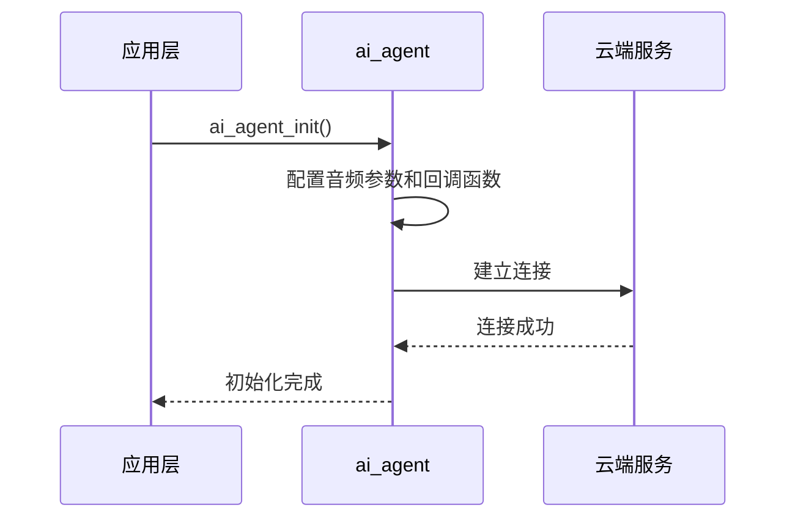
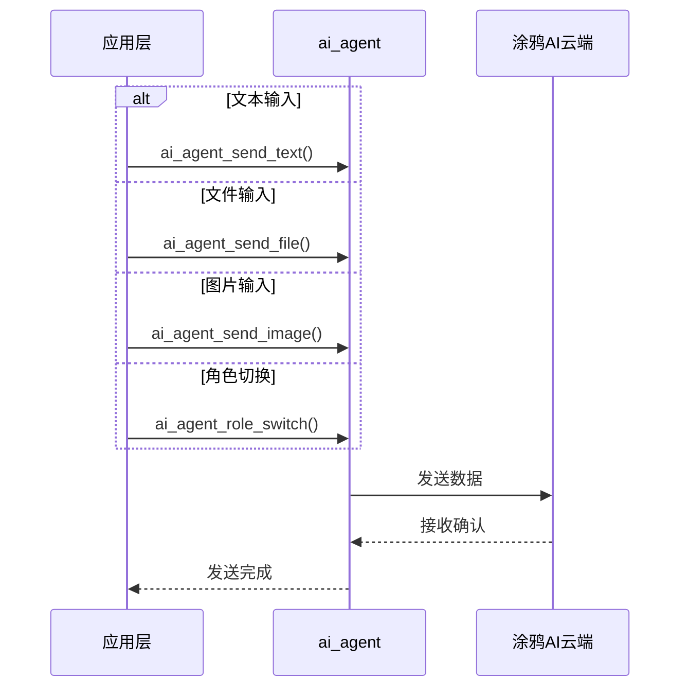
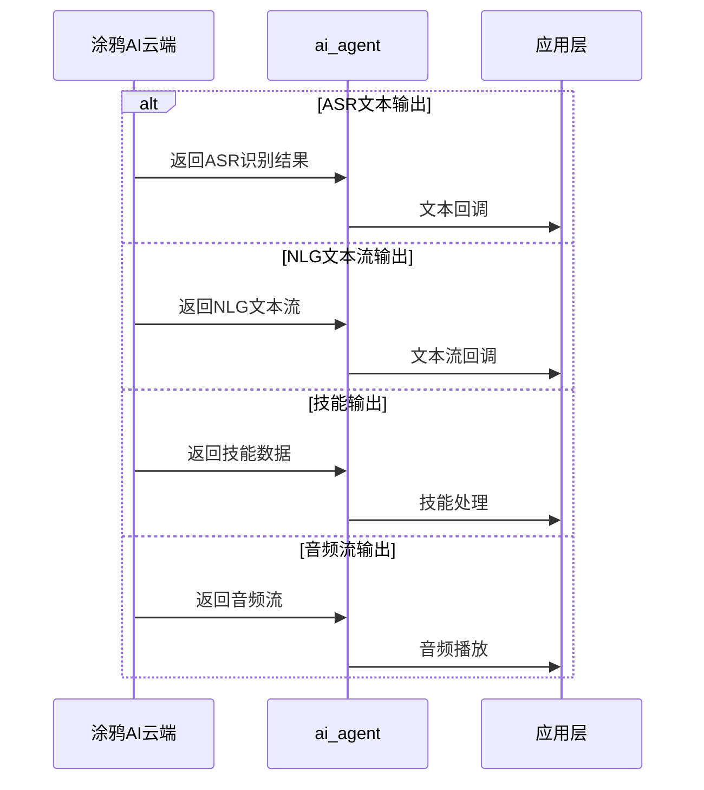
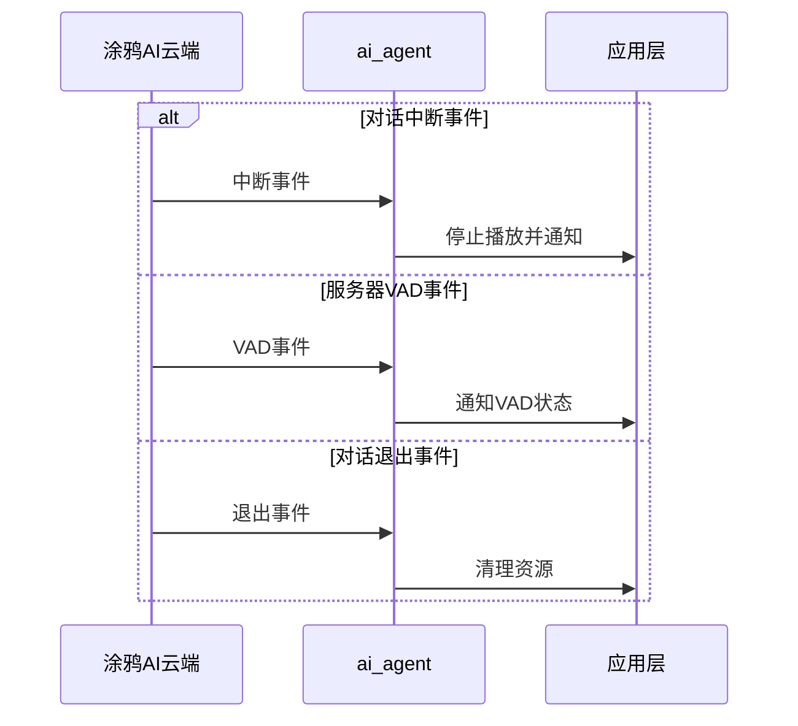
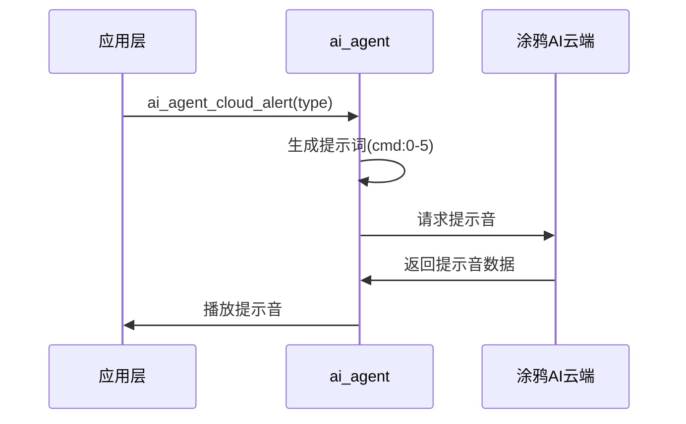
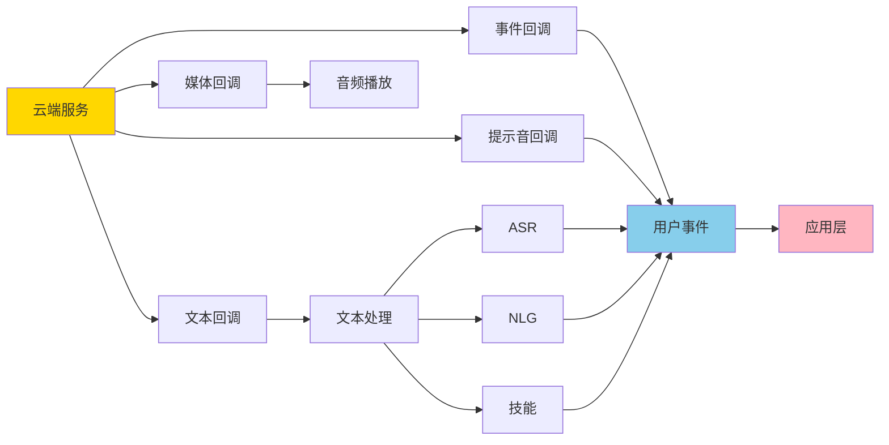
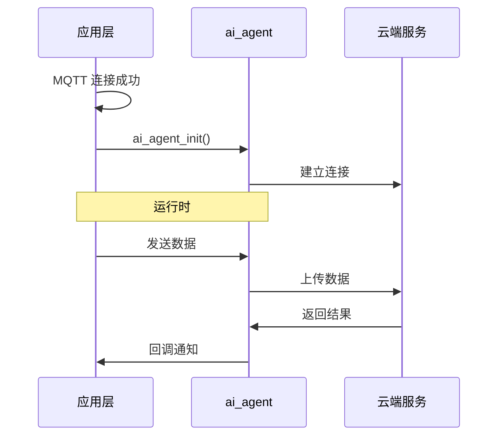

## 名词解释

| 名词  | 解释                                                         |
| ----- | ------------------------------------------------------------ |
| Agent | 智能体，能自主感知、思考、决策、行动的 AI 实体。             |
| ASR   | 自动语音识别（Automatic Speech Recognition）是一种将用户的语音输入转化为文本的技术。 |
| NLG   | 自然语言生成（Natural Language Generation）是一种将结构化数据或者意图转化为自然语言文本的技术。 |
| Skill | 技能 / 能力模块，一个独立、可插拔、专门干某件事的 AI 功能单元。 |

## 功能简述

`ai_agent` 是 TuyaOpen AI 应用框架中的核心组件，负责与涂鸦 AI 云端服务进行通信。`ai_agent` 作为中间层，连接本地应用和云端 AI 服务，实现智能对话、语音识别、自然语言理解等功能。

### 多模态数据输入

- **音频输入**：支持多种多种音频编解码格式
  - PCM：未压缩的原始音频格式，适用于本地处理
  - OPUS：高效的音频编解码格式，适用于网络传输，支持低延迟
  - SPEEX：语音优化的编解码格式，适用于语音通信

- **文本输入**：支持直接发送文本命令或查询到云端

- **图片输入**：支持上传图片数据到云端进行图像识别和分析，适用于视觉问答、图像理解等场景
- **文件输入**：支持上传文件数据到云端，适用于文档处理、文件分析等场景

### 输出处理

- **文本回调**：处理 ASR、NLG、技能等文本数据

- **媒体数据回调**：处理音频、视频、图片、文件等媒体流

- **媒体属性回调**：获取音频编解码类型等信息

### AI 会话事件管理

模块管理 AI 对话的完整生命周期，通过事件回调机制通知应用层：

- **会话开始事件**：当云端开始返回数据时触发，通常用于启动 TTS 播放器，准备接收音频流数据。
- **会话结束事件**：当云端数据发送完成时触发，用于停止 TTS 播放器，完成播放流程。
- **会话中断事件** ：当云端主动中断对话时触发，需要立即停止当前播放，清理资源。常见场景包括用户打断、云端超时等。
- **会话退出事件** ：当对话完全退出时触发，用于清理所有相关资源。
- **服务器 VAD 事件**：云端语音活动检测事件，用于通知应用层云端检测到的语音活动状态。

### 云端提示音管理

- **请求云端提示音**：根据提示音类型生成对应的提示词（cmd:0 到 cmd:5），AI 根据收到的提示词返回对应的提示音内容。***这个需要在平台上对智能体进行配置，在智能体的 Prompt 中注明当 AI 收到 cmd:0 到 cmd:5 时应该返回什么内容***。

- **播放云端提示音**：收到云端返回的音频数据后调用播放器接口进行播放。

- **提示音映射表**：

  | 告警类型             | 提示词 | 说明         |
  | -------------------- | ------ | ------------ |
  | AT_NETWORK_CONNECTED | cmd:0  | 网络连接成功 |
  | AT_WAKEUP            | cmd:1  | 唤醒响应     |
  | AT_LONG_KEY_TALK     | cmd:2  | 长按按键对话 |
  | AT_KEY_TALK          | cmd:3  | 按键对话     |
  | AT_WAKEUP_TALK       | cmd:4  | 唤醒对话     |
  | AT_RANDOM_TALK       | cmd:5  | 随机对话     |

### 智能体角色切换

模块支持动态切换 AI Agent 的角色。不同的角色可以具有不同的对话风格、知识库和技能集，适用于多场景应用。

## 工作流程

### 初始化



###  输入处理



### 输出处理



### 会话事件管理



### 云端提示音



### 回调函数关系图



## 开发流程

### 接口说明

#### 初始化

初始化 AI Agent 模块，如果打开了 `ENABLE_AI_MONITOR` 配置宏，还会初始化监控模块配合 tyutool 上位机可有助于调试。

**该初始化必须在 MQTT 连接成功后调用**

```c
/**
@brief Initialize the AI agent module
@return OPERATE_RET Operation result
*/
OPERATE_RET ai_agent_init(void);
```

#### 反初始化

释放 AI Agent 模块占用的资源

```c
/**
@brief Deinitialize the AI agent module
@return OPERATE_RET Operation result
*/
OPERATE_RET ai_agent_deinit(void);
```

#### 输入文本

发送文本数据给 AI

```c
/**
@brief Send text input to AI agent
@param content Text content to send
@return OPERATE_RET Operation result
*/
OPERATE_RET ai_agent_send_text(char *content);
```

#### 输入文件

发送文件数据给 AI

```c
/**
@brief Send file data to AI agent
@param data Pointer to file data
@param len File data length
@return OPERATE_RET Operation result
*/
OPERATE_RET ai_agent_send_file(uint8_t *data, uint32_t len);
```

#### 输入图片

发送图片数据给 AI

```c
/**
@brief Send image data to AI agent
@param data Pointer to image data
@param len Image data length
@return OPERATE_RET Operation result
*/
OPERATE_RET ai_agent_send_image(uint8_t *data, uint32_t len);
```

#### 播放云端提示音

根据提示音类型生成对应的提示词，用提示词让 AI 生成提示音然后播放。

```c
/**
@brief Request cloud alert from AI agent
@param type Alert type
@return OPERATE_RET Operation result
*/
OPERATE_RET ai_agent_cloud_alert(AI_ALERT_TYPE_E type);
```

#### 切换智能体角色

```c
/**
@brief Switch AI agent role
@param role Role name to switch to
@return OPERATE_RET Operation result
*/
OPERATE_RET ai_agent_role_switch(char *role);
```

### 开发步骤



### 参考代码

```c
// MQTT 连接事件回调
int __ai_mqtt_connected_evt(void *data)
{
    if (!sg_ai_agent_inited) {
        // 步骤 3：初始化 AI Agent 模块
        TUYA_CALL_ERR_LOG(ai_agent_init());
        sg_ai_agent_inited = true;
    }
    return OPRT_OK;
}

// 初始化函数
OPERATE_RET example_init(void)
{
    OPERATE_RET rt = OPRT_OK;

    // 初始化音频输入和播放模块
#if defined(ENABLE_COMP_AI_AUDIO) && (ENABLE_COMP_AI_AUDIO == 1)
    AI_AUDIO_INPUT_CFG_T input_cfg = {
        .vad_mode      = AI_AUDIO_VAD_MANUAL,
        .vad_off_ms    = 1000,
        .vad_active_ms = 200,
        .slice_ms      = 80,
        .output_cb     = __ai_audio_output,
    };
    TUYA_CALL_ERR_RETURN(ai_audio_input_init(&input_cfg));
    TUYA_CALL_ERR_RETURN(ai_audio_player_init());
#endif

    // 订阅 MQTT 连接事件，在连接成功后初始化 AI Agent
    TUYA_CALL_ERR_RETURN(tal_event_subscribe(EVENT_MQTT_CONNECTED, "ai_agent_init", 
                                             __ai_mqtt_connected_evt, SUBSCRIBE_TYPE_EMERGENCY));

    return OPRT_OK;
}

// 使用示例：发送文本
void send_text_to_ai(void)
{
    ai_agent_send_text("今天天气怎么样？");
}

// 使用示例：请求提示音
void request_alert(void)
{
    ai_agent_cloud_alert(AT_WAKEUP);
}

// 使用示例：切换角色
void switch_role(void)
{
    ai_agent_role_switch("");
}
```
