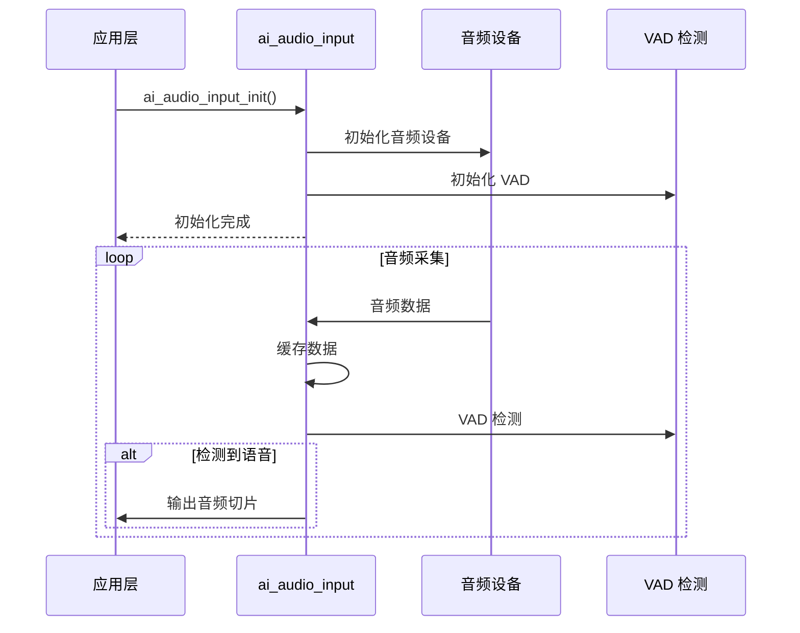
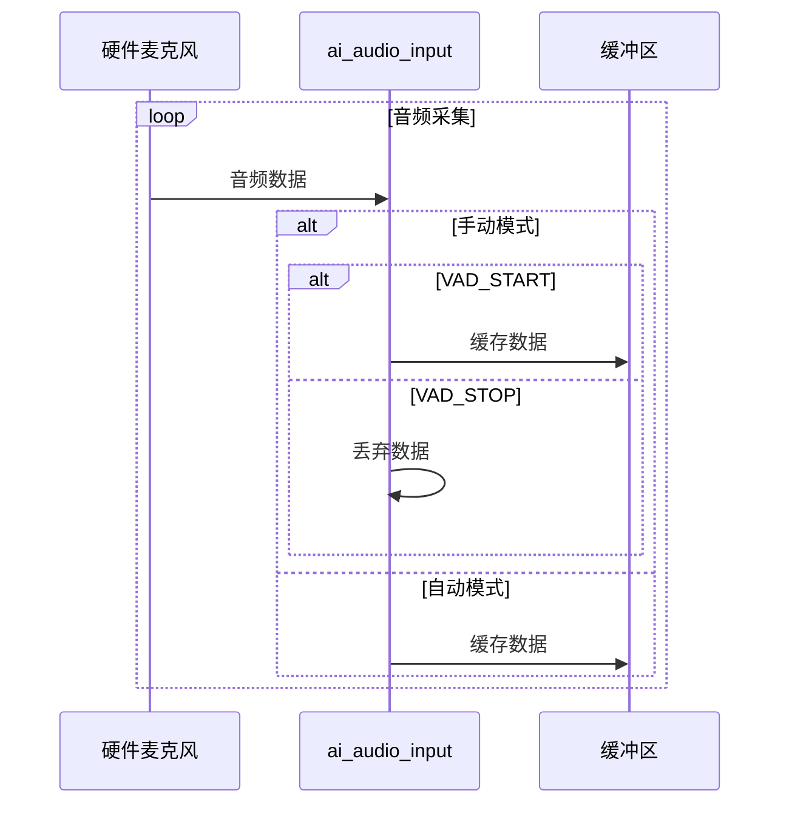
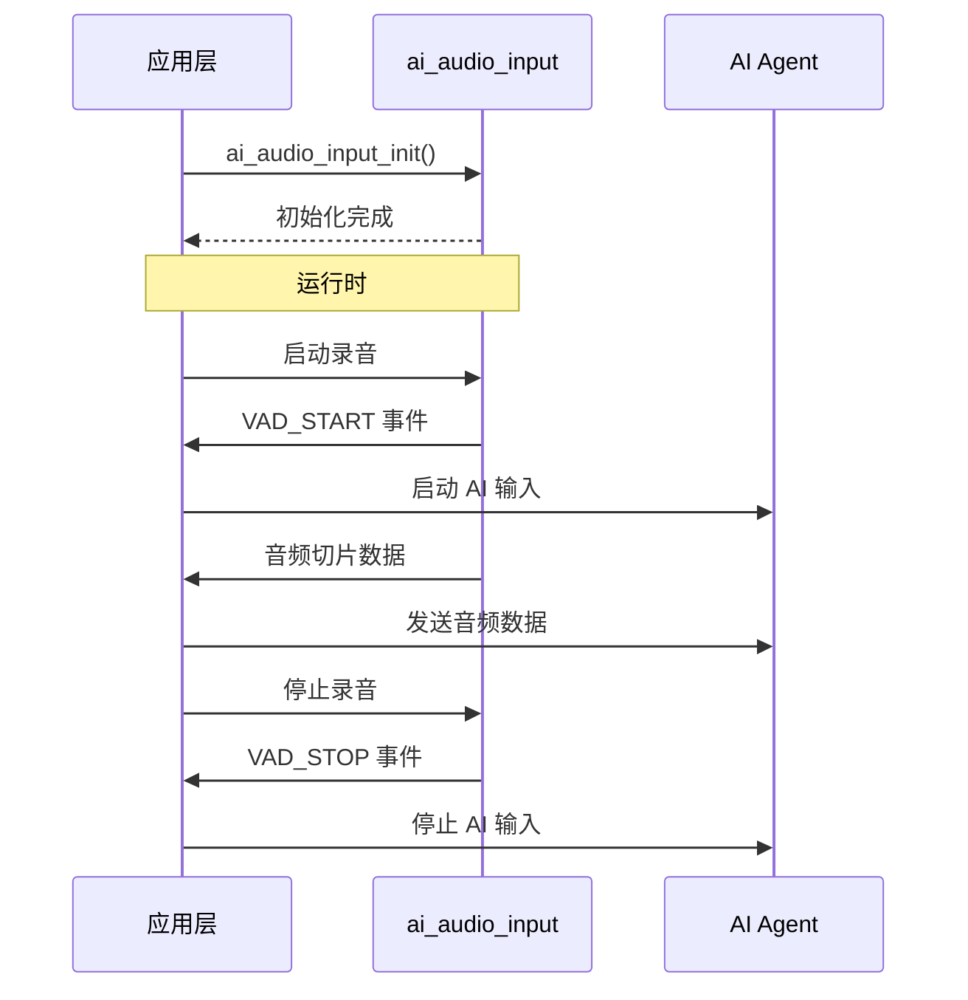

## 名词解释

| 名词     | 解释                                                         |
| -------- | ------------------------------------------------------------ |
| VAD      | 语音活动检测 （Voice Activity Detection），用于判断音频信号中是否存在语音的技术。 |
| VAD 状态 | VAD_START : 语音活动开始<br />VAD_STOP : 语音活动结束        |
| 音频切片 | 音频切片 （Audio Slice）是将连续音频流按固定时间长度分割成的小块，用于分段处理和传输。 |

## 功能简述

`ai_audio_input` 属于 TuyaOpen AI 应用框架中的音频处理组件的子模块。负责音频输入采集、VAD 处理和音频数据切片输出。

### 工作模式

- **手动模式**：
  - 不启动 VAD 检测模块，通过 API 接口外部控制 VAD 状态。
  - 适用于按键触发录音等场景，用户主动控制录音的开始和结束。
- **自动模式**：
  - 启用 VAD 检测模块，周期性检测 VAD 状态。
  - 适用于需要检测到人声就开始录音的场景，不需要人为的操作。

### 音频缓存管理

- 基于环形缓冲区管理输入的音频数据流。
- 数据缓存策略：
  - 手动模式：仅在有语音活动时缓存输入的音频数据。
  - 自动模式：始终缓存输入的音频数据，缓存区满时丢弃旧数据。

### 事件通知

- 当 VAD 状态发生改变时会发布通知。
- 每次收到音频数据时也会发布通知。

## 工作流程

### 完整数据流



### 初始化流程

1. **查找音频设备**：通过 `tdl_audio_find()` 查找音频编解码器设备

2. **获取音频参数**：获取采样率、位深度、声道数等信息

3. **创建录音器**：分配内存并初始化录音器结构体

4. **计算缓冲区大小**：

   - 计算每毫秒音频数据大小

     ```
     audio_1ms_size = (sample_rate × sample_bits × sample_ch_num) / 8 / 1000
     ```

     说明：

     - `sample_rate`：采样率（Hz），如 16000

     - `sample_bits`：位深度（bit），如 16

     - `sample_ch_num`：声道数，如 1（单声道）或 2（立体声）

     - /8：字节转换（bit → byte）

     - /1000：毫秒转换（秒 → 毫秒）

     示例（16kHz, 16bit, 单声道）：

     ```
     audio_1ms_size = (16000 × 16 × 1) / 8 / 1000
                     = 256000 / 8 / 1000
                     = 32000 / 1000
                     = 32 字节/毫秒
     ```

   - 计算 VAD 缓冲区大小

     ```
     vad_size = (vad_active_ms + 300) × audio_1ms_size + 1
     ```

     说明：

     - `vad_active_ms`：VAD 激活阈值（毫秒），配置参数

     - \+ 300：固定补偿时间（300ms），用于缓存 VAD 检测前的音频数据（预缓存），处理 VAD 检测延时， 保证有足够的数据用于云端进行 VAD 分析，避免丢失语音开头。

     - \+ 1：避免边界问题

     示例（vad_active_ms = 200ms，16kHz/16bit/单声道）：

     ```
     vad_size = (200 + 300) × 32 + 1
              = 500 × 32 + 1
              = 16000 + 1
              = 16001 字节
     ```

   - 计算音频切片大小

     ```
     slice_size = slice_ms × audio_1ms_size
     ```

     说明：

     - `slice_ms`：音频切片时长（毫秒），配置参数

     - 用于每次从环形缓冲区读取的数据量

     示例（slice_ms = 100ms，16kHz/16bit/单声道）：

     ```
     slice_size = 100 × 32
                = 3200 字节
     ```

   - 计算环形缓冲区大小

     ```
     rb_size = vad_size;
     ```

     说明：

     - `rb_size`：环形缓冲区大小

5. **创建环形缓冲区**：用于缓存音频数据

6. **打开音频设备**：注册采集音频数据的回调函数

7. **初始化 VAD**：配置 VAD 参数（采样率、声道数、VAD 激活阈值等）

8. **启动任务**：创建任务线程

### 音频数据采集流程



### 音频切片输出时序

- **自动模式**

  ```
  时间轴: 0ms    10ms   20ms   30ms   40ms   50ms   60ms
          |------|------|------|------|------|------|
  音频帧: [帧1]  [帧2]  [帧3]  [帧4]  [帧5]  [帧6]
          ↓      ↓      ↓      ↓      ↓      ↓
  缓冲区: [缓存] [缓存] [缓存] [缓存] [缓存] [缓存]
          ↓      ↓      ↓      ↓      ↓      ↓
  VAD检测: [检测] [检测] [检测] [检测] [检测] [检测]
          ↓      ↓      ↓      ↓      ↓      ↓
  VAD状态: STOP  STOP   START  START  START  STOP
          ↓      ↓      ↓      ↓      ↓      ↓
  切片输出: [无]  [无]   [切片1][切片2][切片3][无]
  ```

- **手动模式**

  ```
  时间轴: 0ms    10ms   20ms   30ms   40ms   50ms   60ms
          |------|------|------|------|------|------|
  音频帧: [帧1]  [帧2]  [帧3]  [帧4]  [帧5]  [帧6]
          ↓      ↓      ↓      ↓      ↓      ↓
  VAD状态: STOP  STOP   START  START  START  STOP
          ↓      ↓      ↓      ↓      ↓      ↓
  缓冲区: [丢弃] [丢弃] [缓存] [缓存] [缓存] [丢弃]
          ↓      ↓      ↓      ↓      ↓      ↓
  切片输出: [无]  [无]   [切片1][切片2][切片3][无]
  ```

- **音频输出说明**：

  - **触发条件**：VAD 状态为 VAD_START  且缓冲区数据量达到切片大小

  - **切片大小**：由配置参数 `slice_ms` 决定，详细计算方式请查看上文的 **初始化流程**

  - **数据读取**：每次读取一个切片大小的数据

## 配置说明

### 配置文件路径

```
ai_components/ai_audio/Kconfig
```

### 功能使能

```
menuconfig ENABLE_COMP_AI_AUDIO
    select ENABLE_AI_PLAYER
    bool "enable ai audio input/output"
    default y
```

## 开发流程

### 数据结构

#### 音频输入配置

```c
typedef struct {
    AI_AUDIO_VAD_MODE_E     vad_mode;         // VAD 模式（手动/自动）
    uint16_t                vad_off_ms;       // vad stop 持续检测时长，在此时间段如持续未检测到活动语音则认为vad stop
    uint16_t                vad_active_ms;    // vad start 持续检测时长，在此时间段如持续检测出到活动语音则认为vad start
    uint16_t                slice_ms;         // 音频切片时间（毫秒）
    AI_AUDIO_OUTPUT         output_cb;        // 音频数据输出回调函数
} AI_AUDIO_INPUT_CFG_T;
```

#### VAD 模式

```c
typedef enum {
    AI_AUDIO_VAD_MANUAL,    // 手动模式：使用按键事件作为 VAD
    AI_AUDIO_VAD_AUTO,      // 自动模式：使用人声检测
} AI_AUDIO_VAD_MODE_E;
```

#### VAD 状态

```c
typedef enum {
    AI_AUDIO_VAD_START = 1,  // VAD 开始
    AI_AUDIO_VAD_STOP,       // VAD 停止
} AI_AUDIO_VAD_STATE_E;
```

### 接口说明

#### 初始化

初始化音频输入模块，配置 VAD 参数和音频切片输出回调。

```c
typedef struct  {
    /* VAD cache = vad_active_ms + vad_off_ms */
    AI_AUDIO_VAD_MODE_E     vad_mode;
    uint16_t                vad_off_ms;        /* Voice activity compensation time, unit: ms */
    uint16_t                vad_active_ms;     /* Voice activity detection threshold, unit: ms */
    uint16_t                slice_ms;          /* Reference macro, AUDIO_RECORDER_SLICE_TIME */

    /* Microphone data processing callback */
    AI_AUDIO_OUTPUT         output_cb;
} AI_AUDIO_INPUT_CFG_T;

/**
@brief Initialize the AI audio input module
@param cfg Audio input configuration
@return OPERATE_RET Operation result
*/
OPERATE_RET ai_audio_input_init(AI_AUDIO_INPUT_CFG_T *cfg);
```

#### 启动音频输入

启动音频采集和 VAD 检测任务

```c
/**
@brief Start audio input
@return OPERATE_RET Operation result
*/
OPERATE_RET ai_audio_input_start(void);
```

#### 停止音频输入

停止音频采集和 VAD 检测任务

```c
/**
@brief Stop audio input
@return OPERATE_RET Operation result
*/
OPERATE_RET ai_audio_input_stop(void);
```

#### 反初始化

释放音频输入模块资源

```c
/**
@brief Deinitialize the AI audio input module
@return OPERATE_RET Operation result
*/
OPERATE_RET ai_audio_input_deinit(void);
```

#### 重置音频输入

重置环形缓冲区和 VAD 状态

```c
/**
@brief Reset audio input ring buffer and VAD state
@return OPERATE_RET Operation result
*/
OPERATE_RET ai_audio_input_reset(void);
```

#### 设置模式

动态切换 VAD 模式

```c
typedef enum {
    AI_AUDIO_VAD_MANUAL,    // use key event as vad
    AI_AUDIO_VAD_AUTO,      // use human voice detect 
} AI_AUDIO_VAD_MODE_E;

/**
@brief Set wake-up mode (VAD mode)
@param mode VAD mode (manual or auto)
@return OPERATE_RET Operation result
*/
OPERATE_RET ai_audio_input_wakeup_mode_set(AI_AUDIO_VAD_MODE_E mode);
```

#### 设置唤醒状态

设置模块是否处于唤醒状态，手动模式下可通过该接口直接设置 VAD 状态。

- 只有模块被唤醒时，才会处理 VAD 相关任务。
- 当 VAD 状态发生改变时，只有模块被唤醒时才会发布通知。

```c
/**
@brief Set wake-up state
@param is_wakeup Wake-up flag
@return OPERATE_RET Operation result
*/
OPERATE_RET ai_audio_input_wakeup_set(bool is_wakeup);
```

### 开发步骤

1. 定义配置参数，设置切片时长和 VAD 阈值。
2. 实现音频输出回调函数， 处理音频切片数据。
3. 实现 VAD 事件处理回调，处理 VAD 状态变化。
4. 初始化音频输入模块，配置并启动音频输入。
5. 订阅 VAD 事件，接收状态变化通知。
6. 控制音频输入（手动模式），根据应用逻辑启动/停止录音。

### 开发流程图



### 参考示例

```c
#include "ai_audio_input.h"
#include "ai_agent.h"

// 步骤 1：定义配置参数
#define AI_AUDIO_SLICE_TIME         80
#define AI_AUDIO_VAD_ACTIVE_TIME    200
#define AI_AUDIO_VAD_OFF_TIME       1000

static bool sg_ai_agent_inited = false;

// 步骤 2：实现音频输出回调函数
static int __ai_audio_output(uint8_t *data, uint16_t datalen)
{
    OPERATE_RET rt = OPRT_OK;
    uint64_t   pts = 0;
    uint64_t   timestamp = 0;

    if(false == sg_ai_agent_inited) {
        return OPRT_OK;
    }

    timestamp = pts = tal_system_get_millisecond();
    TUYA_CALL_ERR_LOG(tuya_ai_audio_input(timestamp, pts, data, datalen, datalen));
    
    return rt;
}

// 步骤 3：实现 VAD 事件处理回调
int __ai_vad_change_evt(void *data)
{
    OPERATE_RET rt = OPRT_OK;

    TUYA_CHECK_NULL_RETURN(data, OPRT_INVALID_PARM);

    AI_AUDIO_VAD_STATE_E vad_flag = (AI_AUDIO_VAD_STATE_E)data;

    // 处理 VAD 状态变化
    if (AI_AUDIO_VAD_START == vad_flag) {
        // VAD 开始，启动 AI 输入
        tuya_ai_agent_set_scode(AI_AGENT_SCODE_DEFAULT);
        tuya_ai_input_start(false);
    } else {
        // VAD 停止，停止 AI 输入
        tuya_ai_input_stop();
    }

    return rt;
}

// 初始化函数
OPERATE_RET example_init(void)
{
    // 步骤 4：初始化音频输入模块
    AI_AUDIO_INPUT_CFG_T input_cfg = {
        .vad_mode      = AI_AUDIO_VAD_MANUAL,
        .vad_off_ms    = AI_AUDIO_VAD_OFF_TIME,
        .vad_active_ms = AI_AUDIO_VAD_ACTIVE_TIME,
        .slice_ms      = AI_AUDIO_SLICE_TIME,
        .output_cb     = __ai_audio_output,
    };
    TUYA_CALL_ERR_RETURN(ai_audio_input_init(&input_cfg));
    
    //...
    
    // 步骤 5：订阅 VAD 事件
    TUYA_CALL_ERR_RETURN(tal_event_subscribe(EVENT_AUDIO_VAD, "vad_change", 
                                             __ai_vad_change_evt, SUBSCRIBE_TYPE_NORMAL));

    sg_ai_agent_inited = true;

    return OPRT_OK;
}

// 按键事件处理（步骤 6：控制音频输入）
void on_button_press(void)
{
    // 按键按下，开始录音
    ai_audio_input_wakeup_set(true);
}

void on_button_release(void)
{
    // 按键释放，停止录音
    ai_audio_input_wakeup_set(false);
}

```
