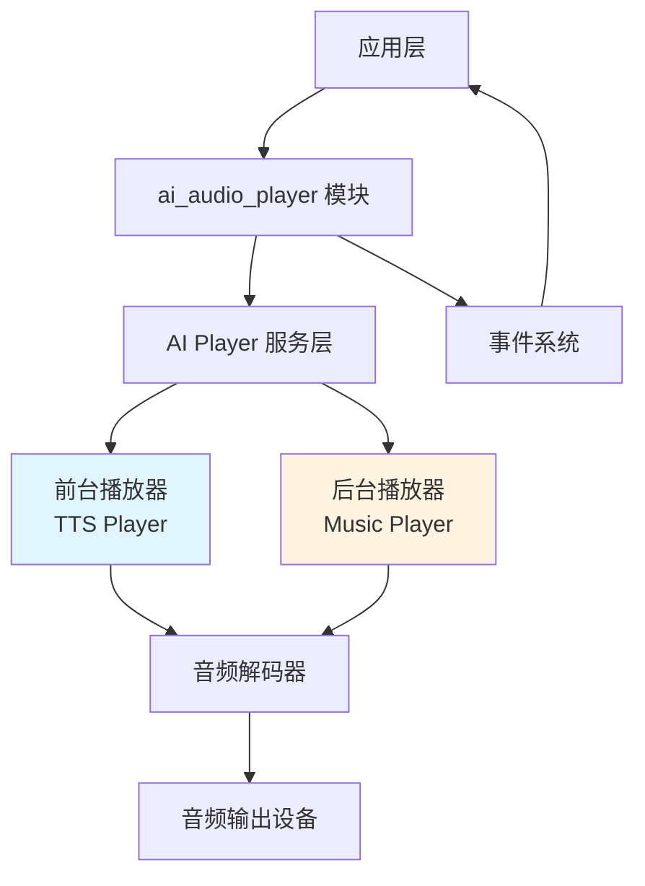
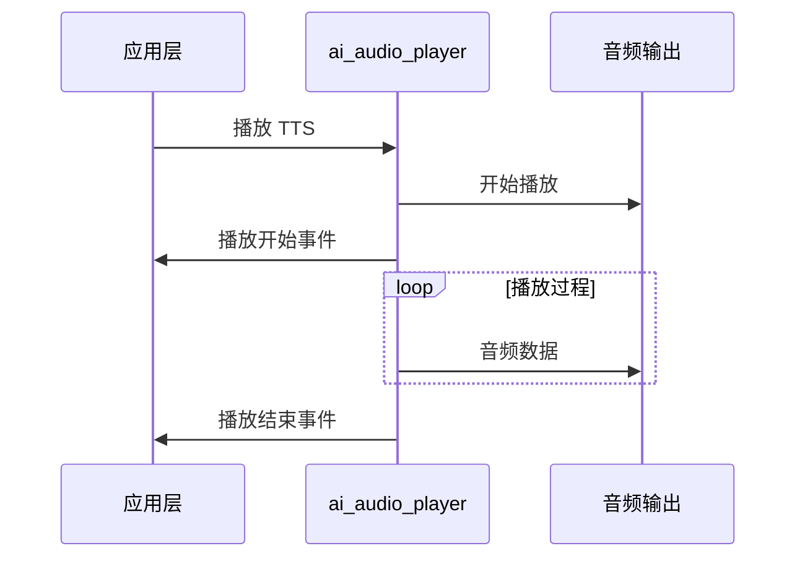
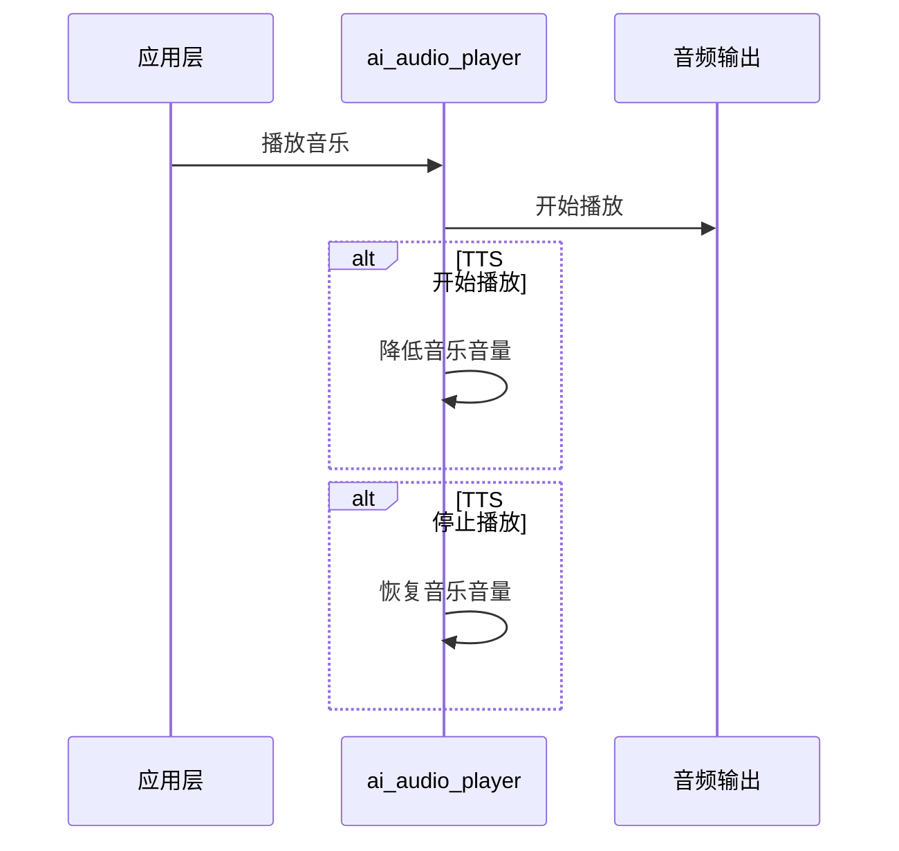
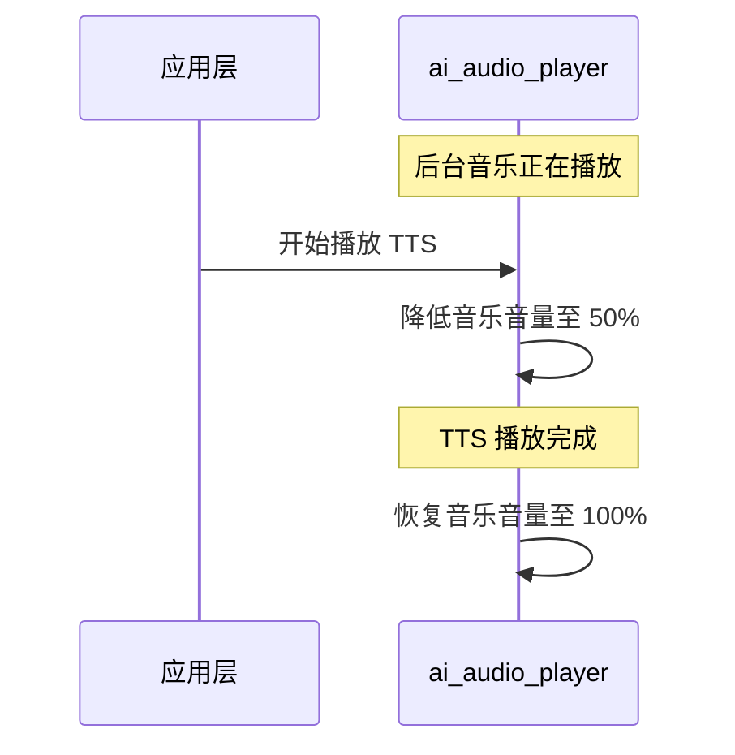

## 名词解释

| 名词 | 解释                                                         |
| ---- | ------------------------------------------------------------ |
| TTS  | 文本转语音（Text-to-Speech）的缩写，是一种将文本转换成语音的技术。在本模块中，TTS 用于播放 AI 助手的语音回复。 |

## 功能简述

`ai_audio_player` 是 TuyaOpen AI 应用框架中的音频播放组件，提供 TTS（文本转语音）、音乐播放和提示音播放等功能。。

### 播放 TTS 音频

- **播放方式：**
  - URL ：通过访问 URL 链接，下载音频内容并播放
  - 流式：支持流式 TTS 数据播放

- **播放状态通知：** 提供 TTS 播放状态事件
- **播放优先级：** 播放 TTS 音频优先级高于背景音乐

### 播放音乐

- **播放列表管理**：支持多首歌曲的播放列表
- **连续播放**：支持音乐连续播放配置
- **重播功能**：支持播放列表重播

### 提示音播放

- **本地提示音**：支持播放本地预置的提示音资源
- **云端提示音**：支持从云端获取提示音资源
- **自定义提示音**：支持注册自定义提示音回调函数

### 音量控制

- **音量设置**：支持音量设置（0-100）
- **音量获取**：支持获取当前音量值
- **自动音量调节**：
  - 播放 TTS 音频时，背景音乐音量自动降低至 50%
  - TTS 播放完成后，背景音乐音量恢复

### 事件通知

- **TTS 播放状态通知**：当TTS 播放状态发生改变时会发布事件通知（准备 / 开始 / 接收数据 / 正常停止 / 中止）

## 工作流程

### 模块架构图



### 初始化流程

- **初始化播放器服务：** 配置采样率、位深度、声道数等
- **创建 TTS 播放器：** 创建前台播放器，创建前台播放列表（容量：2）
- **创建音乐播放器：** 创建后台播放器，创建后台播放列表（容量：32）
- **订阅事件：**订阅播放器状态事件（播放中/播放停止/播放暂停）

### TTS 播放流程



### 音乐播放流程



### 音量自动调节




## 配置说明

### 配置文件路径

```
ai_components/ai_audio/Kconfig
```

### 功能使能

```
menuconfig ENABLE_COMP_AI_AUDIO
    select ENABLE_AI_PLAYER
    bool "enable ai audio input/output"
    default y
```

### 提示音源选择

```
choice 
    prompt "select player alert source"
    default AI_PLAYER_ALERT_SOURCE_LOCAL //默认是本地提示音

config AI_PLAYER_ALERT_SOURCE_LOCAL  //本地提示音, 使用组件框架内嵌的提示音源
    bool "use local alert source"

config AI_PLAYER_ALERT_SOURCE_CLOUD //云端提示音，从云端服务器获取提示音资源
    bool "use cloud alert source"

config AI_PLAYER_ALERT_SOURCE_CUSTOM //自定义提示音，通过回调函数调用开发者的自定义提示音源
    bool "use custom alert source"
endchoice
```

## 开发流程

### 数据结构

#### 提示音类型

```c
typedef enum {
    AI_AUDIO_ALERT_POWER_ON,             // 开机提示
    AI_AUDIO_ALERT_NOT_ACTIVE,           // 未激活提示
    AI_AUDIO_ALERT_NETWORK_CFG,          // 网络配置提示
    AI_AUDIO_ALERT_NETWORK_CONNECTED,    // 网络连接成功提示
    AI_AUDIO_ALERT_NETWORK_FAIL,         // 网络连接失败提示
    AI_AUDIO_ALERT_NETWORK_DISCONNECT,   // 网络断开提示
    AI_AUDIO_ALERT_BATTERY_LOW,          // 低电量提示
    AI_AUDIO_ALERT_PLEASE_AGAIN,         // 请再说一次提示
    AI_AUDIO_ALERT_LONG_KEY_TALK,        // 长按说话提示
    AI_AUDIO_ALERT_KEY_TALK,             // 按键说话提示
    AI_AUDIO_ALERT_WAKEUP_TALK,          // 唤醒说话提示
    AI_AUDIO_ALERT_RANDOM_TALK,          // 随机说话提示
    AI_AUDIO_ALERT_WAKEUP,               // 唤醒提示
    AI_AUDIO_ALERT_MAX,
} AI_AUDIO_ALERT_TYPE_E;
```

#### 播放器类型

```c
typedef enum {
    AI_AUDIO_PLAYER_FG = 0,   // 前台播放器（TTS）
    AI_AUDIO_PLAYER_BG = 1,   // 后台播放器（音乐）
    AI_AUDIO_PLAYER_ALL = 2,  // 所有播放器
} AI_AUDIO_PLAYER_TYPE_E;
```

#### TTS 流状态

```c
typedef enum {
    AI_AUDIO_PLAYER_TTS_START,  // TTS 开始播放
    AI_AUDIO_PLAYER_TTS_DATA,   // TTS 接收数据
    AI_AUDIO_PLAYER_TTS_STOP,   // TTS 正常停止
    AI_AUDIO_PLAYER_TTS_ABORT,  // TTS 中止播放
} AI_AUDIO_PLAYER_TTS_STATE_E;
```

#### TTS 播放

```c
typedef struct {
    char              *url;           // TTS URL
    char              *req_body;      // 请求体
    AI_HTTP_METHOD_E   http_method;   // HTTP 方法
    AI_AUDIO_CODEC_E   format;        // 音频格式
    AI_TTS_TYPE_E      tts_type;      // TTS 类型
    int                duration;      // 时长
} AI_AUDIO_TTS_T;
```

#### TTS 播放配置

```
typedef struct {
    AI_AUDIO_TTS_T  tts;        // TTS 配置
    AI_AUDIO_TTS_T  bg_music;   // 背景音乐配置
} AI_AUDIO_PLAY_TTS_T;
```

####  音乐源

```c
typedef struct {
    uint32_t          id;        // 音乐 ID
    char             *url;       // 音乐 URL
    uint64_t          length;    // 音乐长度
    uint64_t          duration;  // 音乐时长
    AI_AUDIO_CODEC_E  format;    // 音频格式
    char             *artist;    // 艺术家
    char             *song_name; // 歌曲名
    char             *audio_id;  // 音频 ID
    char             *img_url;   // 图片 URL
} AI_MUSIC_SRC_T;
```

#### 音乐播放

```c
typedef struct {
    char              action[32];    // 播放动作（play/next/prev/resume）
    bool              has_tts;       // 是否需要等待 TTS 播放完成
    int               src_cnt;       // 音乐源数量
    AI_MUSIC_SRC_T   *src_array;     // 音乐源数组
} AI_AUDIO_MUSIC_T;
```

### 接口说明

#### 初始化播放器

初始化音频播放服务，创建前台和后台播放器及其播放列表

```c
/**
@brief Initialize the audio player module
@return OPERATE_RET Operation result
*/
OPERATE_RET ai_audio_player_init(void);
```

#### 反初始化播放器

释放音频播放模块资源，销毁播放器和播放列表

```c
/**
@brief Deinitialize the audio player module
@return OPERATE_RET Operation result
*/
OPERATE_RET ai_audio_player_deinit(void);
```

#### 启动播放器

```c
/**
@brief Start the audio player with the specified identifier
@param id The identifier for the current playback session (can be NULL)
@return OPERATE_RET Operation result
*/
OPERATE_RET ai_audio_player_start(char *id);
```

#### 停止播放

停止指定类型的播放器

```c
typedef enum {
    AI_AUDIO_PLAYER_FG = 0,   // 前台播放器（TTS）
    AI_AUDIO_PLAYER_BG = 1,   // 后台播放器（音乐）
    AI_AUDIO_PLAYER_ALL = 2,  // 所有播放器
} AI_AUDIO_PLAYER_TYPE_E;

/**
@brief Stop all audio players
@param type Player type to stop (foreground, background, or all)
@return OPERATE_RET Operation result
*/
OPERATE_RET ai_audio_player_stop(AI_AUDIO_PLAYER_TYPE_E type);
```

#### 播放 TTS （URL 方式）

通过访问 URL 链接，下载 TTS 音频内容并播放

```c
typedef enum {
    AI_HTTP_METHOD_GET,
    AI_HTTP_METHOD_POST,
    AI_HTTP_METHOD_PUT,
    AI_HTTP_METHOD_INVALD
}AI_HTTP_METHOD_E;

typedef enum {
    AI_TTS_TYPE_NORMAL,
    AI_TTS_TYPE_ALERT, 
    AI_TTS_TYPE_CALL,  
}AI_TTS_TYPE_E;

typedef struct {
    char                          *url;
    char                          *req_body;
    AI_HTTP_METHOD_E               http_method;
    AI_AUDIO_CODEC_E               format;
    AI_TTS_TYPE_E                  tts_type;
    int                            duration;
} AI_AUDIO_TTS_T;

typedef struct {
    AI_AUDIO_TTS_T      tts;
    AI_AUDIO_TTS_T      bg_music;
}AI_AUDIO_PLAY_TTS_T;

/**
@brief Play TTS from URL
@param playtts Pointer to TTS play structure
@param is_loop Loop flag (unused)
@return OPERATE_RET Operation result
*/
OPERATE_RET ai_audio_play_tts_url(AI_AUDIO_PLAY_TTS_T *playtts, bool is_loop);
```

#### 播放 TTS 流数据

流式播放 TTS 数据

- 开始 TTS 流，会发布 `AI_USER_EVT_TTS_PRE` 和 `AI_USER_EVT_TTS_START` 事件
- 发送 TTS 数据块，会发布 `AI_USER_EVT_TTS_DATA` 事件
- 停止 TTS 流，会发布 `AI_USER_EVT_TTS_STOP` 事件
- 中止 TTS 流，会发布 `AI_USER_EVT_TTS_ABORT` 事件

```c
typedef enum {
    AI_AUDIO_PLAYER_TTS_START,
    AI_AUDIO_PLAYER_TTS_DATA,
    AI_AUDIO_PLAYER_TTS_STOP,
    AI_AUDIO_PLAYER_TTS_ABORT,
} AI_AUDIO_PLAYER_TTS_STATE_E;

/**
@brief Play TTS stream data
@param state TTS stream state (START, DATA, STOP, ABORT)
@param codec Audio codec format
@param data Pointer to TTS data
@param len TTS data length
@return OPERATE_RET Operation result
*/
OPERATE_RET ai_audio_play_tts_stream(AI_AUDIO_PLAYER_TTS_STATE_E state, AI_AUDIO_CODEC_E codec, char *data,  int len);
```

#### 播放音频数据

通常用于播放自定义提示音

```c
typedef enum {
    AI_AUDIO_CODEC_MP3 = 0,
    AI_AUDIO_CODEC_WAV,
    AI_AUDIO_CODEC_SPEEX,
    AI_AUDIO_CODEC_OPUS,
    AI_AUDIO_CODEC_OGGOPUS,
    AI_AUDIO_CODEC_MAX
} AI_AUDIO_CODEC_E;

/**
@brief Play audio data from memory
@param format Audio codec format
@param data Pointer to audio data
@param len Audio data length
@return OPERATE_RET Operation result
*/
OPERATE_RET ai_audio_play_data(AI_AUDIO_CODEC_E format, uint8_t *data, uint32_t len);
```

#### 播放音乐

播放音乐播放列表

```c
typedef struct {
    uint32_t                      id;
    char                         *url;
    uint64_t                      length;
    uint64_t                      duration;
    AI_AUDIO_CODEC_E              format;
    char                         *artist;
    char                         *song_name;
    char                         *audio_id;
    char                         *img_url;
}AI_MUSIC_SRC_T;

typedef struct {
    char                      action[32];     /* play/next/prev/resume/ */
    bool                      has_tts;        /* Need to wait for TTS playback to finish before playing media */
    int                       src_cnt;
    AI_MUSIC_SRC_T           *src_array;
}AI_AUDIO_MUSIC_T;

/**
@brief Play music from playlist
@param music Pointer to music structure containing playlist
@return OPERATE_RET Operation result
*/
OPERATE_RET ai_audio_play_music(AI_AUDIO_MUSIC_T *music);
```

#### 设置音乐连续播放标志

设置音乐是否连续播放，即 TTS 播放完成后继续播放音乐

```c
/**
@brief Set music continuous play flag
@param is_music_continuous Continuous play flag
@return OPERATE_RET Operation result
*/
OPERATE_RET ai_audio_player_set_resume(bool is_music_continuous);
```

#### 设置音乐重播标志

设置音乐播放列表是否重播

```c
/**
@brief Set music replay flag
@param is_music_replay Replay flag
@return OPERATE_RET Operation result
*/
OPERATE_RET ai_audio_player_set_replay(bool is_music_replay);
```

#### 是否正在播放

检查音频播放器是否正在播放（TTS 或音乐）

```c
/**
@brief Check if audio player is currently playing
@return uint8_t Returns TRUE if playing, FALSE otherwise
*/
uint8_t ai_audio_player_is_playing(void);
```

#### 播放提示音

播放指定类型的提示音

```c
/**
@brief Play alert audio
@param type Alert type
@return OPERATE_RET Operation result
*/
OPERATE_RET ai_audio_player_alert(AI_AUDIO_ALERT_TYPE_E type);
```

#### 设置音量

设置音频播放器音量

```c
/**
@brief Set audio player volume
@param vol Volume value (0-100)
@return OPERATE_RET Operation result
*/
OPERATE_RET ai_audio_player_set_vol(int vol);
```

#### 获取音量

获取当前音频播放器的音量

```c
/**
@brief Get audio player volume
@param vol Pointer to store volume value
@return OPERATE_RET Operation result
*/
OPERATE_RET ai_audio_player_get_vol(int *vol);
```

#### 注册自定义提示音回调

当 `AI_PLAYER_ALERT_SOURCE_CUSTOM` 控制宏打开才有效，即需要通过 Kconfig 配置将提示音源选择为自定义音源。

```c
/**
 * @brief Register a custom alert callback function.
 *
 * @param cb Pointer to the custom alert callback function. The callback will be
 *           invoked when an alert event occurs, receiving the alert type as parameter.
 * @return OPERATE_RET Operation result code.
 */
OPERATE_RET ai_audio_player_reg_alert_cb(AI_PLAYER_ALERT_CUSTOM_CB cb);
```

### 开发步骤

1. 初始化音频播放器
2. 设置播放器音量
3. 播放音频（TTS / 音乐 / 提示音）
4. 控制播放 （停止播放 / 检查播放状态 / 设置连续播放等）

### 参考示例

#### 初始化

```c
#include "ai_audio_player.h"

// 初始化音频播放器
OPERATE_RET init_audio_player(void)
{
    OPERATE_RET rt = OPRT_OK;
    
    // 初始化播放器模块
    TUYA_CALL_ERR_RETURN(ai_audio_player_init());
    
    // 设置音量
    TUYA_CALL_ERR_RETURN(ai_audio_player_set_vol(80));
    
    return rt;
}
```

#### 播放 TTS 

```c
// 方式 1：从 URL 播放 TTS
void play_tts_from_url(void)
{
    AI_AUDIO_PLAY_TTS_T playtts = {
        .tts = {
            .url = "https://example.com/tts.mp3",
            .format = AI_AUDIO_CODEC_MP3,
            .tts_type = AI_TTS_TYPE_NORMAL,
        },
    };
    
    ai_audio_play_tts_url(&playtts, false);
}

// 方式 2：从内存播放 TTS
void play_tts_from_memory(void)
{
    uint8_t tts_data[] = { /* MP3 数据 */ };
    ai_audio_play_data(AI_AUDIO_CODEC_MP3, tts_data, sizeof(tts_data));
}

// 方式 3：流式播放 TTS
void play_tts_stream(void)
{
    // 开始 TTS 流
    ai_audio_play_tts_stream(AI_AUDIO_PLAYER_TTS_START, 
                              AI_AUDIO_CODEC_MP3, 
                              NULL, 
                              0);
    
    // 发送 TTS 数据块
    char *tts_chunk = "TTS data chunk";
    ai_audio_play_tts_stream(AI_AUDIO_PLAYER_TTS_DATA, 
                              AI_AUDIO_CODEC_MP3, 
                              tts_chunk, 
                              strlen(tts_chunk));
    
    // 停止 TTS 流
    ai_audio_play_tts_stream(AI_AUDIO_PLAYER_TTS_STOP, 
                              AI_AUDIO_CODEC_MP3, 
                              NULL, 
                              0);
}
```

#### 播放音乐

```c
void play_music_playlist(void)
{
    AI_MUSIC_SRC_T music_srcs[] = {
        {
            .url = "https://example.com/music1.mp3",
            .format = AI_AUDIO_CODEC_MP3,
            .song_name = "Song 1",
            .artist = "Artist 1",
        },
        {
            .url = "https://example.com/music2.mp3",
            .format = AI_AUDIO_CODEC_MP3,
            .song_name = "Song 2",
            .artist = "Artist 2",
        },
    };
    
    AI_AUDIO_MUSIC_T music = {
        .action = "play",
        .has_tts = false,      // 不需要等待 TTS 完成
        .src_cnt = 2,
        .src_array = music_srcs,
    };
    
    ai_audio_play_music(&music);
}
```

#### 播放提示音

```c
void play_alert_sounds(void)
{
    // 播放唤醒提示音
    ai_audio_player_alert(AI_AUDIO_ALERT_WAKEUP);
    
    // 播放网络连接成功提示音
    ai_audio_player_alert(AI_AUDIO_ALERT_NETWORK_CONNECTED);
    
    // 播放低电量提示音
    ai_audio_player_alert(AI_AUDIO_ALERT_BATTERY_LOW);
}
```

#### 播放控制

```c
void playback_control_example(void)
{
    // 检查是否正在播放
    if (ai_audio_player_is_playing()) {
        PR_NOTICE("正在播放音频");
    }
    
    // 停止 TTS 播放
    ai_audio_player_stop(AI_AUDIO_PLAYER_FG);
    
    // 停止音乐播放
    ai_audio_player_stop(AI_AUDIO_PLAYER_BG);
    
    // 停止所有播放
    ai_audio_player_stop(AI_AUDIO_PLAYER_ALL);
    
    // 设置音乐连续播放
    ai_audio_player_set_resume(true);
    
    // 设置音乐重播
    ai_audio_player_set_replay(true);
}
```

#### 自定义提示音回调

```c
#if defined(AI_PLAYER_ALERT_SOURCE_CUSTOM) && (AI_PLAYER_ALERT_SOURCE_CUSTOM == 1)

// 自定义提示音处理函数
OPERATE_RET custom_alert_handler(AI_AUDIO_ALERT_TYPE_E type)
{
    OPERATE_RET rt = OPRT_OK;
    
    switch(type) {
        case AI_AUDIO_ALERT_WAKEUP:
            // 自定义唤醒提示音处理
            PR_NOTICE("播放自定义唤醒提示音");
            // 可以播放自定义音频文件或执行其他操作
            break;
            
        case AI_AUDIO_ALERT_NETWORK_CONNECTED:
            // 自定义网络连接提示音处理
            PR_NOTICE("播放自定义网络连接提示音");
            break;
            
        default:
            PR_NOTICE("未处理的提示音类型：%d", type);
            break;
    }
    
    return rt;
}

// 注册自定义提示音回调
void register_custom_alert(void)
{
    ai_audio_player_reg_alert_cb(custom_alert_handler);
}

#endif
```

