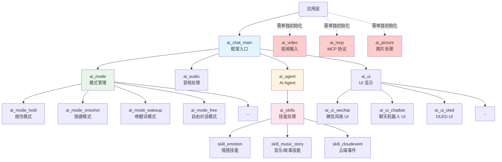
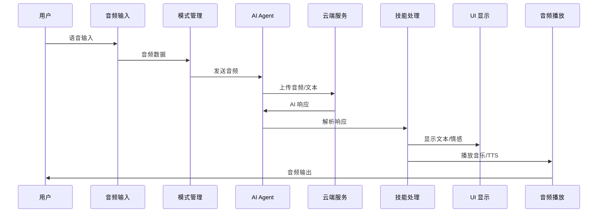
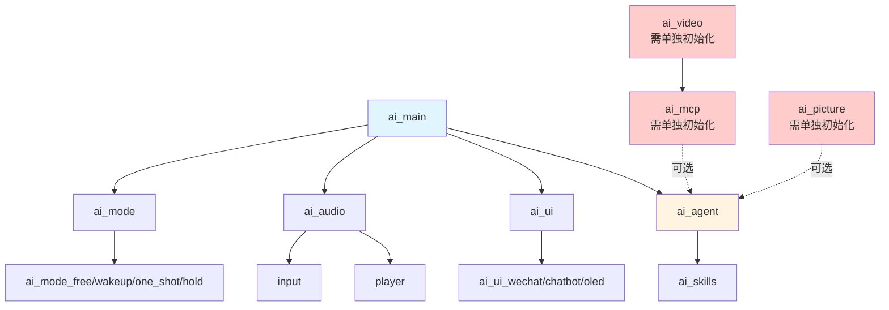

## 简介

`ai_components` 是 TuyaOpen AI 应用框架的核心组件库，提供了一套完整的 AI 聊天功能实现。该组件库采用模块化设计，支持多种聊天模式、音频处理、UI 显示、视频输入等功能，为开发者提供了快速构建 AI 智能设备的能力。

## 模块架构



## 核心模块

### ai_main - 框架入口

**功能**：AI 框架的主入口模块，负责统一初始化和管理各个 AI 组件。

**主要功能**：
- 统一初始化各个 AI 组件
- 模式注册和管理
- 事件处理和分发
- 配置管理和持久化
- 按键事件处理

### ai_mode - 模式管理

**功能**：管理不同的 AI 聊天模式，提供模式注册、切换和事件处理。

**支持的模式**：

- **按住模式**（Hold）：长按按键进行录音，松开停止
- **按键模式**（Oneshot）：单击按键进入监听状态
- **唤醒词模式**（Wakeup）：通过唤醒词触发，支持单轮对话
- **自由对话模式**（Free）：唤醒后持续监听，支持多轮对话
- **自定义模式**（Custom）: 开发者自行实现的模式

### ai_agent - AI Agent

**功能**：与涂鸦 AI 云端服务通信，处理语音输入、文本输入、文件输入等，并接收 AI 响应。

**主要功能**：

- 对 AI 的输入处理
- AI 响应处理（NLG、技能、云端事件）
- 云端提示音获取

### ai_skills - 技能处理

**功能**：处理 AI 模型返回的各种技能指令，包括情感表达、音乐播放、故事播放等。

**支持的技能**：
- **情感技能**：解析情感表达式，显示情感图标
- **音乐/故事技能**：解析音乐和故事数据，管理播放列表
- **播放控制技能**：处理播放、暂停、上一首、下一首等控制指令
- **云端事件**：处理云端推送的 TTS 播放等事件

### ai_audio - 音频处理

**功能**：处理音频输入输出，包括录音、播放、VAD、KWS 等功能。

**主要功能**：
- 音频输入采集和处理
- 音频输出播放（TTS、音乐、提示音等）
- 语音活动检测（VAD）
- 关键词唤醒（KWS）
- 音频格式转换和编码

### ai_ui - UI 显示

**功能**：统一管理和分发各种 UI 显示消息，支持多种 UI 风格。

**UI 风格**：
- **微信风格 UI**：类似微信聊天的气泡样式界面
- **聊天机器人 UI**：简洁的中央消息显示界面
- **OLED UI**：针对小尺寸 OLED 屏幕优化的界面

- **自定义 UI**：开发者自行实现界面

### ai_video - 视频输入

**功能**：处理摄像头数据采集、JPEG 编码和视频显示。

**主要功能**：
- 摄像头初始化和配置
- 原始帧采集
- JPEG 帧捕获（拍照功能）
- 视频显示控制

### ai_mcp - MCP 协议

**功能**：实现 Model Context Protocol（MCP）标准协议，支持 AI 模型与外部工具的交互。

**内嵌工具**：

- 查询设备信息
- 选择聊天模式
- 拍张照片给 AI 分析
- 调节设备音量

### utility - 工具模块

**功能**：提供通用工具函数，包括事件通知等。

**主要功能**：
- 用户事件通知系统
- 通用工具函数

### assets - 资源文件

**功能**：存放 UI 相关的资源文件，如字体、图标等。

## 数据流向



## 使用流程

### 集成到目标工程

#### 添加 CMakeLists.txt

在目标工程的 `CMakeLists.txt` 文件中添加 `ai_components` 子目录：

```cmake
# 在 CMakeLists.txt 中添加
add_subdirectory(${APP_PATH}/../ai_components)
```

**注意**：`${APP_PATH}/../ai_components` 是相对于目标工程路径的 `ai_components` 目录路径，请根据实际项目结构调整路径。

#### 添加 Kconfig

在目标工程的 `Kconfig` 文件中添加 `ai_components` 的配置菜单：

```kconfig
# 在 Kconfig 中添加
rsource "../ai_components/Kconfig"
```

**注意**：`../ai_components/Kconfig` 是相对于目标工程路径的 `ai_components/Kconfig` 文件路径，请根据实际项目结构调整路径。

### 配置组件

在目标工程路径下执行进入配置页面的命令：

```
tos.py config menu
```

根据实际需求打开对应功能选择合适的选项。

### 初始化框架

在应用启动时调用初始化函数：

```c
#include "ai_chat_main.h"

AI_CHAT_MODE_CFG_T cfg = {
    .default_mode = AI_CHAT_MODE_HOLD,
    .default_vol = 70,
    .evt_cb = user_event_callback,
};

ai_chat_init(&cfg);
```

### 初始化可选组件（按需）

如果需要使用视频、MCP 或图片功能，需要单独初始化：

```c
// 初始化视频模块（如果需要）
#if defined(ENABLE_COMP_AI_VIDEO) && (ENABLE_COMP_AI_VIDEO == 1)
#include "ai_video_input.h"

AI_VIDEO_CFG_T ai_video_cfg = {
    .disp_flush_cb = video_display_flush_callback,  // 显示刷新回调
};

ai_video_init(&ai_video_cfg);
#endif

// 初始化 MCP 模块（如果需要）
#if defined(ENABLE_COMP_AI_MCP) && (ENABLE_COMP_AI_MCP == 1)
#include "ai_mcp.h"

ai_mcp_init();
#endif

// 初始化图片模块（如果需要）
#if defined(ENABLE_COMP_AI_PICTURE) && (ENABLE_COMP_AI_PICTURE == 1)
#include "ai_picture_output.h"

AI_PICTURE_OUTPUT_CFG_T picture_cfg = {
    .notify_cb = picture_notify_callback,  // 通知回调
    .output_cb = picture_output_callback,  // 输出回调
};

ai_picture_output_init(&picture_cfg);
#endif
```

### 处理事件（可选）

通过注册的事件回调函数处理用户事件：

```c
void user_event_callback(AI_NOTIFY_EVENT_T *event)
{
    switch (event->type) {
        case AI_USER_EVT_ASR_OK:
            // 处理 ASR 识别结果
            break;
        case AI_USER_EVT_TEXT_STREAM_START:
            // 处理文本流开始
            break;
        // ... 其他事件
    }
}
```

## 模块依赖关系



## 配置说明

### 语言配置

支持中文和英文两种语言：

```kconfig
choice
    prompt "choose ai language"
    default ENABLE_AI_LANGUAGE_CHINESE

    config ENABLE_AI_LANGUAGE_CHINESE
        bool "Chinese"

    config ENABLE_AI_LANGUAGE_ENGLISH
        bool "English"
endchoice
```

### 组件配置

各子模块的配置项位于对应的 `Kconfig` 文件中：
- `ai_mode/Kconfig` - 模式相关配置
- `ai_audio/Kconfig` - 音频相关配置
- `ai_ui/Kconfig` - UI 相关配置
- `ai_video/Kconfig` - 视频相关配置
- `ai_mcp/Kconfig` - MCP 相关配置
- `ai_picture/Kconfig` - 图片相关配置

## 开发指南

### 快速开始

1. **集成到目标工程**：将编译文件和 Kconfig 文件集成到目标工程中。
2. **配置组件**：在 `Kconfig` 中启用需要的组件
3. **初始化框架**：调用 `ai_chat_init()` 初始化框架
4. **初始化可选组件**：按需初始化视频、MCP、图片模块
5. **等待连接**：等待 MQTT 连接，框架会自动初始化 AI Agent
6. **开始使用**：通过按键或唤醒词开始与 AI 交互

### 自定义开发

- **自定义 UI**：实现 `AI_UI_INTFS_T` 接口并注册到 `ai_ui_manage`
- **自定义模式**：实现 `AI_MODE_HANDLE_T` 接口并注册到 `ai_manage_mode`
- **自定义技能**：在 `ai_skills` 中添加新的技能处理逻辑
- **自定义 MCP 工具**：实现 MCP 工具接口并注册到 MCP 服务器
