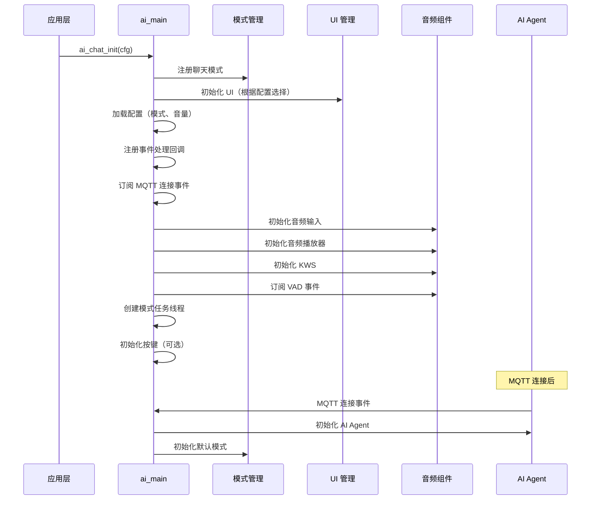
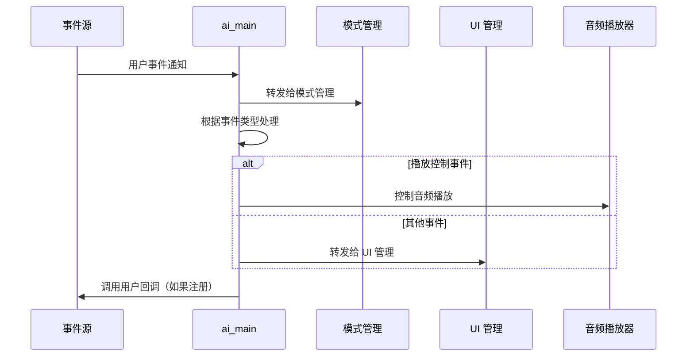
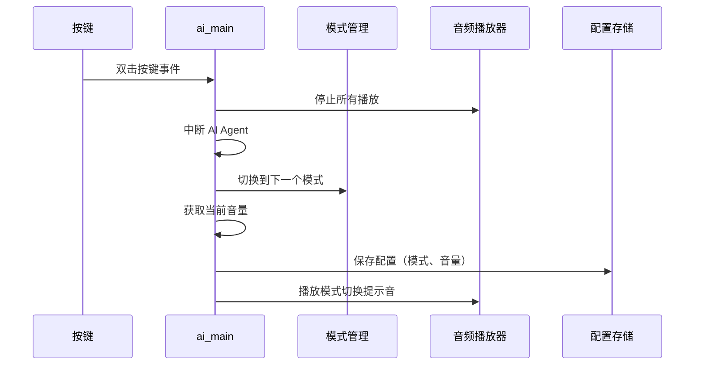

## 名词解释

| 名词 | 解释                                                         |
| ---- | ------------------------------------------------------------ |
| MQTT | 消息队列遥测传输协议（Message Queuing Telemetry Transport），用于设备与云端之间的通信。 |

## 功能简述

`ai_main` 是 TuyaOpen AI 应用框架的入口模块，负责统一初始化和管理各个 AI 组件。该模块提供了完整的 AI 聊天功能初始化流程，包括模式注册、音频输入输出、UI 显示、视频输入、按键处理等，是应用层使用 AI 框架的主要接口。

- **统一初始化**：统一管理各个 AI 组件的初始化，包括模式管理、音频、UI、视频等
- **模式注册**：根据配置自动注册启用的聊天模式（按住、按键、唤醒词、自由对话等）
- **事件处理**：统一处理用户事件，转发给模式管理和 UI 管理模块
- **配置管理**：支持聊天模式和音量的保存和加载，实现配置持久化
- **按键处理**：支持按键事件处理，双击切换聊天模式

## 工作流程

### 初始化流程

模块初始化时，依次注册聊天模式、初始化 UI、加载配置、初始化音频组件、创建模式任务线程等。



### 事件处理流程

用户事件通过事件系统发送后，模块将事件转发给模式管理和 UI 管理模块处理。



### 模式切换流程

用户双击按键时，模块切换到下一个聊天模式，并保存配置。



## 依赖组件

- **模式管理组件**（`ai_mode`）：必需，用于聊天模式管理
- **音频组件**（`ai_audio`）：可选，用于音频输入输出
- **UI 组件**（`ai_ui`）：可选，用于界面显示
- **按键组件**（`button`）：可选，用于按键事件处理
- **AI Agent**（`tuya_ai_service`）：必需，用于与云端 AI 服务通信

## 开发流程

### 数据结构

#### 聊天模式配置

```c
typedef struct {
    AI_CHAT_MODE_E        default_mode;  // 默认聊天模式
    int                   default_vol;   // 默认音量（0-100）
    AI_USER_EVENT_NOTIFY  evt_cb;        // 用户事件回调函数
} AI_CHAT_MODE_CFG_T;
```

### 接口说明

#### 初始化 AI 聊天模块

初始化 AI 聊天模块，注册模式、初始化 UI、加载配置、初始化音频组件等。确保在配置中启用了至少一个聊天模式，否则初始化会失败。

```c
/**
 * @brief Initialize AI chat module
 * @param cfg Chat mode configuration
 * @return OPERATE_RET Operation result code
 */
OPERATE_RET ai_chat_init(AI_CHAT_MODE_CFG_T *cfg);
```

#### 设置音量

设置聊天音量，并保存到配置中。

```c
/**
 * @brief Set chat volume
 * @param volume Volume value (0-100)
 * @return OPERATE_RET Operation result code
 */
OPERATE_RET ai_chat_set_volume(int volume);
```

#### 获取音量

获取当前聊天音量。

```c
/**
 * @brief Get chat volume
 * @return int Volume value (0-100)
 */
int ai_chat_get_volume(void);
```

### 开发步骤

1. **准备配置**：创建 `AI_CHAT_MODE_CFG_T` 结构，设置默认模式和音量
2. **初始化模块**：调用 `ai_chat_init()` 初始化 AI 聊天模块
3. **等待 MQTT 连接**：模块会自动在 MQTT 连接后初始化 AI Agent
4. **处理事件**：通过注册的事件回调函数处理用户事件（可选）

### 参考示例

#### 初始化和配置

```c
#include "ai_chat_main.h"

// 用户事件回调函数
void user_event_callback(AI_NOTIFY_EVENT_T *event)
{
    // 处理用户事件
    switch (event->type) {
        case AI_USER_EVT_ASR_OK:
            PR_NOTICE("ASR 识别成功");
            break;
        case AI_USER_EVT_TEXT_STREAM_START:
            PR_NOTICE("AI 文本流开始");
            break;
        // ... 其他事件处理
        default:
            break;
    }
}

// 初始化 AI 聊天模块
OPERATE_RET init_ai_chat(void)
{
    OPERATE_RET rt = OPRT_OK;
    
    AI_CHAT_MODE_CFG_T cfg = {
        .default_mode = AI_CHAT_MODE_HOLD,  // 默认使用按住模式
        .default_vol = 70,                   // 默认音量 70%
        .evt_cb = user_event_callback,      // 用户事件回调
    };
    
    TUYA_CALL_ERR_RETURN(ai_chat_init(&cfg));
    
    PR_NOTICE("AI 聊天模块初始化成功");
    
    return rt;
}
```

#### 音量控制

```c
// 设置音量
void set_chat_volume(int volume)
{
    if (volume < 0 || volume > 100) {
        PR_ERR("音量值无效: %d", volume);
        return;
    }
    
    OPERATE_RET rt = ai_chat_set_volume(volume);
    if (OPRT_OK == rt) {
        PR_NOTICE("设置音量成功: %d%%", volume);
    } else {
        PR_ERR("设置音量失败: %d", rt);
    }
}

// 获取音量
void get_chat_volume(void)
{
    int volume = ai_chat_get_volume();
    PR_NOTICE("当前音量: %d%%", volume);
}
```

