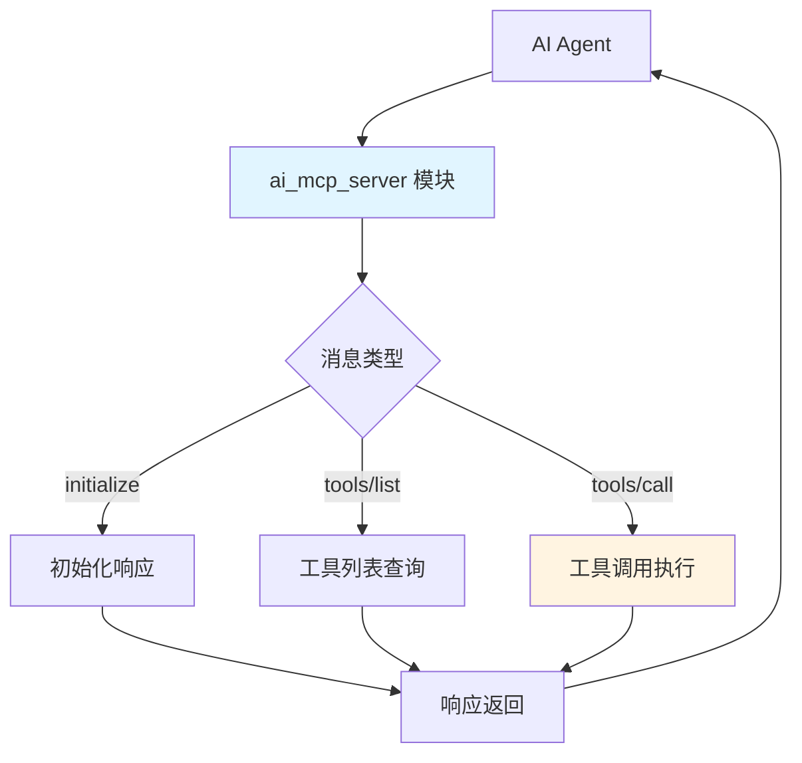
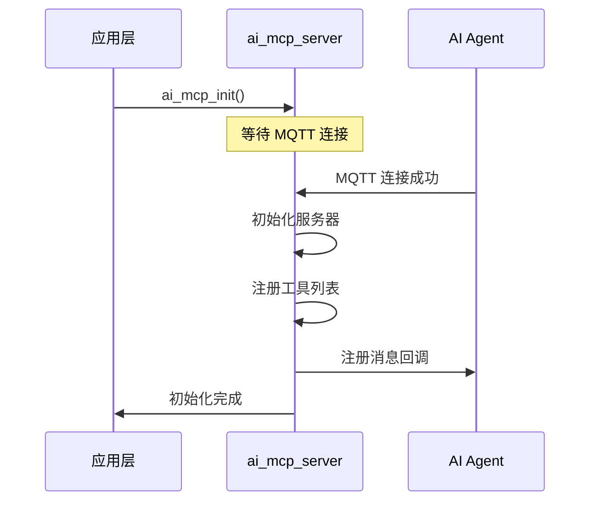
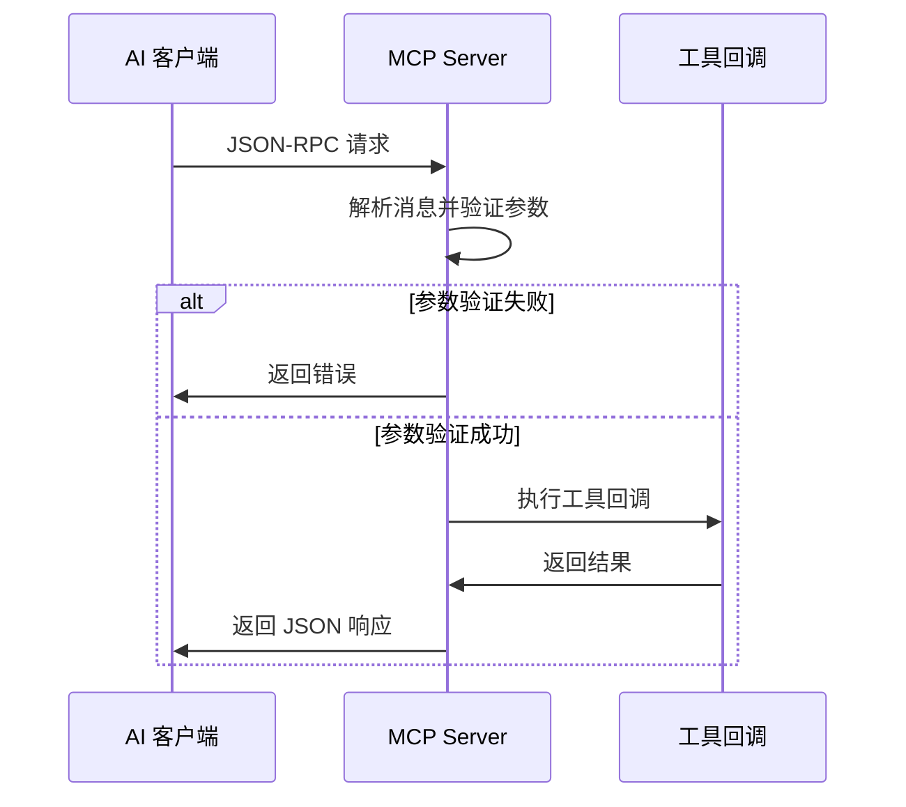
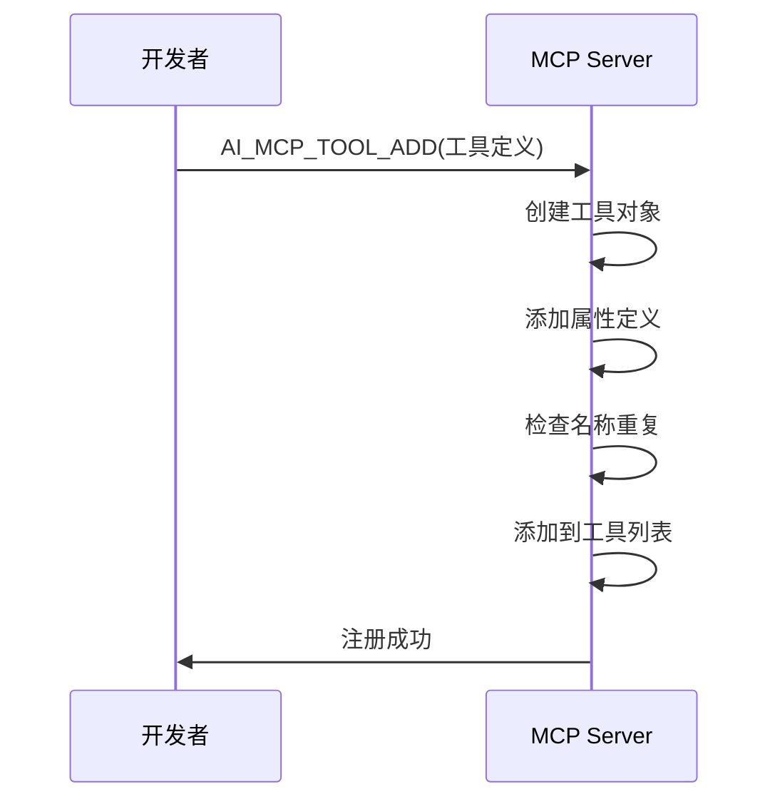

## 名词解释

| 名词 | 解释                                                         |
| ---- | ------------------------------------------------------------ |
| MCP  | Model Context Protocol（模型上下文协议）的缩写，是一种标准化的协议，用于 AI 模型与外部工具和服务进行交互。在本模块中，MCP Server 提供工具发现和执行能力。 |
| JSON-RPC | JSON Remote Procedure Call（JSON 远程过程调用）的缩写，是一种基于 JSON 的轻量级远程过程调用协议。MCP 使用 JSON-RPC 2.0 作为通信协议。 |
| Tool | 工具，是 MCP 协议中的核心概念。每个工具代表一个可执行的功能，包含名称、描述、输入参数定义和执行回调函数。 |
| Property | 属性，用于定义工具的输入参数。每个属性包含名称、类型、描述、默认值和范围限制等信息。 |

目前涂鸦支持 2 种方式接入 MCP 服务：

- **设备 MCP**：工具在设备端执行。设备作为 MCP Server 接入，涂鸦云会直接查询并调用设备提供的工具列表，本文就是描述设备 MCP 的接入方式。
- **自定义 MCP 服务**：工具在云端或外部服务器上执行。开发者在云端或外部服务器上部署 [自定义的 MCP 服务](https://developer.tuya.com/cn/docs/iot/custom-mcp?id=Kety4zbdvwdn8)，通过涂鸦平台进行配置和管理，AI 模型可以通过该服务调用云端工具和资源。

## 功能简述

`ai_mcp_server` 是 TuyaOpen AI 应用框架中的 MCP（Model Context Protocol）服务器实现，提供基于 JSON-RPC 2.0 的工具发现和执行能力。该模块允许 AI 模型通过标准化的协议调用设备功能，实现设备控制、信息查询等操作。

- **工具管理**：支持工具的注册、查找和管理
- **协议处理**：实现 JSON-RPC 2.0 协议的消息解析和响应
- **参数验证**：支持工具参数的验证，包括类型检查、范围验证和默认值处理
- **返回值处理**：支持多种返回类型（布尔值、整数、字符串、JSON、图片）


## 工作流程

### 模块架构图

MCP 服务器接收来自 AI Agent 的 JSON-RPC 消息，根据消息类型进行初始化、工具列表查询或工具调用处理，并将结果返回。



### 初始化流程

应用层调用初始化接口后，等待 MQTT 连接成功，然后初始化服务器并注册工具列表，完成 MCP 服务器的启动。



### 工具调用流程

客户端发送 JSON-RPC 请求后，服务器解析消息并验证参数，验证通过则执行工具回调并返回结果，验证失败则返回错误信息。



### 工具注册流程

开发者通过宏定义工具后，服务器创建工具对象、添加属性定义、检查名称重复，最后将工具添加到工具列表中完成注册。



## 配置说明

### 配置文件路径

```
ai_components/ai_mcp/Kconfig
```

### 功能使能

```
menuconfig ENABLE_COMP_AI_MCP
    bool "enable ai mcp module"
    default y
```

## 开发流程

### 数据结构

#### 属性类型

```c
typedef enum {
    MCP_PROPERTY_TYPE_BOOLEAN = 0,  // 布尔类型
    MCP_PROPERTY_TYPE_INTEGER,      // 整数类型
    MCP_PROPERTY_TYPE_STRING,       // 字符串类型
    MCP_PROPERTY_TYPE_MAX
} MCP_PROPERTY_TYPE_E;
```

#### 返回值类型

```c
typedef enum {
    MCP_RETURN_TYPE_BOOLEAN = 0,  // 布尔值
    MCP_RETURN_TYPE_INTEGER,      // 整数
    MCP_RETURN_TYPE_STRING,       // 字符串
    MCP_RETURN_TYPE_JSON,         // JSON 对象
    MCP_RETURN_TYPE_IMAGE,        // 图片（Base64 编码）
    MCP_RETURN_TYPE_MAX
} MCP_RETURN_TYPE_E;
```

#### 工具属性

```c
typedef struct {
    char *name;                    // 属性名称
    MCP_PROPERTY_TYPE_E type;      // 属性类型
    char *description;             // 属性描述
    bool has_default;              // 是否有默认值
    MCP_PROPERTY_VALUE_T default_val;  // 默认值
    bool has_range;                // 是否有范围限制
    int min_val;                   // 最小值（整数类型）
    int max_val;                   // 最大值（整数类型）
} MCP_PROPERTY_T;
```

#### 工具定义

```c
typedef struct ai_mcp_tool_s {
    char *name;                    // 工具名称
    char *description;              // 工具描述
    MCP_PROPERTY_LIST_T properties; // 输入属性列表
    MCP_TOOL_CALLBACK callback;     // 执行回调函数
    void *user_data;               // 用户数据
    struct ai_mcp_tool_s *next;    // 下一个工具（链表）
} MCP_TOOL_T;
```

#### 返回值

```c
typedef struct {
    MCP_RETURN_TYPE_E type;        // 返回值类型
    union {
        bool bool_val;             // 布尔值
        int int_val;               // 整数值
        char *str_val;             // 字符串值
        cJSON *json_val;           // JSON 对象
        struct {
            char *mime_type;       // MIME 类型
            char *data;             // Base64 编码的数据
            uint32_t data_len;      // 数据长度
        } image_val;               // 图片数据
    };
} MCP_RETURN_VALUE_T;
```

#### 工具回调函数

```c
typedef OPERATE_RET (*MCP_TOOL_CALLBACK)(
    const MCP_PROPERTY_LIST_T *properties,  // 输入属性
    MCP_RETURN_VALUE_T *ret_val,            // 返回值（由回调函数填充）
    void *user_data                         // 用户数据
);
```

### 接口说明

#### 初始化 MCP 服务器

初始化 MCP 服务器，设置服务器名称和版本，并注册消息处理回调。

```c
/**
 * @brief Initialize MCP server
 * @param name Server name (board name)
 * @param version Server version
 * @return OPERATE_RET Operation result
 */
OPERATE_RET ai_mcp_server_init(const char *name, const char *version);
```

#### 销毁 MCP 服务器

释放 MCP 服务器资源，销毁所有已注册的工具。

```c
/**
 * @brief Destroy MCP server
 */
void ai_mcp_server_destroy(void);
```

#### 创建工具

创建一个新的工具对象。

```c
/**
 * @brief Create a new tool
 * @param name Tool name
 * @param description Tool description
 * @param callback Tool execution callback
 * @param user_data User data passed to callback
 * @return Pointer to new tool, NULL on allocation failure
 */
MCP_TOOL_T *ai_mcp_tool_create(const char *name, const char *description,
                                 MCP_TOOL_CALLBACK callback, void *user_data);
```

#### 注册工具（宏）

使用宏快速创建并注册工具，支持可变参数定义属性。

```c
/**
 * @brief Macro to create and register a new tool with properties
 * @param name Tool name
 * @param description Tool description
 * @param callback Tool execution callback
 * @param user_data User data passed to callback
 * @param ... Variable arguments of MCP_PROPERTY_DEF_T* ending with MCP_PROP_END
 * @return OPRT_OK on success, error code on failure
 */
#define AI_MCP_TOOL_ADD(name, description, callback, user_data, ...)
```

#### 添加工具到服务器

将工具添加到服务器，工具的所有权转移给服务器。

```c
/**
 * @brief Add tool to server
 * @param tool Tool to add (ownership transferred to server)
 * @return OPERATE_RET Operation result
 */
OPERATE_RET ai_mcp_server_add_tool(MCP_TOOL_T *tool);
```

#### 查找工具

根据名称查找已注册的工具。

```c
/**
 * @brief Find tool by name
 * @param name Tool name
 * @return Pointer to tool if found, NULL otherwise
 */
MCP_TOOL_T *ai_mcp_server_find_tool(const char *name);
```

#### 解析消息

解析并处理来自客户端的 JSON-RPC 消息。

```c
/**
 * @brief Parse and handle MCP message
 * @param json JSON-RPC message object
 * @param user_data User data (currently unused)
 * @return OPERATE_RET Operation result
 */
OPERATE_RET ai_mcp_server_parse_message(const cJSON *json, void *user_data);
```

#### 设置返回值

设置工具回调函数的返回值。

```c
// 设置布尔值
void ai_mcp_return_value_set_bool(MCP_RETURN_VALUE_T *ret_val, bool value);

// 设置整数值
void ai_mcp_return_value_set_int(MCP_RETURN_VALUE_T *ret_val, int value);

// 设置字符串值
OPERATE_RET ai_mcp_return_value_set_str(MCP_RETURN_VALUE_T *ret_val, const char *value);

// 设置 JSON 值
void ai_mcp_return_value_set_json(MCP_RETURN_VALUE_T *ret_val, cJSON *json);

// 设置图片值（Base64 编码）
OPERATE_RET ai_mcp_return_value_set_image(MCP_RETURN_VALUE_T *ret_val,
                                            const char *mime_type,
                                            const void *data, uint32_t data_len);
```

#### 清理返回值

清理返回值中动态分配的内存。

```c
/**
 * @brief Clean up return value
 * @param ret_val Return value to clean up
 */
void ai_mcp_return_value_cleanup(MCP_RETURN_VALUE_T *ret_val);
```

### 属性定义宏

模块提供了一系列宏来简化属性的定义：

```c
// 整数属性（无默认值，无范围）
MCP_PROP_INT(name, desc)

// 整数属性（有默认值）
MCP_PROP_INT_DEF(name, desc, def_val)

// 整数属性（有范围限制）
MCP_PROP_INT_RANGE(name, desc, min, max)

// 整数属性（有默认值和范围限制）
MCP_PROP_INT_DEF_RANGE(name, desc, def_val, min, max)

// 布尔属性
MCP_PROP_BOOL(name, desc)

// 布尔属性（有默认值）
MCP_PROP_BOOL_DEF(name, desc, def_val)

// 字符串属性
MCP_PROP_STR(name, desc)

// 字符串属性（有默认值）
MCP_PROP_STR_DEF(name, desc, def_val)
```

### 开发步骤

1. **初始化 MCP 服务器**：在应用启动时调用 `ai_mcp_server_init()` 初始化服务器
2. **注册工具**：使用 `AI_MCP_TOOL_ADD` 宏注册自定义工具
3. **实现工具回调**：实现工具的执行逻辑，设置返回值
4. **处理消息**：确保 `ai_mcp_server_parse_message()` 已注册到 AI Agent 的消息回调中

### 参考示例

#### 初始化 MCP 服务器

```c
#include "ai_mcp_server.h"

OPERATE_RET init_mcp_server(void)
{
    OPERATE_RET rt = OPRT_OK;
    
    // 初始化 MCP 服务器
    TUYA_CALL_ERR_RETURN(ai_mcp_server_init("Tuya MCP Server", "1.0"));
    
    // 注册工具（见下方示例）
    // ...
    
    return rt;
}
```

#### 注册简单工具（无参数）

```c
// 工具回调函数
static OPERATE_RET get_device_info_cb(const MCP_PROPERTY_LIST_T *properties, 
                                       MCP_RETURN_VALUE_T *ret_val, 
                                       void *user_data)
{
    cJSON *json = cJSON_CreateObject();
    if (!json) {
        return OPRT_MALLOC_FAILED;
    }
    
    cJSON_AddStringToObject(json, "model", PROJECT_NAME);
    cJSON_AddStringToObject(json, "version", PROJECT_VERSION);
    
    ai_mcp_return_value_set_json(ret_val, json);
    return OPRT_OK;
}

// 注册工具
OPERATE_RET register_tools(void)
{
    TUYA_CALL_ERR_RETURN(AI_MCP_TOOL_ADD(
        "device_info_get",
        "Get device information such as model, serial number, and firmware version.",
        get_device_info_cb,
        NULL
    ));
    
    return OPRT_OK;
}
```

#### 注册带参数的工具

```c
// 设置音量工具回调
static OPERATE_RET set_volume_cb(const MCP_PROPERTY_LIST_T *properties, 
                                  MCP_RETURN_VALUE_T *ret_val, 
                                  void *user_data)
{
    int volume = 50; // 默认音量
    
    // 从属性列表中获取音量值
    for (int i = 0; i < properties->count; i++) {
        MCP_PROPERTY_T *prop = properties->properties[i];
        if (strcmp(prop->name, "volume") == 0 && 
            prop->type == MCP_PROPERTY_TYPE_INTEGER) {
            volume = prop->default_val.int_val;
            break;
        }
    }
    
    // 执行设置音量操作
    ai_audio_player_set_vol(volume);
    
    // 设置返回值
    ai_mcp_return_value_set_bool(ret_val, TRUE);
    
    return OPRT_OK;
}

// 注册工具（带整数参数，有范围限制）
OPERATE_RET register_volume_tool(void)
{
    TUYA_CALL_ERR_RETURN(AI_MCP_TOOL_ADD(
        "device_audio_volume_set",
        "Sets the device's volume level.\n"
        "Parameters:\n"
        "- volume (int): The volume level to set (0-100).\n"
        "Response:\n"
        "- Returns true if the volume was set successfully.",
        set_volume_cb,
        NULL,
        MCP_PROP_INT_RANGE("volume", "The volume level to set (0-100).", 0, 100)
    ));
    
    return OPRT_OK;
}
```

#### 注册带多个参数的工具

```c
// 拍照工具回调
static OPERATE_RET take_photo_cb(const MCP_PROPERTY_LIST_T *properties, 
                                 MCP_RETURN_VALUE_T *ret_val, 
                                 void *user_data)
{
    OPERATE_RET rt = OPRT_OK;
    uint8_t *image_data = NULL;
    uint32_t image_size = 0;
    int count = 1;
    
    // 解析参数
    for (int i = 0; i < properties->count; i++) {
        MCP_PROPERTY_T *prop = properties->properties[i];
        if (strcmp(prop->name, "count") == 0 && 
            prop->type == MCP_PROPERTY_TYPE_INTEGER) {
            count = prop->default_val.int_val;
        }
    }
    
    // 启动视频显示
    TUYA_CALL_ERR_RETURN(ai_video_display_start());
    tal_system_sleep(3000);
    
    // 获取 JPEG 帧
    rt = ai_video_get_jpeg_frame(&image_data, &image_size);
    if (OPRT_OK != rt) {
        ai_video_display_stop();
        return rt;
    }
    
    // 设置返回值（图片）
    rt = ai_mcp_return_value_set_image(ret_val, 
                                        MCP_IMAGE_MIME_TYPE_JPEG, 
                                        image_data, 
                                        image_size);
    
    ai_video_jpeg_image_free(&image_data);
    ai_video_display_stop();
    
    return rt;
}

// 注册工具（带多个参数）
OPERATE_RET register_photo_tool(void)
{
    TUYA_CALL_ERR_RETURN(AI_MCP_TOOL_ADD(
        "device_camera_take_photo",
        "Activates the device's camera to capture one or more photos.\n"
        "Parameters:\n"
        "- count (int): Number of photos to capture (1-10).\n"
        "Response:\n"
        "- Returns the captured photos encoded in Base64 format.",
        take_photo_cb,
        NULL,
        MCP_PROP_STR("question", "The question prompting the photo capture."),
        MCP_PROP_INT_DEF_RANGE("count", "Number of photos to capture (1-10).", 1, 1, 10)
    ));
    
    return OPRT_OK;
}
```

#### 返回不同类型的值

```c
// 返回布尔值
static OPERATE_RET tool_return_bool(const MCP_PROPERTY_LIST_T *properties, 
                                     MCP_RETURN_VALUE_T *ret_val, 
                                     void *user_data)
{
    ai_mcp_return_value_set_bool(ret_val, TRUE);
    return OPRT_OK;
}

// 返回整数值
static OPERATE_RET tool_return_int(const MCP_PROPERTY_LIST_T *properties, 
                                   MCP_RETURN_VALUE_T *ret_val, 
                                   void *user_data)
{
    ai_mcp_return_value_set_int(ret_val, 100);
    return OPRT_OK;
}

// 返回字符串值
static OPERATE_RET tool_return_string(const MCP_PROPERTY_LIST_T *properties, 
                                      MCP_RETURN_VALUE_T *ret_val, 
                                      void *user_data)
{
    ai_mcp_return_value_set_str(ret_val, "Success");
    return OPRT_OK;
}

// 返回 JSON 对象
static OPERATE_RET tool_return_json(const MCP_PROPERTY_LIST_T *properties, 
                                    MCP_RETURN_VALUE_T *ret_val, 
                                    void *user_data)
{
    cJSON *json = cJSON_CreateObject();
    if (!json) {
        return OPRT_MALLOC_FAILED;
    }
    
    cJSON_AddStringToObject(json, "status", "ok");
    cJSON_AddNumberToObject(json, "code", 200);
    
    ai_mcp_return_value_set_json(ret_val, json);
    return OPRT_OK;
}
```

