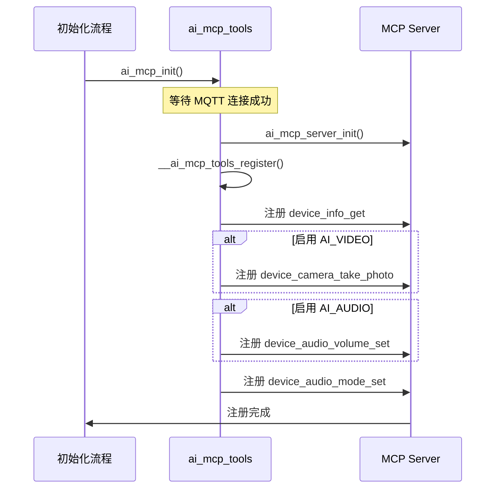
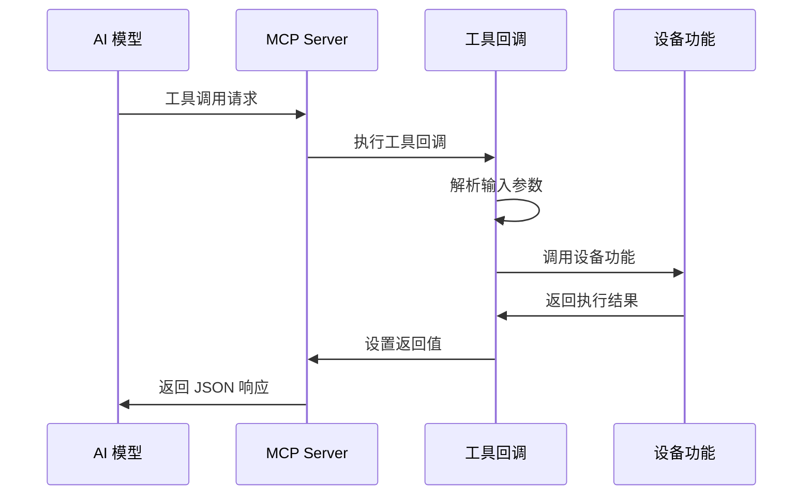

## 名词解释

| 名词 | 解释 |
| ---- | ------------------------------------------------------------ |
| MCP Tool | MCP 工具，是设备端提供给 AI 模型调用的功能接口。每个工具代表一个可执行的功能，包含名称、描述、输入参数定义和执行回调函数。 |

## 功能简述

`ai_mcp_tools` 是 TuyaOpen AI 应用框架中预定义的 MCP 工具集合，提供了设备信息查询、设备控制等基础功能。该模块在 MCP 服务器初始化时自动注册这些工具，使 AI 模型能够通过标准化的协议调用设备功能。

### 工具列表

- **查询设备信息查询**

  - 功能：获取设备的基本信息，包括设备型号、序列号和固件版本

  - 返回：JSON 格式的设备信息

- **拍照**（需启用 `ENABLE_COMP_AI_VIDEO`）

  - 功能：激活设备摄像头拍摄照片，拍摄一张照片并返回给 AI 。AI 会对接收的图片进行分析。

  - 返回：Base64 编码的 JPEG 图片数据

- **设置音量**（需启用 `ENABLE_COMP_AI_AUDIO`）

  - 功能：设置设备的音量级别，范围 0-100

  - 返回：布尔值，表示设置是否成功

- **设置聊天模式**

  - 功能：切换设备的 AI 聊天模式，支持四种模式：长按模式、按键模式、唤醒词模式、自由对话模式

  - 返回：布尔值，表示设置是否成功

## 工作流程

### 工具注册流程

在 MCP 服务器初始化时，模块会自动注册所有可用的工具。工具注册顺序为：设备信息查询工具 → 视频工具（如果启用）→ 音频工具（如果启用）→ 模式设置工具。



### 工具调用流程

AI 模型通过 MCP 协议调用工具时，工具回调函数会解析参数、执行相应操作并返回结果。



## 配置说明

### 配置文件路径

```
ai_components/ai_mcp/Kconfig
```

### 功能使能

工具模块的可用性依赖于相关组件的使能状态：

```
# MCP 模块使能
menuconfig ENABLE_COMP_AI_MCP
    bool "enable ai mcp module"
    default y
```

## 开发流程

### 接口说明

#### 初始化 MCP 工具模块

在应用启动时调用，会自动订阅 MQTT 连接事件，在连接成功后初始化 MCP 服务器并注册所有工具。

```c
/**
 * @brief Initialize MCP tools module
 * @return OPERATE_RET Operation result
 */
OPERATE_RET ai_mcp_init(void);
```

#### 反初始化 MCP 工具模块

释放 MCP 服务器资源，销毁所有已注册的工具。

```c
/**
 * @brief Deinitialize MCP tools module
 * @return OPERATE_RET Operation result
 */
OPERATE_RET ai_mcp_deinit(void);
```

### 开发步骤

1. **确保 MCP 模块已使能**：在配置中启用 `ENABLE_COMP_AI_MCP`
2. **按需启用相关组件**：
   - 如需使用拍照功能，启用 `ENABLE_COMP_AI_VIDEO`
   - 如需使用音量控制，启用 `ENABLE_COMP_AI_AUDIO`
3. **调用初始化接口**：在应用启动时调用 `ai_mcp_init()`
5. **AI 模型调用**：AI 会根据你的输入内容分析意图，然后通过 MCP 协议调用这些工具


