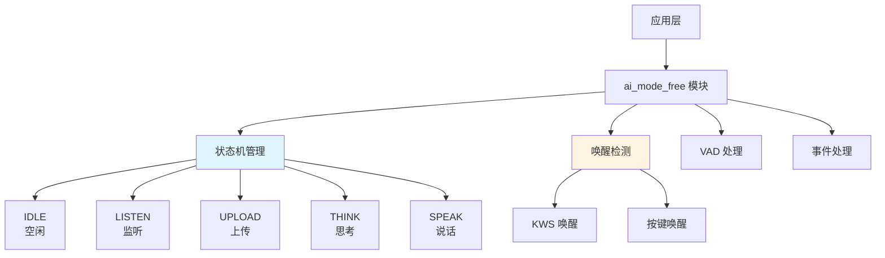
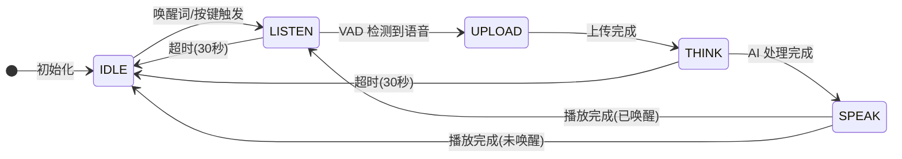
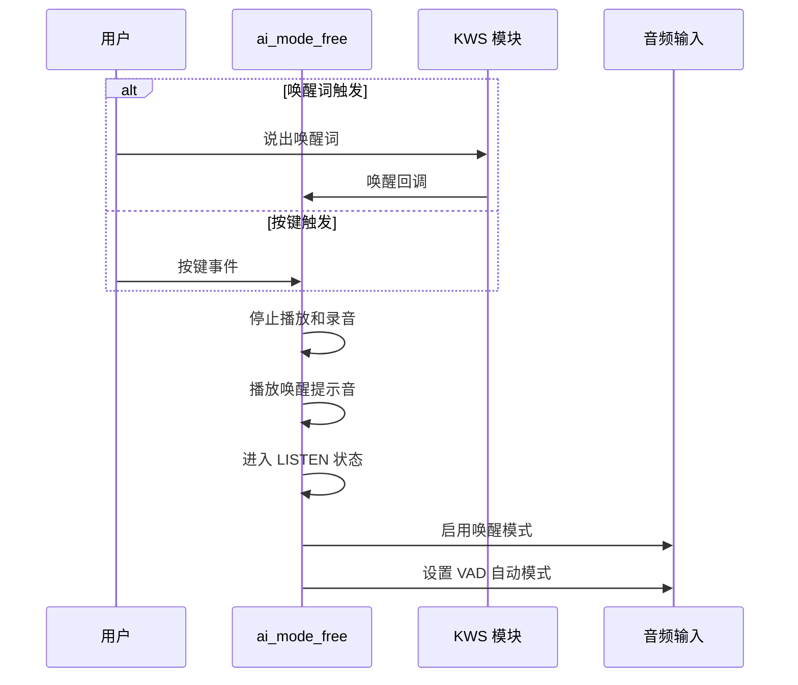
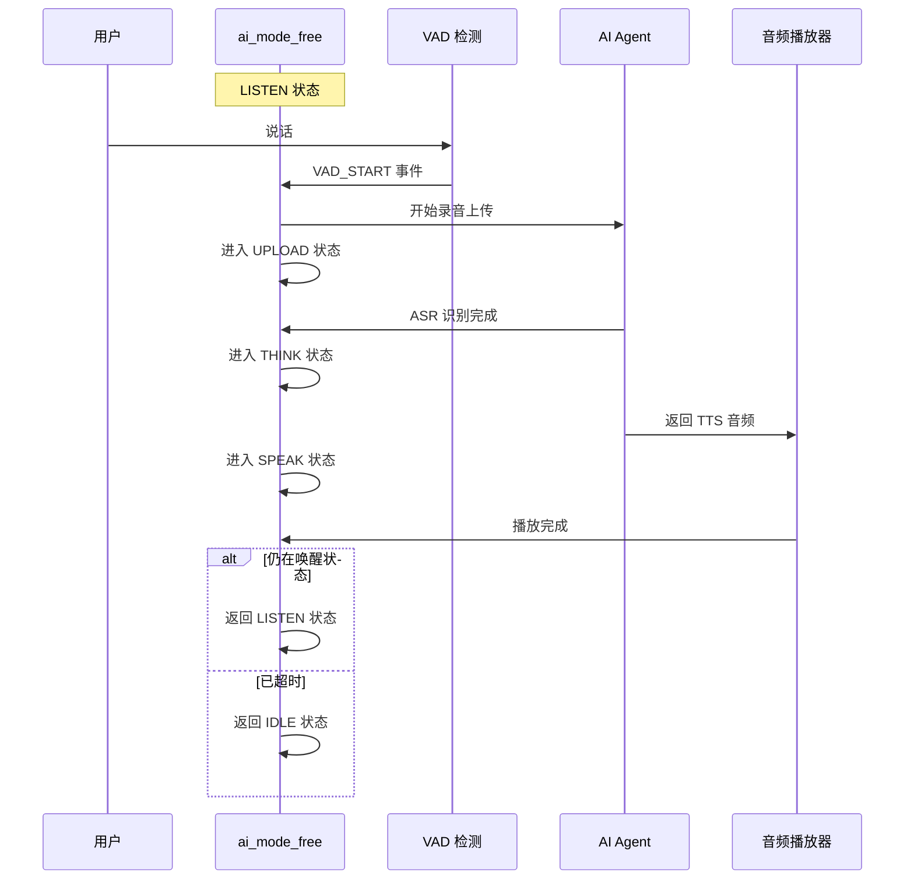

## 名词解释

| 名词 | 解释                                                         |
| ---- | ------------------------------------------------------------ |
| KWS  | 关键词唤醒（Keyword Spotting），用于检测特定的唤醒词，触发设备进入监听状态。 |
| VAD  | 语音活动检测（Voice Activity Detection），用于检测是否有语音输入。 |

## 功能简述

`ai_mode_free` 是 TuyaOpen AI 应用框架中的自由对话模式实现，提供了一种自然的语音交互方式。用户通过唤醒词或按键触发后，设备进入持续监听状态，可以在一定时间内（默认 30 秒）自由进行多轮对话，无需每次交互都重新触发。

- **唤醒机制**：支持关键词唤醒（KWS）和按键唤醒两种方式
- **持续监听**：唤醒后进入持续监听状态，支持多轮对话
- **自动超时**：在无语音活动或播放完成后，自动超时（默认 30 秒）返回空闲状态
- **LED 指示**：不同状态显示不同的 LED 效果（需启用 LED 组件）
  - 空闲：LED 关闭
  - 聆听：LED 闪烁（500ms）
  - 思考：LED 闪烁（2000ms）
  - 说话：LED 常亮

## 工作流程

### 模块架构图



### 状态机流程

自由对话模式通过状态机管理整个交互流程，从空闲状态开始，通过唤醒进入监听，完成语音交互后根据情况返回监听或空闲状态。



### 唤醒流程

用户可以通过唤醒词或按键两种方式触发自由对话模式。



### 语音交互流程

唤醒后，设备自动通过 VAD 检测语音活动，完成一轮完整的语音交互。



## 配置说明

### 配置文件路径

```
ai_components/ai_mode/Kconfig
```

### 功能使能

```
menuconfig ENABLE_COMP_AI_PRESENT_MODE
    bool "enable ai present mode"
    default y

config ENABLE_COMP_AI_MODE_FREE
    bool "enable ai mode free"
    default y
```

### 依赖组件

- **音频组件**（`ENABLE_COMP_AI_AUDIO`）：必需，用于音频输入输出和 VAD 检测
- **LED 组件**（`ENABLE_LED`）：可选，用于状态指示
- **按键组件**（`ENABLE_BUTTON`）：可选，用于按键唤醒功能

## 开发流程

### 接口说明

#### 注册自由对话模式

将自由对话模式注册到模式管理器中。

```c
/**
 * @brief Register free mode
 * @return OPERATE_RET Operation result
 */
OPERATE_RET ai_mode_free_register(void);
```

### 开发步骤

1. **注册模式**：在应用启动时调用 `ai_mode_free_register()` 注册自由对话模式
2. **初始化模式**：通过 `ai_mode_init(AI_CHAT_MODE_FREE)` 初始化自由对话模式
3. **运行模式任务**：在任务循环中调用 `ai_mode_task_running()` 运行状态机
4. **处理事件**：确保用户事件、VAD 状态变化、按键事件等已正确转发到模式管理器

### 参考示例

#### 注册和初始化

```c
#include "ai_mode_free.h"
#include "ai_manage_mode.h"

// 注册自由对话模式
OPERATE_RET register_free_mode(void)
{
    OPERATE_RET rt = OPRT_OK;
    
    // 注册自由对话模式
    TUYA_CALL_ERR_RETURN(ai_mode_free_register());
    
    return rt;
}

// 初始化自由对话模式
OPERATE_RET init_free_mode(void)
{
    OPERATE_RET rt = OPRT_OK;
    
    // 初始化自由对话模式
    TUYA_CALL_ERR_RETURN(ai_mode_init(AI_CHAT_MODE_FREE));
    
    return rt;
}
```

#### 模式切换

```c
// 切换到自由对话模式
void switch_to_free_mode(void)
{
    OPERATE_RET rt = ai_mode_switch(AI_CHAT_MODE_FREE);
    if (OPRT_OK == rt) {
        PR_NOTICE("切换到自由对话模式");
    } else {
        PR_ERR("切换模式失败: %d", rt);
    }
}
```

#### 查询模式状态

```c
void query_free_mode_state(void)
{
    AI_MODE_STATE_E state = ai_mode_get_state();
    PR_NOTICE("自由对话模式当前状态: %s", ai_get_mode_state_str(state));
}
```

