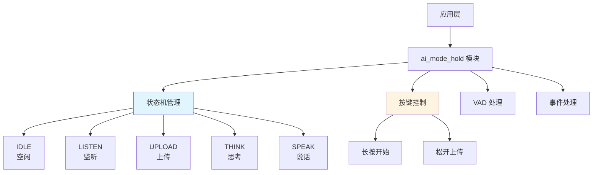
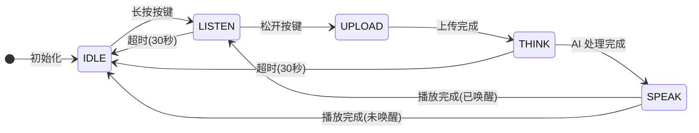
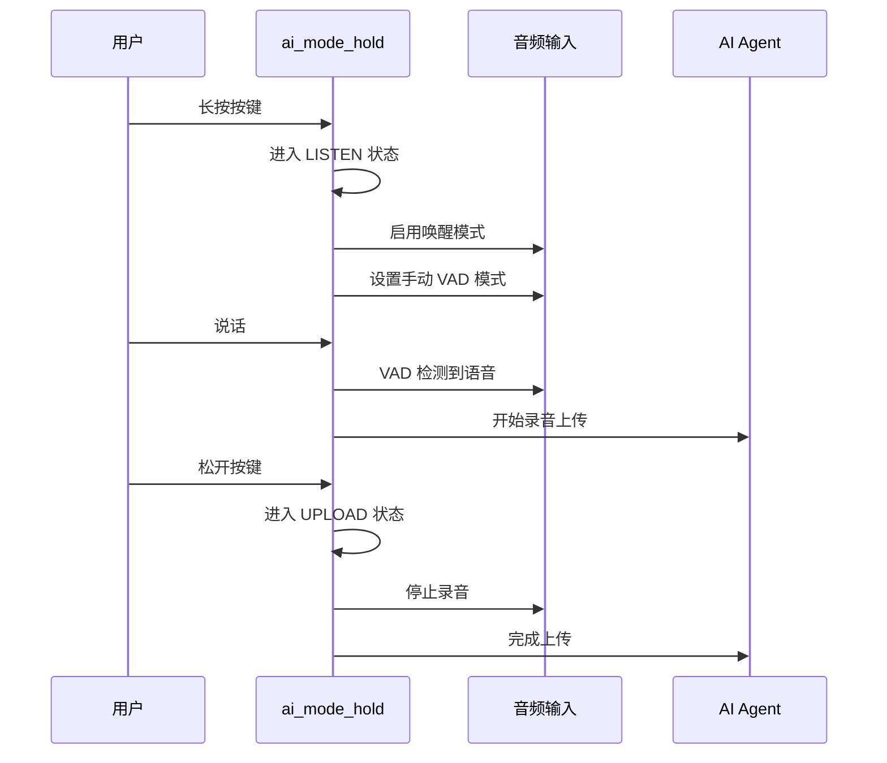
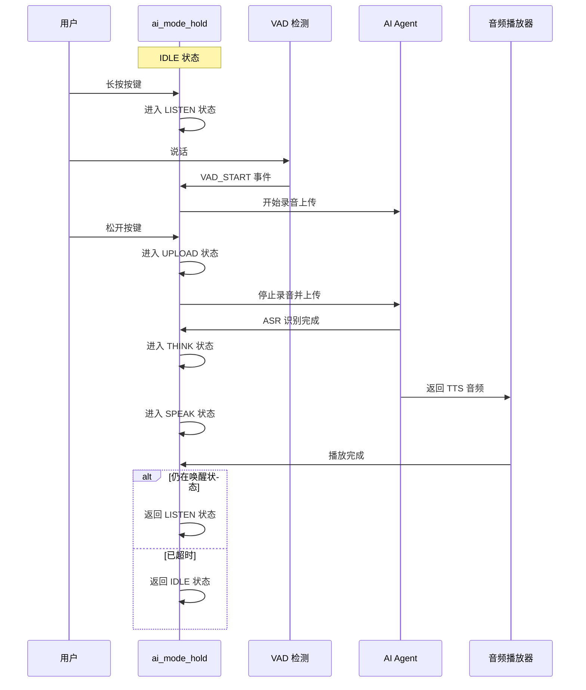

## 名词解释

| 名词 | 解释                                                         |
| ---- | ------------------------------------------------------------ |
| VAD  | 语音活动检测（Voice Activity Detection），用于检测是否有语音输入。 |

## 功能简述

`ai_mode_hold` 是 TuyaOpen AI 应用框架中的长按模式实现，提供了一种需要用户主动控制的语音交互方式。用户需要长按按键才能进行录音，松开按键后停止录音并上传，适合需要精确控制录音时长的场景。

- **按键控制**：长按按键开始录音，松开按键停止录音并上传。由用户按键控制录音，不依赖自动语音检测。
- **自动超时**：在无语音活动或播放完成后，自动超时（默认 30 秒）返回空闲状态
- **LED 指示**：不同状态显示不同的 LED 效果（需启用 LED 组件）
  - 空闲：LED 关闭
  - 聆听：LED 闪烁（500ms）
  - 思考：LED 闪烁（2000ms）
  - 说话：LED 常亮

## 工作流程

### 模块架构图



### 状态机流程

长按模式通过状态机管理整个交互流程，从空闲状态开始，通过长按按键进入监听，松开按键后上传，完成语音交互后根据情况返回监听或空闲状态。



### 按键交互流程

用户通过长按按键触发录音，松开按键后停止录音并上传。



### 语音交互流程

长按按键后，设备开始录音，松开按键后停止录音并上传，完成一轮完整的语音交互。



## 配置说明

### 配置文件路径

```
ai_components/ai_mode/Kconfig
```

### 功能使能

```
menuconfig ENABLE_COMP_AI_PRESENT_MODE
    bool "enable ai present mode"
    default y

config ENABLE_COMP_AI_MODE_HOLD
    bool "enable ai mode hold"
    default y
```

### 依赖组件

- **音频组件**（`ENABLE_COMP_AI_AUDIO`）：必需，用于音频输入输出和 VAD 检测
- **LED 组件**（`ENABLE_LED`）：可选，用于状态指示
- **按键组件**（`ENABLE_BUTTON`）：必需，用于按键控制功能

## 开发流程

### 接口说明

#### 注册长按模式

将长按模式注册到模式管理器中。

```c
/**
 * @brief Register hold mode
 * @return OPERATE_RET Operation result
 */
OPERATE_RET ai_mode_hold_register(void);
```

### 开发步骤

1. **注册模式**：在应用启动时调用 `ai_mode_hold_register()` 注册长按模式
2. **初始化模式**：通过 `ai_mode_init(AI_CHAT_MODE_HOLD)` 初始化长按模式
3. **运行模式任务**：在任务循环中调用 `ai_mode_task_running()` 运行状态机
4. **处理事件**：确保用户事件、VAD 状态变化、按键事件等已正确转发到模式管理器

### 参考示例

#### 注册和初始化

```c
#include "ai_mode_hold.h"
#include "ai_manage_mode.h"

// 注册长按模式
OPERATE_RET register_hold_mode(void)
{
    OPERATE_RET rt = OPRT_OK;
    
    // 注册长按模式
    TUYA_CALL_ERR_RETURN(ai_mode_hold_register());
    
    return rt;
}

// 初始化长按模式
OPERATE_RET init_hold_mode(void)
{
    OPERATE_RET rt = OPRT_OK;
    
    // 初始化长按模式
    TUYA_CALL_ERR_RETURN(ai_mode_init(AI_CHAT_MODE_HOLD));
    
    return rt;
}
```

#### 模式切换

```c
// 切换到长按模式
void switch_to_hold_mode(void)
{
    OPERATE_RET rt = ai_mode_switch(AI_CHAT_MODE_HOLD);
    if (OPRT_OK == rt) {
        PR_NOTICE("切换到长按模式");
    } else {
        PR_ERR("切换模式失败: %d", rt);
    }
}
```

#### 查询模式状态

```c
void query_hold_mode_state(void)
{
    AI_MODE_STATE_E state = ai_mode_get_state();
    PR_NOTICE("长按模式当前状态: %s", ai_get_mode_state_str(state));
}
```

