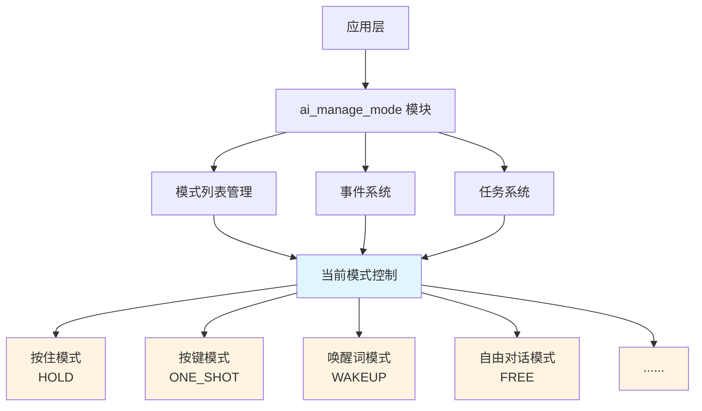
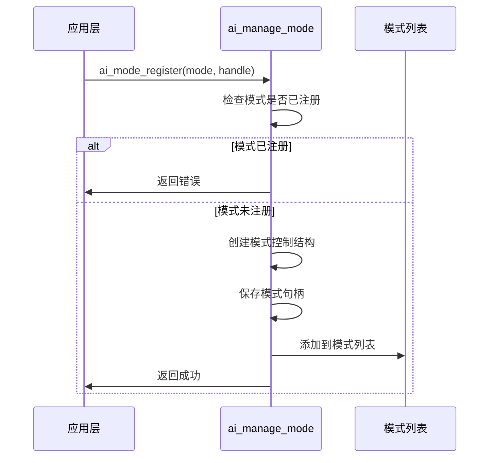
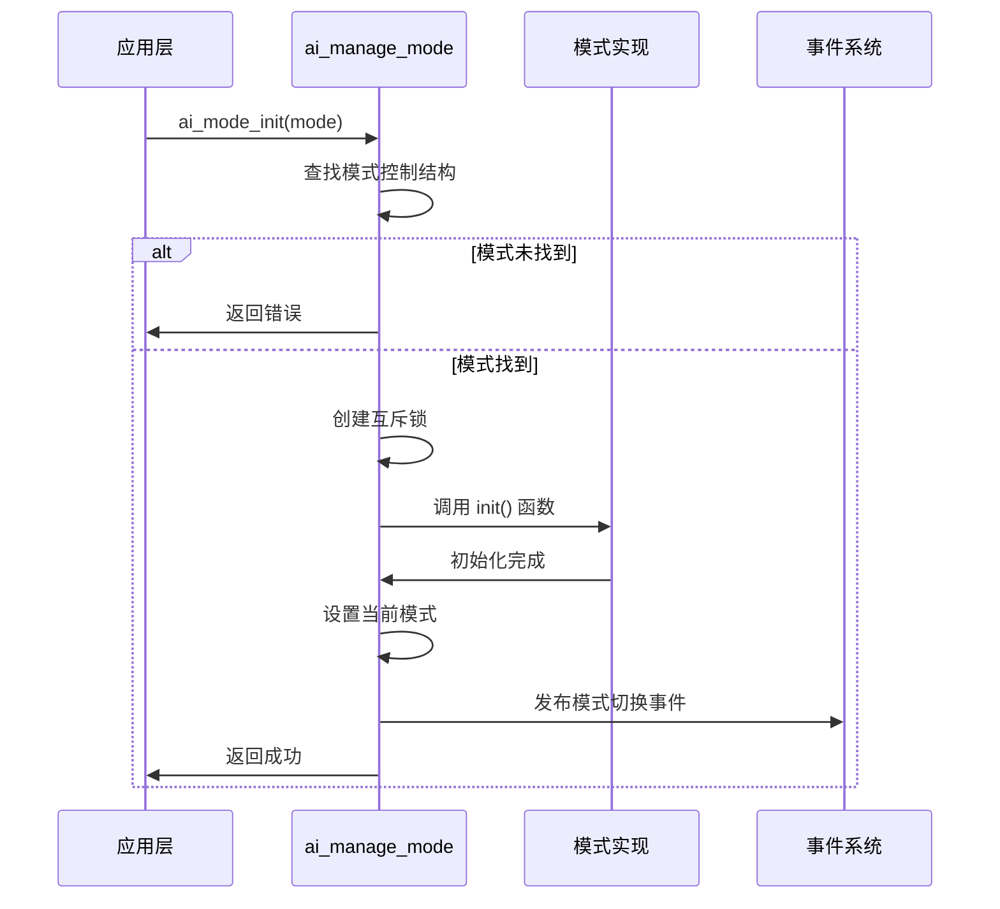
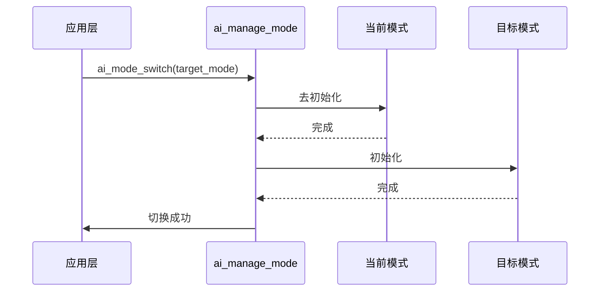
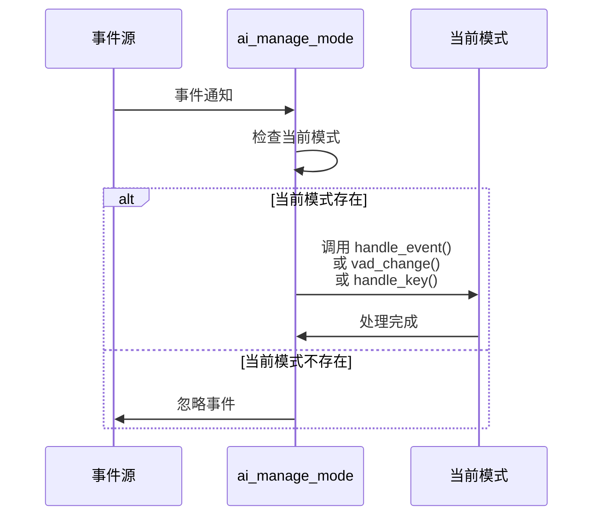
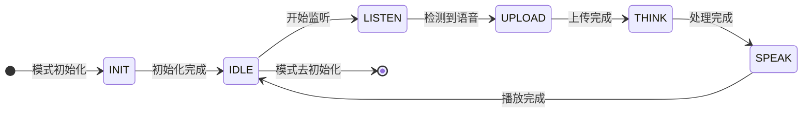

## 名词解释

| 名词 | 解释 |
| ---- | ------------------------------------------------------------ |
| AI 聊天模式 | AI 设备的交互模式，定义了用户如何与设备进行语音交互。包括按住模式、按键模式、唤醒词模式和自由对话模式。 |
| VAD | 语音活动检测（Voice Activity Detection），用于检测是否有语音输入。 |

## 功能简述

`ai_manage_mode` 是 TuyaOpen AI 应用框架中的聊天模式管理组件，负责管理不同的 AI 聊天模式，提供模式注册、初始化、切换和事件处理等功能。

### 模式管理

- **模式注册**：支持注册多种聊天模式，每个模式提供独立的初始化和事件处理逻辑
- **模式切换**：支持在不同模式之间切换，自动处理当前模式的去初始化和新模式的初始化
- **模式查询**：支持查询当前模式、模式状态、模式是否已注册等信息

### 事件处理

- **用户事件处理**：将用户事件转发给当前模式的处理器
- **VAD 状态处理**：将语音活动检测状态变化转发给当前模式（需启用音频组件）
- **按键事件处理**：将按键事件转发给当前模式（需启用按键组件）

## 工作流程

### 模块架构图



### 模式注册流程

应用层注册聊天模式时，模块会检查模式是否已注册，创建模式控制结构并添加到模式列表中。



### 模式初始化流程

初始化指定模式时，模块会查找模式、创建互斥锁、调用模式的初始化函数，并设置当前模式。



### 模式切换流程

切换模式时，模块会去初始化当前模式，初始化目标模式，并发布模式切换事件。



### 事件处理流程

当有用户事件、VAD 状态变化或按键事件时，模块会将事件转发给当前模式的处理器。



### 模式状态机流程

每个模式都有自己的状态机，通过 `task()` 函数运行，状态包括：初始化、空闲、监听、上传、思考、说话。



## 开发流程

### 数据结构

#### 聊天模式枚举

```c
typedef enum {
    AI_CHAT_MODE_HOLD,       // 按住模式
    AI_CHAT_MODE_ONE_SHOT,   // 按键模式
    AI_CHAT_MODE_WAKEUP,     // 唤醒词模式
    AI_CHAT_MODE_FREE,       // 自由对话模式

    AI_CHAT_MODE_CUSTOM_START = 0x100,   // 自定义模式起始值
} AI_CHAT_MODE_E;
```

#### 模式状态枚举

```c
typedef enum {
    AI_MODE_STATE_INIT,      // 初始化状态
    AI_MODE_STATE_IDLE,      // 空闲状态
    AI_MODE_STATE_LISTEN,    // 监听状态
    AI_MODE_STATE_UPLOAD,    // 上传状态
    AI_MODE_STATE_THINK,     // 思考状态
    AI_MODE_STATE_SPEAK,     // 说话状态
    AI_MODE_STATE_INVALID,   // 无效状态
} AI_MODE_STATE_E;
```

#### 模式抽象接口

```c
typedef struct {
    const char *name;                    // 模式名称

    OPERATE_RET     (*init)         (void);                              // 初始化函数
    OPERATE_RET     (*deinit)       (void);                              // 去初始化函数
    OPERATE_RET     (*task)         (void *args);                        // 任务函数
    OPERATE_RET     (*handle_event) (AI_NOTIFY_EVENT_T *event);        // 事件处理函数
    AI_MODE_STATE_E (*get_state)    (void);                              // 获取状态函数
    OPERATE_RET     (*client_run)   (void *data);                        // 客户端回调函数

#if defined(ENABLE_COMP_AI_AUDIO) && (ENABLE_COMP_AI_AUDIO == 1)
    OPERATE_RET     (*vad_change)   (AI_AUDIO_VAD_STATE_E vad_state);    // VAD 状态变化处理
#endif

#if defined(ENABLE_BUTTON) && (ENABLE_BUTTON == 1)
    OPERATE_RET   (*handle_key)  (TDL_BUTTON_TOUCH_EVENT_E event, void *arg);  // 按键处理函数
#endif
} AI_MODE_HANDLE_T;
```

### 接口说明

#### 注册聊天模式

注册一个聊天模式到模式管理器中。

- 模式注册的顺序决定了切换到下一个模式的切换顺序。
- 自定义模式的枚举值应从 `AI_CHAT_MODE_CUSTOM_START` 开始，避免与内置模式冲突。

```c
/**
 * @brief Register an AI chat mode
 * @param mode Chat mode to register
 * @param handle Pointer to mode handle structure
 * @return OPERATE_RET Operation result
 */
OPERATE_RET ai_mode_register(AI_CHAT_MODE_E mode, AI_MODE_HANDLE_T *handle);
```

#### 初始化聊天模式

初始化指定的聊天模式，使其成为当前活动模式。在切换模式前，确保目标模式已注册。

```c
/**
 * @brief Initialize a chat mode
 * @param mode Chat mode to initialize
 * @return OPERATE_RET Operation result
 */
OPERATE_RET ai_mode_init(AI_CHAT_MODE_E mode);
```

#### 去初始化当前模式

去初始化当前活动的聊天模式。

```c
/**
 * @brief Deinitialize current chat mode
 * @return OPERATE_RET Operation result
 */
OPERATE_RET ai_mode_deinit(void);
```

#### 运行模式任务

执行当前模式的任务函数，通常用于状态机运行。

```c
/**
 * @brief Run current mode task
 * @param args Task arguments
 * @return OPERATE_RET Operation result
 */
OPERATE_RET ai_mode_task_running(void *args);
```

#### 处理用户事件

将用户事件转发给当前模式的处理器。

```c
/**
 * @brief Handle AI user event
 * @param event Pointer to event structure
 * @return OPERATE_RET Operation result
 */
OPERATE_RET ai_mode_handle_event(AI_NOTIFY_EVENT_T *event);
```

#### 获取模式状态

获取当前模式的状态。在模式未初始化时查询状态会返回 `AI_MODE_STATE_INVALID`。

```c
/**
 * @brief Get current mode state
 * @return AI_MODE_STATE_E Current mode state
 */
AI_MODE_STATE_E ai_mode_get_state(void);
```

#### 运行客户端回调

执行当前模式的客户端回调函数。

```c
/**
 * @brief Run client callback for current mode
 * @param data Client data pointer
 * @return OPERATE_RET Operation result
 */
OPERATE_RET ai_mode_client_run(void *data);
```

#### 处理 VAD 状态变化

将 VAD 状态变化转发给当前模式（需启用音频组件）。

```c
#if defined(ENABLE_COMP_AI_AUDIO) && (ENABLE_COMP_AI_AUDIO == 1)
/**
 * @brief Handle VAD (Voice Activity Detection) state change for current mode
 * @param vad_state VAD state value
 * @return OPERATE_RET Operation result
 */
OPERATE_RET ai_mode_vad_change(AI_AUDIO_VAD_STATE_E vad_state);
#endif
```

#### 处理按键事件

将按键事件转发给当前模式（需启用按键组件）。

```c
#if defined(ENABLE_BUTTON) && (ENABLE_BUTTON == 1)
/**
 * @brief Handle button key event
 * @param event Button touch event
 * @param arg Callback argument
 * @return OPERATE_RET Operation result
 */
OPERATE_RET ai_mode_handle_key(TDL_BUTTON_TOUCH_EVENT_E event, void *arg);
#endif
```

#### 获取当前模式

获取当前活动的聊天模式。

```c
/**
 * @brief Get current chat mode
 * @param mode Pointer to store current mode
 * @return OPERATE_RET Operation result
 */
OPERATE_RET ai_mode_get_curr_mode(AI_CHAT_MODE_E *mode);
```

#### 切换模式

切换到指定的聊天模式。

```c
/**
 * @brief Switch to a different chat mode
 * @param mode Target chat mode
 * @return OPERATE_RET Operation result
 */
OPERATE_RET ai_mode_switch(AI_CHAT_MODE_E mode);
```

#### 切换到下一个模式

切换到模式列表中的下一个模式。

```c
/**
 * @brief Switch to next chat mode in the list
 * @return AI_CHAT_MODE_E Next mode value
 */
AI_CHAT_MODE_E ai_mode_switch_next(void);
```

#### 获取模式状态字符串

将模式状态枚举转换为字符串。

```c
/**
 * @brief Get mode state string
 * @param state Mode state
 * @return char* State string
 */
char *ai_get_mode_state_str(AI_MODE_STATE_E state);
```

#### 获取模式名称字符串

获取指定模式的名称字符串。

```c
/**
 * @brief Get mode name string
 * @param mode Mode
 * @return char* name string
 */
char *ai_get_mode_name_str(AI_CHAT_MODE_E mode);
```

#### 检查模式是否已注册

检查指定的聊天模式是否已注册。

```c
/**
 * @brief Check if a chat mode is registered
 * @param mode Chat mode to check
 * @return bool Returns TRUE if registered, FALSE otherwise
 */
bool ai_mode_is_in_register_list(AI_CHAT_MODE_E mode);
```

#### 获取第一个模式

获取模式列表中的第一个模式。

```c
/**
 * @brief Get the first chat mode in the list
 * @param out_mode Pointer to store the first mode
 * @return OPERATE_RET Operation result
 */
OPERATE_RET ai_get_first_mode(AI_CHAT_MODE_E *out_mode);
```

### 开发步骤

1. **注册模式**：在应用启动时，调用 `ai_mode_register()` 注册所有需要的聊天模式
2. **初始化模式**：调用 `ai_mode_init()` 初始化默认模式
3. **运行模式任务**：在任务循环中调用 `ai_mode_task_running()` 运行当前模式的状态机
4. **处理事件**：将用户事件、VAD 状态变化、按键事件等转发给模式管理器
5. **切换模式**：根据需求调用 `ai_mode_switch()` 或 `ai_mode_switch_next()` 切换模式

### 参考示例

#### 注册和初始化模式

```c
#include "ai_manage_mode.h"

// 注册所有模式
OPERATE_RET register_all_modes(void)
{
    OPERATE_RET rt = OPRT_OK;

    // 注册按住模式
    TUYA_CALL_ERR_RETURN(ai_mode_hold_register());

    // 注册按键模式
    TUYA_CALL_ERR_RETURN(ai_mode_oneshot_register());

    // 注册唤醒词模式
    TUYA_CALL_ERR_RETURN(ai_mode_wakeup_register());

    // 注册自由对话模式
    TUYA_CALL_ERR_RETURN(ai_mode_free_register());

    return rt;
}

// 初始化默认模式
OPERATE_RET init_default_mode(void)
{
    OPERATE_RET rt = OPRT_OK;
    AI_CHAT_MODE_E default_mode = AI_CHAT_MODE_HOLD;

    // 初始化默认模式
    TUYA_CALL_ERR_RETURN(ai_mode_init(default_mode));

    return rt;
}
```

#### 模式切换

```c
// 切换到指定模式
void switch_to_mode(AI_CHAT_MODE_E mode)
{
    OPERATE_RET rt = ai_mode_switch(mode);
    if (OPRT_OK == rt) {
        PR_NOTICE("切换到模式: %s", ai_get_mode_name_str(mode));
    } else {
        PR_ERR("切换模式失败: %d", rt);
    }
}

// 切换到下一个模式
void switch_to_next_mode(void)
{
    AI_CHAT_MODE_E next_mode = ai_mode_switch_next();
    PR_NOTICE("切换到下一个模式: %s", ai_get_mode_name_str(next_mode));
}
```

#### 查询模式信息

```c
void query_mode_info(void)
{
    AI_CHAT_MODE_E current_mode;
    AI_MODE_STATE_E current_state;

    // 获取当前模式
    if (OPRT_OK == ai_mode_get_curr_mode(&current_mode)) {
        PR_NOTICE("当前模式: %s", ai_get_mode_name_str(current_mode));
    }

    // 获取当前状态
    current_state = ai_mode_get_state();
    PR_NOTICE("当前状态: %s", ai_get_mode_state_str(current_state));

    // 检查模式是否已注册
    if (ai_mode_is_in_register_list(AI_CHAT_MODE_WAKEUP)) {
        PR_NOTICE("唤醒词模式已注册");
    }
}
```

#### 事件处理

```c
// 处理用户事件
void handle_user_event(AI_NOTIFY_EVENT_T *event)
{
    ai_mode_handle_event(event);
}

#if defined(ENABLE_COMP_AI_AUDIO) && (ENABLE_COMP_AI_AUDIO == 1)
// 处理 VAD 状态变化
void handle_vad_change(AI_AUDIO_VAD_STATE_E vad_state)
{
    ai_mode_vad_change(vad_state);
}
#endif

#if defined(ENABLE_BUTTON) && (ENABLE_BUTTON == 1)
// 处理按键事件
void handle_key_event(TDL_BUTTON_TOUCH_EVENT_E event, void *arg)
{
    ai_mode_handle_key(event, arg);
}
#endif
```

#### 运行模式任务

```c
// 在任务循环中运行模式任务
void mode_task_loop(void *args)
{
    while (1) {
        // 运行当前模式的任务
        ai_mode_task_running(args);

        // 延时
        tal_system_sleep(10);
    }
}
```

#### 自定义模式实现

```c
// 自定义模式的状态变量
static AI_MODE_STATE_E sg_custom_mode_state = AI_MODE_STATE_IDLE;

// 自定义模式初始化
static OPERATE_RET custom_mode_init(void)
{
    PR_NOTICE("自定义模式初始化");
    sg_custom_mode_state = AI_MODE_STATE_IDLE;
    return OPRT_OK;
}

// 自定义模式去初始化
static OPERATE_RET custom_mode_deinit(void)
{
    PR_NOTICE("自定义模式去初始化");
    return OPRT_OK;
}

// 自定义模式任务
static OPERATE_RET custom_mode_task(void *args)
{
    // 实现模式的状态机逻辑
    switch (sg_custom_mode_state) {
        case AI_MODE_STATE_IDLE:
            // 空闲状态处理
            break;
        case AI_MODE_STATE_LISTEN:
            // 监听状态处理
            break;
        // ... 其他状态
        default:
            break;
    }
    return OPRT_OK;
}

// 自定义模式事件处理
static OPERATE_RET custom_mode_handle_event(AI_NOTIFY_EVENT_T *event)
{
    // 处理用户事件
    return OPRT_OK;
}

// 获取自定义模式状态
static AI_MODE_STATE_E custom_mode_get_state(void)
{
    return sg_custom_mode_state;
}

// 注册自定义模式
OPERATE_RET register_custom_mode(void)
{
    AI_MODE_HANDLE_T handle = {
        .name = "Custom Mode",
        .init = custom_mode_init,
        .deinit = custom_mode_deinit,
        .task = custom_mode_task,
        .handle_event = custom_mode_handle_event,
        .get_state = custom_mode_get_state,
    };

    return ai_mode_register(AI_CHAT_MODE_CUSTOM_START, &handle);
}
```

