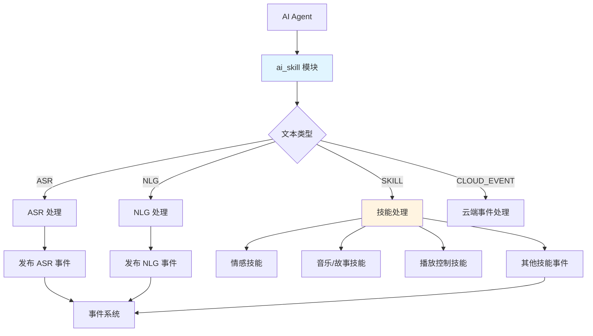
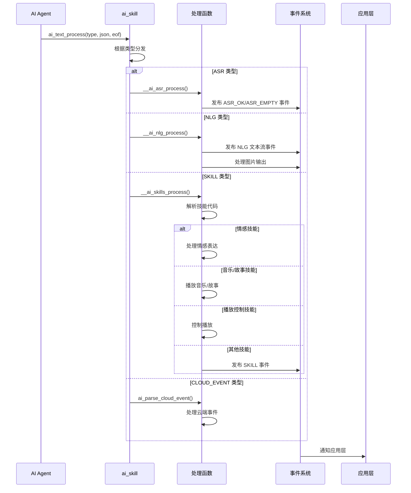
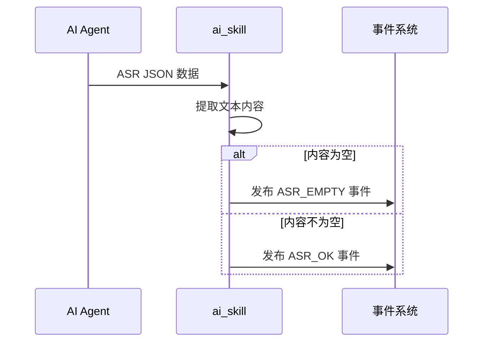
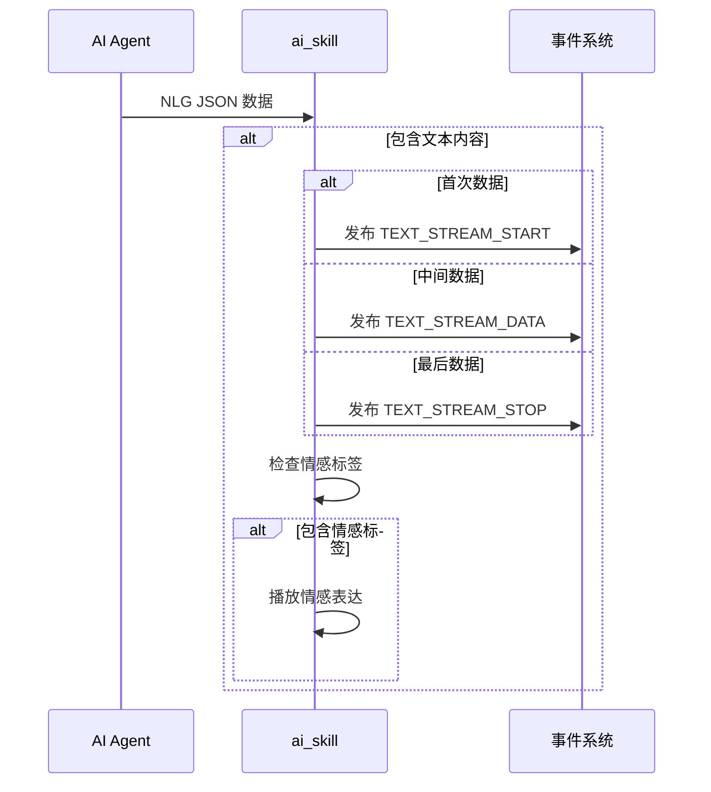
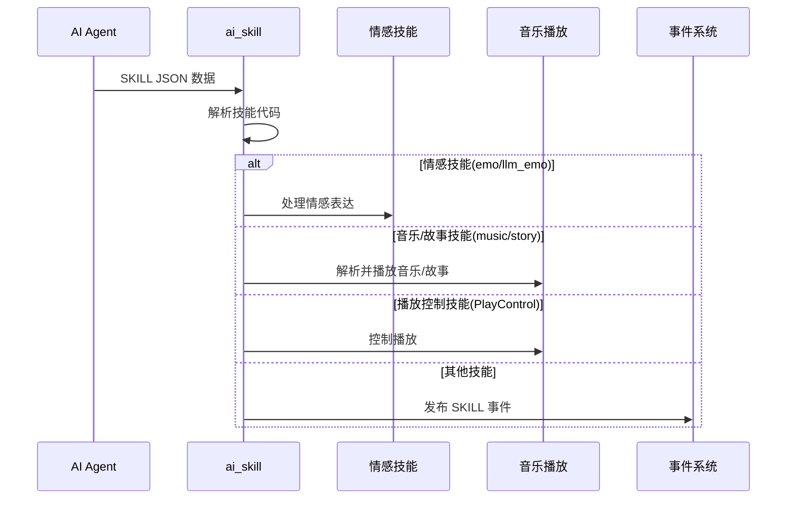

## 名词解释

| 名词 | 解释                                                         |
| ---- | ------------------------------------------------------------ |
| ASR  | 自动语音识别（Automatic Speech Recognition），将用户的语音输入转化为文本的技术。 |
| NLG  | 自然语言生成（Natural Language Generation），将结构化数据或者意图转化为自然语言文本的技术。 |
| Skill | 技能，AI 模型返回的特定功能指令，包括情感表达、音乐播放、故事播放、播放控制等。 |
| 云端事件 | 由云端主动推送的事件，用于控制设备行为，如播放 TTS 等。 |

## 功能简述

`ai_skill` 是 TuyaOpen AI 应用框架中的文本处理组件，负责处理来自 AI Agent 的各种文本数据，包括 ASR 识别结果、NLG 生成文本、技能指令和云端事件。该模块根据不同的文本类型进行相应的处理，并触发相应的用户事件或执行相应的操作。

### 核心功能

- **ASR 处理**：处理语音识别结果，发布 ASR 事件通知应用层
- **NLG 处理**：处理自然语言生成文本流，支持流式文本输出
- **技能处理**：解析并执行各种技能指令，包括情感技能、音乐/故事技能、播放控制技能
- **云端事件处理**：处理云端推送的事件，如 TTS 播放指令等
- **事件通知**：通过事件系统通知应用层各种文本处理结果

## 工作流程

### 模块架构图



### 文本处理流程

AI Agent 接收到文本数据后，根据文本类型分发到相应的处理函数。



### ASR 处理流程

处理语音识别结果，根据识别内容是否为空发布相应的事件。



### NLG 处理流程

处理自然语言生成文本流，支持流式输出和图片输出。



### 技能处理流程

解析技能代码，根据不同的技能类型执行相应的操作。



### 依赖组件

- **音频组件**（`ENABLE_COMP_AI_AUDIO`）：可选，用于音乐/故事技能和播放控制技能

## 技能模块说明

`ai_skill` 模块包含以下子模块，分别处理不同类型的技能和事件：

### 情感

情感技能处理模块，负责解析和处理 AI 返回的情感表达指令。

- **功能**：解析情感技能 JSON 数据，提取情感标签和表情符号，发布情感事件通知应用层
- **支持的情感类型**：包括中性、开心、大笑、悲伤、愤怒、恐惧、喜爱、尴尬、惊讶、震惊、思考、眨眼、酷、放松、美味、亲吻、自信、睡觉、傻、困惑等多种情感表达

### 音乐/故事

音乐和故事技能处理模块，负责解析和播放音乐/故事内容。

- **功能**：解析音乐/故事技能 JSON 数据，构建播放列表，调用音频播放器播放内容
- **支持的操作**：播放、暂停、恢复、停止、上一首、下一首、重播、单曲循环、顺序循环等播放控制

### 云端事件处理

云端事件处理模块，负责处理云端主动推送的事件指令。

- **功能**：解析云端事件 JSON 数据，处理 TTS 播放指令（playTts 和 alert）
- **支持的事件类型**：TTS 播放（playTts）、提示音播放（alert）
- **特性**：支持 TTS URL 播放、背景音乐播放、多种音频格式（MP3、WAV、SPEEX、OPUS、OGGOPUS）

## 开发流程

### 数据结构

#### 文本类型

```c
typedef uint8_t AI_TEXT_TYPE_E;
#define AI_TEXT_ASR 0x00          // ASR 文本
#define AI_TEXT_NLG 0x01          // NLG 文本
#define AI_TEXT_SKILL 0x02         // 技能数据
#define AI_TEXT_OTHER 0x03         // 其他文本
#define AI_TEXT_CLOUD_EVENT 0x04   // 云端事件
```

#### 文本通知结构

```c
typedef struct {
    char *data;           // 文本数据
    uint32_t datalen;     // 数据长度
    uint32_t timeindex;   // 时间索引
} AI_NOTIFY_TEXT_T;
```

### 接口说明

#### 处理文本数据

根据文本类型处理来自 AI Agent 的文本数据。

```c
/**
 * @brief Process AI text data based on type
 * @param type Text type (ASR, NLG, SKILL, CLOUD_EVENT)
 * @param root JSON root object containing text data
 * @param eof End of file flag indicating if this is the last data chunk
 * @return OPERATE_RET Operation result code
 */
OPERATE_RET ai_text_process(AI_TEXT_TYPE_E type, cJSON *root, bool eof);
```

### 开发步骤

1. **确保依赖组件已初始化**：如果使用音乐/故事技能，确保音频播放器已初始化
2. **注册文本回调**：在 AI Agent 初始化时，确保文本回调已正确注册
3. **处理事件**：在应用层订阅相应的用户事件（ASR、NLG、SKILL 等）来处理文本处理结果

### 参考示例

#### 处理 ASR 结果

```c
#include "ai_user_event.h"

// 订阅 ASR 事件
void handle_asr_event(AI_NOTIFY_EVENT_T *event)
{
    if (event->type == AI_USER_EVT_ASR_OK) {
        AI_NOTIFY_TEXT_T *text = (AI_NOTIFY_TEXT_T *)event->data;
        PR_NOTICE("ASR 识别结果: %s", text->data);
    } else if (event->type == AI_USER_EVT_ASR_EMPTY) {
        PR_NOTICE("ASR 识别结果为空");
    }
}
```

#### 处理 NLG 文本流

```c
// 订阅 NLG 文本流事件
void handle_nlg_stream(AI_NOTIFY_EVENT_T *event)
{
    AI_NOTIFY_TEXT_T *text = (AI_NOTIFY_TEXT_T *)event->data;
    
    switch (event->type) {
        case AI_USER_EVT_TEXT_STREAM_START:
            PR_NOTICE("NLG 文本流开始");
            break;
        case AI_USER_EVT_TEXT_STREAM_DATA:
            PR_NOTICE("NLG 文本数据: %s", text->data);
            break;
        case AI_USER_EVT_TEXT_STREAM_STOP:
            PR_NOTICE("NLG 文本流结束");
            break;
        default:
            break;
    }
}
```

#### 处理技能事件

```c
// 订阅技能事件
void handle_skill_event(AI_NOTIFY_EVENT_T *event)
{
    if (event->type == AI_USER_EVT_SKILL) {
        cJSON *skill_data = (cJSON *)event->data;
        PR_NOTICE("收到技能数据");
        
        // 解析并处理自定义技能
        // ...
    }
}
```
