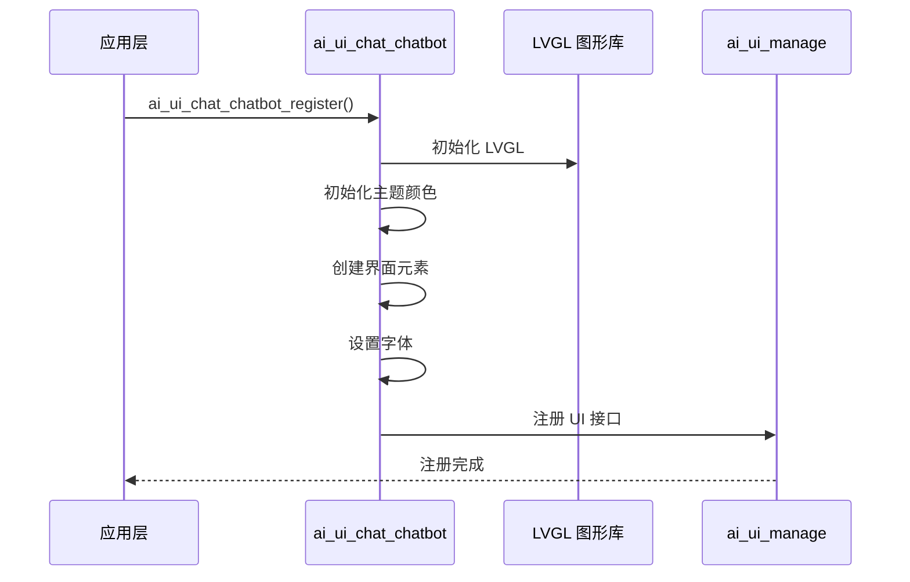
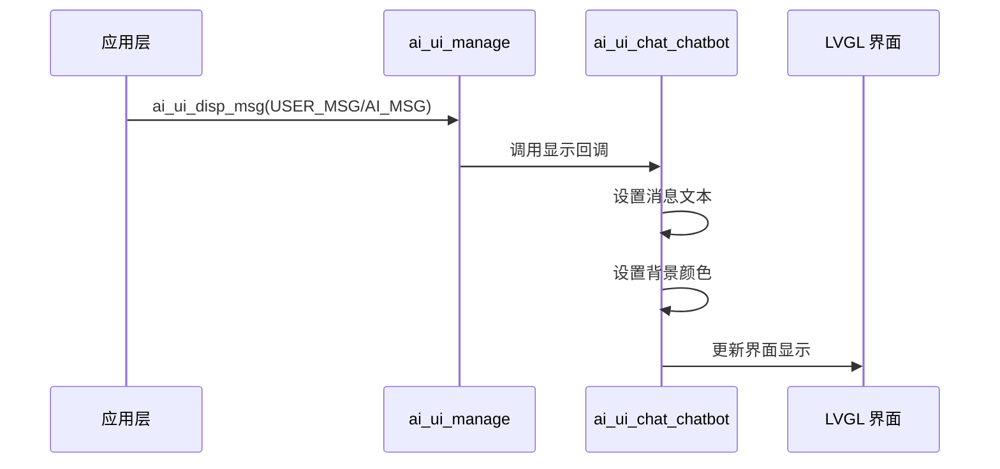
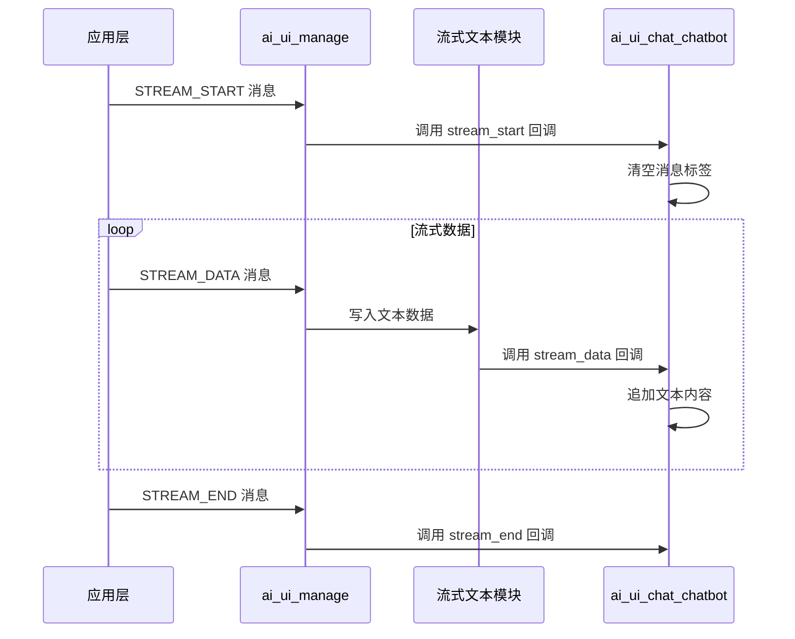

## 名词解释

| 名词 | 解释                                                         |
| ---- | ------------------------------------------------------------ |
| LVGL | 轻量级图形库（Light and Versatile Graphics Library），一个免费的开源图形库，用于创建嵌入式图形用户界面。 |

## 功能简述

`ai_ui_chat_chatbot` 是 TuyaOpen AI 应用框架中的聊天机器人风格 UI 实现，基于 LVGL 图形库开发。该模块实现了 `ai_ui_manage` 模块定义的所有 UI 显示接口，提供了简洁的聊天界面功能，包括消息显示、情感表达、状态显示等。

- **聊天机器人风格界面**：消息显示在屏幕中央，用户消息使用绿色背景，AI 消息使用白色背景，系统消息使用灰色背景
- **主题支持**：支持浅色主题，可扩展支持深色主题
- **情感显示**：支持在内容区中央显示情感图标

## 工作流程

### 初始化流程

模块初始化时，初始化 LVGL 图形库，创建界面元素，设置主题颜色和字体，并注册到 UI 管理模块。



### 消息显示流程

用户消息或 AI 消息通过 UI 管理模块发送后，在聊天界面中央更新消息内容和背景色。



### 流式文本显示流程

AI 消息流通过流式文本模块处理后，实时更新聊天界面中的文本内容。



## 配置说明

### 配置文件路径

```
ai_components/ai_ui/Kconfig
```

### 功能使能

```
menuconfig ENABLE_COMP_AI_DISPLAY
    bool "enable ai chat display ui"
    default y

config ENABLE_AI_CHAT_GUI_CHATBOT
    select ENABLE_LIBLVGL
    bool "Use Chatbot ui"
    # 启用聊天机器人风格 UI，需要依赖 LVGL 图形库

config ENABLE_CIRCLE_UI_STYLE
    depends on ENABLE_AI_CHAT_GUI_CHATBOT
    bool "Enable circle ui style"
    default n
    # 启用圆形 UI 样式（状态栏左右留白）
```

### 依赖组件

- **LVGL 图形库**（`ENABLE_LIBLVGL`）：必需，用于图形界面渲染

## 开发流程

### 接口说明

#### 注册聊天机器人风格 UI

将聊天机器人风格 UI 实现注册到 UI 管理模块中。

```c
/**
 * @brief Register chatbot-style chat UI implementation
 * @return OPERATE_RET Operation result code
 */
OPERATE_RET ai_ui_chat_chatbot_register(void);
```

### 开发步骤

1. **确保依赖组件已初始化**：确保 LVGL 图形库和显示设备已正确初始化
2. **注册 UI 实现**：在应用启动时调用 `ai_ui_chat_chatbot_register()` 注册聊天机器人风格 UI
3. **初始化 UI 管理模块**：调用 `ai_ui_init()` 初始化 UI 管理模块（会自动调用注册的初始化回调）
4. **发送显示消息**：通过 `ai_ui_disp_msg()` 发送各种类型的显示消息

### 参考示例

#### 注册和初始化

```c
#include "ai_ui_chat_chatbot.h"
#include "ai_ui_manage.h"

// 注册聊天机器人风格 UI
OPERATE_RET init_chatbot_ui(void)
{
    OPERATE_RET rt = OPRT_OK;
    
    // 注册聊天机器人风格 UI 实现
    TUYA_CALL_ERR_RETURN(ai_ui_chat_chatbot_register());
    
    // 初始化 UI 管理模块（会自动调用注册的初始化回调）
    TUYA_CALL_ERR_RETURN(ai_ui_init());
    
    return rt;
}
```

#### 显示消息

```c
// 显示用户消息
void display_user_message(const char *msg)
{
    ai_ui_disp_msg(AI_UI_DISP_USER_MSG, (uint8_t *)msg, strlen(msg));
}

// 显示 AI 消息
void display_ai_message(const char *msg)
{
    ai_ui_disp_msg(AI_UI_DISP_AI_MSG, (uint8_t *)msg, strlen(msg));
}

// 显示系统消息
void display_system_message(const char *msg)
{
    ai_ui_disp_msg(AI_UI_DISP_SYSTEM_MSG, (uint8_t *)msg, strlen(msg));
}
```

