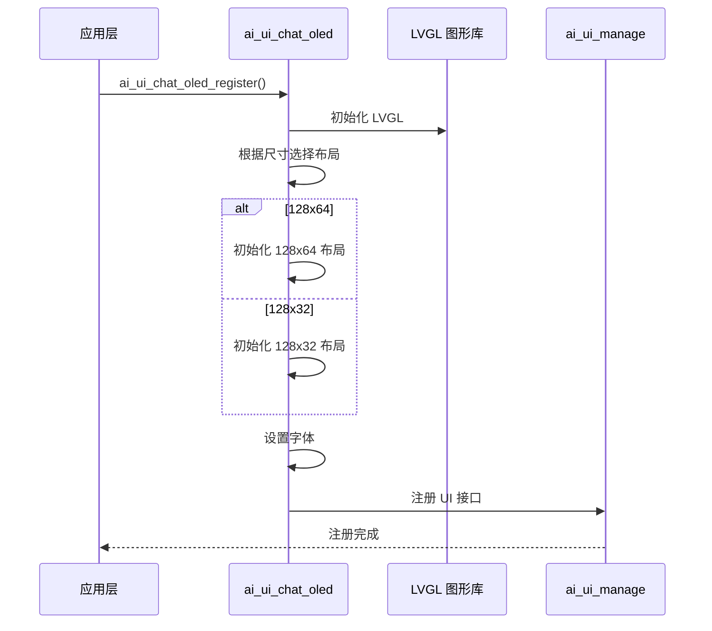
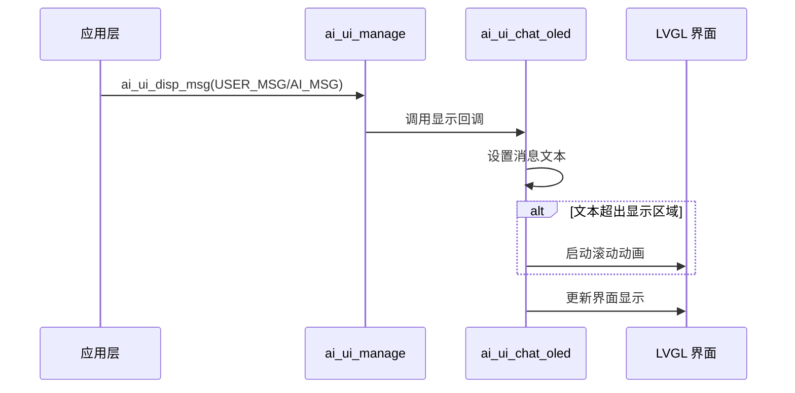
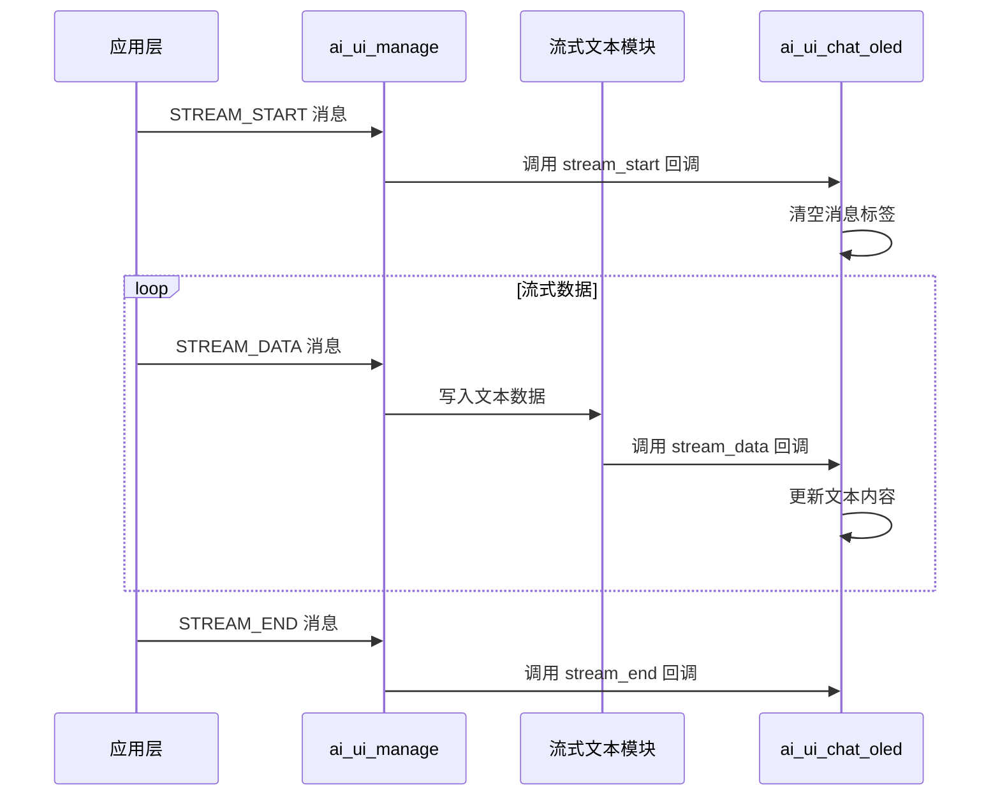

## 名词解释

| 名词 | 解释                                                         |
| ---- | ------------------------------------------------------------ |
| LVGL | 轻量级图形库（Light and Versatile Graphics Library），一个免费的开源图形库，用于创建嵌入式图形用户界面。 |
| OLED | 有机发光二极管（Organic Light-Emitting Diode）显示器，一种自发光显示技术，具有高对比度和低功耗的特点。 |

## 功能简述

`ai_ui_chat_oled` 是 TuyaOpen AI 应用框架中的 OLED 显示器聊天 UI 实现，基于 LVGL 图形库开发。该模块实现了 `ai_ui_manage` 模块定义的所有 UI 显示接口，针对小尺寸 OLED 屏幕进行了优化，支持 128x64 和 128x32 两种分辨率。

- **多分辨率支持**：支持 128x64 和 128x32 两种 OLED 分辨率，根据配置自动选择对应的布局
- **紧凑布局**：针对小屏幕优化，合理利用有限的显示空间

## 工作流程

### 初始化流程

模块初始化时，根据配置的 OLED 尺寸选择对应的初始化函数，创建界面元素并注册到 UI 管理模块。



### 消息显示流程

用户消息或 AI 消息通过 UI 管理模块发送后，在 OLED 界面中更新消息内容，长文本会自动滚动显示。



### 流式文本显示流程

AI 消息流通过流式文本模块处理后，实时更新 OLED 界面中的文本内容。



## 配置说明

### 配置文件路径

```
ai_components/ai_ui/Kconfig
```

### 功能使能

```
menuconfig ENABLE_COMP_AI_DISPLAY
    bool "enable ai chat display ui"
    default y

config ENABLE_AI_CHAT_GUI_OLED
    select ENABLE_LIBLVGL
    bool "Use OLED ui"
    # 启用 OLED UI，需要依赖 LVGL 图形库

choice AI_CHAT_GUI_OLED_SIZE
    prompt "choose oled ui size"
    default AI_CHAT_GUI_OLED_SIZE_128_64
    
    config AI_CHAT_GUI_OLED_SIZE_128_64
        bool "OLED size 128x64"
        # 128x64 像素的 OLED 显示器
    
    config AI_CHAT_GUI_OLED_SIZE_128_32
        bool "OLED size 128x32"
        # 128x32 像素的 OLED 显示器
endchoice
```

### 依赖组件

- **LVGL 图形库**（`ENABLE_LIBLVGL`）：必需，用于图形界面渲染

## 开发流程

### 接口说明

#### 注册 OLED UI

将 OLED UI 实现注册到 UI 管理模块中。

```c
/**
 * @brief Register OLED chat UI implementation
 * @return OPERATE_RET Operation result code
 */
OPERATE_RET ai_ui_chat_oled_register(void);
```

### 开发步骤

1. **确保依赖组件已初始化**：确保 LVGL 图形库和 OLED 显示设备已正确初始化
2. **配置 OLED 尺寸**：在 Kconfig 中选择对应的 OLED 尺寸（128x64 或 128x32）
3. **注册 UI 实现**：在应用启动时调用 `ai_ui_chat_oled_register()` 注册 OLED UI
4. **初始化 UI 管理模块**：调用 `ai_ui_init()` 初始化 UI 管理模块（会自动调用注册的初始化回调）
5. **发送显示消息**：通过 `ai_ui_disp_msg()` 发送各种类型的显示消息

### 参考示例

#### 注册和初始化

```c
#include "ai_ui_chat_oled.h"
#include "ai_ui_manage.h"

// 注册 OLED UI
OPERATE_RET init_oled_ui(void)
{
    OPERATE_RET rt = OPRT_OK;
    
    // 注册 OLED UI 实现
    TUYA_CALL_ERR_RETURN(ai_ui_chat_oled_register());
    
    // 初始化 UI 管理模块（会自动调用注册的初始化回调）
    TUYA_CALL_ERR_RETURN(ai_ui_init());
    
    return rt;
}
```

#### 显示消息

```c
// 显示用户消息
void display_user_message(const char *msg)
{
    ai_ui_disp_msg(AI_UI_DISP_USER_MSG, (uint8_t *)msg, strlen(msg));
}

// 显示 AI 消息
void display_ai_message(const char *msg)
{
    ai_ui_disp_msg(AI_UI_DISP_AI_MSG, (uint8_t *)msg, strlen(msg));
}

// 显示系统消息
void display_system_message(const char *msg)
{
    ai_ui_disp_msg(AI_UI_DISP_SYSTEM_MSG, (uint8_t *)msg, strlen(msg));
}
```

