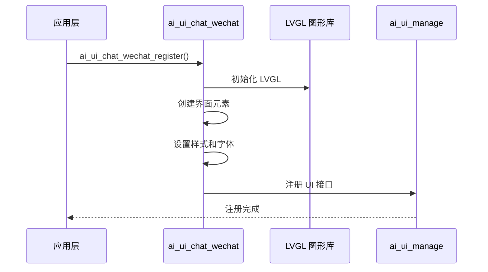
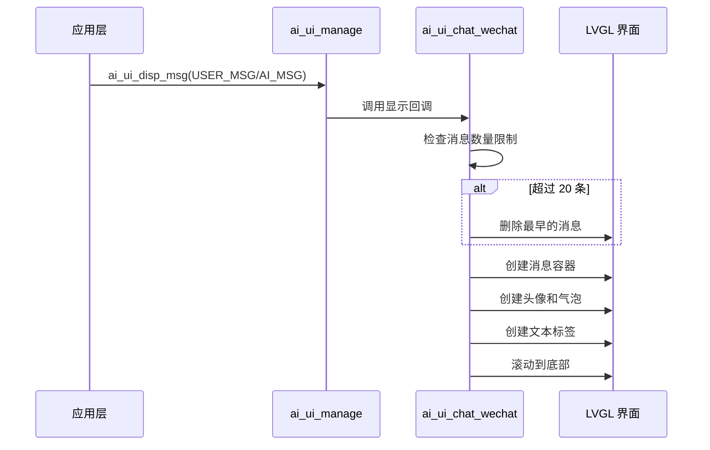
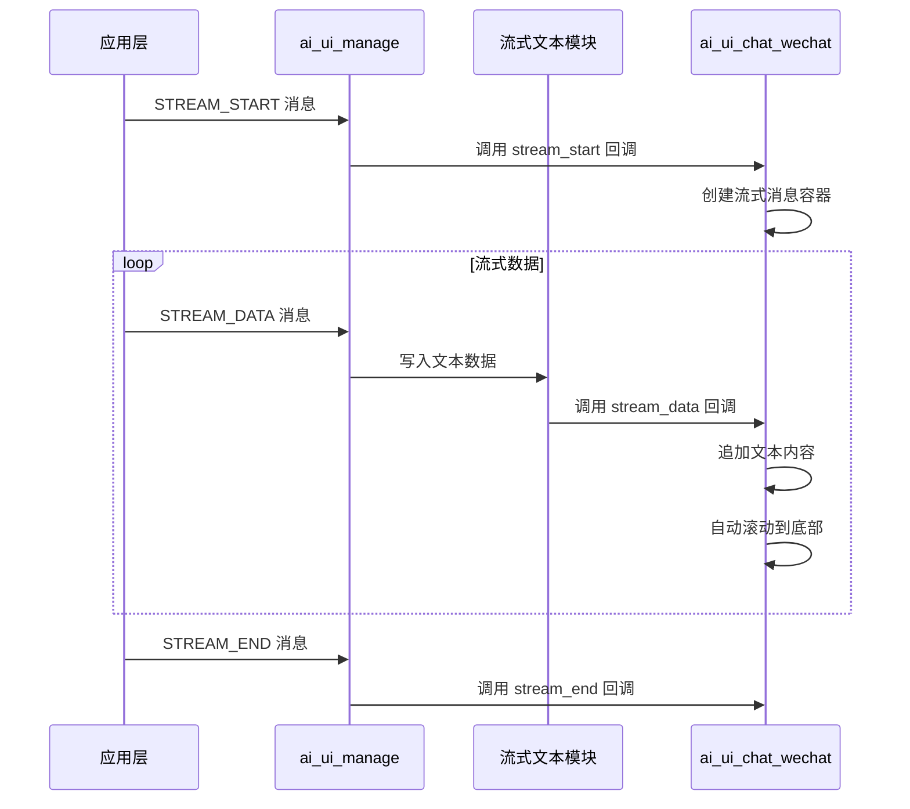

## 名词解释

| 名词 | 解释                                                         |
| ---- | ------------------------------------------------------------ |
| LVGL | 轻量级图形库（Light and Versatile Graphics Library），一个免费的开源图形库，用于创建嵌入式图形用户界面。 |
| 气泡样式 | 类似微信聊天的消息显示样式，用户消息和 AI 消息分别显示在右侧和左侧，带有圆角背景和阴影效果。 |

## 功能简述

`ai_ui_chat_wechat` 是 TuyaOpen AI 应用框架中的微信风格聊天 UI 实现，基于 LVGL 图形库开发。该模块实现了 `ai_ui_manage` 模块定义的所有 UI 显示接口，提供了完整的聊天界面功能，包括消息显示、情感表达、状态显示、摄像头画面和图片显示等。

- **微信风格界面**：采用类似微信聊天的气泡样式，用户消息显示在右侧（绿色气泡），AI 消息显示在左侧（白色气泡）
- **消息管理**：支持最多 20 条消息显示，超出限制时自动删除最早的消息
- **流式文本显示**：支持 AI 消息的流式显示，实时更新文本内容
- **摄像头显示**：支持摄像头画面的全屏显示
- **图片显示**：支持图片显示，点击可查看大图，3 秒后自动返回聊天界面

## 工作流程

### 初始化流程

模块初始化时，初始化 LVGL 图形库，创建界面元素，设置样式和字体，并注册到 UI 管理模块。



### 消息显示流程

用户消息或 AI 消息通过 UI 管理模块发送后，在聊天界面中创建相应的气泡和文本标签。



### 流式文本显示流程

AI 消息流通过流式文本模块处理后，实时更新聊天界面中的文本内容。



## 配置说明

### 配置文件路径

```
ai_components/ai_ui/Kconfig
```

### 功能使能

```
menuconfig ENABLE_COMP_AI_DISPLAY
    bool "enable ai chat display ui"
    default y

config ENABLE_AI_CHAT_GUI_WECHAT
    select ENABLE_LIBLVGL
    bool "Use WeChat-like ui"
    # 启用微信风格 UI，需要依赖 LVGL 图形库
```

### 依赖组件

- **LVGL 图形库**（`ENABLE_LIBLVGL`）：必需，用于图形界面渲染
- **视频组件**（`ENABLE_COMP_AI_VIDEO`）：可选，用于摄像头画面显示
- **图片组件**（`ENABLE_COMP_AI_PICTURE`）：可选，用于图片显示功能

## 开发流程

### 接口说明

#### 注册微信风格 UI

将微信风格 UI 实现注册到 UI 管理模块中。

```c
/**
 * @brief Register WeChat-style chat UI implementation
 * @return OPERATE_RET Operation result code
 */
OPERATE_RET ai_ui_chat_wechat_register(void);
```

### 开发步骤

1. **确保依赖组件已初始化**：确保 LVGL 图形库和显示设备已正确初始化
2. **注册 UI 实现**：在应用启动时调用 `ai_ui_chat_wechat_register()` 注册微信风格 UI
3. **初始化 UI 管理模块**：调用 `ai_ui_init()` 初始化 UI 管理模块（会自动调用注册的初始化回调）
4. **发送显示消息**：通过 `ai_ui_disp_msg()` 发送各种类型的显示消息

### 参考示例

#### 注册和初始化

```c
#include "ai_ui_chat_wechat.h"
#include "ai_ui_manage.h"

// 注册微信风格 UI
OPERATE_RET init_wechat_ui(void)
{
    OPERATE_RET rt = OPRT_OK;
    
    // 注册微信风格 UI 实现
    TUYA_CALL_ERR_RETURN(ai_ui_chat_wechat_register());
    
    // 初始化 UI 管理模块（会自动调用注册的初始化回调）
    TUYA_CALL_ERR_RETURN(ai_ui_init());
    
    return rt;
}
```

#### 显示消息

```c
// 显示用户消息
void display_user_message(const char *msg)
{
    ai_ui_disp_msg(AI_UI_DISP_USER_MSG, (uint8_t *)msg, strlen(msg));
}

// 显示 AI 消息
void display_ai_message(const char *msg)
{
    ai_ui_disp_msg(AI_UI_DISP_AI_MSG, (uint8_t *)msg, strlen(msg));
}

// 显示模式状态
void display_mode_state(const char *state)
{
    ai_ui_disp_msg(AI_UI_DISP_STATUS, (uint8_t *)state, strlen(state));
}
```


