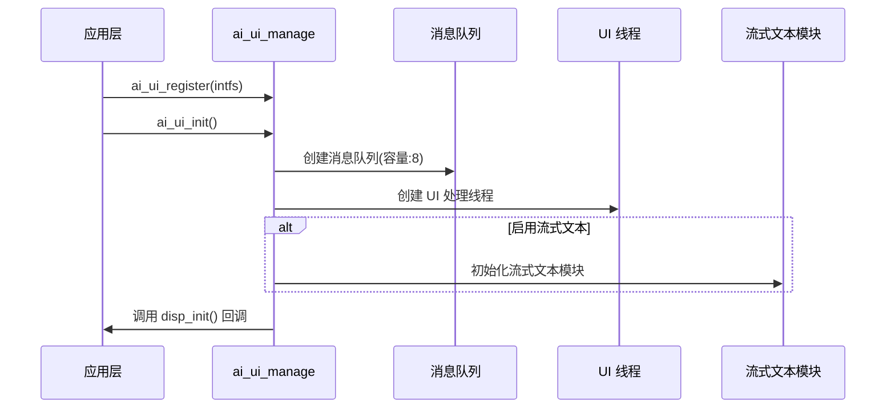
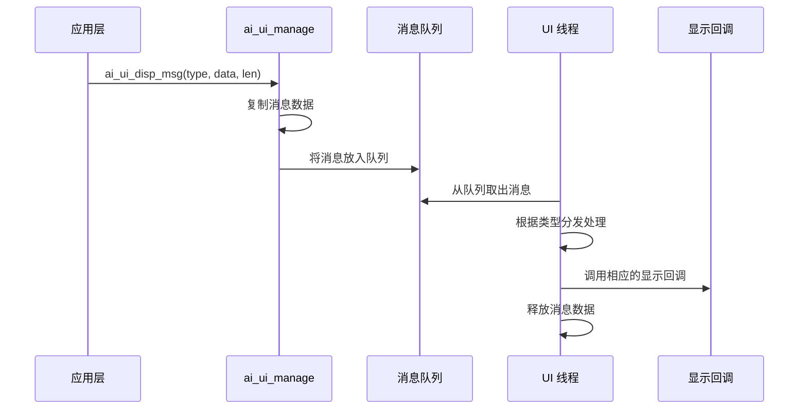
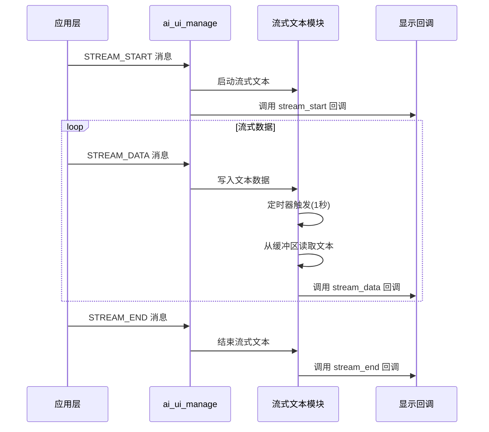

## 名词解释

| 名词 | 解释                                                         |
| ---- | ------------------------------------------------------------ |
| UI | 用户界面（User Interface），用户能看到、能操作的一切界面，都叫 UI。 |
| 流式文本 | 逐字或逐词显示的文本流，用于实时显示 AI 生成的文本内容，提供更好的用户体验。 |

## 功能简述

`ai_ui_manage` 是 TuyaOpen AI 应用框架中的 UI 管理组件，负责统一管理和分发各种 UI 显示消息。该模块采用消息队列和独立线程的架构，实现异步消息处理，支持多种显示类型，包括用户消息、AI 消息、流式文本、系统消息、情感表达、状态显示、通知、网络状态、聊天模式等。

- **多类型显示支持**：支持用户消息、AI 消息、流式文本、系统消息、情感、状态、通知等多种显示类型
- **流式文本显示**：支持流式文本显示功能，逐字显示 AI 生成的文本内容（可选功能）
- **摄像头显示**：支持摄像头画面的启动、刷新和结束
- **图片显示**：支持图片显示功能（需启用图片组件）
- **接口注册机制**：通过注册回调接口的方式，让应用层实现具体的显示逻辑

## 工作流程

### 初始化流程

模块初始化时，创建消息队列和 UI 处理线程，初始化流式文本模块（如果启用），并调用注册的初始化回调。



### 消息处理流程

应用层发送显示消息后，消息被放入队列，UI 线程从队列中取出消息并调用相应的显示回调。



### 流式文本显示流程

启用流式文本功能后，AI 消息流通过流式文本模块处理，实现逐字显示效果。



## 配置说明

### 配置文件路径

```
ai_components/ai_ui/Kconfig
```

### 功能使能

```
menuconfig ENABLE_COMP_AI_DISPLAY
    bool "enable ai chat display ui"
    default y
    # 是否启用 AI 聊天显示 UI

config ENABLE_AI_UI_TEXT_STREAMING
    bool "enable ui ai msg text streaming display"
    default n
    # 是否启用流式文本显示功能，启用后 AI 消息会逐字显示
```

### 依赖组件

- **图片组件**（`ENABLE_COMP_AI_PICTURE`）：可选，用于图片显示功能

## 开发流程

### 数据结构

#### 显示类型

```c
typedef enum {
    AI_UI_DISP_USER_MSG,              // 用户消息
    AI_UI_DISP_AI_MSG,                // AI 消息
    AI_UI_DISP_AI_MSG_STREAM_START,   // AI 消息流开始
    AI_UI_DISP_AI_MSG_STREAM_DATA,    // AI 消息流数据
    AI_UI_DISP_AI_MSG_STREAM_END,     // AI 消息流结束
    AI_UI_DISP_AI_MSG_STREAM_INTERRUPT, // AI 消息流中断
    AI_UI_DISP_SYSTEM_MSG,            // 系统消息
    AI_UI_DISP_EMOTION,               // 情感表达
    AI_UI_DISP_STATUS,                // 状态显示
    AI_UI_DISP_NOTIFICATION,          // 通知
    AI_UI_DISP_NETWORK,               // 网络状态
    AI_UI_DISP_CHAT_MODE,             // 聊天模式
    AI_UI_DISP_SYS_MAX,
} AI_UI_DISP_TYPE_E;
```

#### 网络状态

```c
typedef uint8_t AI_UI_WIFI_STATUS_E;
#define AI_UI_WIFI_STATUS_DISCONNECTED 0  // 未连接
#define AI_UI_WIFI_STATUS_GOOD         1  // 信号良好
#define AI_UI_WIFI_STATUS_FAIR         2  // 信号一般
#define AI_UI_WIFI_STATUS_WEAK         3  // 信号弱
```

#### UI 抽象接口

```c
typedef struct {
    OPERATE_RET (*disp_init)(void);                    // 初始化回调
    void (*disp_user_msg)(char* string);               // 用户消息显示
    void (*disp_ai_msg)(char* string);                 // AI 消息显示
    void (*disp_ai_msg_stream_start)(void);            // AI 消息流开始
    void (*disp_ai_msg_stream_data)(char *string);     // AI 消息流数据
    void (*disp_ai_msg_stream_end)(void);              // AI 消息流结束
    void (*disp_system_msg)(char *string);             // 系统消息显示
    void (*disp_emotion)(char *emotion);               // 情感显示
    void (*disp_ai_mode_state)(char *string);          // 模式状态显示
    void (*disp_notification)(char *string);           // 通知显示
    void (*disp_wifi_state)(AI_UI_WIFI_STATUS_E wifi_status); // WiFi 状态显示
    void (*disp_ai_chat_mode)(char *string);           // 聊天模式显示
    void (*disp_other_msg)(uint32_t type, uint8_t *data, int len); // 其他消息显示
    
    OPERATE_RET (*disp_camera_start)(uint16_t width, uint16_t height); // 摄像头显示开始
    OPERATE_RET (*disp_camera_flush)(uint8_t *data, uint16_t width, uint16_t height); // 摄像头帧刷新
    OPERATE_RET (*disp_camera_end)(void);              // 摄像头显示结束
    
#if defined(ENABLE_COMP_AI_PICTURE) && (ENABLE_COMP_AI_PICTURE == 1)
    OPERATE_RET (*disp_picture)(TUYA_FRAME_FMT_E fmt, uint16_t width, uint16_t height,
                                uint8_t *data, uint32_t len); // 图片显示
#endif
} AI_UI_INTFS_T;
```

### 接口说明

#### 注册 UI 接口

注册 UI 显示接口回调函数，应用层需要实现相应的显示逻辑。

```c
/**
 * @brief Register UI interface callbacks
 * @param intfs Pointer to the UI interface structure containing callback functions
 * @return OPERATE_RET Operation result code
 */
OPERATE_RET ai_ui_register(AI_UI_INTFS_T *intfs);
```

#### 初始化 UI 模块

初始化 UI 管理模块，创建消息队列和处理线程。

```c
/**
 * @brief Initialize AI UI module
 * @return OPERATE_RET Operation result code
 */
OPERATE_RET ai_ui_init(void);
```

#### 显示消息

向 UI 模块发送显示消息，消息会被放入队列异步处理。

```c
/**
 * @brief Display message on UI
 * @param tp Display type indicating the message category
 * @param data Pointer to the message data
 * @param len Length of the message data
 * @return OPERATE_RET Operation result code
 */
OPERATE_RET ai_ui_disp_msg(AI_UI_DISP_TYPE_E tp, uint8_t *data, int len);
```

#### 摄像头显示

启动、刷新和结束摄像头画面显示。

```c
/**
 * @brief Start camera display
 * @param width Camera frame width
 * @param height Camera frame height
 * @return OPERATE_RET Operation result code
 */
OPERATE_RET ai_ui_camera_start(uint16_t width, uint16_t height);

/**
 * @brief Flush camera frame data to display
 * @param data Pointer to the camera frame data
 * @param width Frame width
 * @param height Frame height
 * @return OPERATE_RET Operation result code
 */
OPERATE_RET ai_ui_camera_flush(uint8_t *data, uint16_t width, uint16_t height);

/**
 * @brief End camera display
 * @return OPERATE_RET Operation result code
 */
OPERATE_RET ai_ui_camera_end(void);
```

#### 图片显示

显示图片数据（需启用图片组件）。

```c
#if defined(ENABLE_COMP_AI_PICTURE) && (ENABLE_COMP_AI_PICTURE == 1)
/**
 * @brief Display picture on UI
 * @param fmt Picture frame format
 * @param width Picture width
 * @param height Picture height
 * @param data Pointer to the picture data
 * @param len Length of the picture data
 * @return OPERATE_RET Operation result code
 */
OPERATE_RET ai_ui_disp_picture(TUYA_FRAME_FMT_E fmt, uint16_t width, uint16_t height,
                                uint8_t *data, uint32_t len);
#endif
```

### 开发步骤

1. **注册 UI 接口**：在应用启动时调用 `ai_ui_register()` 注册 UI 显示接口回调函数
2. **初始化模块**：调用 `ai_ui_init()` 初始化 UI 管理模块
3. **发送显示消息**：通过 `ai_ui_disp_msg()` 发送各种类型的显示消息
4. **实现显示回调**：在注册的接口回调函数中实现具体的显示逻辑

### 参考示例

#### 注册和初始化

```c
#include "ai_ui_manage.h"

// 用户消息显示回调
void disp_user_msg_cb(char* string)
{
    PR_NOTICE("显示用户消息: %s", string);
    // 实现具体的显示逻辑
}

// AI 消息显示回调
void disp_ai_msg_cb(char* string)
{
    PR_NOTICE("显示 AI 消息: %s", string);
    // 实现具体的显示逻辑
}

// 流式文本数据回调
void disp_ai_msg_stream_data_cb(char *string)
{
    PR_NOTICE("显示流式文本: %s", string);
    // 实现具体的显示逻辑
}

// 初始化回调
OPERATE_RET disp_init_cb(void)
{
    PR_NOTICE("UI 初始化");
    // 初始化显示设备
    return OPRT_OK;
}

// 注册 UI 接口
OPERATE_RET register_ui_interfaces(void)
{
    AI_UI_INTFS_T intfs = {
        .disp_init = disp_init_cb,
        .disp_user_msg = disp_user_msg_cb,
        .disp_ai_msg = disp_ai_msg_cb,
        .disp_ai_msg_stream_start = NULL,
        .disp_ai_msg_stream_data = disp_ai_msg_stream_data_cb,
        .disp_ai_msg_stream_end = NULL,
        // ... 其他回调函数
    };
    
    TUYA_CALL_ERR_RETURN(ai_ui_register(&intfs));
    TUYA_CALL_ERR_RETURN(ai_ui_init());
    
    return OPRT_OK;
}
```

#### 发送显示消息

```c
// 显示用户消息
void display_user_message(const char *msg)
{
    ai_ui_disp_msg(AI_UI_DISP_USER_MSG, (uint8_t *)msg, strlen(msg));
}

// 显示 AI 消息
void display_ai_message(const char *msg)
{
    ai_ui_disp_msg(AI_UI_DISP_AI_MSG, (uint8_t *)msg, strlen(msg));
}

// 显示模式状态
void display_mode_state(const char *state)
{
    ai_ui_disp_msg(AI_UI_DISP_STATUS, (uint8_t *)state, strlen(state));
}

// 显示网络状态
void display_wifi_status(AI_UI_WIFI_STATUS_E status)
{
    ai_ui_disp_msg(AI_UI_DISP_NETWORK, (uint8_t *)&status, sizeof(status));
}
```

#### 摄像头显示

```c
// 启动摄像头显示
void start_camera_display(void)
{
    ai_ui_camera_start(480, 480);
}

// 刷新摄像头帧
void flush_camera_frame(uint8_t *frame_data, uint16_t width, uint16_t height)
{
    ai_ui_camera_flush(frame_data, width, height);
}

// 结束摄像头显示
void end_camera_display(void)
{
    ai_ui_camera_end();
}
```

