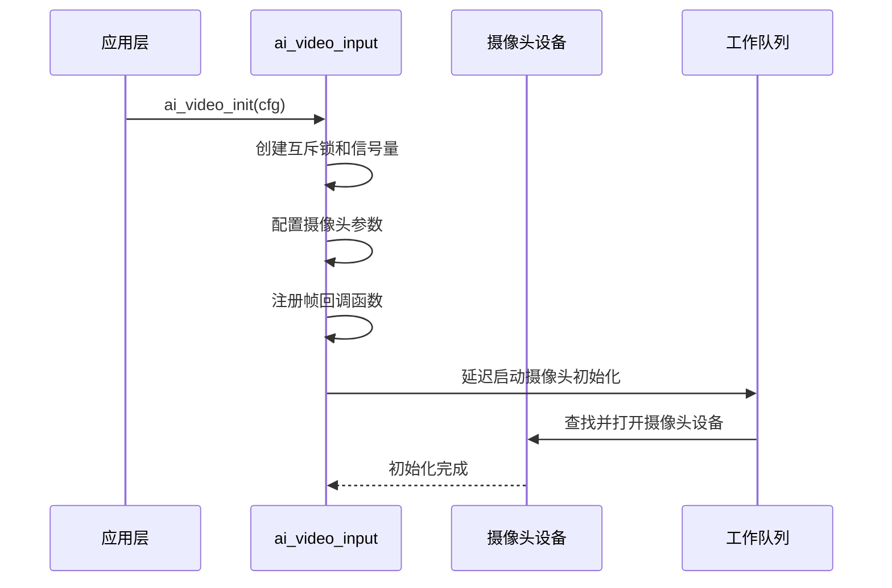
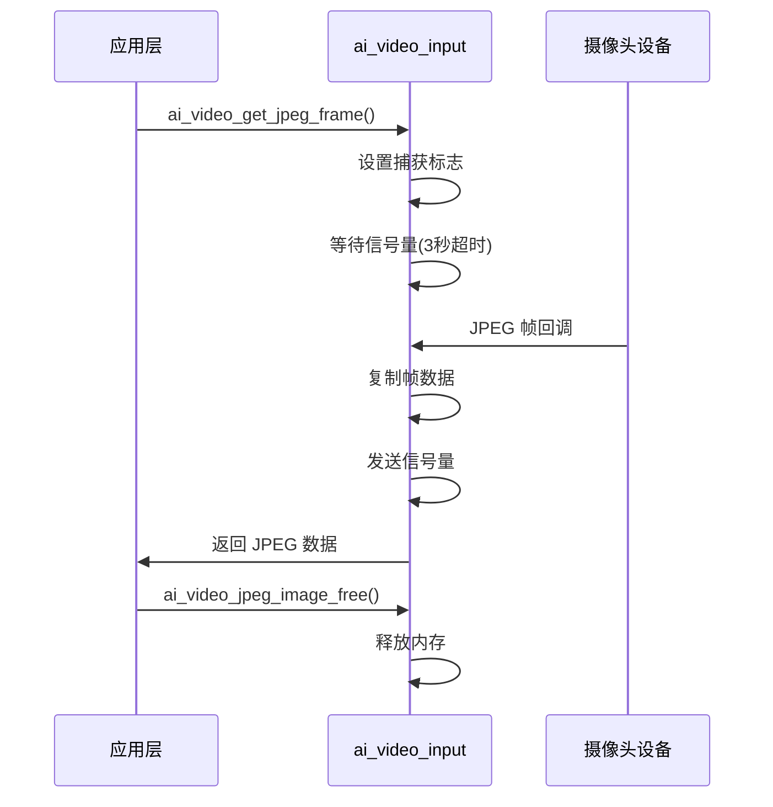
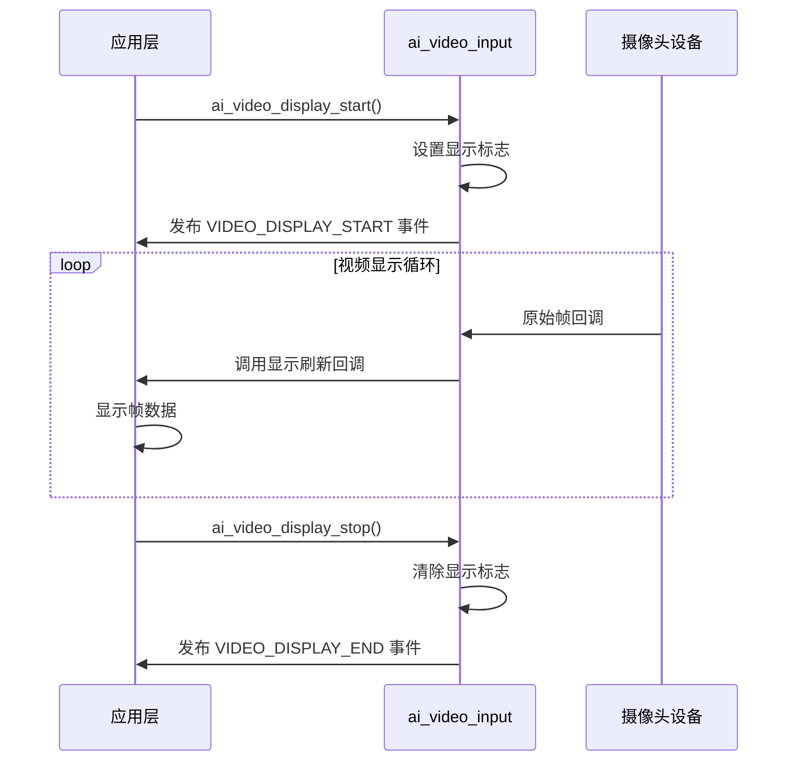

## 名词解释

| 名词 | 解释                                                         |
| ---- | ------------------------------------------------------------ |
| JPEG 编码 | 一种图像压缩格式，将原始图像数据压缩为 JPEG 格式，减小数据量，便于传输和存储。 |
| 原始帧 | 摄像头直接输出的未压缩图像数据，通常为 YUV 格式。 |

## 功能简述

`ai_video_input` 是 TuyaOpen AI 应用框架中的视频输入组件，负责处理摄像头数据采集、JPEG 编码和输出视频流的功能。该模块提供了摄像头初始化、帧捕获、图像编码等能力，支持将摄像头数据用于 AI 视觉分析或实时显示。

- **摄像头管理**：初始化和管理摄像头设备，配置分辨率、帧率等参数
- **原始帧采集**：通过回调函数获取摄像头原始帧数据，用于实时显示
- **JPEG 帧捕获**：提供同步接口获取 JPEG 编码后的图像数据，俗称 “拍照”
- **视频显示控制**：支持启动和停止视频显示，发布相应的事件通知

## 工作流程

### 初始化流程

模块初始化时，配置摄像头参数，注册帧回调函数，并延迟启动摄像头设备。



### JPEG 帧捕获流程

应用层请求获取 JPEG 帧时，模块设置捕获标志，等待摄像头回调，然后返回编码后的图像数据。



### 视频显示流程

启动视频显示后，摄像头原始帧通过回调函数传递给应用层进行显示。



## 配置说明

### 配置文件路径

```
ai_components/ai_video/Kconfig
```

### 功能使能

```
menuconfig ENABLE_COMP_AI_VIDEO
    select ENABLE_CAMERA
    bool "enable ai camera"
    default n
```

### 配置参数

```
config COMP_AI_VIDEO_WIDTH
    int "ai video input width"
    default 480
    # 摄像头采集图像宽度（像素）

config COMP_AI_VIDEO_HEIGHT
    int "ai video input height"
    default 480
    # 摄像头采集图像高度（像素）

config COMP_AI_VIDEO_FPS        
    int "ai video input fps"
    default 20
    # 摄像头采集帧率（帧/秒）

config ENABLE_COMP_AI_VIDEO_JPEG_QUALITY        
    bool "enable ai video input jpeg quality"
    default y
    # 是否启用 JPEG 质量自动调整功能

config COMP_AI_VIDEO_JPEG_QUALITY_MAX_SIZE
    int "ai video input jpeg quality max size(kb)"
    default 25
    # JPEG 图像最大尺寸（KB），超过此尺寸会自动降低质量

config COMP_AI_VIDEO_JPEG_QUALITY_MIN_SIZE
    int "ai video input jpeg quality min size(kb)"
    default 10
    # JPEG 图像最小尺寸（KB），低于此尺寸会自动提高质量
```

### 依赖组件

- **摄像头组件**（`ENABLE_CAMERA`）：必需，用于摄像头设备管理

## 开发流程

### 数据结构

#### 视频输入配置

```c
typedef void (*AI_VIDEO_DISP_FLUSH_CB)(TDL_CAMERA_FRAME_T *frame);

typedef struct {
    AI_VIDEO_DISP_FLUSH_CB disp_flush_cb;  // 显示刷新回调函数
} AI_VIDEO_CFG_T;
```

#### 视频显示启动通知

```c
typedef struct {
    uint32_t camera_width;   // 摄像头宽度
    uint32_t camera_height;  // 摄像头高度
} AI_NOTIFY_VIDEO_START_T;
```

### 接口说明

#### 初始化

初始化视频输入模块，配置摄像头参数和回调函数。如果启用了 JPEG 质量配置，模块会根据配置的最大/最小尺寸自动调整 JPEG 编码质量。

```c
/**
 * @brief Initialize AI video input module
 * @param vi_cfg Video input configuration
 * @return OPERATE_RET Operation result
 */
OPERATE_RET ai_video_init(AI_VIDEO_CFG_T *vi_cfg);
```

#### 反初始化

释放视频输入模块资源，关闭摄像头设备。

```c
/**
 * @brief Deinitialize AI video input module
 * @return OPERATE_RET Operation result
 */
OPERATE_RET ai_video_deinit(void);
```

#### 获取 JPEG 帧

从摄像头获取 JPEG 编码后的图像帧。 

-  如果在 3 秒内获取不到 JPEG 帧，会超时返回错误。

- 获取的图像数据使用完后需要使用 `ai_video_jpeg_image_free()` 释放，避免内存泄漏。

```c
/**
 * @brief Get JPEG frame from camera
 * @param image_data Pointer to store image data pointer
 * @param image_data_len Pointer to store image data length
 * @return OPERATE_RET Operation result
 */
OPERATE_RET ai_video_get_jpeg_frame(uint8_t **image_data, uint32_t *image_data_len);
```

#### 释放 JPEG 图像数据

释放通过 `ai_video_get_jpeg_frame()` 获取的图像数据内存。

```c
/**
 * @brief Free JPEG image data
 * @param image_data Pointer to image data pointer
 * @return OPERATE_RET Operation result
 */
OPERATE_RET ai_video_jpeg_image_free(uint8_t **image_data);
```

#### 启动视频显示

启动视频显示，开始接收原始帧数据并通过回调函数传递给应用层。

```c
/**
 * @brief Start video display
 * @return OPERATE_RET Operation result
 */
OPERATE_RET ai_video_display_start(void);
```

#### 停止视频显示

停止视频显示，不再接收原始帧数据。

```c
/**
 * @brief Stop video display
 * @return OPERATE_RET Operation result
 */
OPERATE_RET ai_video_display_stop(void);
```

### 开发步骤

1. **初始化模块**：调用 `ai_video_init()` 初始化视频输入模块，配置显示刷新回调函数
2. **启动显示**（可选）：如果需要实时显示视频，调用 `ai_video_display_start()` 启动显示
3. **获取 JPEG 帧**：调用 `ai_video_get_jpeg_frame()` 获取 JPEG 编码后的图像数据
4. **释放资源**：使用完图像数据后，调用 `ai_video_jpeg_image_free()` 释放内存
5. **停止显示**（可选）：调用 `ai_video_display_stop()` 停止视频显示
6. **反初始化**：调用 `ai_video_deinit()` 释放模块资源

### 参考示例

#### 初始化和显示

```c
#include "ai_video_input.h"
#include "ai_user_event.h"

// 显示刷新回调函数
void video_display_flush(TDL_CAMERA_FRAME_T *frame)
{
    // 将帧数据刷新到显示设备
    // ...
}

// 初始化视频输入模块
OPERATE_RET init_video_input(void)
{
    OPERATE_RET rt = OPRT_OK;
    AI_VIDEO_CFG_T cfg = {
        .disp_flush_cb = video_display_flush,
    };
    
    TUYA_CALL_ERR_RETURN(ai_video_init(&cfg));
    
    return rt;
}

// 启动视频显示
void start_video_display(void)
{
    ai_video_display_start();
}

// 停止视频显示
void stop_video_display(void)
{
    ai_video_display_stop();
}
```

#### 获取 JPEG 帧

```c
// 获取 JPEG 图像帧
OPERATE_RET capture_jpeg_image(void)
{
    OPERATE_RET rt = OPRT_OK;
    uint8_t *image_data = NULL;
    uint32_t image_data_len = 0;
    
    // 获取 JPEG 帧
    rt = ai_video_get_jpeg_frame(&image_data, &image_data_len);
    if (OPRT_OK != rt) {
        PR_ERR("Get JPEG frame failed: %d", rt);
        return rt;
    }
    
    PR_NOTICE("JPEG frame captured, size: %d bytes", image_data_len);
    
    // 使用图像数据（例如上传到云端、保存到文件等）
    // ...
    
    // 释放图像数据
    ai_video_jpeg_image_free(&image_data);
    
    return rt;
}
```

#### 处理视频显示事件

```c
// 订阅视频显示事件
void handle_video_event(AI_NOTIFY_EVENT_T *event)
{
    switch (event->type) {
        case AI_USER_EVT_VIDEO_DISPLAY_START: {
            AI_NOTIFY_VIDEO_START_T *notify = (AI_NOTIFY_VIDEO_START_T *)event->data;
            PR_NOTICE("Video display started: %dx%d", 
                      notify->camera_width, 
                      notify->camera_height);
        }
        break;
        
        case AI_USER_EVT_VIDEO_DISPLAY_END:
            PR_NOTICE("Video display stopped");
        break;
        
        default:
        break;
    }
}
```

