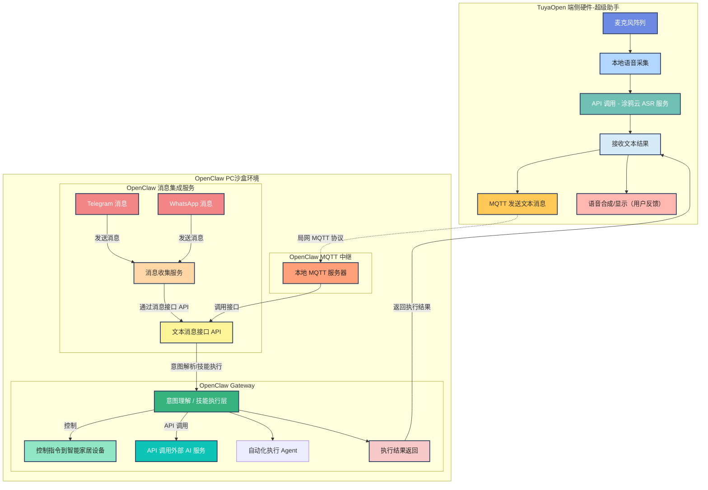

本文介绍如何基于 TuyaOpen 端侧硬件与 OpenClaw 网关服务打通，通过语音转写（ASR）将用户指令发送到本机 OpenClaw，实现“动口即执行”的桌面语音助手。适合已完成 TuyaOpen 快速入门的应用开发者，用于搭建可演示的轻量化个人助手。


*TuyaOpen 硬件（麦克风 + 扬声器）与 OpenClaw 网关（PC）通过本地网络连接。*

## 前置条件

- 已完成 [快速开始](quick-start/index) 中的 [环境安装与代码获取](quick-start/enviroment-setup)。
- 具备 TuyaOpen 仓库中的 [your_chat_bot](https://github.com/tuya/TuyaOpen/tree/master/apps/tuya.ai/your_chat_bot) 编译、烧录与配网经验。
- 一台用于运行 OpenClaw 与 MQTT 桥接服务的 PC（Linux 推荐），与 TuyaOpen 设备处于同一局域网。

## 要求

- **硬件**：支持 your_chat_bot 的 TuyaOpen 开发板（如 T5AI-Core、T5-AI Board 等）、USB 线、麦克风等外设按板级说明连接。
- **软件**：TuyaOpen 仓库代码、Python 3、Mosquitto（MQTT broker）、OpenClaw 运行环境。
- **网络**：TuyaOpen 设备与运行 OpenClaw 的 PC 在同一局域网；PC 需固定或已知 IP，用于 MQTT 连接。
- **授权码**：本 Demo 使用涂鸦云端 ASR 服务，需完成 [设备授权](quick-start/equipment-authorization) 并按 your_chat_bot 要求配置 PID 等。

## 技术架构简述

TuyaOpen 设备与涂鸦云建立连接，获取 ASR 语音转写结果；设备将转写文本通过局域网 MQTT 发送至运行 OpenClaw 的 PC。PC 上的 MQTT 桥接服务将消息转发给 OpenClaw，由 OpenClaw 进行意图理解与指令执行（如查邮件、写代码、管理备忘录等），执行结果可经 MQTT 回传设备端展示或播报。整体实现端侧语音采集与云端 OpenClaw 能力的结合。

### 架构示意

下图展示 TuyaOpen 端侧硬件与 OpenClaw PC 沙盒环境之间的数据流：语音采集与涂鸦云 ASR、MQTT 中继、OpenClaw 网关的意图解析与执行，以及执行结果回传。



## 步骤

### 一、TuyaOpen 环境与 your_chat_bot 部署

1. **克隆 TuyaOpen 仓库**
   ```bash
   git clone https://github.com/tuya/TuyaOpen.git
   cd TuyaOpen
   ```

2. **激活构建环境**  
   每次新开终端后需重新执行：
   ```bash
   . ./export.sh
   ```

3. **进入应用目录并编译**  
   可编译项目位于 `apps`、`example` 下。以 your_chat_bot 为例：
   ```bash
   cd apps/tuya.ai/your_chat_bot
   tos.py build
   ```

4. **烧录固件**  
   按 [固件烧录](quick-start/firmware-burning) 将生成的固件烧录到设备。

5. **设备配网**  
   按 [设备配网](quick-start/device-network-configuration) 完成 Wi‑Fi 配置，使设备可访问涂鸦云及局域网。

6. **验证**  
   设备上电并配网成功后，应能进行语音交互（ASR 由涂鸦云处理）。若遇问题可参考 [项目演练](project-walkthrough)。

### 二、安装 OpenClaw

OpenClaw 为阿里云大模型相关服务，用于在 PC 端接收文本指令并执行任务。安装与配置请按阿里云官方文档操作：

- [OpenClaw 安装与配置](https://help.aliyun.com/zh/model-studio/openclaw#step-config-manual-title)（阿里云帮助中心）

在 PC 上可用的典型命令示例：
```bash
openclaw agent --agent main --message "今天深圳天气怎么样"
```

### 三、TuyaOpen 与 OpenClaw 打通

打通方式：在运行 OpenClaw 的 PC 上部署 MQTT 服务器与桥接脚本，在 TuyaOpen 侧增加 MQTT 客户端，将 ASR 结果发布到 MQTT，由桥接脚本转发给 OpenClaw。

#### 3.1 在 PC 上部署 MQTT 与桥接服务

1. **安装并启动 Mosquitto**
   ```bash
   sudo apt-get install mosquitto mosquitto-clients
   sudo systemctl start mosquitto
   sudo systemctl enable mosquitto
   ```
   若提供 `setup_mosquitto.sh`，可按需执行：
   ```bash
   sudo ./setup_mosquitto.sh
   ```

2. **部署 MQTT–OpenClaw 桥接脚本**  
   将桥接代码（如 `mqtt_openclaw_bridge`）放到 PC 上，进入目录并启动：
   ```bash
   cd ~/mqtt_openclaw_bridge
   python3 mqtt_openclaw_bridge.py
   ```
   桥接脚本负责订阅来自设备的 MQTT 主题，将收到的文本作为 OpenClaw 的输入并执行，可选将执行结果发布回设备。

3. **验证 MQTT 收发（可选）**
   ```bash
   cd ~/mqtt_openclaw_bridge
   python3 test_receiver.py
   ```
   另开终端发送测试指令：
   ```bash
   python3 test_sender.py "在桌面新建一个文件夹，并生成包含10首诗歌的新文本文件。"
   ```
   确认 OpenClaw 侧能收到并执行对应指令。

#### 3.2 设备端：连接 MQTT 并发送 ASR 结果

在 your_chat_bot 工程中增加与 PC 上 MQTT broker 的连接，并在收到涂鸦云 ASR 结果时，将文本通过 MQTT 发送到桥接脚本订阅的主题。

1. **新增 MQTT 连接函数**  
   在工程中增加例如 `claw_mqtt_connect` 的函数，用于连接 PC 上的 MQTT broker（地址与端口见下方配置表）。

2. **在 ASR 回调中发送 MQTT 消息**  
   在 `__app_ai_audio_evt_inform_cb` 等接收 ASR 结果的回调里，将转写文本通过 MQTT 发布到指令主题，例如：
   ```c
   // 将 ASR 文本通过 MQTT 发送到 AI_CMD 主题
   uint16_t cmd_msgid = ai_cmd_send(data, len, MQTT_QOS_1);
   ```
   具体实现与工程结构可参考社区或仓库中与 OpenClaw 对接的示例代码（若有提供）。

3. **配置 MQTT 参数**  
   设备端与桥接脚本中的 MQTT 配置需一致，且 broker 地址为运行 OpenClaw 的 PC 在本局域网内的 IP。

## MQTT 配置说明

| 配置项 | 说明 | 示例值 |
|--------|------|--------|
| MQTT_BROKER | MQTT broker 地址（运行 OpenClaw 的 PC 的局域网 IP） | `192.168.100.132` |
| MQTT_PORT | MQTT broker 端口 | `1883` |
| MQTT_TOPIC_CMD | 设备发送指令的 topic | `AI_CMD` |
| MQTT_TOPIC_RET | 设备接收结果的 topic | `AI_RET` |
| MQTT_CLIENT_ID | 设备端 MQTT 客户端 ID | `T5_AI_CLAW` |

请将 `mqtt_openclaw_bridge.py` 中的 `MQTT_BROKER` 与 your_chat_bot 工程中的 `MQTT_BROKER` 均改为你本机在当前局域网内的实际 IP 地址。

## 注意事项

:::note
本方案为开发者体验版本，对环境有明确要求。
:::

- **局域网**：TuyaOpen 设备与运行 OpenClaw、Mosquitto 的 PC 必须在同一局域网，且设备能访问 PC 的 MQTT 端口。
- **IP 配置**：PC 的 IP 可能随网络变化而改变，若 IP 变更需同步修改设备端与桥接脚本中的 `MQTT_BROKER`。
- **更多方案**：TuyaOpen 与 OpenClaw 的更多集成方式仍在适配中，可关注仓库与文档更新。

## 预期效果

完成上述步骤后，在 TuyaOpen 设备上通过语音输入，涂鸦云 ASR 将语音转为文字，设备经 MQTT 把文字发送到 PC；OpenClaw 接收并执行对应指令（如查邮件、建文件夹、写代码等），实现“语音控制桌面任务”的轻量化助手体验。

## 参考

- [快速开始](quick-start/index)
- [环境安装与代码获取](quick-start/enviroment-setup)
- [固件烧录](quick-start/firmware-burning)
- [设备配网](quick-start/device-network-configuration)
- [项目演练](project-walkthrough)
- [Chatbot Demo（your_chat_bot）](applications/tuya.ai/demo-your-chat-bot)
- [Raspberry Pi 示例：OpenClaw 流程](hardware-specific/Linux/raspberry-pi/Examples/claw-flow)
- [OpenClaw 帮助文档](https://help.aliyun.com/zh/model-studio/openclaw)（阿里云）
