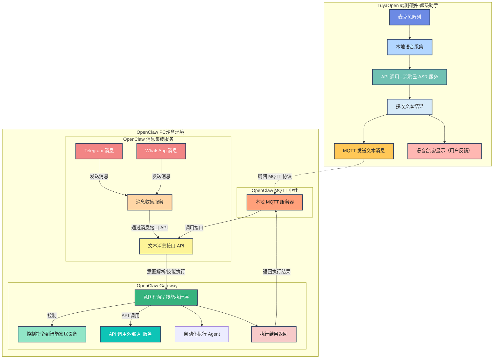

本文介绍如何基于 TuyaOpen 端侧硬件与 OpenClaw 网关服务打通，通过语音转写（ASR）将用户指令发送到本机 OpenClaw，实现“动口即执行”的桌面语音助手。适合已完成 TuyaOpen 快速入门的应用开发者，用于搭建可演示的轻量化个人助手。

<div align="center">

</div>

*TuyaOpen 硬件（麦克风 + 扬声器）与 OpenClaw 网关（PC）通过本地网络连接。*

## 前置条件

- 已完成 [环境安装与代码获取](/docs/quick-start/enviroment-setup)。
- 具备 TuyaOpen 仓库中 `openclaw_demo_app` 的编译、烧录与配网基础经验。
- 一台用于运行 OpenClaw 与 MQTT 桥接服务的 PC（Linux 推荐），与 TuyaOpen 设备处于同一局域网。

## 要求

| 类型 | 说明 |
|------|------|
| 硬件 | 支持 `openclaw_demo_app` 的 TuyaOpen 开发板（如 T5AI-Core、T5-AI Board 等）、USB 线，以及板级说明要求的麦克风和扬声器等外设。 |
| 软件 | TuyaOpen 仓库代码、Python 3、Mosquitto（MQTT broker）、OpenClaw 运行环境。 |
| 网络 | TuyaOpen 设备与运行 OpenClaw 的 PC 在同一局域网；PC 需固定或已知 IP，用于 MQTT 连接。 |
| 授权码 | 本 Demo 使用 Tuya Cloud ASR 服务，需完成 [设备授权](/docs/quick-start/equipment-authorization) 并按硬件应用要求配置 PID 等。 |

## 技术架构简述

TuyaOpen 设备与涂鸦云建立连接，获取 ASR 语音转写结果；设备将转写文本通过局域网 MQTT 发送至运行 OpenClaw 的 PC。PC 上的 MQTT 桥接服务将消息转发给 OpenClaw，由 OpenClaw 进行意图理解与指令执行（如查邮件、写代码、管理备忘录等），执行结果可经 MQTT 回传设备端展示或播报。整体实现端侧语音采集与云端 OpenClaw 能力的结合。

### 架构示意

下图展示 TuyaOpen 端侧硬件与 OpenClaw PC 沙盒环境之间的数据流：语音采集与涂鸦云 ASR、MQTT 中继、OpenClaw 网关的意图解析与执行，以及执行结果回传。



## 步骤

### 1. 按 OpenClaw 官方文档完成安装

先在 PC 上完成 OpenClaw 安装，并确认本地可执行 Agent 命令。

1. 打开官方文档并完成安装与 onboarding：
   - [OpenClaw 官网文档](https://openclaw.ai/)
2. 检查 `openclaw` 命令是否可用：
   ```bash
   which openclaw && openclaw --version
   ```
3. 执行一个基础命令验证：
   ```bash
   openclaw agent --agent main --message "Hello from TuyaOpen"
   ```

### 2. 按 GitHub 仓库启动 MQTT 代理服务

使用最新 `openclaw_tuya_mqtt_proxy` 仓库，在 PC 上启动 Mosquitto 与代理脚本，实现硬件 MQTT 消息转发到 OpenClaw gateway。

1. 克隆并进入代理仓库：
   ```bash
   git clone https://github.com/adwuard/openclaw_tuya_mqtt_proxy.git ~/mqtt_openclaw_bridge
   cd ~/mqtt_openclaw_bridge
   ```
2. 安装 Python 依赖：
   ```bash
   pip3 install --user -r requirements.txt
   ```
3. 安装并启动 Mosquitto：
   ```bash
   sudo bash install.sh install-mosquitto
   ```
4. 可选：允许局域网设备连接 broker：
   ```bash
   sudo bash install.sh mosquitto-listen-all
   ```
5. 启动代理脚本：
   ```bash
   python3 openclaw_mqtt_bridge.py
   ```
6. 可选：快速验证消息路由（两个终端）：
   ```bash
   mosquitto_sub -h localhost -t openclaw/server/response -v
   ```
   ```bash
   mosquitto_pub -h localhost -t openclaw/device/user_speech_text -m "Hello from MQTT"
   ```

### 3. 构建硬件代码并联调

1. 克隆 TuyaOpen 并初始化构建环境：
   ```bash
   git clone https://github.com/tuya/TuyaOpen.git
   cd TuyaOpen
   . ./export.sh
   ```
2. 修改 `apps/tuya.ai/openclaw_demo_app/src/openclaw_remote_mqtt.c` 中 MQTT broker 的本地 IP：
   ```c
   /**
    * Remote MQTT broker host.
    *
    * NOTE: Please update the IP address below to match your actual MQTT broker.
   at https://github.com/tuya/TuyaOpen/tree/master/apps/tuya.ai/openclaw_demo_app/src/openclaw_remote_mqtt.c
   apps/tuya.ai/openclaw_demo_app/src/openclaw_remote_mqtt.c
    */
   #define OPENCLAW_REMOTE_MQTT_BROKER_HOST "192.168.100.132"

   /** Remote MQTT broker port. */
   #define OPENCLAW_REMOTE_MQTT_BROKER_PORT 1883
   ```
3. 按现有指南完成设备授权与配置：
   - [设备授权](/docs/quick-start/equipment-authorization)
4. 编译 `openclaw_demo_app`：
   ```bash
   cd apps/tuya.ai/openclaw_demo_app
   tos.py build
   ```
5. 烧录固件：
   - 按 [固件烧录](/docs/quick-start/firmware-burning) 操作
6. 通过 Smart Life App 完成设备配网：
   - 按 [设备配网](/docs/quick-start/device-network-configuration) 操作
7. 开始语音对话并观察代理日志：
   - 设备联网后发起语音交互。
   - 你应在 `openclaw_mqtt_bridge.py` 日志看到代理转发的 ASR 消息与回传消息。

## MQTT 配置说明

| 配置项 | 说明 | 示例值 |
|--------|------|--------|
| MQTT_BROKER | `openclaw_mqtt_bridge.py` 与设备端使用的 MQTT broker 地址 | `127.0.0.1`（本机 broker）/ `192.168.100.132`（局域网 broker） |
| MQTT_PORT | MQTT broker 端口 | `1883` |
| MQTT_TOPIC_IN_COMMAND | 设备 ASR 文本发送到 OpenClaw 的 topic | `openclaw/device/user_speech_text` |
| MQTT_TOPIC_OUT_RESULT | OpenClaw 返回设备结果的 topic | `openclaw/server/response` |

本机部署 broker 用 `127.0.0.1`；远端部署 broker 用对应局域网 IP 或域名。

## 注意事项

- **局域网**：TuyaOpen 设备与运行 OpenClaw、Mosquitto 的 PC 必须在同一局域网，且设备能访问 PC 的 MQTT 端口。
- **IP 配置**：PC 的 IP 可能随网络变化而改变，若 IP 变更需同步修改设备端与桥接脚本中的 `MQTT_BROKER`。
- **broker 可达性**：如果局域网设备连不上 broker，请检查 Mosquitto 的监听网卡和端口，并在防火墙放通 `1883/tcp`。
- **更多方案**：TuyaOpen 与 OpenClaw 的更多集成方式仍在适配中，可关注仓库与文档更新。

## 预期效果

完成上述步骤后，在 TuyaOpen 设备上通过语音输入，涂鸦云 ASR 将语音转为文字，设备经 MQTT 把文字发送到 PC；OpenClaw 接收并执行对应指令（如查邮件、建文件夹、写代码等），实现“语音控制桌面任务”的轻量化助手体验。

## 参考

- [环境安装与代码获取](/docs/quick-start/enviroment-setup)
- [固件烧录](/docs/quick-start/firmware-burning)
- [设备配网](/docs/quick-start/device-network-configuration)
- [设备授权](/docs/quick-start/equipment-authorization)
- [OpenClaw 官网文档](https://openclaw.ai/)
- [MQTT OpenClaw Bridge README](https://github.com/adwuard/openclaw_tuya_mqtt_proxy/blob/main/README.md)
- [openclaw_remote_mqtt.c（TuyaOpen）](https://github.com/tuya/TuyaOpen/tree/master/apps/tuya.ai/openclaw_demo_app/src/openclaw_remote_mqtt.c)
