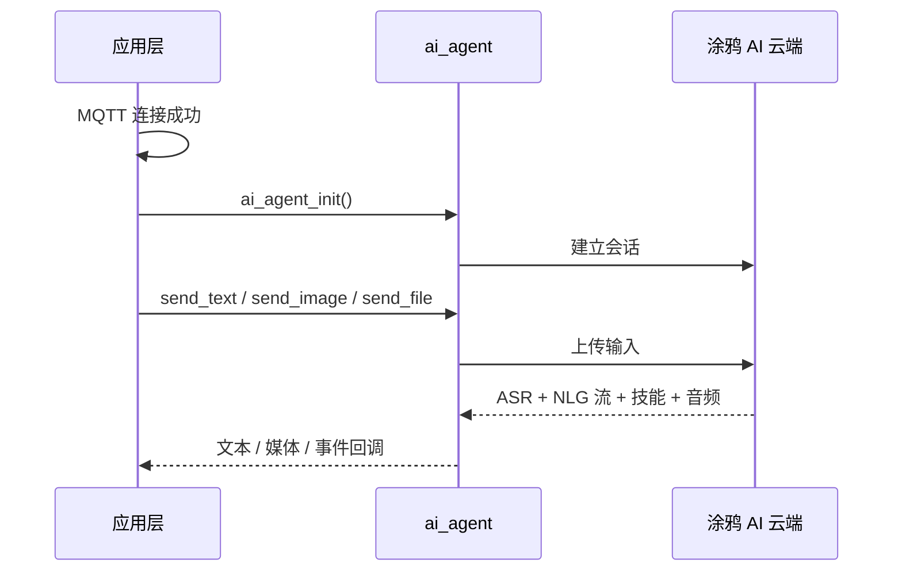

`ai_agent` 是设备与涂鸦 AI 云端之间的桥梁。它把语音、文本、图片、文件输入上传到云端，接收 AI 流式返回的回复，并通过事件把进度通知给应用层——这样固件的其余部分无需直接和云端通信。

它位于**对话模式**（决定*何时*聆听）与**云端**（决定*说什么*）之间。

## 名词解释

| 名词 | 解释 |
|------|------|
| Agent | 智能体，能自主感知、思考、决策、行动的 AI 实体。 |
| ASR | 自动语音识别（Automatic Speech Recognition），将用户语音输入转化为文本。 |
| NLG | 自然语言生成（Natural Language Generation），将意图或结构化数据转化为自然语言文本。 |
| Skill | 技能，一个独立、可插拔、专门做某件事的 AI 功能单元（播放音乐、表达情绪、处理云端事件等）。 |

## 功能说明

### 输入：多模态

`ai_agent` 接受四类输入并上传到云端：

- **音频**——`PCM`（未压缩，适用于本地处理）、`OPUS`（高效低延迟，适用于网络传输）或 `SPEEX`（语音优化，适用于语音通信）。
- **文本**——直接发送命令或查询字符串。
- **图片**——上传图像帧，用于视觉问答、图像理解。
- **文件**——上传文档，用于文档处理与分析。

### 输出：回调

云端的回复通过回调返回：

- **文本回调**——ASR 结果、NLG 文本流、技能数据。
- **媒体回调**——音频、视频、图片、文件等媒体流。
- **媒体属性回调**——音频编解码类型等元信息。

### 会话事件

`ai_agent` 管理对话的完整生命周期，并通过用户事件回调（`AI_USER_EVENT_NOTIFY`）把每个阶段通知应用层：

- **会话开始**——云端开始返回数据，应启动 TTS 播放器，准备接收音频。
- **会话结束**——云端数据发送完成，应停止播放器，完成播放流程。
- **会话中断**——云端主动中断当前轮次（用户打断、云端超时），应立即停止播放并清理缓冲。
- **会话退出**——对话完全退出，应释放所有相关资源。
- **服务器 VAD**——云端语音活动检测状态，转发给应用层。

### 云端提示音

`ai_agent_cloud_alert(type)` 向云端请求一段语音提示。它把告警类型映射为提示词（`cmd:0`–`cmd:5`）并作为文本发送，云端返回对应的提示音音频。

:::note
这些提示词需要在 AI 智能体平台上配置才能生效。在智能体的 Prompt 中注明：当 AI 收到 `cmd:0` 到 `cmd:5` 时应返回什么内容。未配置则不会播放提示音。
:::

目前仅映射下列六种告警类型，其他 `AI_ALERT_TYPE_E` 取值将返回 `OPRT_NOT_SUPPORTED`：

| 告警类型 | 提示词 | 说明 |
|----------|--------|------|
| `AT_NETWORK_CONNECTED` | `cmd:0` | 网络连接成功 |
| `AT_WAKEUP` | `cmd:1` | 唤醒响应 |
| `AT_LONG_KEY_TALK` | `cmd:2` | 长按按键对话 |
| `AT_KEY_TALK` | `cmd:3` | 按键对话 |
| `AT_WAKEUP_TALK` | `cmd:4` | 唤醒对话 |
| `AT_RANDOM_TALK` | `cmd:5` | 随机对话 |

### 角色切换

`ai_agent_role_switch(role)` 在运行时切换当前智能体角色。不同角色可以拥有不同的对话风格、知识库和技能集，适用于多场景产品。

## 接口参考

头文件：`ai_agent.h`。所有函数返回 `OPERATE_RET`（成功时为 `OPRT_OK`）。

```c
OPERATE_RET ai_agent_init(void);
OPERATE_RET ai_agent_deinit(void);
OPERATE_RET ai_agent_send_text(char *content);
OPERATE_RET ai_agent_send_file(uint8_t *data, uint32_t len);
OPERATE_RET ai_agent_send_image(uint8_t *data, uint32_t len);
OPERATE_RET ai_agent_cloud_alert(AI_ALERT_TYPE_E type);
OPERATE_RET ai_agent_role_switch(char *role);
```

| 函数 | 参数 | 作用 |
|------|------|------|
| `ai_agent_init` | — | 初始化智能体。当 `ENABLE_AI_MONITOR` 打开时，同时初始化监控模块（配合 `tyutool` 上位机调试）。 |
| `ai_agent_deinit` | — | 释放智能体占用的资源。 |
| `ai_agent_send_text` | `content`——待发送文本 | 发送文本查询。 |
| `ai_agent_send_file` | `data`、`len`——缓冲区与长度 | 上传文件。 |
| `ai_agent_send_image` | `data`、`len`——缓冲区与长度 | 上传图片。 |
| `ai_agent_cloud_alert` | `type`——`AI_ALERT_TYPE_E` | 请求云端提示音（见上表）。 |
| `ai_agent_role_switch` | `role`——角色名 | 切换当前智能体角色。 |

:::warning
`ai_agent_init()` **必须在 MQTT 连接成功后调用**。请订阅 `EVENT_MQTT_CONNECTED`，并在该事件回调中初始化智能体。
:::

## 一次对话的流程



## 参考示例

先初始化音频，再在 MQTT 连接事件中初始化智能体：

```c
// MQTT 连接成功后初始化 AI Agent。
static bool sg_ai_agent_inited = false;

int __ai_mqtt_connected_evt(void *data)
{
    if (!sg_ai_agent_inited) {
        TUYA_CALL_ERR_LOG(ai_agent_init());
        sg_ai_agent_inited = true;
    }
    return OPRT_OK;
}

OPERATE_RET example_init(void)
{
    OPERATE_RET rt = OPRT_OK;

#if defined(ENABLE_COMP_AI_AUDIO) && (ENABLE_COMP_AI_AUDIO == 1)
    AI_AUDIO_INPUT_CFG_T input_cfg = {
        .vad_mode      = AI_AUDIO_VAD_MANUAL,
        .vad_off_ms    = 1000,
        .vad_active_ms = 200,
        .slice_ms      = 80,
        .output_cb     = __ai_audio_output,
    };
    TUYA_CALL_ERR_RETURN(ai_audio_input_init(&input_cfg));
    TUYA_CALL_ERR_RETURN(ai_audio_player_init());
#endif

    // 仅在 MQTT 连接成功后初始化智能体。
    TUYA_CALL_ERR_RETURN(tal_event_subscribe(EVENT_MQTT_CONNECTED, "ai_agent_init",
                                             __ai_mqtt_connected_evt, SUBSCRIBE_TYPE_EMERGENCY));
    return OPRT_OK;
}

void send_text_to_ai(void)   { ai_agent_send_text("今天天气怎么样？"); }
void request_alert(void)     { ai_agent_cloud_alert(AT_WAKEUP); }
void switch_role(void)       { ai_agent_role_switch("storyteller"); }
```

## 相关文档

- [组件框架](ai-components.md)——`ai_agent` 在整个 AI 框架中的位置
- [应用开发指南](../application-development-guide)——把智能体接入完整应用
- [AI 智能体开发平台](../../tuya-cloud/ai-agent/ai-agent-dev-platform)——配置角色、Prompt 与 `cmd:` 提示音
