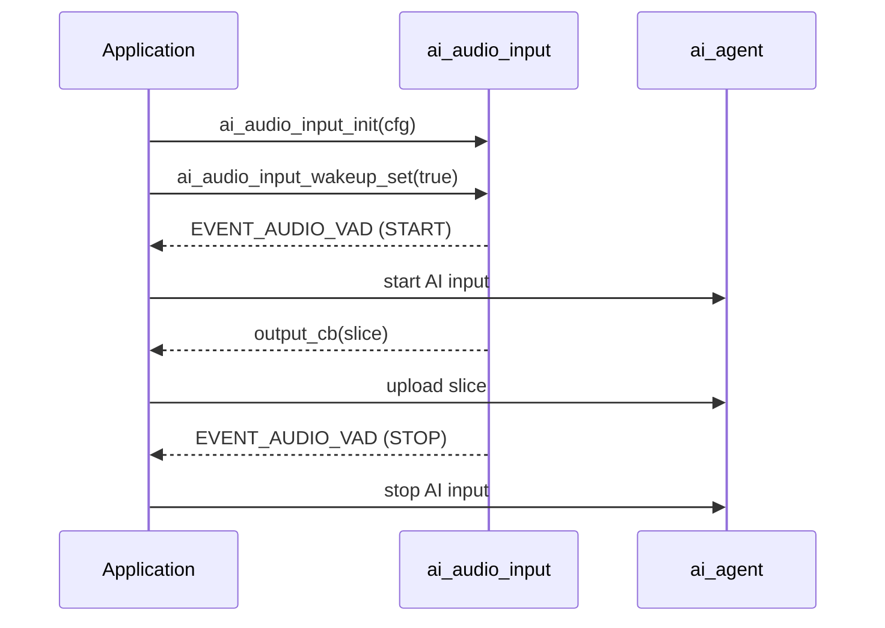

`ai_audio_input` 负责采集麦克风音频、判断其中是否存在语音，并通过回调把切分后的音频切片交给你的应用。它是 AI 音频流水线的前端：产出由 `ai_agent` 上传到云端的音频。

它本身不与云端通信，唯一的职责是把原始麦克风数据流转换成成帧的切片，并由**语音活动检测（VAD）**进行门控。

## 名词解释

| 名词 | 含义 |
|------|------|
| VAD | 语音活动检测（Voice Activity Detection）——判断一段音频中是否包含语音。 |
| VAD 状态 | 语音开始时为 `AI_AUDIO_VAD_START`，语音结束时为 `AI_AUDIO_VAD_STOP`。 |
| 切片 | 音频流中固定时长的一段数据，由 `slice_ms` 决定大小，交付给你的回调。 |
| 唤醒 | 模块当前是否处于“监听”状态。只有在唤醒状态下才会进行 VAD 处理并输出切片。 |

## VAD 模式

模块运行在两种模式之一，由 `vad_mode` 选择，并可在运行时切换。

| 模式 | 枚举 | 由什么驱动 | 适用场景 |
|------|------|------------|----------|
| 手动 | `AI_AUDIO_VAD_MANUAL` | 你的按键事件。你直接设置唤醒状态；不运行任何语音检测器。 | 按键说话和长按说话，由用户控制开始和结束。 |
| 自动 | `AI_AUDIO_VAD_AUTO` | 内置的人声检测器。模块自行触发 `AI_AUDIO_VAD_START` / `AI_AUDIO_VAD_STOP`。 | 免提采集，有人说话即开始。 |

在**手动**模式下，由你决定何时监听——通常在按键按下时调用 `ai_audio_input_wakeup_set(true)`，按键抬起时调用 `ai_audio_input_wakeup_set(false)`。在**自动**模式下，检测器为你跟踪语音，并使用 `vad_active_ms` 和 `vad_off_ms` 对起始和结束进行去抖。

:::note
唤醒词监听（说出唤醒词来开始一轮对话）不在这里处理。它由 [Wakeup 对话模式](ai-mode-wakeup) 驱动，该模式会调用本模块来切换 VAD 模式并切换唤醒状态。
:::

## VAD 状态与事件

当模块被唤醒时，VAD 状态发生变化会发布 `EVENT_AUDIO_VAD` 事件。事件负载是一个 `AI_AUDIO_VAD_STATE_E` 值：

```c
typedef enum {
    AI_AUDIO_VAD_START = 1,    // speech started
    AI_AUDIO_VAD_STOP,         // speech ended
} AI_AUDIO_VAD_STATE_E;
```

订阅 `EVENT_AUDIO_VAD`，以便与检测到的语音同步地启动和停止上游 AI 输入。

:::warning
VAD 处理和事件发布**仅在模块被唤醒时**进行。如果你从不设置唤醒状态，就不会产生任何切片和事件。
:::

## 配置

你在初始化时通过 `AI_AUDIO_INPUT_CFG_T` 一次性配置模块：

```c
typedef struct {
    /* VAD cache = vad_active_ms + vad_off_ms */
    AI_AUDIO_VAD_MODE_E     vad_mode;
    uint16_t                vad_off_ms;        /* Voice activity compensation time, unit: ms */
    uint16_t                vad_active_ms;     /* Voice activity detection threshold, unit: ms */
    uint16_t                slice_ms;          /* Reference macro, AUDIO_RECORDER_SLICE_TIME */
    AI_AUDIO_OUTPUT         output_cb;         /* Microphone data processing callback */
} AI_AUDIO_INPUT_CFG_T;
```

| 字段 | 类型 | 用途 |
|------|------|------|
| `vad_mode` | `AI_AUDIO_VAD_MODE_E` | 手动或自动检测（见上文）。 |
| `vad_off_ms` | `uint16_t` | 语音活动补偿时间，单位毫秒。用于在自动模式下对语音结束进行去抖。 |
| `vad_active_ms` | `uint16_t` | 语音活动检测阈值，单位毫秒。语音需持续多久才判定 VAD 开始。 |
| `slice_ms` | `uint16_t` | 切片时长，单位毫秒。参考宏 `AUDIO_RECORDER_SLICE_TIME`。 |
| `output_cb` | `AI_AUDIO_OUTPUT` | 每个音频切片到达时被调用。 |

输出回调每次交付一个切片：

```c
typedef int (*AI_AUDIO_OUTPUT)(uint8_t *data, uint16_t datalen);
```

`data` 指向切片缓冲区，`datalen` 是其字节长度。你在此处把音频转发到云端（例如通过 `ai_agent`）。

## API 参考

头文件：`ai_audio_input.h`。每个函数都返回 `OPERATE_RET`（成功时为 `OPRT_OK`）。

```c
OPERATE_RET ai_audio_input_init(AI_AUDIO_INPUT_CFG_T *cfg);
OPERATE_RET ai_audio_input_start(void);
OPERATE_RET ai_audio_input_stop(void);
OPERATE_RET ai_audio_input_deinit(void);
OPERATE_RET ai_audio_input_reset(void);
OPERATE_RET ai_audio_input_wakeup_mode_set(AI_AUDIO_VAD_MODE_E mode);
OPERATE_RET ai_audio_input_wakeup_set(bool is_wakeup);
```

| 函数 | 参数 | 用途 |
|------|------|------|
| `ai_audio_input_init` | `cfg` —— 输入配置 | 用 VAD 模式、阈值、切片大小和输出回调初始化模块。 |
| `ai_audio_input_start` | —— | 启动音频采集和 VAD 处理。 |
| `ai_audio_input_stop` | —— | 停止音频采集和 VAD 处理。 |
| `ai_audio_input_deinit` | —— | 释放模块资源。 |
| `ai_audio_input_reset` | —— | 重置音频环形缓冲区和 VAD 状态。在两轮对话之间调用以清除残留音频。 |
| `ai_audio_input_wakeup_mode_set` | `mode` —— 一个 `AI_AUDIO_VAD_MODE_E` | 在运行时切换 VAD 模式（手动或自动）。 |
| `ai_audio_input_wakeup_set` | `is_wakeup` —— 唤醒标志 | 设置模块是否处于监听状态。在手动模式下，这会直接驱动 VAD 状态。 |

## 一轮对话的流程



## 完整示例

配置模块，在输出回调中把切片转发到云端，并根据 VAD 事件启动/停止一轮对话。本片段使用手动（按键）模式。

```c
#include "ai_audio_input.h"

#define AI_AUDIO_SLICE_TIME       80
#define AI_AUDIO_VAD_ACTIVE_TIME  200
#define AI_AUDIO_VAD_OFF_TIME     1000

// Called with each audio slice. Forward it to the cloud here.
static int __ai_audio_output(uint8_t *data, uint16_t datalen)
{
    // e.g. upload `data`/`datalen` through ai_agent
    return OPRT_OK;
}

// React to VAD state changes published on EVENT_AUDIO_VAD.
static int __ai_vad_change_evt(void *data)
{
    AI_AUDIO_VAD_STATE_E vad_flag = (AI_AUDIO_VAD_STATE_E)data;

    if (AI_AUDIO_VAD_START == vad_flag) {
        // speech started — begin the AI input turn
    } else {
        // speech ended — finish the AI input turn
    }
    return OPRT_OK;
}

OPERATE_RET example_init(void)
{
    AI_AUDIO_INPUT_CFG_T input_cfg = {
        .vad_mode      = AI_AUDIO_VAD_MANUAL,
        .vad_off_ms    = AI_AUDIO_VAD_OFF_TIME,
        .vad_active_ms = AI_AUDIO_VAD_ACTIVE_TIME,
        .slice_ms      = AI_AUDIO_SLICE_TIME,
        .output_cb     = __ai_audio_output,
    };
    TUYA_CALL_ERR_RETURN(ai_audio_input_init(&input_cfg));
    TUYA_CALL_ERR_RETURN(ai_audio_input_start());

    TUYA_CALL_ERR_RETURN(tal_event_subscribe(EVENT_AUDIO_VAD, "vad_change",
                                             __ai_vad_change_evt, SUBSCRIBE_TYPE_NORMAL));
    return OPRT_OK;
}

// Button handlers (manual mode): press to listen, release to stop.
void on_button_press(void)   { ai_audio_input_wakeup_set(true);  }
void on_button_release(void) { ai_audio_input_wakeup_set(false); }
```

若想改为免提，把 `.vad_mode` 设为 `AI_AUDIO_VAD_AUTO`（或在运行时调用 `ai_audio_input_wakeup_mode_set(AI_AUDIO_VAD_AUTO)`），让检测器替你触发 VAD 事件。

## 相关文档

- [AI Agent](ai-agent) —— 上传本模块产出的切片
- [Audio Player](ai-audio-player) —— 播放云端返回的语音回复
- [Voice Chat Modes](ai-mode-manage) —— 决定设备何时监听
- [Wakeup mode](ai-mode-wakeup) —— 基于本模块构建的唤醒词监听
