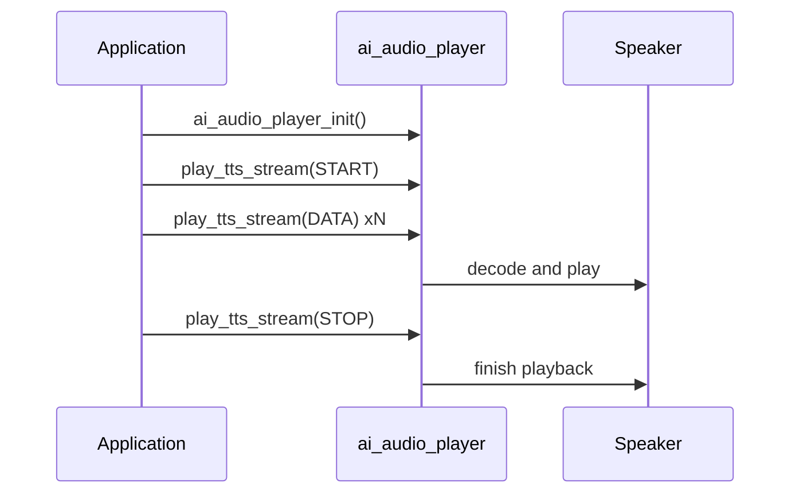

`ai_audio_player` 负责在设备上播放对话中“说”的那一侧音频——流式 TTS、音乐和本地提示音——通过扬声器输出。它是 AI 音频流水线的后端：`ai_audio_input` 采集用户所说的内容，而本模块则渲染设备回复所说的内容。

它本身不与云端通信。由你的应用（或 `ai_agent` 的回调）向它提供音频——一段 TTS 流、一块解码后的缓冲区、一个音乐播放列表，或一个提示音请求——播放器负责解码并播放。

## 名词解释

| 名词 | 含义 |
|------|------|
| TTS | 文本转语音（Text-to-Speech）——云端“说出”的回复，以流或 URL 的形式交付给播放器。 |
| 前台 / 后台 | 两个相互独立的播放器：前台播放 TTS，后台播放音乐。二者可同时运行。 |
| 提示音 | 一段短促的本地提示声（开机、低电量、“请再说一次”），来自设备本地而非云端。 |
| 编解码格式 | 你交给播放器的数据的音频格式，一个 `AI_AUDIO_CODEC_E` 值。 |

## 它能播放什么

播放器处理三类音频，每类各有自己的入口：

- **TTS** —— 云端的语音回复。可以以流的形式（`ai_audio_play_tts_stream`）、从 URL（`ai_audio_play_tts_url`），或作为单块解码缓冲区（`ai_audio_play_data`）提供。TTS 在**前台**播放器上播放。
- **音乐** —— 一个曲目播放列表（`ai_audio_play_music`）。音乐在**后台**播放器上播放，因此可在短促的 TTS 回复叠加播放时继续运行。
- **提示音** —— 短促的本地提示（`ai_audio_player_alert`），如开机或低电量。

### 前台与后台

播放器运行两个相互独立的通道，由 `AI_AUDIO_PLAYER_TYPE_E` 选择。`ai_audio_player_stop` 所针对的也正是这个枚举：

```c
typedef enum {
    AI_AUDIO_PLAYER_FG  = 0,   // foreground player, used to play TTS
    AI_AUDIO_PLAYER_BG  = 1,   // background player, used to play music
    AI_AUDIO_PLAYER_ALL = 2,   // all players
} AI_AUDIO_PLAYER_TYPE_E;
```

| 类型 | 通道 | 停止的内容 |
|------|------|------------|
| `AI_AUDIO_PLAYER_FG` | 前台 | 仅 TTS 播放 |
| `AI_AUDIO_PLAYER_BG` | 后台 | 仅音乐播放 |
| `AI_AUDIO_PLAYER_ALL` | 二者 | 当前正在播放的全部内容 |

### 本地提示音

`ai_audio_player_alert(type)` 播放一段存储在设备上的短促提示音。这些提示音是**本地**的——它们不调用云端，这与 [`ai_agent`](ai-agent) 中的 `cmd:` 提示音不同，后者请求云端合成回复。请用它们提供必须在联网之前或无网络时也能工作的快速反馈。

```c
typedef enum {
    AI_AUDIO_ALERT_POWER_ON,             // power on notification
    AI_AUDIO_ALERT_NOT_ACTIVE,           // not activated, configure network first
    AI_AUDIO_ALERT_NETWORK_CFG,          // entering network configuration
    AI_AUDIO_ALERT_NETWORK_CONNECTED,    // network connected
    AI_AUDIO_ALERT_NETWORK_FAIL,         // network connection failed, retry
    AI_AUDIO_ALERT_NETWORK_DISCONNECT,   // network disconnected
    AI_AUDIO_ALERT_BATTERY_LOW,          // low battery
    AI_AUDIO_ALERT_PLEASE_AGAIN,         // please say again
    AI_AUDIO_ALERT_LONG_KEY_TALK,        // long key press to talk
    AI_AUDIO_ALERT_KEY_TALK,             // key press to talk
    AI_AUDIO_ALERT_WAKEUP_TALK,          // talk after wake
    AI_AUDIO_ALERT_RANDOM_TALK,          // random chat
    AI_AUDIO_ALERT_WAKEUP,               // "Hello, I'm here"
    AI_AUDIO_ALERT_MAX,
} AI_AUDIO_ALERT_TYPE_E;
```

:::tip
默认情况下，这些提示音来自内置音源。如果你的固件定义了 `AI_PLAYER_ALERT_SOURCE_CUSTOM`，可用 `ai_audio_player_reg_alert_cb` 注册你自己的提供者，为每个 `AI_AUDIO_ALERT_TYPE_E` 自行提供音频。
:::

### 流式 TTS 状态

当你以流的形式提供 TTS 时，每次调用都携带一个来自 `AI_AUDIO_PLAYER_TTS_STATE_E` 的状态，告诉播放器你处在回复的哪个阶段：

```c
typedef enum {
    AI_AUDIO_PLAYER_TTS_START,   // first chunk — open the stream
    AI_AUDIO_PLAYER_TTS_DATA,    // a chunk of audio data
    AI_AUDIO_PLAYER_TTS_STOP,    // last chunk — close the stream
    AI_AUDIO_PLAYER_TTS_ABORT,   // abort — discard the stream
} AI_AUDIO_PLAYER_TTS_STATE_E;
```

先发送一次 `AI_AUDIO_PLAYER_TTS_START`，然后为云端到达的每一块数据发送 `AI_AUDIO_PLAYER_TTS_DATA`，最后发送 `AI_AUDIO_PLAYER_TTS_STOP` 收尾——或者发送 `AI_AUDIO_PLAYER_TTS_ABORT` 以丢弃一轮被打断的对话。

## 关键结构体

`ai_audio_play_music` 接受一个 `AI_AUDIO_MUSIC_T`——一个播放列表加上一个控制动作：

```c
typedef struct {
    char            action[32];   // play / next / prev / resume
    bool            has_tts;      // wait for TTS to finish before playing media
    int             src_cnt;      // number of tracks in src_array
    AI_MUSIC_SRC_T *src_array;    // the track list
} AI_AUDIO_MUSIC_T;
```

每个 `AI_MUSIC_SRC_T` 描述一首曲目（`url`、`format`、`duration`，以及 `artist`、`song_name`、`img_url` 等元数据）。当应先播放语音回复、再接着播放音乐时，把 `has_tts` 设为 `true`。

`ai_audio_play_tts_url` 接受一个 `AI_AUDIO_PLAY_TTS_T`，它把语音回复与可选的背景音乐配对在一起：

```c
typedef struct {
    AI_AUDIO_TTS_T tts;        // the TTS audio source (url, method, format, type)
    AI_AUDIO_TTS_T bg_music;   // optional background music to play under it
} AI_AUDIO_PLAY_TTS_T;
```

每个 `AI_AUDIO_TTS_T` 携带音源 `url`、HTTP 方法 `http_method`、格式 `format`（`AI_AUDIO_CODEC_E`）和类型 `tts_type`。

## API 参考

头文件：`ai_audio_player.h`。除 `ai_audio_player_is_playing` 返回 `uint8_t` 外，每个函数都返回 `OPERATE_RET`（成功时为 `OPRT_OK`）。

```c
OPERATE_RET ai_audio_player_init(void);
OPERATE_RET ai_audio_player_deinit(void);
OPERATE_RET ai_audio_player_start(char *id);
OPERATE_RET ai_audio_play_tts_url(AI_AUDIO_PLAY_TTS_T *playtts, bool is_loop);
OPERATE_RET ai_audio_play_data(AI_AUDIO_CODEC_E format, uint8_t *data, uint32_t len);
OPERATE_RET ai_audio_play_tts_stream(AI_AUDIO_PLAYER_TTS_STATE_E state, AI_AUDIO_CODEC_E codec, char *data, int len);
OPERATE_RET ai_audio_play_music(AI_AUDIO_MUSIC_T *music);
OPERATE_RET ai_audio_player_stop(AI_AUDIO_PLAYER_TYPE_E type);
OPERATE_RET ai_audio_player_set_resume(bool is_music_continuous);
OPERATE_RET ai_audio_player_set_replay(bool is_music_replay);
uint8_t     ai_audio_player_is_playing(void);
OPERATE_RET ai_audio_player_alert(AI_AUDIO_ALERT_TYPE_E type);
OPERATE_RET ai_audio_player_set_vol(int vol);
OPERATE_RET ai_audio_player_get_vol(int *vol);
OPERATE_RET ai_audio_player_reg_alert_cb(AI_PLAYER_ALERT_CUSTOM_CB cb);  // AI_PLAYER_ALERT_SOURCE_CUSTOM only
```

| 函数 | 参数 | 用途 |
|------|------|------|
| `ai_audio_player_init` | —— | 初始化播放器模块。 |
| `ai_audio_player_deinit` | —— | 释放播放器资源。 |
| `ai_audio_player_start` | `id` —— 播放会话标识（可为 `NULL`） | 开始一次播放会话。 |
| `ai_audio_play_tts_url` | `playtts`、`is_loop` | 从 URL 播放 TTS 回复（及可选背景音乐）。`is_loop` 目前未使用。 |
| `ai_audio_play_data` | `format`、`data`、`len` | 播放内存中的一块解码后音频缓冲区。 |
| `ai_audio_play_tts_stream` | `state`、`codec`、`data`、`len` | 由流状态驱动，逐块提供 TTS 流。 |
| `ai_audio_play_music` | `music` —— 播放列表和动作 | 在后台播放器上播放、切换或恢复音乐播放列表。 |
| `ai_audio_player_stop` | `type` —— 指定通道 | 停止前台、后台或全部播放。 |
| `ai_audio_player_set_resume` | `is_music_continuous` | 设置在被 TTS 回复等打断后，音乐是否恢复（连续播放）。 |
| `ai_audio_player_set_replay` | `is_music_replay` | 设置当前曲目结束后是否重播。 |
| `ai_audio_player_is_playing` | —— | 若当前有任何内容正在播放则返回 `TRUE`，否则返回 `FALSE`。 |
| `ai_audio_player_alert` | `type` —— 一个 `AI_AUDIO_ALERT_TYPE_E` | 播放一段本地提示音。 |
| `ai_audio_player_set_vol` | `vol` —— 0–100 | 设置播放器音量。 |
| `ai_audio_player_get_vol` | `vol`（出参） | 读取当前播放器音量。 |
| `ai_audio_player_reg_alert_cb` | `cb` —— 提示音提供者 | 注册自定义提示音音源。仅在设置了 `AI_PLAYER_ALERT_SOURCE_CUSTOM` 时可用。 |

:::warning
在调用任何其他播放器函数之前，请先调用 `ai_audio_player_init()`。TTS 流、音乐和提示音相关的调用都假定模块已初始化。
:::

## TTS 回复如何播放



## 完整示例

初始化播放器，然后随着数据块从云端到达，以流的形式播放 TTS 回复。若用户插话打断，则停止前台通道。

```c
#include "ai_audio_player.h"

OPERATE_RET player_start(void)
{
    OPERATE_RET rt = OPRT_OK;

    TUYA_CALL_ERR_RETURN(ai_audio_player_init());
    TUYA_CALL_ERR_RETURN(ai_audio_player_set_vol(70));
    return OPRT_OK;
}

// Drive the foreground TTS stream from ai_agent's media callbacks.
void on_tts_begin(void)
{
    ai_audio_play_tts_stream(AI_AUDIO_PLAYER_TTS_START, AI_AUDIO_CODEC_MP3, NULL, 0);
}

void on_tts_chunk(char *data, int len)
{
    ai_audio_play_tts_stream(AI_AUDIO_PLAYER_TTS_DATA, AI_AUDIO_CODEC_MP3, data, len);
}

void on_tts_end(void)
{
    ai_audio_play_tts_stream(AI_AUDIO_PLAYER_TTS_STOP, AI_AUDIO_CODEC_MP3, NULL, 0);
}

// User interrupted — stop the TTS channel and discard the stream.
void on_barge_in(void)
{
    ai_audio_play_tts_stream(AI_AUDIO_PLAYER_TTS_ABORT, AI_AUDIO_CODEC_MP3, NULL, 0);
    ai_audio_player_stop(AI_AUDIO_PLAYER_FG);
}

// Local feedback that does not need the cloud.
void on_power_on(void) { ai_audio_player_alert(AI_AUDIO_ALERT_POWER_ON); }
```

## 相关文档

- [AI Agent](ai-agent) —— 交付本模块所播放的 TTS 流
- [AI Audio Input](ai-audio-input) —— 采集用户语音，构成一轮对话的另一半
- [AI Skill](ai-skill) —— 音乐播放等技能会驱动本播放器
- [Component Framework](ai-components.md) —— 播放器如何融入更广的 AI 框架
- [Multimodal Data Flow](../multimodal-data-flow) —— 媒体如何在设备与云端之间传输
