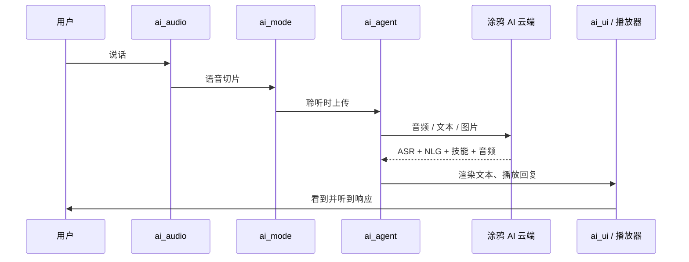

`ai_components` 是每个 TuyaOpen AI 应用背后的端侧 AI 框架。它是一个模块化库，把带有麦克风、扬声器和屏幕的开发板变成语音助手：采集音频、运行对话模式、与 [AI Agent](ai-agent) 通信、渲染 UI 并播放回复。你只需启用产品所需的模块，并调用一个初始化函数。

关于语音、视觉、文本和传感器数据如何在这些模块间流动，参见[多模态数据流](../multimodal-data-flow)。

## 模块

框架由每个应用都会用到的核心模块，以及按需初始化的可选模块组成。

| 模块 | 职责 | 是否核心 |
|------|------|----------|
| [`ai_main`](ai-main) | 框架入口——初始化各组件、注册模式、分发事件 | 核心 |
| [`ai_agent`](ai-agent) | 通往涂鸦 AI 云端的桥梁（输入、响应、提示音、角色） | 核心 |
| [`ai_mode`](ai-mode-manage) | 对话模式管理——长按、单次、唤醒、自由、自定义 | 核心 |
| [`ai_audio`](ai-audio-input) | 音频采集（VAD）与播放（TTS、音乐、提示音） | 核心 |
| [`ai_ui`](ai-ui-manage) | 屏幕对话 UI——微信风格、chatbot、OLED | 核心 |
| [`ai_skills`](ai-skill) | 处理 AI 返回的技能数据——情绪、音乐/故事、播放控制、云端事件 | 核心 |
| `ai_video` | 摄像头采集、JPEG 编码、实时预览 | 可选 |
| `ai_mcp` | 通过 MCP 向 AI 暴露设备工具 | 可选 |
| `ai_picture` | 图像转换与显示输出 | 可选 |

## 数据流



## 接入到项目

框架与你的应用并列存放。先让构建和配置指向它，再启用模块。

1. 在项目的 `CMakeLists.txt` 中加入框架目录（相对路径按你的工程结构调整）：

   ```cmake
   add_subdirectory(${APP_PATH}/../ai_components)
   ```

2. 在项目的 `Kconfig` 中引入框架菜单：

   ```kconfig
   rsource "../ai_components/Kconfig"
   ```

3. 打开配置菜单，启用所需模块：

   ```bash
   tos.py config menu
   ```

## 初始化框架

在启动时用一份配置调用一次 `ai_chat_init()`。MQTT 连接成功后，框架会自动初始化 AI 智能体。

```c
#include "ai_chat_main.h"

AI_CHAT_MODE_CFG_T cfg = {
    .default_mode = AI_CHAT_MODE_HOLD,   // AI_CHAT_MODE_HOLD | ONE_SHOT | WAKEUP | FREE
    .default_vol  = 70,                  // 0-100
    .evt_cb       = user_event_callback,
};
ai_chat_init(&cfg);
```

运行时可用 `ai_chat_set_volume(int)` 调整播放音量，用 `ai_chat_get_volume()` 读回当前音量。

### 初始化可选模块

仅在产品用到时才初始化视频、MCP 或图片——每个模块都由各自的 `Kconfig` 开关保护：

```c
#if defined(ENABLE_COMP_AI_VIDEO) && (ENABLE_COMP_AI_VIDEO == 1)
    AI_VIDEO_CFG_T video_cfg = { .disp_flush_cb = video_display_flush_callback };
    ai_video_init(&video_cfg);
#endif

#if defined(ENABLE_COMP_AI_MCP) && (ENABLE_COMP_AI_MCP == 1)
    ai_mcp_init();
#endif

#if defined(ENABLE_COMP_AI_PICTURE) && (ENABLE_COMP_AI_PICTURE == 1)
    AI_PICTURE_OUTPUT_CFG_T picture_cfg = {
        .notify_cb = picture_notify_callback,
        .output_cb = picture_output_callback,
    };
    ai_picture_output_init(&picture_cfg);
#endif
```

## 处理事件

框架把发生的一切——ASR 结果、NLG 文本流、技能、播放控制、模式切换——都通过你传给 `ai_chat_init()` 的事件回调上报。回调收到一个 `AI_NOTIFY_EVENT_T`，其 `type` 为 `AI_USER_EVT_*` 取值：

```c
void user_event_callback(AI_NOTIFY_EVENT_T *event)
{
    switch (event->type) {
        case AI_USER_EVT_ASR_OK:            /* 识别到语音 */          break;
        case AI_USER_EVT_TEXT_STREAM_START: /* NLG 回复开始流式返回 */ break;
        case AI_USER_EVT_TTS_START:         /* 启动播放器 */          break;
        // ... 完整事件列表见 ai_user_event.h
        default: break;
    }
}
```

## 配置

- **语言**——为内置提示音与资源选择中文或英文（`ENABLE_AI_LANGUAGE_CHINESE` / `ENABLE_AI_LANGUAGE_ENGLISH`）。
- **各模块选项**——每个模块都有自己的 `Kconfig`（`ai_mode/Kconfig`、`ai_audio/Kconfig`、`ai_ui/Kconfig`、`ai_video/Kconfig`、`ai_mcp/Kconfig`、`ai_picture/Kconfig`）。未启用的模块不会被编译进固件。

## 自定义

每个核心模块都暴露了注册接口，让你无需 fork 框架即可扩展：

- **自定义 UI**——实现 `AI_UI_INTFS_T` 并注册到 `ai_ui_manage`。
- **自定义模式**——实现 `AI_MODE_HANDLE_T` 并注册到 `ai_manage_mode`（自定义模式 ID 从 `AI_CHAT_MODE_CUSTOM_START` 开始）。
- **自定义技能**——在 `ai_skills` 中添加处理逻辑。
- **自定义 MCP 工具**——实现工具接口并注册到 MCP 服务端。

## 相关文档

- [多模态数据流](../multimodal-data-flow)——各模态如何到达云端
- [AI Agent](ai-agent)——云端桥梁
- [语音对话模式](ai-mode-manage)——设备何时聆听
- [开发应用](../application-development-guide)——基于本框架构建完整应用
