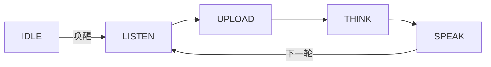

**自由对话**是一种语音对话模式：唤醒之后，设备持续聆听，进行多轮、免手的连续对话。你只需唤醒一次，便可来回交谈，无需按键，也无需每一轮都重复唤醒词。

它是四种[语音对话模式](ai-mode-manage)之一，通过 `ai_mode_free_register()` 注册。

## 何时使用

当用户需要连续进行多轮自然对话时，使用自由对话：

- **多轮对话**：唤醒后设备持续聆听后续对话，使交谈连贯进行，无需每次重新触发。
- **完全免手**：对话过程中无需任何按键操作，用户只管继续说话。
- **对话型产品**：最适合面向来回交谈而非单条指令的助手与陪伴类设备。

代价是对话期间设备会持续聆听，因此更适合安静、单一用户的场景，而非嘈杂或多人共用的环境。需要每次只进行一轮时，请用[唤醒对话模式](ai-mode-wakeup)；需要完全手动控制时，请用[长按对话模式](ai-mode-hold)。

## 行为方式

一轮对话遵循通用的模式生命周期。唤醒后设备进入 `LISTEN`；每一轮依次经过 `UPLOAD`、`THINK`、`SPEAK`，随后返回 `LISTEN` 进入下一轮，而非转为空闲——从而保持对话持续开启。



:::note
自由对话在各轮之间保持聆听，因此对话期间设备会持续采集音频。该模式需要音频组件（`ENABLE_COMP_AI_AUDIO`）进行语音活动检测。
:::

## 启用方式

在启动时注册该模式，然后用 `ai_mode_init` 将其设为当前模式：

```c
ai_mode_free_register();
ai_mode_init(AI_CHAT_MODE_FREE);   // AI_CHAT_MODE_HOLD | ONE_SHOT | WAKEUP | FREE
```

完整的启动流程（注册多个模式、运行任务循环、运行时切换模式）请参见[语音对话模式](ai-mode-manage)。

## 相关文档

- [语音对话模式](ai-mode-manage)——注册、切换并在所有模式间路由事件
- [长按对话模式](ai-mode-hold)——按住按键进行录音
- [单次对话模式](ai-mode-oneshot)——单击一次完成一轮对话
- [唤醒对话模式](ai-mode-wakeup)——通过语音开启一轮对话
- [AI Agent](ai-agent)——各模式所驱动的云端桥梁
