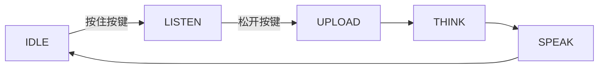

**长按对话**是一种语音对话模式：按住按键开始录音，松开按键停止录音并上传。采集时长完全由按键控制——不会自行开始或结束。

它是四种[语音对话模式](ai-mode-manage)之一，通过 `ai_mode_hold_register()` 注册。

## 何时使用

当你需要明确、可控的对话节奏，并完全掌控设备听到的内容时，使用长按对话：

- **嘈杂环境**：仅在按住按键期间采集，按键窗口之外的背景人声和噪声不会上传到云端。
- **明确的对话回合**：由用户决定每一轮何时开始、何时结束，无需唤醒词，也不依赖语音活动检测的判断。
- **避免误触发**：未按下按键前不会上传任何音频，设备不会对环境声音做出反应。

代价是需要动手操作：每一轮都要按一次按键。若需要免手操作，请改用[唤醒对话模式](ai-mode-wakeup)或[自由对话模式](ai-mode-free)。

## 行为方式

一轮对话遵循通用的模式生命周期。按下按键时，设备从 `IDLE` 进入 `LISTEN`；松开按键结束采集，依次经过 `UPLOAD`、`THINK`、`SPEAK`，随后返回 `IDLE`。



:::note
采集时长由按住按键的时间决定。该模式需要启用按键组件（`ENABLE_BUTTON`）以接收按下和松开事件。
:::

## 启用方式

在启动时注册该模式，然后用 `ai_mode_init` 将其设为当前模式：

```c
ai_mode_hold_register();
ai_mode_init(AI_CHAT_MODE_HOLD);   // AI_CHAT_MODE_HOLD | ONE_SHOT | WAKEUP | FREE
```

完整的启动流程（注册多个模式、运行任务循环、运行时切换模式）请参见[语音对话模式](ai-mode-manage)。

## 相关文档

- [语音对话模式](ai-mode-manage)——注册、切换并在所有模式间路由事件
- [单次对话模式](ai-mode-oneshot)——单击一次完成一轮对话
- [唤醒对话模式](ai-mode-wakeup)——通过语音开启一轮对话
- [自由对话模式](ai-mode-free)——持续聆听的免手对话
- [AI Agent](ai-agent)——各模式所驱动的云端桥梁
