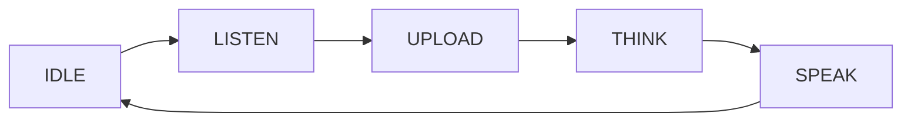

**语音对话模式**决定设备*何时*监听、上传和回复——按住说话、单击一次、关键词唤醒，或免提连续对话。`ai_manage_mode` 是注册这些模式、在它们之间切换、并把事件（用户、VAD、按键）路由到当前激活模式的组件。

它位于设备输入（按键、麦克风、唤醒词）与 [`ai_agent`](ai-agent) 之间，后者负责真正与云端通信。模式本身从不上传音频；它只决定开始和停止的*时刻*，然后驱动 `ai_agent`。

## 名词解释

| 名词 | 含义 |
|------|------|
| 对话模式 | 决定设备何时监听和上传的交互方式——`hold`、`oneshot`、`wakeup` 或 `free`。 |
| VAD | 语音活动检测（Voice Activity Detection）——检测用户当前是否正在说话。 |
| 模式句柄 | 一个 `AI_MODE_HANDLE_T`——某个模式实现的回调集合（init、task、事件处理等）。 |

## 什么是对话模式

每个模式都回答同一个问题：**设备应在何时开始和停止采集用户的语音？** 四个内置模式给出不同的答案。

| 模式 | 枚举 | 触发方式 | 停止采集的条件 |
|------|------|----------|----------------|
| 按住说话 | `AI_CHAT_MODE_HOLD` | 按住按键 | 松开按键 |
| 单击说话 | `AI_CHAT_MODE_ONE_SHOT` | 单击一次按键 | VAD 检测到语音结束 |
| 唤醒词 | `AI_CHAT_MODE_WAKEUP` | 说出唤醒词 | VAD 检测到语音结束 |
| 自由对话 | `AI_CHAT_MODE_FREE` | 始终监听 | 永不——持续进行 |

枚举为 `AI_CHAT_MODE_E`。自定义模式从 `AI_CHAT_MODE_CUSTOM_START`（`0x100`）开始，其取值绝不会与内置模式冲突。

```c
typedef enum {
    AI_CHAT_MODE_HOLD,
    AI_CHAT_MODE_ONE_SHOT,
    AI_CHAT_MODE_WAKEUP,
    AI_CHAT_MODE_FREE,

    AI_CHAT_MODE_CUSTOM_START = 0x100,
} AI_CHAT_MODE_E;
```

## 模式生命周期

无论触发方式如何，每个模式都运行同一个状态机，以 `AI_MODE_STATE_E` 表示。激活的模式随着一轮对话的推进在这些状态间前进；用 `ai_mode_get_state` 查询当前状态。

| 状态 | 含义 |
|------|------|
| `AI_MODE_STATE_INIT` | 模式正在初始化。 |
| `AI_MODE_STATE_IDLE` | 已初始化，等待触发。 |
| `AI_MODE_STATE_LISTEN` | 正在采集用户语音。 |
| `AI_MODE_STATE_UPLOAD` | 正在把采集到的音频发送到云端。 |
| `AI_MODE_STATE_THINK` | 云端正在处理（ASR + 推理）。 |
| `AI_MODE_STATE_SPEAK` | 正在播放云端的回复。 |
| `AI_MODE_STATE_INVALID` | 没有激活的模式，或模式尚未初始化。 |



:::note
当没有任何模式被初始化时，`ai_mode_get_state` 返回 `AI_MODE_STATE_INVALID`。在依赖状态之前，请先用 `ai_mode_init` 初始化一个模式。
:::

## 模式是如何实现的

一个模式是一组汇集在 `AI_MODE_HANDLE_T` 中的回调，通过 `ai_mode_register` 注册到某个 `AI_CHAT_MODE_E` 值上。只有 `name`、`init`、`deinit`、`task`、`handle_event`、`get_state` 和 `client_run` 是必需的；`vad_change` 和 `handle_key` 仅在启用了音频和按键组件时才存在。

```c
typedef struct {
    const char *name;

    OPERATE_RET     (*init)         (void);
    OPERATE_RET     (*deinit)       (void);
    OPERATE_RET     (*task)         (void *args);
    OPERATE_RET     (*handle_event) (AI_NOTIFY_EVENT_T *event);
    AI_MODE_STATE_E (*get_state)    (void);
    OPERATE_RET     (*client_run)   (void *data);

#if defined(ENABLE_COMP_AI_AUDIO) && (ENABLE_COMP_AI_AUDIO == 1)
    OPERATE_RET     (*vad_change)   (AI_AUDIO_VAD_STATE_E vad_state);
#endif

#if defined(ENABLE_BUTTON) && (ENABLE_BUTTON == 1)
    OPERATE_RET     (*handle_key)   (TDL_BUTTON_TOUCH_EVENT_E event, void *arg);
#endif
} AI_MODE_HANDLE_T;
```

内置模式已经提供了各自的句柄；你只需各调用一次即可注册它们（`ai_mode_hold_register`、`ai_mode_oneshot_register` 等）。只有在构建自定义模式时，你才需要自己定义 `AI_MODE_HANDLE_T`。

## API 参考

头文件：`ai_manage_mode.h`。除非另有说明，函数都返回 `OPERATE_RET`（成功时为 `OPRT_OK`）。

| 函数 | 参数 | 用途 |
|------|------|------|
| `ai_mode_register` | `mode`、`handle` | 把一个模式句柄注册到某个对话模式值上。注册顺序决定 `ai_mode_switch_next` 的循环顺序。 |
| `ai_mode_init` | `mode` | 初始化一个已注册的模式并使其成为激活模式。 |
| `ai_mode_deinit` | —— | 反初始化当前激活模式。 |
| `ai_mode_task_running` | `args` | 运行激活模式的 `task` 回调——在你的循环中调用它以推进其状态机。 |
| `ai_mode_handle_event` | `event` | 把一个 `AI_NOTIFY_EVENT_T` 转发给激活模式。 |
| `ai_mode_get_state` | —— | 返回激活模式的 `AI_MODE_STATE_E`（若无则为 `AI_MODE_STATE_INVALID`）。 |
| `ai_mode_client_run` | `data` | 运行激活模式的 `client_run` 回调。 |
| `ai_mode_vad_change` | `vad_state` | 把一次 VAD 状态变化转发给激活模式。需要 `ENABLE_COMP_AI_AUDIO`。 |
| `ai_mode_handle_key` | `event`、`arg` | 把一次按键事件转发给激活模式。需要 `ENABLE_BUTTON`。 |
| `ai_mode_get_curr_mode` | `mode`（出参） | 获取当前激活的对话模式。 |
| `ai_mode_switch` | `mode` | 切换到另一个模式——反初始化当前模式并初始化目标模式。 |
| `ai_mode_switch_next` | —— | 切换到下一个已注册的模式，并返回其 `AI_CHAT_MODE_E` 值。 |
| `ai_get_mode_state_str` | `state` | 返回某个状态的可读名称。 |
| `ai_get_mode_name_str` | `mode` | 返回某个模式的可读名称。 |
| `ai_mode_is_in_register_list` | `mode` | 若该模式已注册则返回 `TRUE`。 |
| `ai_get_first_mode` | `out_mode`（出参） | 获取第一个已注册的模式。 |

:::tip
`ai_mode_switch_next` 按你注册的顺序循环切换模式。把它接到长按或设置开关上，即可让用户在运行时轮换对话模式。
:::

## 接入到应用中

在启动时注册你需要的模式，初始化一个默认模式，然后运行任务循环并转发事件。

```c
#include "ai_manage_mode.h"
#include "ai_mode_hold.h"
#include "ai_mode_oneshot.h"

OPERATE_RET ai_modes_start(void)
{
    OPERATE_RET rt = OPRT_OK;

    // 1. Register the modes you want. Registration order = switch-next order.
    TUYA_CALL_ERR_RETURN(ai_mode_hold_register());
    TUYA_CALL_ERR_RETURN(ai_mode_oneshot_register());

    // 2. Initialize a default mode.
    TUYA_CALL_ERR_RETURN(ai_mode_init(AI_CHAT_MODE_HOLD));
    return rt;
}

// 3. Advance the active mode's state machine in your loop.
void ai_mode_loop(void *args)
{
    while (1) {
        ai_mode_task_running(args);
        tal_system_sleep(10);
    }
}

// Rotate to the next registered mode (e.g. from a long-press).
void ai_mode_cycle(void)
{
    AI_CHAT_MODE_E next = ai_mode_switch_next();
    PR_NOTICE("Switched to mode: %s", ai_get_mode_name_str(next));
}
```

## 添加自定义模式

实现必需的回调，填充一个 `AI_MODE_HANDLE_T`，并用一个不小于 `AI_CHAT_MODE_CUSTOM_START` 的值注册它。

```c
static AI_MODE_STATE_E sg_state = AI_MODE_STATE_IDLE;

static OPERATE_RET my_mode_init(void)   { sg_state = AI_MODE_STATE_IDLE; return OPRT_OK; }
static OPERATE_RET my_mode_deinit(void) { return OPRT_OK; }
static AI_MODE_STATE_E my_mode_get_state(void) { return sg_state; }

static OPERATE_RET my_mode_task(void *args)
{
    switch (sg_state) {
        case AI_MODE_STATE_IDLE:   /* wait for a trigger */ break;
        case AI_MODE_STATE_LISTEN: /* capture voice */      break;
        default: break;
    }
    return OPRT_OK;
}

static OPERATE_RET my_mode_handle_event(AI_NOTIFY_EVENT_T *event) { return OPRT_OK; }

OPERATE_RET my_mode_register(void)
{
    AI_MODE_HANDLE_T handle = {
        .name         = "my_mode",
        .init         = my_mode_init,
        .deinit       = my_mode_deinit,
        .task         = my_mode_task,
        .handle_event = my_mode_handle_event,
        .get_state    = my_mode_get_state,
    };
    return ai_mode_register(AI_CHAT_MODE_CUSTOM_START, &handle);
}
```

## 相关文档

- [Hold-to-Talk Mode](ai-mode-hold) —— 按住录音
- [One-Shot Mode](ai-mode-oneshot) —— 单击一次进行一轮对话
- [Wake-Word Mode](ai-mode-wakeup) —— 用语音开始一轮对话
- [Free Conversation Mode](ai-mode-free) —— 始终监听的免提对话
- [AI Agent](ai-agent) —— 模式所驱动的云端桥梁
- [Component Framework](ai-components.md) —— 模式如何融入更广的 AI 框架
- [Multimodal Data Flow](../multimodal-data-flow) —— 语音和其他输入如何传往云端
