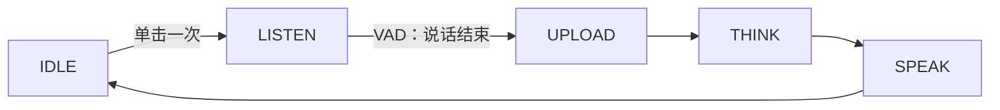

**单次对话**是一种语音对话模式：单击一次按键开启一轮对话。设备随即开始聆听，由语音活动检测（VAD）在你停止说话时结束本轮——无需按住按键。

它是四种[语音对话模式](ai-mode-manage)之一，通过 `ai_mode_oneshot_register()` 注册。

## 何时使用

当你想要单击即问、又不想一直按住按键时，使用单次对话：

- **单轮、自包含的对话**：一击、一问、一答，适合「今天天气怎么样」这类交互。
- **轻量免手**：只需点击一次开始，停止交由 VAD 处理，你可以自然地说完后松手。
- **较安静的环境**：因为由 VAD 判断说话何时结束，在背景噪声不会被误判为句子起止的环境中效果最佳。

相比[长按对话模式](ai-mode-hold)，代价是失去对采集结束时机的精确控制：由 VAD 决定何时停止本轮。嘈杂环境下更适合长按对话；需要多轮免手对话时，请改用[自由对话模式](ai-mode-free)。

## 行为方式

一轮对话遵循通用的模式生命周期。单击一次使设备从 `IDLE` 进入 `LISTEN`；当 VAD 检测到你已停止说话时，本轮依次经过 `UPLOAD`、`THINK`、`SPEAK`，随后返回 `IDLE`。



:::note
本轮由 VAD 结束，而非再次点击。该模式需要按键组件（`ENABLE_BUTTON`）接收点击，并需要音频组件（`ENABLE_COMP_AI_AUDIO`）进行 VAD。
:::

## 启用方式

在启动时注册该模式，然后用 `ai_mode_init` 将其设为当前模式：

```c
ai_mode_oneshot_register();
ai_mode_init(AI_CHAT_MODE_ONE_SHOT);   // AI_CHAT_MODE_HOLD | ONE_SHOT | WAKEUP | FREE
```

完整的启动流程（注册多个模式、运行任务循环、运行时切换模式）请参见[语音对话模式](ai-mode-manage)。

## 相关文档

- [语音对话模式](ai-mode-manage)——注册、切换并在所有模式间路由事件
- [长按对话模式](ai-mode-hold)——按住按键进行录音
- [唤醒对话模式](ai-mode-wakeup)——通过语音开启一轮对话
- [自由对话模式](ai-mode-free)——持续聆听的免手对话
- [AI Agent](ai-agent)——各模式所驱动的云端桥梁
