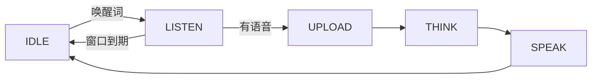

**唤醒对话**是一种语音对话模式：通过说出唤醒词开启一轮对话，无需按键。说出唤醒词后，设备会聆听一段时间窗口（约 30 秒），完成单轮对话后返回空闲。

它是四种[语音对话模式](ai-mode-manage)之一，通过 `ai_mode_wakeup_register()` 注册。

## 何时使用

当你想要免手交互、但每次仍只进行明确的一轮对话时，使用唤醒对话：

- **免手开启**：用唤醒词代替按键，适合放置在房间另一端的设备。
- **每次唤醒一轮**：每个唤醒词只授予一轮对话，设备在回答后不会持续聆听或答复。
- **有限的聆听窗口**：若唤醒后没有说话，窗口到期后设备会自行返回空闲。

相比[自由对话模式](ai-mode-free)，代价是每一轮都需要重新唤醒——没有多轮跟随对话。需要连续来回对话时请用自由对话模式；需要完全手动控制时请用[长按对话模式](ai-mode-hold)。

## 行为方式

一轮对话遵循通用的模式生命周期。唤醒词使设备从 `IDLE` 进入 `LISTEN`。如果你说话，本轮依次经过 `UPLOAD`、`THINK`、`SPEAK`，随后返回 `IDLE`。如果聆听窗口到期仍无语音，设备直接返回 `IDLE`。

聆听窗口为 `AI_CHAT_WAKEUP_TIME_MS`，在 `ai_mode_wakeup.c` 中定义为 `30 * 1000`（30 秒）。



:::note
说出唤醒词后，设备聆听约 30 秒；若未说话则返回空闲。每一轮新对话都需要再次说出唤醒词。
:::

## 启用方式

在启动时注册该模式，然后用 `ai_mode_init` 将其设为当前模式：

```c
ai_mode_wakeup_register();
ai_mode_init(AI_CHAT_MODE_WAKEUP);   // AI_CHAT_MODE_HOLD | ONE_SHOT | WAKEUP | FREE
```

完整的启动流程（注册多个模式、运行任务循环、运行时切换模式）请参见[语音对话模式](ai-mode-manage)。

## 相关文档

- [语音对话模式](ai-mode-manage)——注册、切换并在所有模式间路由事件
- [长按对话模式](ai-mode-hold)——按住按键进行录音
- [单次对话模式](ai-mode-oneshot)——单击一次完成一轮对话
- [自由对话模式](ai-mode-free)——持续聆听的免手对话
- [AI Agent](ai-agent)——各模式所驱动的云端桥梁
