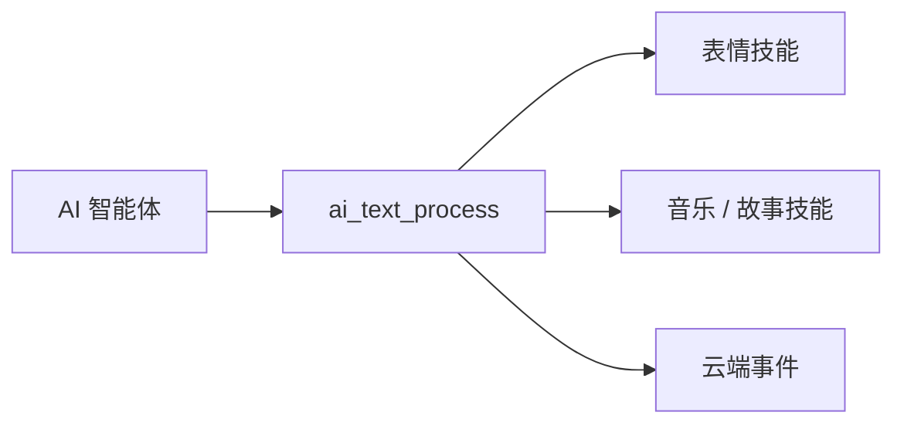

`ai_skills` 解析 AI 返回的结构化技能数据，并把它转化为设备行为——展示表情、播放音乐或故事、处理播放控制、响应云端事件。技能数据由 [AI 智能体](ai-agent) 下发；本模块决定设备如何处理这些数据。

## 技能如何到达

技能是云端随对话一同下发的结构化 JSON。[AI 智能体](ai-agent) 把每一条文本数据交给 `ai_text_process`，由它按类型分发：

```c
OPERATE_RET ai_text_process(AI_TEXT_TYPE_E type, cJSON *root, bool eof);
```

| 参数 | 含义 |
|------|------|
| `type` | 数据类型：`AI_TEXT_ASR`、`AI_TEXT_NLG`、`AI_TEXT_SKILL` 或 `AI_TEXT_CLOUD_EVENT`。 |
| `root` | JSON 数据。 |
| `eof` | 为最后一段数据时取 `true`。 |

返回 `OPERATE_RET`（成功为 `OPRT_OK`）。当 `type` 为 `AI_TEXT_SKILL` 时，模块解析技能 JSON 并路由到下文对应的技能族；`AI_TEXT_CLOUD_EVENT` 则交给云端事件处理器。



## 技能族

模块内置三个技能族。每一族都有各自的头文件与入口函数。

| 技能族 | 头文件 | 关键函数 | 作用 |
|--------|--------|----------|------|
| 表情 | `skill_emotion.h` | `ai_skill_emo_process`、`ai_agent_play_emo`、`ai_emoji_unicode_to_utf8` | 在屏幕上展示表情。 |
| 音乐 / 故事 | `skill_music_story.h` | `ai_skill_parse_music`、`ai_skill_parse_playcontrol`、`ai_skill_playcontrol_music` | 播放音乐或故事，并处理播放控制。 |
| 云端事件 | `skill_cloudevent.h` | `ai_parse_cloud_event` | 响应云端推送的事件。 |

### 表情

表情技能把表情名称（`HAPPY`、`SAD`、`THINKING`、`SLEEP` 等，在 `skill_emotion.h` 中定义为 `EMOJI_*` 宏）映射为屏幕上的一种表情。一个表情由 `AI_AGENT_EMO_T` 描述：

```c
typedef struct {
    const char  *emoji;   // emoji 码点，例如 "U+1F636"
    const char  *name;    // 表情名称，例如 "NEUTRAL"
} AI_AGENT_EMO_T;
```

| 函数 | 参数 | 作用 |
|------|------|------|
| `ai_skill_emo_process` | `json`——表情技能 JSON | 解析表情技能数据并播放。 |
| `ai_agent_play_emo` | `emo`——指向表情的指针 | 在屏幕上展示一个表情。 |
| `ai_emoji_unicode_to_utf8` | `unicode_str`——`"U+XXXX"`；`utf8_buf`——输出（≥ 5 字节）；`buf_size`——缓冲区大小 | 把 Unicode 码点转换为 UTF-8 字节。返回字节数，出错时返回 `-1`。 |

`ai_skill_emo_process` 与 `ai_agent_play_emo` 返回 `OPERATE_RET`。

### 音乐与故事

音乐 / 故事技能解析播放内容与播放控制方式，基于播放器的 `AI_AUDIO_MUSIC_T` 工作。这些函数仅在设置 `ENABLE_COMP_AI_AUDIO` 时参与编译；实际播放由 [音频播放器](ai-audio-player) 完成。

| 函数 | 参数 | 作用 |
|------|------|------|
| `ai_skill_parse_music` | `json`；`music`——返回解析得到的结构 | 把音乐 / 故事数据解析为 `AI_AUDIO_MUSIC_T`。 |
| `ai_skill_parse_music_free` | `music` | 释放解析得到的音乐结构。 |
| `ai_skill_parse_music_dump` | `music` | 打印音乐结构用于调试。 |
| `ai_skill_parse_playcontrol` | `json`；`music`——返回解析得到的结构 | 解析播放控制数据（播放、暂停、下一首等）。 |
| `ai_skill_playcontrol_music` | `music` | 执行解析得到的播放控制命令。 |

`ai_skill_parse_music` 与 `ai_skill_parse_playcontrol` 返回 `OPERATE_RET`；其余返回 `void`。

:::warning
每次调用 `ai_skill_parse_music` 或 `ai_skill_parse_playcontrol` 后，使用完结构即应配对调用 `ai_skill_parse_music_free`，否则设备会泄漏解析出的数据。
:::

### 云端事件

云端事件技能处理云端在正常回复流之外推送的事件，例如一条 TTS 播放命令。

| 函数 | 参数 | 作用 |
|------|------|------|
| `ai_parse_cloud_event` | `json`——云端事件 JSON | 解析并处理云端事件。返回 `OPERATE_RET`。 |

## 相关文档

- [AI 智能体](ai-agent)——下发本模块所解析的技能数据
- [AI 音频播放器](ai-audio-player)——播放技能请求的音乐与故事
- [组件框架](ai-components.md)——`ai_skills` 在整个 AI 框架中的位置
- [多模态数据流](../multimodal-data-flow)——数据如何在设备与云端之间传输
